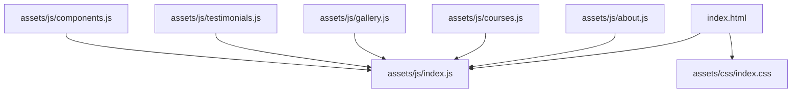
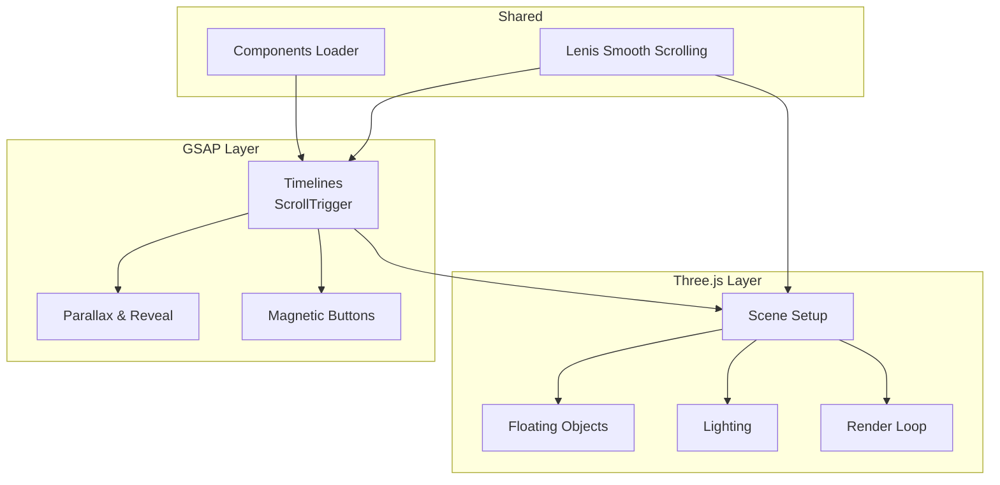
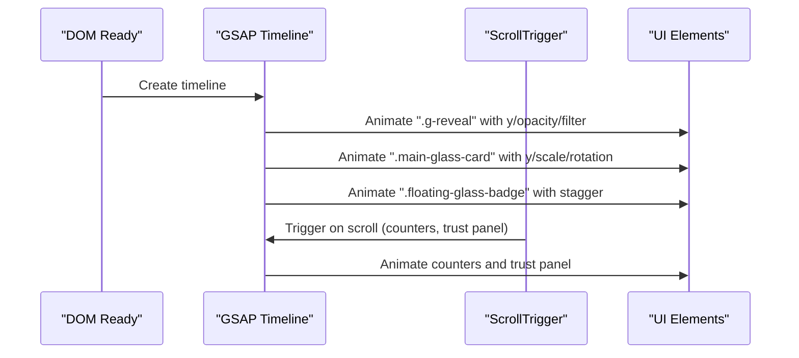
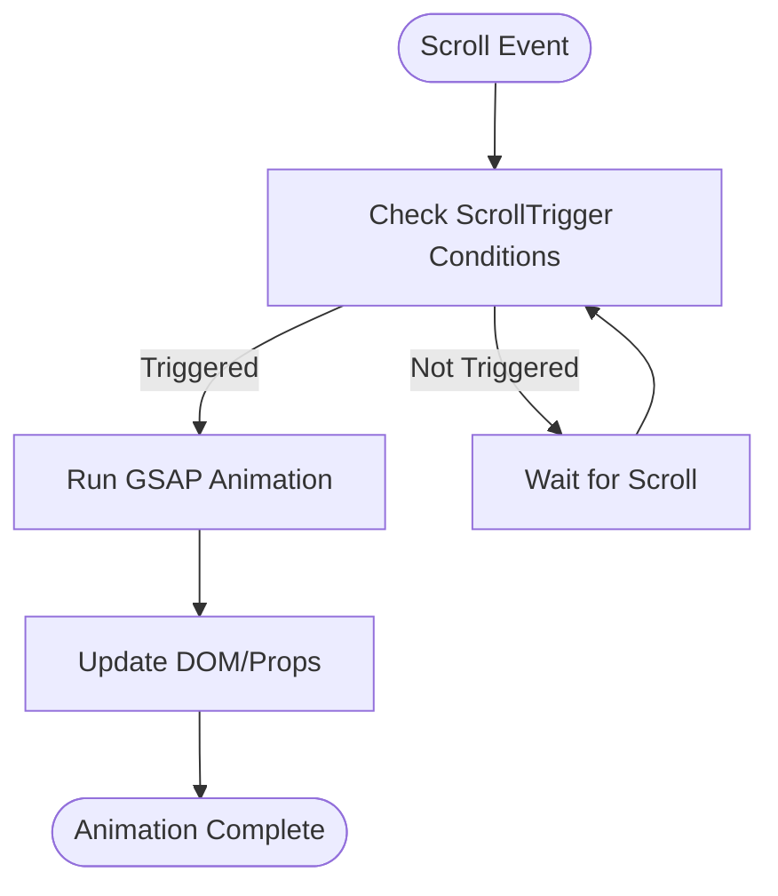
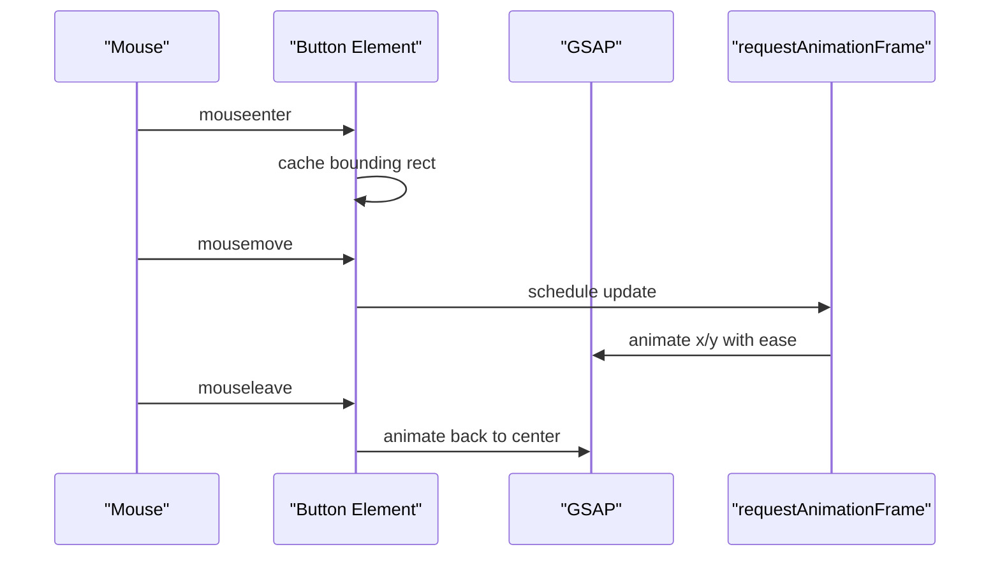
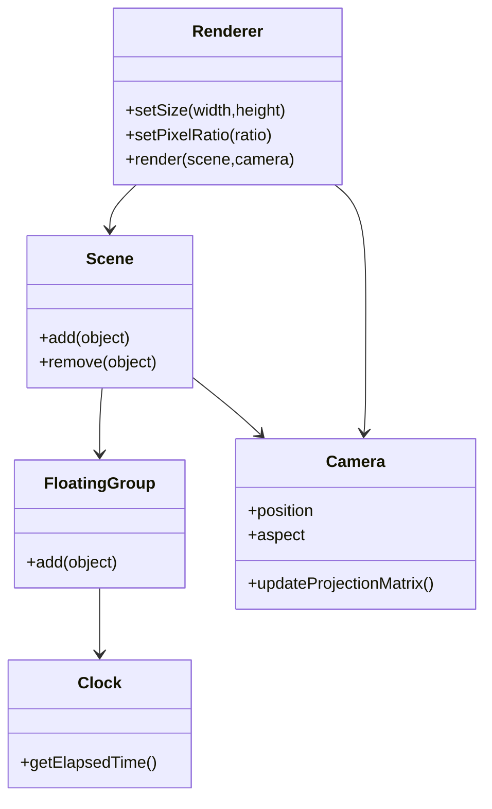
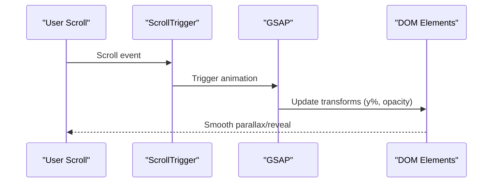
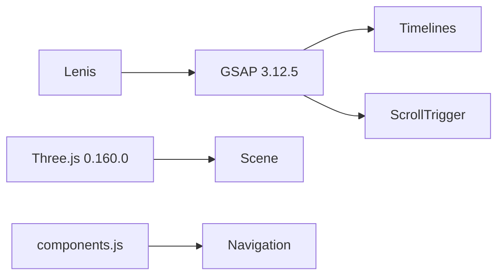

# Animation System

<cite>
**Referenced Files in This Document**
- [index.html](file://index.html)
- [index.js](file://assets/js/index.js)
- [about.js](file://assets/js/about.js)
- [courses.js](file://assets/js/courses.js)
- [gallery.js](file://assets/js/gallery.js)
- [testimonials.js](file://assets/js/testimonials.js)
- [index.css](file://assets/css/index.css)
- [components.js](file://assets/js/components.js)
</cite>

## Table of Contents
1. [Introduction](#introduction)
2. [Project Structure](#project-structure)
3. [Core Components](#core-components)
4. [Architecture Overview](#architecture-overview)
5. [Detailed Component Analysis](#detailed-component-analysis)
6. [Dependency Analysis](#dependency-analysis)
7. [Performance Considerations](#performance-considerations)
8. [Troubleshooting Guide](#troubleshooting-guide)
9. [Conclusion](#conclusion)

## Introduction
This document describes the Eduooz animation system built with GSAP and Three.js. It covers coordinated timelines, scroll-triggered effects, magnetic button interactions, parallax and content reveal sequences, and the integration between 2D animations and 3D scenes. It also provides guidance on performance optimization, responsive scaling, and accessibility considerations.

## Project Structure
The animation system spans multiple pages and scripts:
- Entry point and hero animations: index.html and assets/js/index.js
- Additional page-specific animations: assets/js/about.js, assets/js/courses.js, assets/js/gallery.js, assets/js/testimonials.js
- Shared component loader: assets/js/components.js
- Global styles and responsive behavior: assets/css/index.css

**Diagram sources**
- [index.html:18-24](file://index.html#L18-L24)
- [index.js:1-100](file://assets/js/index.js#L1-L100)
- [about.js:1-50](file://assets/js/about.js#L1-L50)
- [courses.js:1-50](file://assets/js/courses.js#L1-L50)
- [gallery.js:1-50](file://assets/js/gallery.js#L1-L50)
- [testimonials.js:1-50](file://assets/js/testimonials.js#L1-L50)
- [components.js:1-50](file://assets/js/components.js#L1-L50)

**Section sources**
- [index.html:18-24](file://index.html#L18-L24)
- [index.js:1-100](file://assets/js/index.js#L1-L100)

## Core Components
- GSAP timelines and ScrollTrigger-driven reveals
- Magnetic button interactions with mouse tracking
- Three.js 3D scenes with animated floating elements and interactive lighting
- Parallax effects and content stacking animations
- Responsive scaling and deferred heavy WebGL initialization

**Section sources**
- [index.js:4-21](file://assets/js/index.js#L4-L21)
- [index.js:58-84](file://assets/js/index.js#L58-L84)
- [index.js:105-433](file://assets/js/index.js#L105-L433)
- [index.js:434-599](file://assets/js/index.js#L434-L599)

## Architecture Overview
The system integrates GSAP for orchestration and ScrollTrigger for scroll-based animations, while Three.js renders immersive 3D backgrounds. A shared component loader initializes navigation and reusable UI elements.

**Diagram sources**
- [index.js:4-21](file://assets/js/index.js#L4-L21)
- [index.js:58-84](file://assets/js/index.js#L58-L84)
- [index.js:105-433](file://assets/js/index.js#L105-L433)
- [index.js:434-599](file://assets/js/index.js#L434-L599)
- [components.js:1-50](file://assets/js/components.js#L1-L50)

## Detailed Component Analysis

### GSAP Timeline Management
- Hero entrance: staggered reveals, scale and blur transitions, and bounce easing
- Course section: staggered slides and fades
- About hybrid section: layered card and image reveals with blur removal
- Video section: entrance and magnetic portal interactions
- Spatial scroll: pinned section with z-axis transitions

**Diagram sources**
- [index.js:4-21](file://assets/js/index.js#L4-L21)
- [index.js:500-537](file://assets/js/index.js#L500-L537)
- [index.js:718-787](file://assets/js/index.js#L718-L787)

**Section sources**
- [index.js:4-21](file://assets/js/index.js#L4-L21)
- [index.js:500-537](file://assets/js/index.js#L500-L537)
- [index.js:718-787](file://assets/js/index.js#L718-L787)

### Scroll-Triggered Effects
- Contained trust panel fade and float
- Counter animations triggered on visibility
- Course and about section reveals
- Parallax image stacks and bento layouts
- Spatial scroll with pinned sections

**Diagram sources**
- [index.js:500-537](file://assets/js/index.js#L500-L537)
- [index.js:540-560](file://assets/js/index.js#L540-L560)
- [index.js:776-787](file://assets/js/index.js#L776-L787)

**Section sources**
- [index.js:500-537](file://assets/js/index.js#L500-L537)
- [index.js:540-560](file://assets/js/index.js#L540-L560)
- [index.js:776-787](file://assets/js/index.js#L776-L787)

### Magnetic Button Interaction Effects
- Mouse enter/move: compute deltas and apply GSAP x/y with easing
- Mouse leave: elastic return to center
- Debounced RAF usage to prevent animation thrash

**Diagram sources**
- [index.js:58-84](file://assets/js/index.js#L58-L84)
- [blogs.js:39-51](file://assets/js/blogs.js#L39-L51)
- [testimonials.js:39-51](file://assets/js/testimonials.js#L39-L51)

**Section sources**
- [index.js:58-84](file://assets/js/index.js#L58-L84)
- [blogs.js:39-51](file://assets/js/blogs.js#L39-L51)
- [testimonials.js:39-51](file://assets/js/testimonials.js#L39-L51)

### Three.js 3D Scenes and Animations
- Hero cinematic background with floating healthcare elements
- Course hologram morphing with lighting changes
- Gyroscope astrolabe with particle systems and glowing cores
- Performance optimizations: deferred initialization, IntersectionObserver pause, device pixel ratio limits

**Diagram sources**
- [index.js:105-132](file://assets/js/index.js#L105-L132)
- [index.js:335-380](file://assets/js/index.js#L335-L380)
- [index.js:1450-1599](file://assets/js/index.js#L1450-L1599)

**Section sources**
- [index.js:105-132](file://assets/js/index.js#L105-L132)
- [index.js:335-380](file://assets/js/index.js#L335-L380)
- [index.js:1450-1599](file://assets/js/index.js#L1450-L1599)

### Scroll-Based Animations, Parallax, and Content Reveal Sequences
- Hero image parallax within about section
- Bento grid parallax and staggered reveals
- Infinite marquee strips and testimonial carousels
- Category-based YouTube playlist with dynamic card rendering

**Diagram sources**
- [index.js:776-787](file://assets/js/index.js#L776-L787)
- [index.js:558-572](file://assets/js/index.js#L558-L572)
- [courses.js:126-131](file://assets/js/courses.js#L126-L131)

**Section sources**
- [index.js:776-787](file://assets/js/index.js#L776-L787)
- [index.js:558-572](file://assets/js/index.js#L558-L572)
- [courses.js:126-131](file://assets/js/courses.js#L126-L131)

### Animation Sequencing, Timing Functions, and Easing Curves
- Back out for hero entrance scale-ups
- Power4/power3 for entrance easing
- Elastic and bounce for magnetic returns
- Sine ease for smooth magnetic tracking
- Expo and back for 3D assembly sequences

**Section sources**
- [index.js:8-20](file://assets/js/index.js#L8-L20)
- [index.js:438-444](file://assets/js/index.js#L438-L444)
- [index.js:879-889](file://assets/js/index.js#L879-L889)

### Examples and Implementation Patterns
- Timeline construction with staggered elements
- Animation chaining with delayed callbacks
- Performance monitoring via IntersectionObserver and deferred initialization
- Responsive scaling using device pixel ratios and viewport-aware camera adjustments

**Section sources**
- [index.js:4-21](file://assets/js/index.js#L4-L21)
- [index.js:344-348](file://assets/js/index.js#L344-L348)
- [index.js:414-431](file://assets/js/index.js#L414-L431)

## Dependency Analysis
The system relies on external libraries and modular scripts:
- GSAP core and ScrollTrigger for animation orchestration
- Three.js for 3D rendering
- Lenis for smooth scrolling integration
- Shared components loader for navigation and UI scaffolding

**Diagram sources**
- [index.html:18-20](file://index.html#L18-L20)
- [index.js:4-21](file://assets/js/index.js#L4-L21)
- [components.js:1-50](file://assets/js/components.js#L1-L50)

**Section sources**
- [index.html:18-20](file://index.html#L18-L20)
- [index.js:4-21](file://assets/js/index.js#L4-L21)
- [components.js:1-50](file://assets/js/components.js#L1-L50)

## Performance Considerations
- Deferred Three.js initialization to prioritize hero entrance
- IntersectionObserver to pause render loops when off-screen
- Device pixel ratio capped to balance quality and performance
- Staggered and delayed animations to reduce initial layout thrash
- Efficient magnetic button updates using requestAnimationFrame and GSAP quickTo

**Section sources**
- [index.js:381-413](file://assets/js/index.js#L381-L413)
- [index.js:423-431](file://assets/js/index.js#L423-L431)
- [index.js:424-430](file://assets/js/index.js#L424-L430)

## Troubleshooting Guide
- If animations do not trigger, verify ScrollTrigger registration and trigger element existence
- Magnetic buttons fail to respond: check mouse event listeners and bounding rect caching
- Three.js scenes appear dark: confirm environment map generation and lighting setup
- Performance drops on low-end devices: reduce geometry complexity, lower pixel ratio, or disable effects

**Section sources**
- [index.js:500-537](file://assets/js/index.js#L500-L537)
- [index.js:58-84](file://assets/js/index.js#L58-L84)
- [index.js:1466-1479](file://assets/js/index.js#L1466-L1479)

## Conclusion
The Eduooz animation system combines GSAP orchestration with Three.js immersion to deliver a premium, scroll-driven experience. Through careful sequencing, responsive scaling, and performance-conscious design, it achieves smooth, engaging interactions across devices while maintaining accessibility and maintainability.