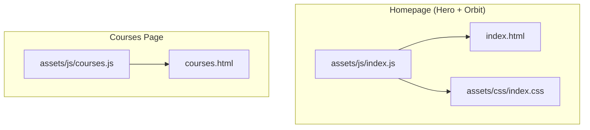
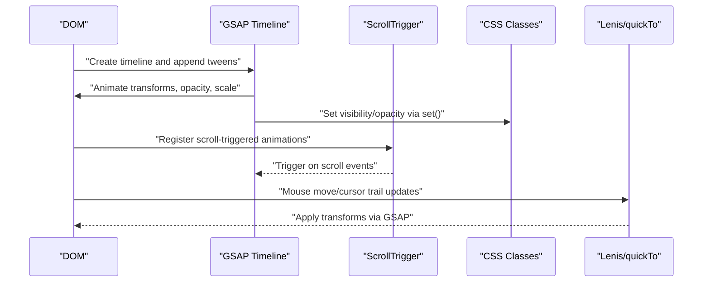
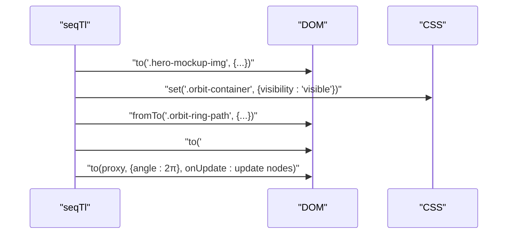
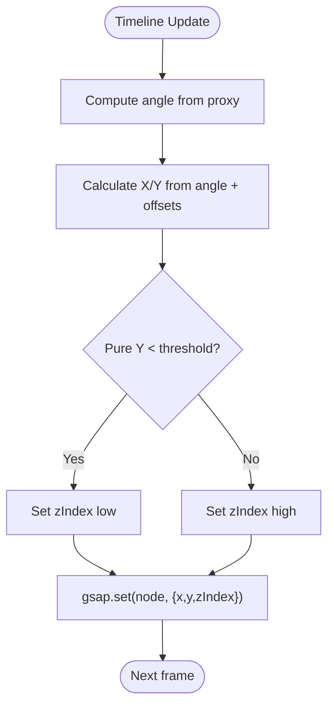
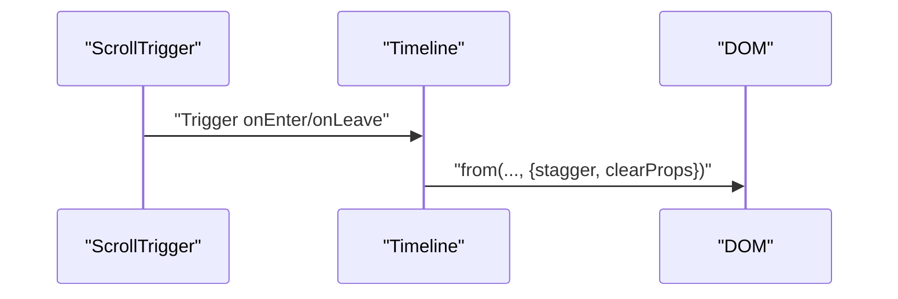
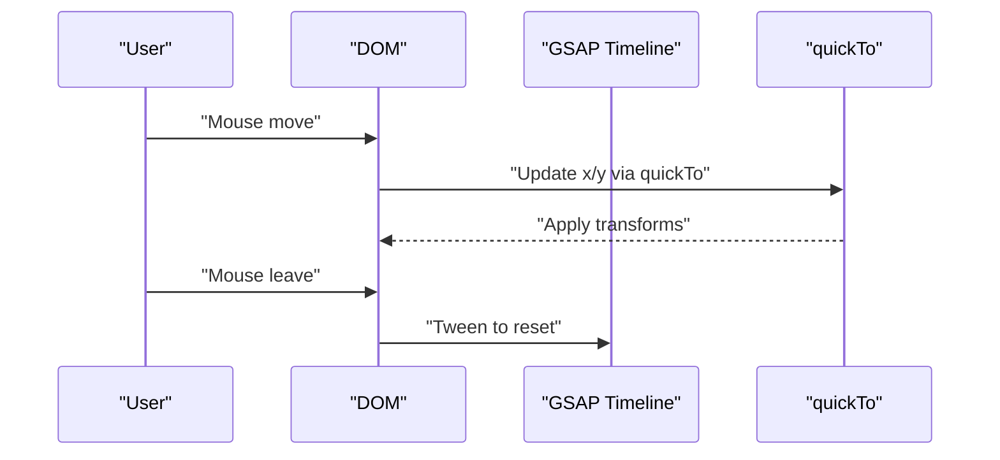
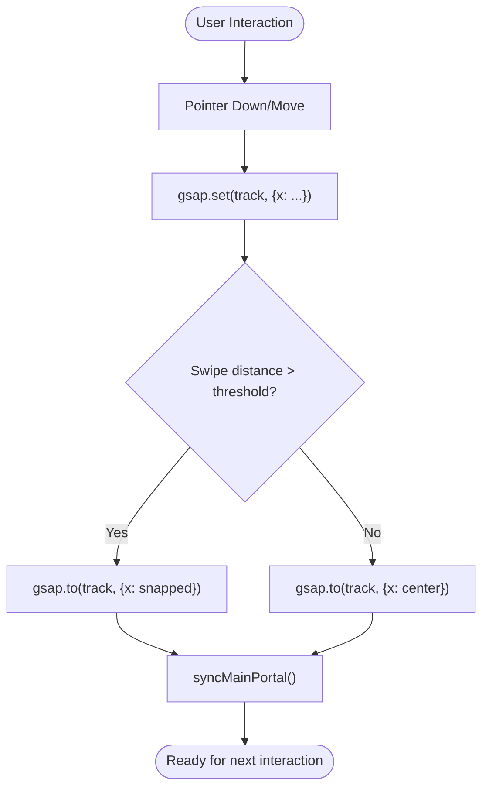
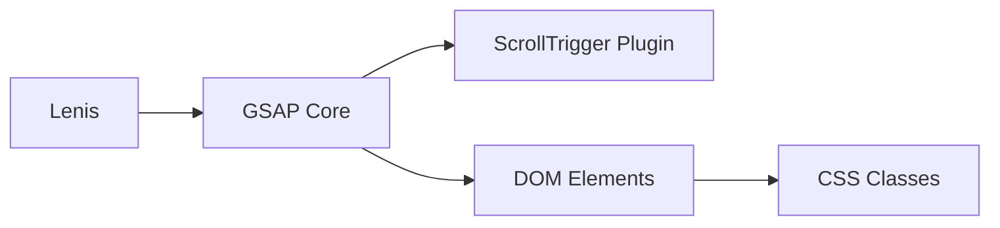

# GSAP Timeline Management

<cite>
**Referenced Files in This Document**
- [index.js](file://assets/js/index.js)
- [courses.js](file://assets/js/courses.js)
- [index.css](file://assets/css/index.css)
- [index.html](file://index.html)
- [courses.html](file://courses.html)
</cite>

## Table of Contents
1. [Introduction](#introduction)
2. [Project Structure](#project-structure)
3. [Core Components](#core-components)
4. [Architecture Overview](#architecture-overview)
5. [Detailed Component Analysis](#detailed-component-analysis)
6. [Dependency Analysis](#dependency-analysis)
7. [Performance Considerations](#performance-considerations)
8. [Troubleshooting Guide](#troubleshooting-guide)
9. [Conclusion](#conclusion)

## Introduction
This document explains the GSAP timeline management system powering the Eduooz animation framework. It focuses on constructing and orchestrating complex animation sequences such as the hero entrance, course selection orbit, and section reveal animations. It documents timeline chaining techniques, staggered animations, timing control, integration with user interactions, and performance optimization strategies. Guidance is included for debugging and browser compatibility.

## Project Structure
The animation framework is primarily implemented in JavaScript files under assets/js and styled via assets/css. The hero entrance and course orbit are orchestrated in the homepage’s main script, while course-specific sequences and UI interactions are managed in the courses page script. CSS defines the visual structure for the orbit and related elements.

**Diagram sources**
- [index.js:434-497](file://assets/js/index.js#L434-L497)
- [index.css:2374-2424](file://assets/css/index.css#L2374-L2424)
- [index.html:59-81](file://index.html#L59-L81)
- [courses.js:1-120](file://assets/js/courses.js#L1-L120)

**Section sources**
- [index.js:1-120](file://assets/js/index.js#L1-L120)
- [courses.js:1-120](file://assets/js/courses.js#L1-L120)

## Core Components
- Hero entrance timeline: Orchestrates the phone mockup scaling-in, orbit container reveal, ring path scaling, node bursts, and continuous orbit rotation with z-index wrapping.
- Course selection orbit: Uses a timeline to position nodes along a circular path and rotates them continuously while toggling z-index based on position.
- Section reveal timelines: Use ScrollTrigger to reveal content in staggered fashion as users scroll.
- Integrated interactions: Magnetic buttons, playlist sliders, pricing toggles, and video portals integrate GSAP for smooth UX.

Key implementation references:
- Hero entrance sequence: [index.js:434-497](file://assets/js/index.js#L434-L497)
- Orbit container and nodes: [index.css:2374-2424](file://assets/css/index.css#L2374-L2424), [index.html:74-81](file://index.html#L74-L81)
- Section reveals: [index.js:546-559](file://assets/js/index.js#L546-L559), [courses.js:1378-1406](file://assets/js/courses.js#L1378-L1406)
- Magnetic buttons: [index.js:59-84](file://assets/js/index.js#L59-L84)
- Playlist slider with GSAP: [courses.js:1158-1250](file://assets/js/courses.js#L1158-L1250)

**Section sources**
- [index.js:434-497](file://assets/js/index.js#L434-L497)
- [index.css:2374-2424](file://assets/css/index.css#L2374-L2424)
- [index.html:74-81](file://index.html#L74-L81)
- [courses.js:1158-1250](file://assets/js/courses.js#L1158-L1250)

## Architecture Overview
The animation architecture combines:
- GSAP timelines for sequencing and timing control
- ScrollTrigger for scroll-driven animations
- DOM-managed orbit containers and nodes
- Utility integrations (Lenis for smooth scrolling, quickTo for cursor trails)

**Diagram sources**
- [index.js:434-497](file://assets/js/index.js#L434-L497)
- [index.js:546-559](file://assets/js/index.js#L546-L559)
- [index.js:1383-1402](file://assets/js/index.js#L1383-L1402)

## Detailed Component Analysis

### Hero Entrance Timeline
The hero entrance timeline composes four phases:
1. Phone mockup scaling-in with bounce
2. Orbit container visibility and ring path scaling
3. Nodes burst out from center with stagger
4. Continuous orbit rotation with z-index wrapping

- Timing control: Uses explicit offsets and delays to chain actions precisely.
- Staggered animations: Nodes use staggered durations and easing for a burst effect.
- Z-index wrapping: Dynamically toggles z-index based on node position to simulate depth.

**Diagram sources**
- [index.js:434-497](file://assets/js/index.js#L434-L497)

**Section sources**
- [index.js:434-497](file://assets/js/index.js#L434-L497)
- [index.css:2374-2424](file://assets/css/index.css#L2374-L2424)
- [index.html:74-81](file://index.html#L74-L81)

### Course Selection Orbit
The orbit uses a rotating proxy to compute node positions along a circle and toggles z-index to manage layering. Nodes are positioned using trigonometric calculations and updated via GSAP set calls.

- Dynamic radius and node sizing adapt to responsive breakpoints.
- Continuous rotation uses repeat: -1 with ease: "none" and onUpdate to update positions.

**Diagram sources**
- [index.js:467-497](file://assets/js/index.js#L467-L497)

**Section sources**
- [index.js:467-497](file://assets/js/index.js#L467-L497)

### Section Reveal Timelines
Section reveals use ScrollTrigger to animate elements as the user scrolls. These timelines often combine staggered animations and clearProps to avoid rendering artifacts.

Examples:
- Homepage course section: [index.js:546-559](file://assets/js/index.js#L546-L559)
- Courses page entrance: [courses.js:1378-1406](file://assets/js/courses.js#L1378-L1406)
- Duration counter: [courses.js:269-291](file://assets/js/courses.js#L269-L291)

**Diagram sources**
- [index.js:546-559](file://assets/js/index.js#L546-L559)
- [courses.js:1378-1406](file://assets/js/courses.js#L1378-L1406)

**Section sources**
- [index.js:546-559](file://assets/js/index.js#L546-L559)
- [courses.js:1378-1406](file://assets/js/courses.js#L1378-L1406)
- [courses.js:269-291](file://assets/js/courses.js#L269-L291)

### Magnetic Buttons and Cursor Interactions
Magnetic buttons and cursor portals use GSAP to achieve smooth, responsive movement and elastic returns.

- Magnetic buttons: [index.js:59-84](file://assets/js/index.js#L59-L84)
- Cursor portal: [index.js:1383-1402](file://assets/js/index.js#L1383-L1402)
- Playlist magnetic cursor: [courses.js:405-441](file://assets/js/courses.js#L405-L441)

**Diagram sources**
- [index.js:59-84](file://assets/js/index.js#L59-L84)
- [index.js:1383-1402](file://assets/js/index.js#L1383-L1402)
- [courses.js:405-441](file://assets/js/courses.js#L405-L441)

**Section sources**
- [index.js:59-84](file://assets/js/index.js#L59-L84)
- [index.js:1383-1402](file://assets/js/index.js#L1383-L1402)
- [courses.js:405-441](file://assets/js/courses.js#L405-L441)

### Playlist Slider with GSAP
The playlist slider integrates GSAP for smooth horizontal translation and card switching. It uses a proxy to track the track’s x-position and applies snapping and infinite-loop behavior.

- Infinite loop: DOM manipulation during drag to maintain seamless looping.
- Auto-slide: Interval-based cycling with collision checks to prevent timeline collisions.

**Diagram sources**
- [courses.js:1158-1250](file://assets/js/courses.js#L1158-L1250)
- [courses.js:1003-1043](file://assets/js/courses.js#L1003-L1043)

**Section sources**
- [courses.js:1158-1250](file://assets/js/courses.js#L1158-L1250)
- [courses.js:1003-1043](file://assets/js/courses.js#L1003-L1043)

## Dependency Analysis
- GSAP plugins: ScrollTrigger is registered and used extensively for scroll-driven animations.
- External libraries: Lenis integrates with GSAP ticker for smooth scrolling.
- DOM structure: Orbit container and nodes are defined in HTML/CSS and manipulated by JS timelines.
- Utility patterns: quickTo for high-performance cursor trails; set() for visibility and z-index toggling.

**Diagram sources**
- [index.js:500-500](file://assets/js/index.js#L500-L500)
- [index.js:41-55](file://assets/js/index.js#L41-L55)
- [index.js:1383-1402](file://assets/js/index.js#L1383-L1402)

**Section sources**
- [index.js:500-500](file://assets/js/index.js#L500-L500)
- [index.js:41-55](file://assets/js/index.js#L41-L55)
- [index.js:1383-1402](file://assets/js/index.js#L1383-L1402)

## Performance Considerations
- Defer heavy 3D scenes: The homepage defers WebGL initialization to ensure the hero entrance maintains 60 FPS.
- Use will-change and transform properties: Footer and other sections leverage will-change to optimize compositing.
- Avoid layout thrashing: Precompute thresholds for scroll-driven progress bars.
- Efficient z-index toggling: Update z-index only when crossing thresholds to reduce repaints.
- quickTo for cursor trails: Reduces overhead by reusing tween instances for frequent updates.
- Scroll-trigger scrubbing: Use scrub to smooth transitions and reduce jank.

Practical references:
- Deferred WebGL: [index.js:387-413](file://assets/js/index.js#L387-L413)
- will-change usage: [courses.js:897-923](file://assets/js/courses.js#L897-L923)
- Threshold precomputation: [about.js:760-787](file://assets/js/about.js#L760-L787)
- quickTo for cursor portal: [index.js:1383-1402](file://assets/js/index.js#L1383-L1402)

**Section sources**
- [index.js:387-413](file://assets/js/index.js#L387-L413)
- [courses.js:897-923](file://assets/js/courses.js#L897-L923)
- [about.js:760-787](file://assets/js/about.js#L760-L787)
- [index.js:1383-1402](file://assets/js/index.js#L1383-L1402)

## Troubleshooting Guide
- Timeline collisions: When rapid user interactions occur, kill or reuse timelines to prevent conflicts. Example: [courses.js:1019-1020](file://assets/js/courses.js#L1019-L1020)
- Scroll-trigger not firing: Ensure ScrollTrigger is registered and triggers are placed correctly. Example: [index.js:500-500](file://assets/js/index.js#L500-L500)
- Staggered animations not aligning: Verify stagger values and offsets; use clearProps to avoid residual styles. Example: [index.js:546-559](file://assets/js/index.js#L546-L559)
- Cursor jitter: Use quickTo and throttle RAF updates. Example: [index.js:1383-1402](file://assets/js/index.js#L1383-L1402)
- Orbit z-index glitches: Confirm thresholds and update only on crossing boundaries. Example: [index.js:479-496](file://assets/js/index.js#L479-L496)

**Section sources**
- [courses.js:1019-1020](file://assets/js/courses.js#L1019-L1020)
- [index.js:500-500](file://assets/js/index.js#L500-L500)
- [index.js:546-559](file://assets/js/index.js#L546-L559)
- [index.js:1383-1402](file://assets/js/index.js#L1383-L1402)
- [index.js:479-496](file://assets/js/index.js#L479-L496)

## Conclusion
The Eduooz animation framework demonstrates robust GSAP timeline management across hero entrances, course orbits, and section reveals. By combining precise timing control, staggered animations, and scroll-driven orchestration, it delivers a polished, performant user experience. Integrations with Lenis, quickTo, and careful z-index management ensure smooth interactions across devices. Following the documented patterns and troubleshooting tips will help maintain and extend the system effectively.