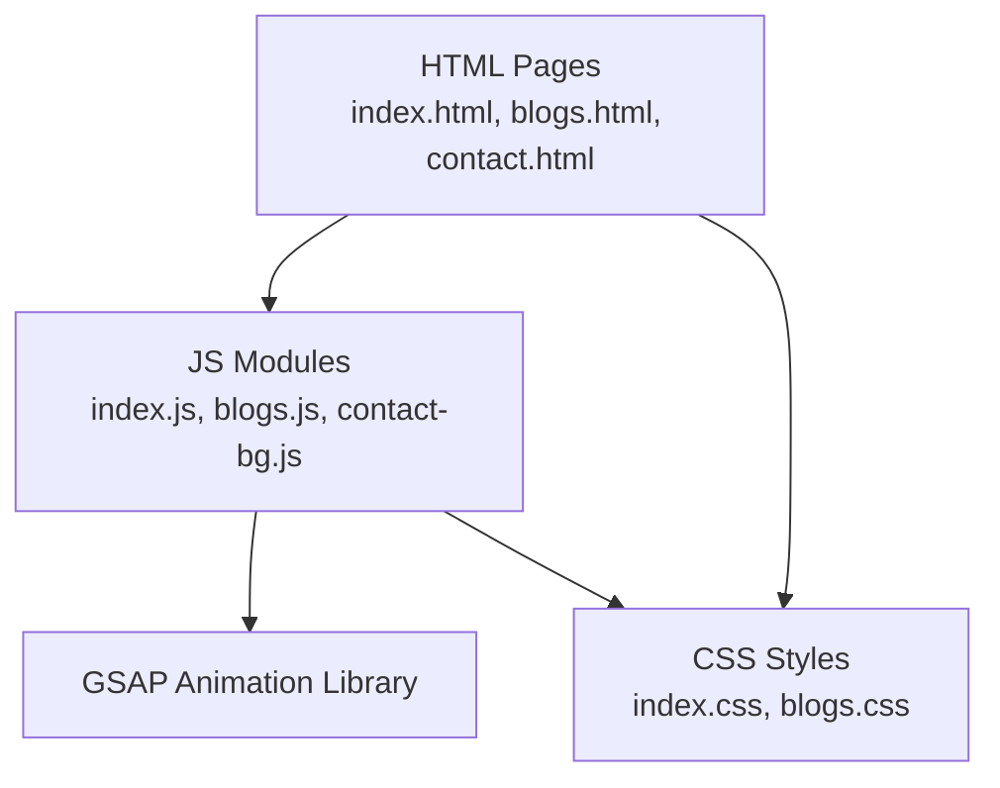
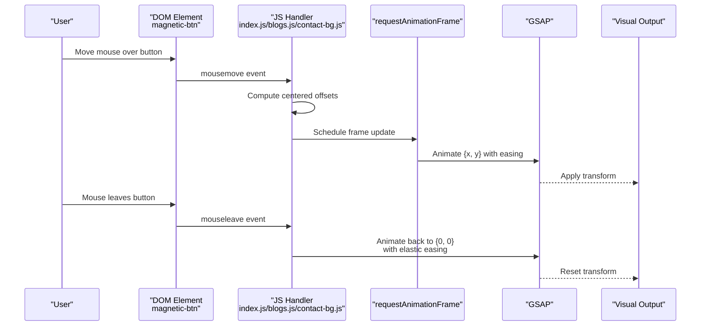
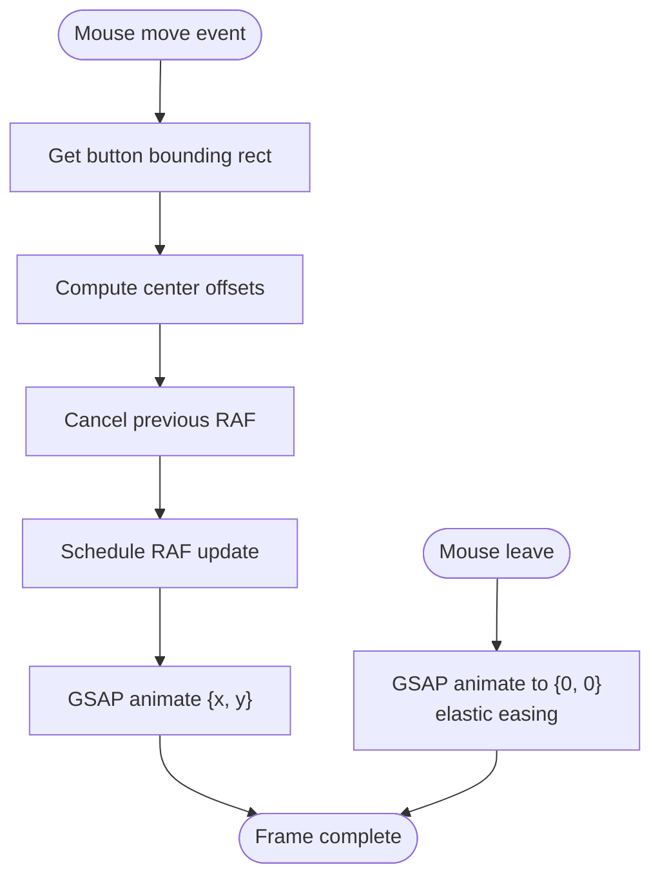
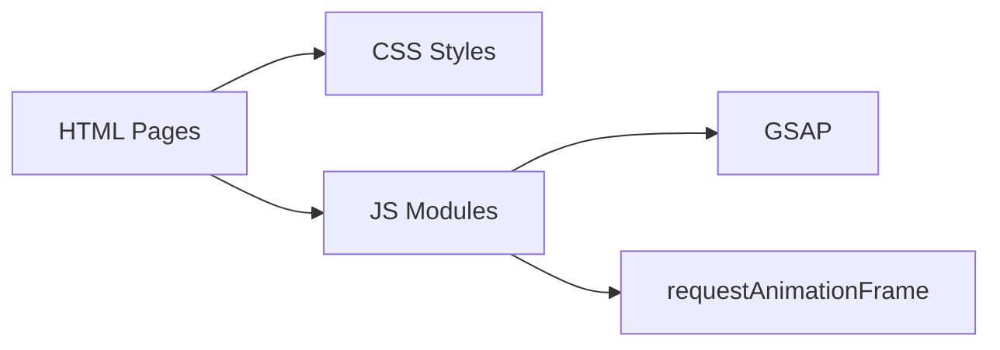

# Magnetic Button Effects

<cite>
**Referenced Files in This Document**
- [index.js](file://assets/js/index.js)
- [index.css](file://assets/css/index.css)
- [index.html](file://index.html)
- [blogs.js](file://assets/js/blogs.js)
- [blogs.css](file://assets/css/blogs.css)
- [contact-bg.js](file://assets/js/contact-bg.js)
</cite>

## Table of Contents
1. [Introduction](#introduction)
2. [Project Structure](#project-structure)
3. [Core Components](#core-components)
4. [Architecture Overview](#architecture-overview)
5. [Detailed Component Analysis](#detailed-component-analysis)
6. [Dependency Analysis](#dependency-analysis)
7. [Performance Considerations](#performance-considerations)
8. [Troubleshooting Guide](#troubleshooting-guide)
9. [Conclusion](#conclusion)

## Introduction
This document explains the magnetic button interaction system that delivers immersive hover effects through physics-based animation. It covers mouse tracking, position calculation, smooth interpolation using requestAnimationFrame, elastic easing, timing configurations, and responsive behavior. It also provides customization examples for magnetic strength, animation duration, and easing curves, along with browser compatibility, fallback strategies, and accessibility considerations for reduced motion preferences.

## Project Structure
The magnetic button implementation is present across multiple pages and shared scripts:
- Magnetic buttons are defined in HTML with the class magnetic-btn.
- JavaScript initializes magnetic behavior on DOMContentLoaded.
- CSS defines button styles and transitions for hover states.
- The implementation is consistent across index.js, blogs.js, and contact-bg.js.

**Diagram sources**
- [index.js:58-84](file://assets/js/index.js#L58-L84)
- [blogs.js:39-51](file://assets/js/blogs.js#L39-L51)
- [contact-bg.js:144-156](file://assets/js/contact-bg.js#L144-L156)

**Section sources**
- [index.html:66-69](file://index.html#L66-L69)
- [index.js:58-84](file://assets/js/index.js#L58-L84)
- [blogs.js:39-51](file://assets/js/blogs.js#L39-L51)
- [contact-bg.js:144-156](file://assets/js/contact-bg.js#L144-L156)

## Core Components
- Magnetic button elements: Any anchor or button with the class magnetic-btn.
- Mouse tracking: mousemove and mouseleave events capture cursor position and reset animation.
- Position calculation: Centers coordinates relative to the button’s bounding rectangle.
- Interpolation: requestAnimationFrame batches updates to avoid layout thrashing.
- Easing and timing: GSAP-powered animations with configurable duration and easing.
- Elastic return: On mouseleave, buttons return to neutral using elastic easing.

Key implementation highlights:
- Mouse enter stores the button’s bounding rectangle for accurate centering.
- Mouse move computes normalized offsets and applies GSAP transforms.
- requestAnimationFrame cancels previous frames to ensure smooth updates.
- mouseleave triggers a return animation using elastic easing.

**Section sources**
- [index.js:58-84](file://assets/js/index.js#L58-L84)
- [blogs.js:39-51](file://assets/js/blogs.js#L39-L51)
- [contact-bg.js:144-156](file://assets/js/contact-bg.js#L144-L156)

## Architecture Overview
The magnetic effect is composed of three layers:
- DOM: HTML elements with magnetic-btn class.
- Behavior: JavaScript event handlers and GSAP animations.
- Styling: CSS transitions and hover states.

**Diagram sources**
- [index.js:58-84](file://assets/js/index.js#L58-L84)
- [blogs.js:39-51](file://assets/js/blogs.js#L39-L51)
- [contact-bg.js:144-156](file://assets/js/contact-bg.js#L144-L156)

## Detailed Component Analysis

### Magnetic Button Mechanics
- Centered coordinate system: Offsets are computed relative to the button’s center using getBoundingClientRect().
- Strength factor: Offsets are multiplied by a small scalar to control magnetic pull intensity.
- Smooth interpolation: requestAnimationFrame ensures single update per frame, preventing jank.
- Elastic return: mouseleave triggers a return animation using elastic easing for a playful feel.

**Diagram sources**
- [index.js:60-84](file://assets/js/index.js#L60-L84)
- [blogs.js:40-51](file://assets/js/blogs.js#L40-L51)
- [contact-bg.js:145-156](file://assets/js/contact-bg.js#L145-L156)

**Section sources**
- [index.js:60-84](file://assets/js/index.js#L60-L84)
- [blogs.js:40-51](file://assets/js/blogs.js#L40-L51)
- [contact-bg.js:145-156](file://assets/js/contact-bg.js#L145-L156)

### Physics-Based Animation Details
- Position calculation: Normalized offsets from the button center.
- Interpolation: requestAnimationFrame batches updates to one per frame.
- Easing: power2.out for smooth acceleration; elastic.out for playful return.
- Timing: Configurable duration for both hover and return animations.

Implementation references:
- Hover transform: [index.js:75](file://assets/js/index.js#L75), [blogs.js:46](file://assets/js/blogs.js#L46), [contact-bg.js:151](file://assets/js/contact-bg.js#L151)
- Return transform: [index.js:81](file://assets/js/index.js#L81), [blogs.js:49](file://assets/js/blogs.js#L49), [contact-bg.js:154](file://assets/js/contact-bg.js#L154)

**Section sources**
- [index.js:68-84](file://assets/js/index.js#L68-L84)
- [blogs.js:40-51](file://assets/js/blogs.js#L40-L51)
- [contact-bg.js:144-156](file://assets/js/contact-bg.js#L144-L156)

### Customization Examples
Below are examples of how to adjust magnetic behavior. Replace the highlighted values in the magnetic button handlers with your desired configuration.

- Customize magnetic strength
  - Current: multiply offsets by a small scalar (e.g., 0.3).
  - Example: increase pull strength by adjusting the multiplier in the GSAP x/y assignments.
  - References: [index.js:75](file://assets/js/index.js#L75), [blogs.js:46](file://assets/js/blogs.js#L46), [contact-bg.js:151](file://assets/js/contact-bg.js#L151)

- Adjust animation duration
  - Hover duration: modify the duration parameter in the GSAP hover animation.
  - Return duration: modify the duration parameter in the GSAP mouseleave animation.
  - References: [index.js:75](file://assets/js/index.js#L75), [index.js:81](file://assets/js/index.js#L81), [blogs.js:46](file://assets/js/blogs.js#L46), [blogs.js:49](file://assets/js/blogs.js#L49), [contact-bg.js:151](file://assets/js/contact-bg.js#L151), [contact-bg.js:154](file://assets/js/contact-bg.js#L154)

- Change easing curve
  - Hover easing: replace the ease value in the hover animation.
  - Return easing: replace the ease value in the mouseleave animation.
  - References: [index.js:75](file://assets/js/index.js#L75), [index.js:81](file://assets/js/index.js#L81), [blogs.js:46](file://assets/js/blogs.js#L46), [blogs.js:49](file://assets/js/blogs.js#L49), [contact-bg.js:151](file://assets/js/contact-bg.js#L151), [contact-bg.js:154](file://assets/js/contact-bg.js#L154)

- Responsive behavior
  - The magnetic effect is applied uniformly across screen sizes. For fine-tuning, adjust CSS transforms or add media queries to reduce motion sensitivity.
  - References: [index.css:299-325](file://assets/css/index.css#L299-L325), [blogs.css:96-103](file://assets/css/blogs.css#L96-L103)

**Section sources**
- [index.js:68-84](file://assets/js/index.js#L68-L84)
- [blogs.js:40-51](file://assets/js/blogs.js#L40-L51)
- [contact-bg.js:144-156](file://assets/js/contact-bg.js#L144-L156)
- [index.css:299-325](file://assets/css/index.css#L299-L325)
- [blogs.css:96-103](file://assets/css/blogs.css#L96-L103)

## Dependency Analysis
- HTML depends on CSS for visual presentation and hover states.
- JavaScript depends on GSAP for smooth animations and requestAnimationFrame for scheduling.
- The magnetic effect is consistent across multiple pages via shared JS modules.

**Diagram sources**
- [index.js:58-84](file://assets/js/index.js#L58-L84)
- [blogs.js:39-51](file://assets/js/blogs.js#L39-L51)
- [contact-bg.js:144-156](file://assets/js/contact-bg.js#L144-L156)

**Section sources**
- [index.js:58-84](file://assets/js/index.js#L58-L84)
- [blogs.js:39-51](file://assets/js/blogs.js#L39-L51)
- [contact-bg.js:144-156](file://assets/js/contact-bg.js#L144-L156)

## Performance Considerations
- requestAnimationFrame batching: Ensures a single update per frame, reducing layout thrashing.
- Cancelation strategy: Previous frames are canceled before scheduling a new one to avoid redundant work.
- GSAP interpolation: Hardware-accelerated transforms minimize repaint costs.
- Elastic easing: Provides a natural feel without excessive CPU usage.
- Responsive adjustments: Consider disabling magnetic behavior on low-power devices or under heavy page load.

[No sources needed since this section provides general guidance]

## Troubleshooting Guide
- Magnetic effect not triggering
  - Ensure magnetic-btn class is present on the element.
  - Verify the JS module is included and DOMContentLoaded has fired.
  - Confirm GSAP is loaded before invoking animations.

- Jittery or choppy motion
  - Check for conflicting CSS transforms or transitions.
  - Ensure requestAnimationFrame is not being blocked by long-running tasks.

- Inconsistent behavior across browsers
  - requestAnimationFrame and GSAP are widely supported; verify library versions.
  - Test on target browsers and consider polyfills if necessary.

- Accessibility and reduced motion
  - Respect prefers-reduced-motion by disabling or simplifying animations for affected users.
  - Provide a way to globally reduce motion preferences.

**Section sources**
- [index.js:58-84](file://assets/js/index.js#L58-L84)
- [blogs.js:39-51](file://assets/js/blogs.js#L39-L51)
- [contact-bg.js:144-156](file://assets/js/contact-bg.js#L144-L156)

## Conclusion
The magnetic button system combines precise mouse tracking, centered coordinate math, and GSAP-driven interpolation to deliver a smooth, immersive hover effect. With requestAnimationFrame batching and elastic easing, it balances responsiveness and aesthetics. By adjusting the strength multiplier, durations, and easing curves, teams can tailor the feel to brand guidelines. For broad compatibility and inclusivity, pair the effect with reduced-motion safeguards and responsive refinements.