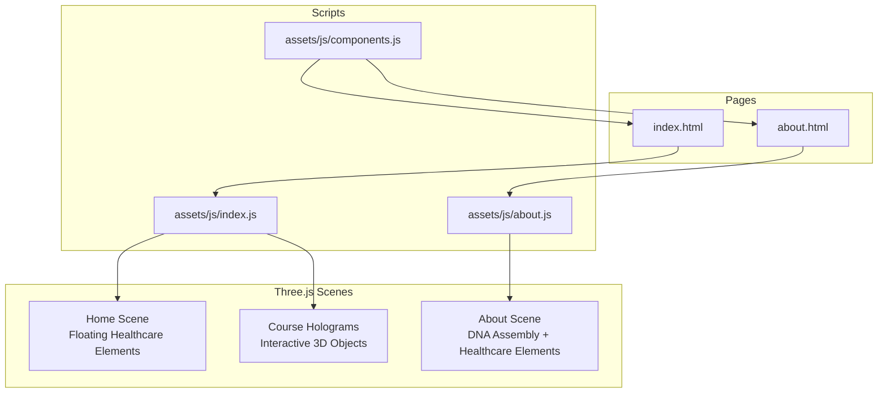
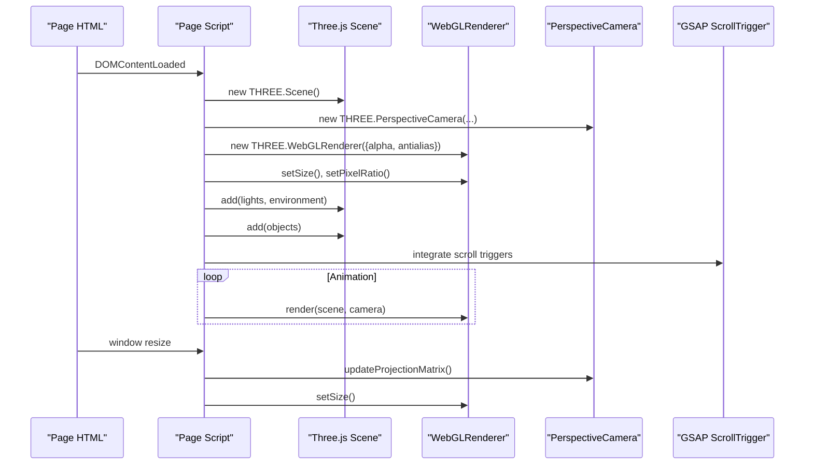
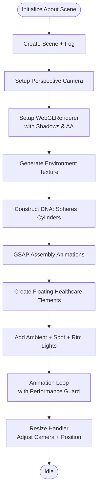
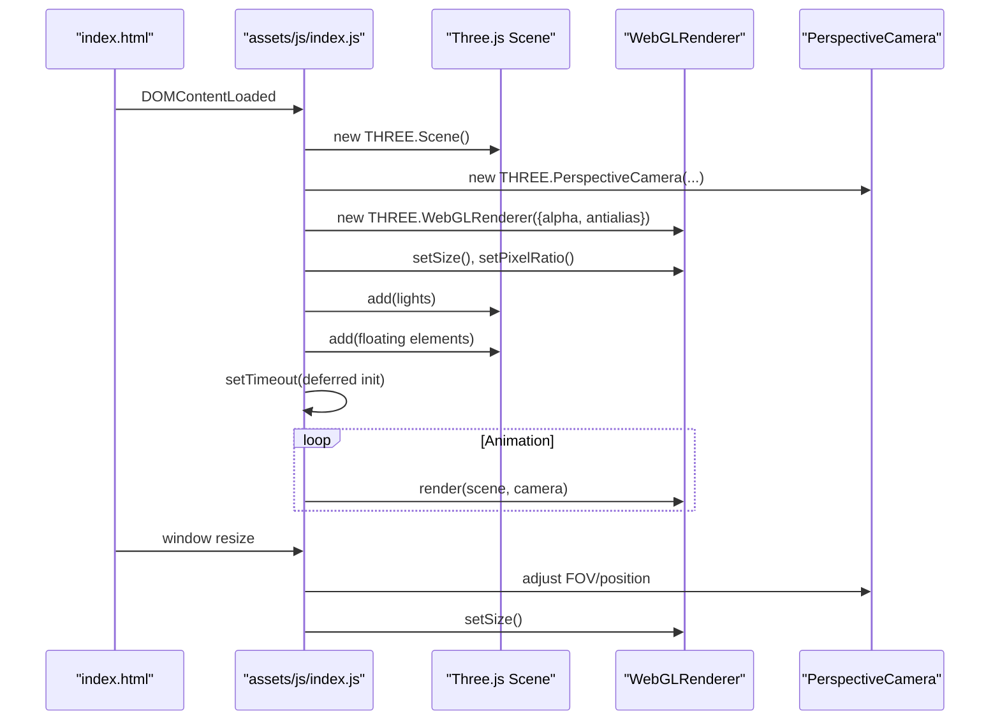
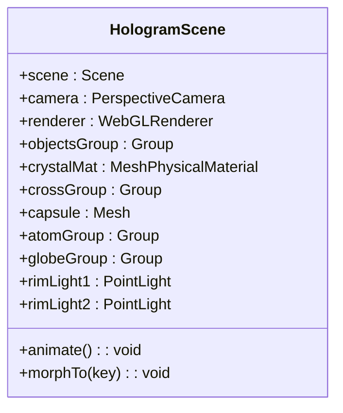
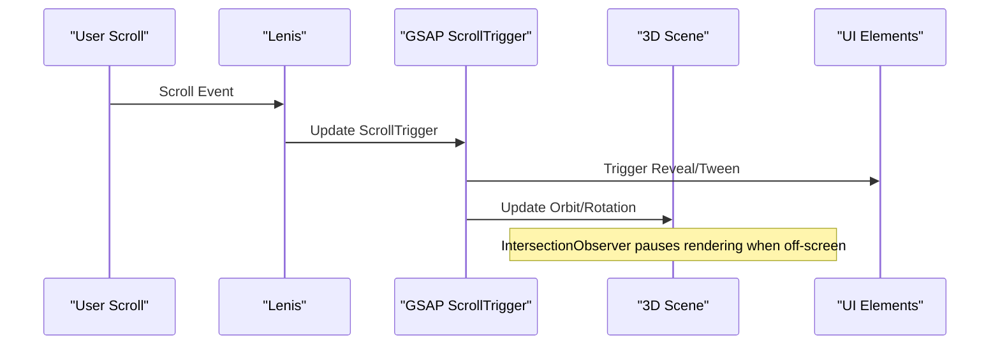
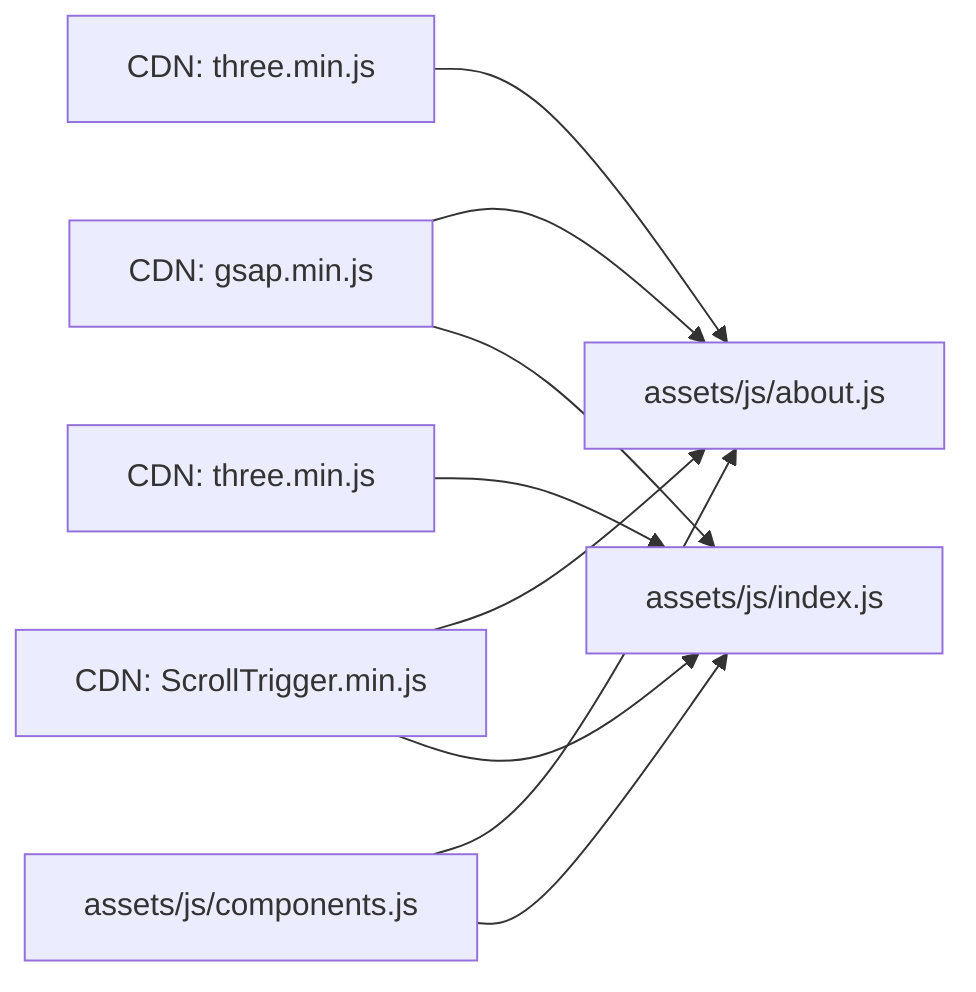

# 3D Graphics Integration

<cite>
**Referenced Files in This Document**
- [about.html](file://about.html)
- [index.html](file://index.html)
- [assets/js/about.js](file://assets/js/about.js)
- [assets/js/index.js](file://assets/js/index.js)
- [assets/js/components.js](file://assets/js/components.js)
</cite>

## Table of Contents
1. [Introduction](#introduction)
2. [Project Structure](#project-structure)
3. [Core Components](#core-components)
4. [Architecture Overview](#architecture-overview)
5. [Detailed Component Analysis](#detailed-component-analysis)
6. [Dependency Analysis](#dependency-analysis)
7. [Performance Considerations](#performance-considerations)
8. [Troubleshooting Guide](#troubleshooting-guide)
9. [Conclusion](#conclusion)

## Introduction
This document explains the Three.js 3D graphics integration used across the Eduooz website. It covers scene setup, camera positioning, renderer configuration, and the creation of healthcare-themed 3D objects (medical equipment, molecular structures, and geometric forms). It also documents the animation loop, performance optimizations, responsive scaling, scroll-triggered effects, and coordination between 3D scenes and UI elements including z-index management and layering.

## Project Structure
The 3D integration appears in two primary pages:
- Home page (index.html) with a floating healthcare elements background and interactive course holograms
- About page (about.html) with a DNA assembly scene and floating healthcare elements

Both pages embed Three.js via CDN and use GSAP for scroll-triggered animations and UI orchestration.

**Diagram sources**
- [index.html:18-24](file://index.html#L18-L24)
- [about.html:14-20](file://about.html#L14-L20)
- [assets/js/index.js:105-118](file://assets/js/index.js#L105-L118)
- [assets/js/about.js:70-106](file://assets/js/about.js#L70-L106)

**Section sources**
- [index.html:18-24](file://index.html#L18-L24)
- [about.html:14-20](file://about.html#L14-L20)

## Core Components
- Scene initialization and fog setup
- Perspective camera with aspect ratio and position tuning
- WebGLRenderer with transparency, antialiasing, and shadow mapping
- Environment generation for realistic refractions
- Healthcare-themed 3D object factories (medical cross, capsule, test tube, stethoscope)
- Lighting system (ambient, spot, rim lights)
- Animation loop with performance optimizations (intersection observer, device pixel ratio limits)
- Responsive resize handling with camera FOV adjustments
- Scroll-triggered UI integration using GSAP ScrollTrigger

**Section sources**
- [assets/js/about.js:75-106](file://assets/js/about.js#L75-L106)
- [assets/js/about.js:390-413](file://assets/js/about.js#L390-L413)
- [assets/js/about.js:414-492](file://assets/js/about.js#L414-L492)
- [assets/js/index.js:107-118](file://assets/js/index.js#L107-L118)
- [assets/js/index.js:310-333](file://assets/js/index.js#L310-L333)
- [assets/js/index.js:335-432](file://assets/js/index.js#L335-L432)

## Architecture Overview
The 3D scenes are encapsulated within page-specific scripts. Each scene follows a similar lifecycle:
- Container selection and Three.js availability checks
- Scene, camera, and renderer creation
- Environment and lighting setup
- Object instantiation via factory functions
- Animation loop with performance guards
- Resize and scroll integration

**Diagram sources**
- [assets/js/about.js:75-106](file://assets/js/about.js#L75-L106)
- [assets/js/about.js:414-466](file://assets/js/about.js#L414-L466)
- [assets/js/index.js:107-118](file://assets/js/index.js#L107-L118)
- [assets/js/index.js:335-380](file://assets/js/index.js#L335-L380)

## Detailed Component Analysis

### About Page: DNA Assembly and Floating Healthcare Elements
- Scene setup with exponential fog and environment-based lighting
- DNA construction using spheres and cylinders with alternating glow materials
- Assembly animation using GSAP timelines for position, scale, and rotation
- Floating healthcare elements grouped and animated with sine-based offsets
- Mouse parallax applied to groups for immersive interaction
- Performance guard using IntersectionObserver to pause rendering when off-screen
- Responsive behavior adjusts camera position and FOV based on viewport width

**Diagram sources**
- [assets/js/about.js:75-106](file://assets/js/about.js#L75-L106)
- [assets/js/about.js:162-241](file://assets/js/about.js#L162-L241)
- [assets/js/about.js:243-384](file://assets/js/about.js#L243-L384)
- [assets/js/about.js:390-413](file://assets/js/about.js#L390-L413)
- [assets/js/about.js:414-492](file://assets/js/about.js#L414-L492)

**Section sources**
- [assets/js/about.js:75-106](file://assets/js/about.js#L75-L106)
- [assets/js/about.js:162-241](file://assets/js/about.js#L162-L241)
- [assets/js/about.js:243-384](file://assets/js/about.js#L243-L384)
- [assets/js/about.js:390-413](file://assets/js/about.js#L390-L413)
- [assets/js/about.js:414-492](file://assets/js/about.js#L414-L492)

### Home Page: Floating Healthcare Elements Background
- Minimal scene with premium frosted glass and glow materials
- Factory functions for medical cross, capsule, test tube, and stethoscope
- Organic floating motion with separate drift rates per axis
- Ambient and rim lighting for depth and rim highlights
- Deferred initialization to preserve hero animation performance
- Responsive camera adjustments for mobile/tablet/desktop

**Diagram sources**
- [assets/js/index.js:105-118](file://assets/js/index.js#L105-L118)
- [assets/js/index.js:124-288](file://assets/js/index.js#L124-L288)
- [assets/js/index.js:310-333](file://assets/js/index.js#L310-L333)
- [assets/js/index.js:335-432](file://assets/js/index.js#L335-L432)

**Section sources**
- [assets/js/index.js:105-118](file://assets/js/index.js#L105-L118)
- [assets/js/index.js:124-288](file://assets/js/index.js#L124-L288)
- [assets/js/index.js:310-333](file://assets/js/index.js#L310-L333)
- [assets/js/index.js:335-432](file://assets/js/index.js#L335-L432)

### Course Holograms: Interactive 3D Objects
- Dedicated container for course-specific 3D content
- Physical materials for crystal-like transmission and refraction
- Object factories for medical cross, capsule, molecular rings, and wireframe globe
- Dynamic lighting with color-changing rim lights
- UI-driven morphing between objects using GSAP
- Performance guard and responsive resize handling

**Diagram sources**
- [assets/js/index.js:561-574](file://assets/js/index.js#L561-L574)
- [assets/js/index.js:576-627](file://assets/js/index.js#L576-L627)
- [assets/js/index.js:633-640](file://assets/js/index.js#L633-L640)
- [assets/js/index.js:641-682](file://assets/js/index.js#L641-L682)
- [assets/js/index.js:684-716](file://assets/js/index.js#L684-L716)

**Section sources**
- [assets/js/index.js:561-574](file://assets/js/index.js#L561-L574)
- [assets/js/index.js:576-627](file://assets/js/index.js#L576-L627)
- [assets/js/index.js:633-640](file://assets/js/index.js#L633-L640)
- [assets/js/index.js:641-682](file://assets/js/index.js#L641-L682)
- [assets/js/index.js:684-716](file://assets/js/index.js#L684-L716)

### Scroll-Triggered Effects and UI Coordination
- Lenis smooth scrolling integrated with GSAP ScrollTrigger
- Hero entrance sequences with staggered reveals and magnetic buttons
- Orbiting course nodes with dynamic z-index management during rotation
- Timeline progress indicators synchronized with scroll position
- IntersectionObserver pauses animations when off-screen

**Diagram sources**
- [assets/js/index.js:22-57](file://assets/js/index.js#L22-L57)
- [assets/js/index.js:466-497](file://assets/js/index.js#L466-L497)
- [assets/js/about.js:423-430](file://assets/js/about.js#L423-L430)

**Section sources**
- [assets/js/index.js:22-57](file://assets/js/index.js#L22-L57)
- [assets/js/index.js:466-497](file://assets/js/index.js#L466-L497)
- [assets/js/about.js:423-430](file://assets/js/about.js#L423-L430)

## Dependency Analysis
- Three.js imported via CDN in both pages
- GSAP and ScrollTrigger included for UI and scroll-driven animations
- Components loader script manages header/footer/chat injection and path resolution

**Diagram sources**
- [index.html:18-20](file://index.html#L18-L20)
- [about.html:14-16](file://about.html#L14-L16)
- [assets/js/components.js:26-33](file://assets/js/components.js#L26-L33)

**Section sources**
- [index.html:18-20](file://index.html#L18-L20)
- [about.html:14-16](file://about.html#L14-L16)
- [assets/js/components.js:26-33](file://assets/js/components.js#L26-L33)

## Performance Considerations
- Device pixel ratio capped to limit rendering overhead on high-DPR devices
- Shadow mapping enabled with soft PCF for quality balance
- IntersectionObserver pauses animation loops when containers are not visible
- Deferred initialization of heavy WebGL payloads to prioritize hero animations
- Responsive camera adjustments reduce computational load on mobile devices
- Materials optimized for transmission/refraction with reasonable roughness/metalness

**Section sources**
- [assets/js/about.js:84-91](file://assets/js/about.js#L84-L91)
- [assets/js/about.js:423-430](file://assets/js/about.js#L423-L430)
- [assets/js/index.js:115](file://assets/js/index.js#L115)
- [assets/js/index.js:382-386](file://assets/js/index.js#L382-L386)
- [assets/js/index.js:420-431](file://assets/js/index.js#L420-L431)

## Troubleshooting Guide
- Three.js not loaded: Scripts check for global THREE availability before initializing scenes
- IntersectionObserver not supported: Fallback animation loop continues without pausing
- Mobile performance: Adjust camera FOV and position in resize handler; consider lowering shadow map sizes
- Lighting artifacts: Ensure environment textures are compiled before assigning to scene.environment
- Scroll-trigger conflicts: Verify GSAP and ScrollTrigger are loaded and Lenis updates ScrollTrigger on scroll events

**Section sources**
- [assets/js/about.js:75](file://assets/js/about.js#L75)
- [assets/js/about.js:423-430](file://assets/js/about.js#L423-L430)
- [assets/js/index.js:18-20](file://assets/js/index.js#L18-L20)
- [assets/js/index.js:22-57](file://assets/js/index.js#L22-L57)

## Conclusion
The Eduooz website integrates Three.js across multiple pages to create immersive, healthcare-themed 3D experiences. The implementations emphasize performance, responsiveness, and seamless UI integration. By leveraging factory functions, GSAP ScrollTrigger, and IntersectionObserver-based pausing, the scenes remain visually rich while maintaining smooth interactions across devices.