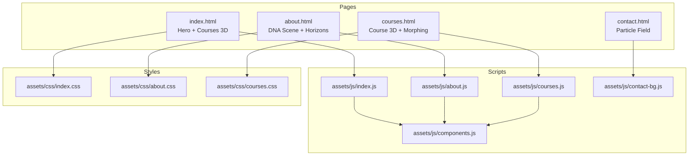
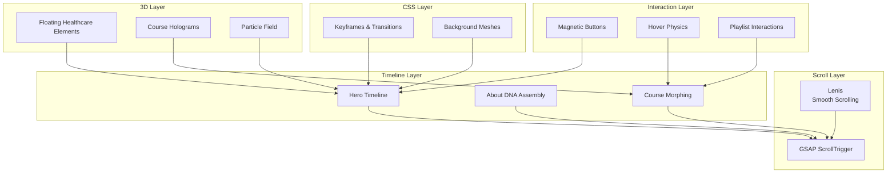
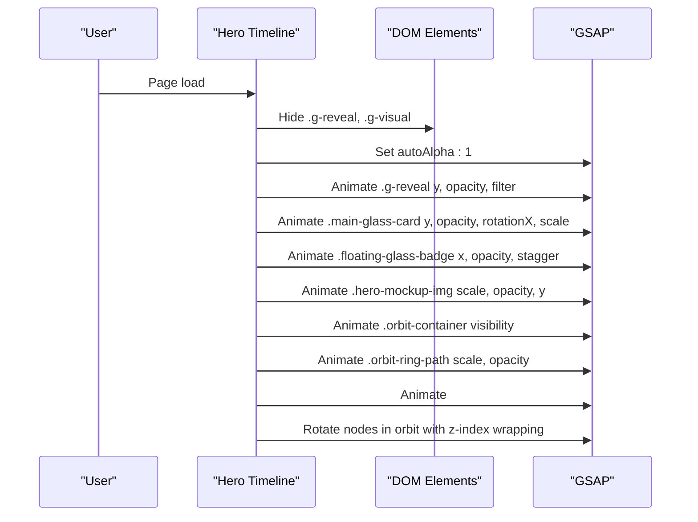
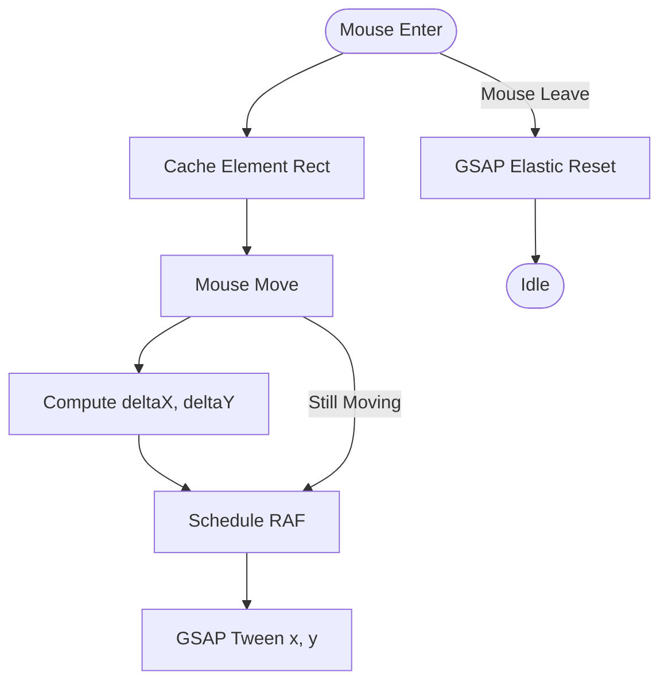
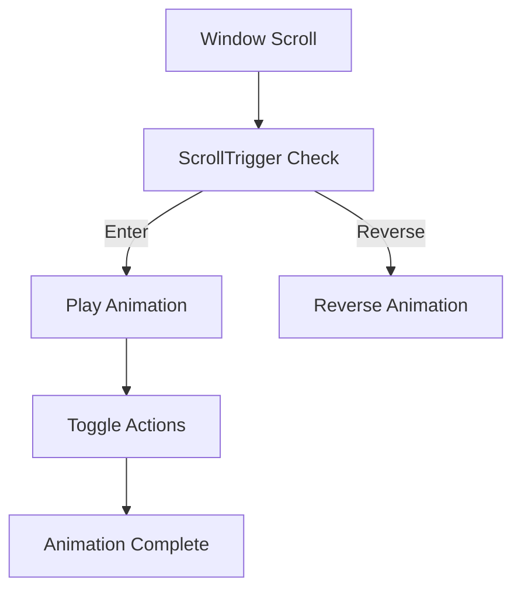
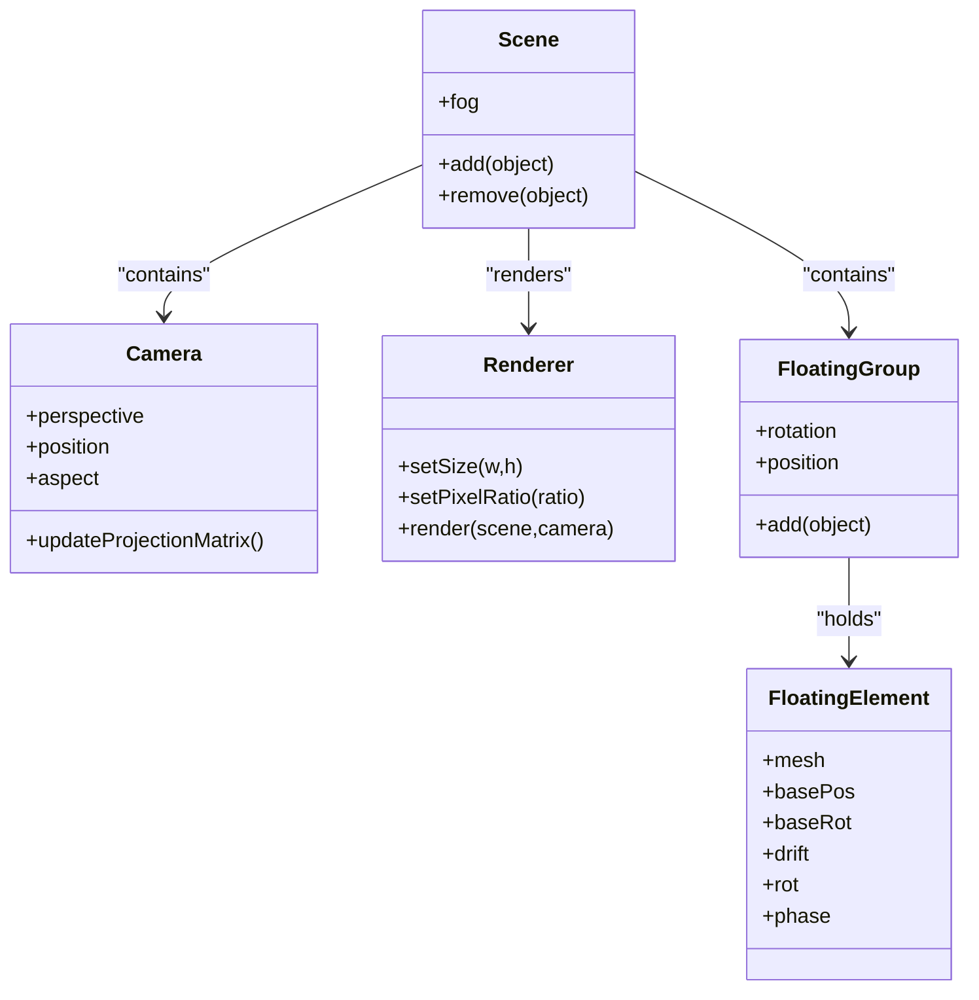
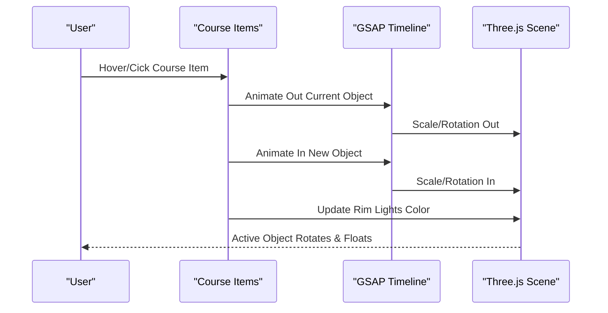
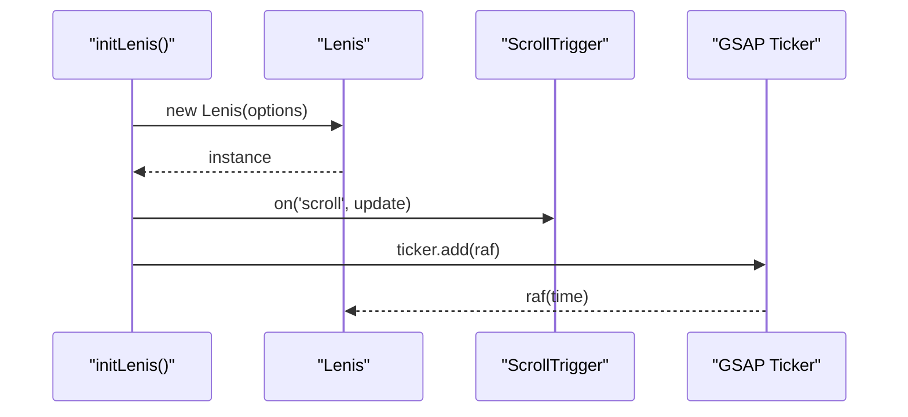
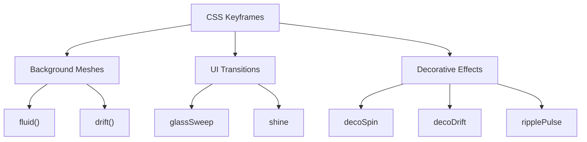
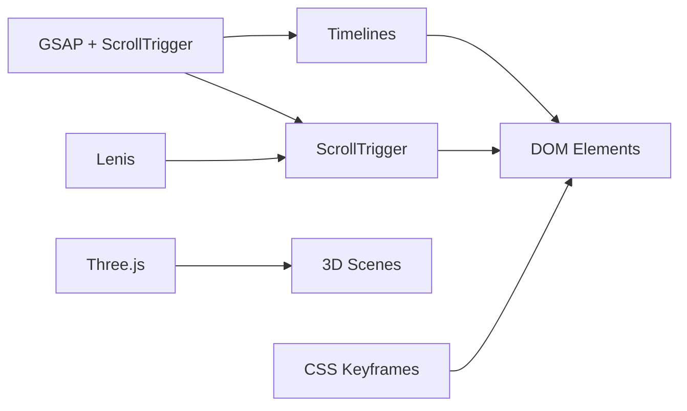

# Animation Architecture

<cite>
**Referenced Files in This Document**
- [index.js](file://assets/js/index.js)
- [index.css](file://assets/css/index.css)
- [about.js](file://assets/js/about.js)
- [about.css](file://assets/css/about.css)
- [courses.js](file://assets/js/courses.js)
- [courses.css](file://assets/css/courses.css)
- [contact-bg.js](file://assets/js/contact-bg.js)
- [components.js](file://assets/js/components.js)
</cite>

## Table of Contents
1. [Introduction](#introduction)
2. [Project Structure](#project-structure)
3. [Core Components](#core-components)
4. [Architecture Overview](#architecture-overview)
5. [Detailed Component Analysis](#detailed-component-analysis)
6. [Dependency Analysis](#dependency-analysis)
7. [Performance Considerations](#performance-considerations)
8. [Troubleshooting Guide](#troubleshooting-guide)
9. [Conclusion](#conclusion)

## Introduction
This document explains the animation architecture powering Eduooz, focusing on the integration between GSAP timelines, scroll-triggered effects, magnetic interactions, Three.js 3D scenes, and Lenis smooth scrolling. It covers timeline management for hero animations, magnetic button interaction effects, scroll-based triggers, and the coordination between page load, user interaction, and continuous background animations. It also documents the CSS animation keyframes and transitions that complement JavaScript-driven motion, along with performance optimization techniques and browser compatibility considerations.

## Project Structure
The animation system spans multiple pages and scripts:
- Hero and landing page animations: index.js and index.css
- About page cinematic sequences and scroll reveals: about.js and about.css
- Courses page interactive 3D morphing and scroll triggers: courses.js and courses.css
- Contact page particle background: contact-bg.js
- Shared component loader: components.js

**Diagram sources**
- [index.js:1-2203](file://assets/js/index.js#L1-L2203)
- [index.css:1-3513](file://assets/css/index.css#L1-L3513)
- [about.js:1-1836](file://assets/js/about.js#L1-L1836)
- [about.css:1-2392](file://assets/css/about.css#L1-L2392)
- [courses.js:1-1408](file://assets/js/courses.js#L1-L1408)
- [courses.css:1-1238](file://assets/css/courses.css#L1-L1238)
- [contact-bg.js:1-193](file://assets/js/contact-bg.js#L1-L193)
- [components.js:1-347](file://assets/js/components.js#L1-L347)

**Section sources**
- [index.js:1-2203](file://assets/js/index.js#L1-L2203)
- [index.css:1-3513](file://assets/css/index.css#L1-L3513)
- [about.js:1-1836](file://assets/js/about.js#L1-L1836)
- [about.css:1-2392](file://assets/css/about.css#L1-L2392)
- [courses.js:1-1408](file://assets/js/courses.js#L1-L1408)
- [courses.css:1-1238](file://assets/css/courses.css#L1-L1238)
- [contact-bg.js:1-193](file://assets/js/contact-bg.js#L1-L193)
- [components.js:1-347](file://assets/js/components.js#L1-L347)

## Core Components
- GSAP timelines and ScrollTrigger-driven entrances and parallax
- Lenis smooth scrolling integration with GSAP ticker
- Magnetic button interactions using requestAnimationFrame
- Three.js floating healthcare elements and morphing 3D scenes
- CSS keyframes and transitions for background meshes and UI polish

Key implementation anchors:
- Hero entrance and orbiting nodes with GSAP timeline and ScrollTrigger
- Magnetic buttons with per-pixel cursor influence
- Three.js floating elements with organic drift and mouse parallax
- About page DNA assembly and floating elements
- Courses page course hologram morphing and lighting mood shifts
- Lenis initialization and integration hooks

**Section sources**
- [index.js:1-2203](file://assets/js/index.js#L1-L2203)
- [about.js:1-1836](file://assets/js/about.js#L1-L1836)
- [courses.js:1-1408](file://assets/js/courses.js#L1-L1408)

## Architecture Overview
The animation architecture combines:
- Page load animations: hero entrance, badge reveals, and initial card builds
- Scroll-triggered animations: section reveals, parallax overlays, and progress bars
- User interaction animations: magnetic buttons, hover physics, and playlist interactions
- Continuous background animations: floating 3D elements, particle fields, and CSS meshes
- Smooth scrolling: Lenis coordinating with GSAP for seamless motion

**Diagram sources**
- [index.js:1-2203](file://assets/js/index.js#L1-L2203)
- [about.js:1-1836](file://assets/js/about.js#L1-L1836)
- [courses.js:1-1408](file://assets/js/courses.js#L1-L1408)
- [index.css:1-3513](file://assets/css/index.css#L1-L3513)

## Detailed Component Analysis

### Hero Animation Timeline Management
The hero sequence uses a layered GSAP timeline:
- Initial reveal of text and visual blocks with blur and staggered entrance
- Phone mockup scale-up with bounce easing
- Orbit container and ring path scaling
- Node bursts from center with staggered timing
- Infinite orbit rotation with dynamic z-index wrapping

**Diagram sources**
- [index.js:4-50](file://assets/js/index.js#L4-L50)

**Section sources**
- [index.js:4-50](file://assets/js/index.js#L4-L50)
- [index.js:434-497](file://assets/js/index.js#L434-L497)

### Magnetic Button Interaction Effects
Magnetic buttons track mouse movement and apply spring-like transforms:
- On mouseenter: cache bounding rectangle
- On mousemove: compute deltas, schedule RAF, apply GSAP tween
- On mouseleave: return to rest with elastic ease

**Diagram sources**
- [index.js:58-84](file://assets/js/index.js#L58-L84)

**Section sources**
- [index.js:58-84](file://assets/js/index.js#L58-L84)

### Scroll-Based Animation Triggers
ScrollTrigger powers multiple sections:
- Navbar light/dark blend at specific scroll offsets
- Trust panel fade and float with toggleActions
- Counter animations triggered once when entering viewport
- Course section entrance with staggered reveals
- About page horizon scroll with skew and parallax
- Courses page pricing toggle with animated number swaps

**Diagram sources**
- [index.js:86-101](file://assets/js/index.js#L86-L101)
- [index.js:500-537](file://assets/js/index.js#L500-L537)
- [about.js:494-556](file://assets/js/about.js#L494-L556)
- [courses.js:293-361](file://assets/js/courses.js#L293-L361)

**Section sources**
- [index.js:86-101](file://assets/js/index.js#L86-L101)
- [index.js:500-537](file://assets/js/index.js#L500-L537)
- [about.js:494-556](file://assets/js/about.js#L494-L556)
- [courses.js:293-361](file://assets/js/courses.js#L293-L361)

### Three.js Integration and Floating Elements
Three.js scenes are built per page:
- Floating healthcare elements with procedural geometry and materials
- Organic drift and rotation using elapsed time
- Mouse parallax and camera breathing for immersion
- IntersectionObserver to pause rendering when offscreen
- Performance optimizations: deferred instantiation, pixel ratio limits, and resize handling

**Diagram sources**
- [index.js:105-431](file://assets/js/index.js#L105-L431)
- [about.js:71-492](file://assets/js/about.js#L71-L492)
- [contact-bg.js:1-193](file://assets/js/contact-bg.js#L1-L193)

**Section sources**
- [index.js:105-431](file://assets/js/index.js#L105-L431)
- [about.js:71-492](file://assets/js/about.js#L71-L492)
- [contact-bg.js:1-193](file://assets/js/contact-bg.js#L1-L193)

### Course Hologram Morphing Engine
The courses page features a morphing 3D engine:
- Four course-specific 3D objects (medical cross, capsule, atom rings, wireframe globe)
- Lighting mood changes synchronized with course selection
- Continuous rotation and floating for active object
- GSAP morph transitions between objects with elastic/back easings

**Diagram sources**
- [courses.js:586-707](file://assets/js/courses.js#L586-L707)

**Section sources**
- [courses.js:586-707](file://assets/js/courses.js#L586-L707)

### Lenis Smooth Scrolling Integration
Lenis integrates with GSAP to synchronize scroll updates and ticker:
- Initialize Lenis with easing and duration parameters
- On scroll, notify ScrollTrigger to update
- Hook GSAP ticker to Lenis raf for frame-perfect motion
- Fallback to native requestAnimationFrame if GSAP unavailable

**Diagram sources**
- [index.js:22-55](file://assets/js/index.js#L22-L55)
- [about.js:4-33](file://assets/js/about.js#L4-L33)
- [courses.js:3-33](file://assets/js/courses.js#L3-L33)

**Section sources**
- [index.js:22-55](file://assets/js/index.js#L22-L55)
- [about.js:4-33](file://assets/js/about.js#L4-L33)
- [courses.js:3-33](file://assets/js/courses.js#L3-L33)

### CSS Keyframes and Transitions
CSS keyframes and transitions complement JavaScript-driven animations:
- Fluid background blobs with alternating easing
- Glass sweep overlays and shimmering text gradients
- Floating deco rings and blobs for organic motion
- Particle additive blending for contact page field

**Diagram sources**
- [index.css:121-129](file://assets/css/index.css#L121-L129)
- [index.css:701-709](file://assets/css/index.css#L701-L709)
- [index.css:597-609](file://assets/css/index.css#L597-L609)
- [about.css:1116-1123](file://assets/css/about.css#L1116-L1123)
- [about.css:1378-1396](file://assets/css/about.css#L1378-L1396)
- [contact-bg.js:25-32](file://assets/js/contact-bg.js#L25-L32)

**Section sources**
- [index.css:121-129](file://assets/css/index.css#L121-L129)
- [index.css:701-709](file://assets/css/index.css#L701-L709)
- [index.css:597-609](file://assets/css/index.css#L597-L609)
- [about.css:1116-1123](file://assets/css/about.css#L1116-L1123)
- [about.css:1378-1396](file://assets/css/about.css#L1378-L1396)
- [contact-bg.js:25-32](file://assets/js/contact-bg.js#L25-L32)

## Dependency Analysis
The animation system exhibits layered dependencies:
- Scripts depend on GSAP and ScrollTrigger globals
- Lenis is optional but enhances scroll performance
- Three.js scenes are isolated per page with minimal cross-page coupling
- CSS keyframes provide baseline motion while JS orchestrates orchestration

**Diagram sources**
- [index.js:1-2203](file://assets/js/index.js#L1-L2203)
- [about.js:1-1836](file://assets/js/about.js#L1-L1836)
- [courses.js:1-1408](file://assets/js/courses.js#L1-L1408)
- [index.css:1-3513](file://assets/css/index.css#L1-L3513)

**Section sources**
- [index.js:1-2203](file://assets/js/index.js#L1-L2203)
- [about.js:1-1836](file://assets/js/about.js#L1-L1836)
- [courses.js:1-1408](file://assets/js/courses.js#L1-L1408)
- [index.css:1-3513](file://assets/css/index.css#L1-L3513)

## Performance Considerations
- Deferred heavy WebGL payload: delay 3D scene creation to ensure hero entrance remains smooth
- IntersectionObserver pauses rendering when offscreen
- Pixel ratio limits and antialiasing tuned for device capabilities
- requestAnimationFrame scheduling avoids redundant updates
- Scroll-triggered animations use scrubbing for smoothness
- CSS keyframes handle continuous motion (blobs, rings) to reduce JS overhead

Practical tips:
- Keep ScrollTrigger scrub durations moderate to avoid jank
- Limit GSAP tweens to essential properties (avoid frequent layout thrashing)
- Prefer transform/opacity for GPU acceleration
- Defer non-critical 3D scenes until after initial load

**Section sources**
- [index.js:382-413](file://assets/js/index.js#L382-L413)
- [about.js:423-430](file://assets/js/about.js#L423-L430)
- [courses.js:363-389](file://assets/js/courses.js#L363-L389)

## Troubleshooting Guide
Common issues and resolutions:
- Lenis not loaded: script logs a warning and falls back to native scrolling
- GSAP/ScrollTrigger undefined: ensure libraries are loaded before invoking timeline/trigger APIs
- 3D scene not rendering: verify container exists and camera/scene/renderer are properly initialized
- Magnetic buttons jitter: ensure RAF scheduling prevents accumulation and resets on leave
- Scroll-trigger not firing: confirm trigger/target elements exist and ScrollTrigger is registered

Debugging steps:
- Check console warnings for missing dependencies
- Verify element selectors match DOM structure
- Confirm IntersectionObserver and ResizeEvent listeners are attached
- Validate easing and duration values for smoothness

**Section sources**
- [index.js:22-55](file://assets/js/index.js#L22-L55)
- [index.js:58-84](file://assets/js/index.js#L58-L84)
- [about.js:4-33](file://assets/js/about.js#L4-L33)
- [courses.js:3-33](file://assets/js/courses.js#L3-L33)

## Conclusion
Eduooz’s animation architecture blends GSAP timelines, ScrollTrigger, Lenis smooth scrolling, and Three.js scenes to deliver immersive, performant experiences. The system separates page load animations, user interaction effects, and continuous background motion, ensuring smooth performance across devices. CSS keyframes complement JS orchestration for efficient, visually rich motion. By deferring heavy workloads, leveraging IntersectionObserver, and integrating Lenis with GSAP, the architecture maintains responsiveness while delivering polished, coordinated animations.