# Architecture Overview

<cite>
**Referenced Files in This Document**
- [index.html](file://index.html)
- [structure.html](file://structure.html)
- [components.js](file://assets/js/components.js)
- [header.html](file://components/header.html)
- [footer.html](file://components/footer.html)
- [index.js](file://assets/js/index.js)
- [about.js](file://assets/js/about.js)
- [courses.js](file://assets/js/courses.js)
- [index.css](file://assets/css/index.css)
- [header-footer.css](file://assets/css/header-footer.css)
</cite>

## Table of Contents
1. [Introduction](#introduction)
2. [Project Structure](#project-structure)
3. [Core Components](#core-components)
4. [Architecture Overview](#architecture-overview)
5. [Detailed Component Analysis](#detailed-component-analysis)
6. [Dependency Analysis](#dependency-analysis)
7. [Performance Considerations](#performance-considerations)
8. [Troubleshooting Guide](#troubleshooting-guide)
9. [Conclusion](#conclusion)

## Introduction
This document describes the Eduooz website’s component-based architecture, focusing on modular HTML components, dynamic loading, responsive design, and immersive UI systems. It explains how Three.js powers 3D graphics, GSAP orchestrates scroll-triggered animations and magnetic interactions, and the glass morphism design system is unified via CSS custom properties. The document also covers component interaction patterns among header, footer, and main content, and outlines data flow from static pages to dynamic animations, with guidance for maintaining performance across devices and browsers.

## Project Structure
The site is organized around a small set of HTML entry points and a shared component loader. Static pages define sections and containers; a single JavaScript module dynamically loads reusable header, footer, and chat components. Styles are split into theme-specific and shared stylesheets, with CSS custom properties enabling a cohesive glass design system.

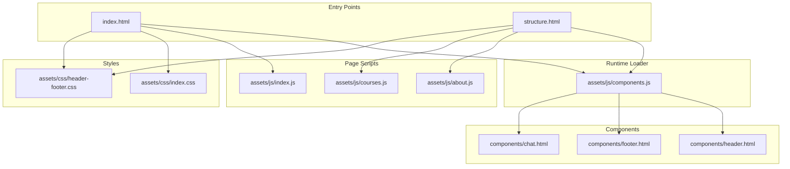

**Diagram sources**
- [index.html](file://index.html)
- [structure.html](file://structure.html)
- [components.js](file://assets/js/components.js)
- [header.html](file://components/header.html)
- [footer.html](file://components/footer.html)
- [index.css](file://assets/css/index.css)
- [header-footer.css](file://assets/css/header-footer.css)
- [index.js](file://assets/js/index.js)
- [about.js](file://assets/js/about.js)
- [courses.js](file://assets/js/courses.js)

**Section sources**
- [index.html](file://index.html)
- [structure.html](file://structure.html)
- [components.js](file://assets/js/components.js)

## Core Components
- Modular HTML components: Header, footer, and chat are separate HTML fragments intended for reuse.
- Dynamic component loader: A self-contained module detects the deployment base path, loads components via fetch, fixes relative URLs, and initializes component-specific behaviors.
- Shared design system: CSS custom properties define dark/light themes and glass material variables; shared header/footer styles unify the global look-and-feel.
- Page-specific scripts: Each major page initializes smooth scrolling, reveals, and specialized animations.

**Section sources**
- [components.js](file://assets/js/components.js)
- [header.html](file://components/header.html)
- [footer.html](file://components/footer.html)
- [index.css](file://assets/css/index.css)
- [header-footer.css](file://assets/css/header-footer.css)

## Architecture Overview
The runtime architecture centers on a lightweight component loader that injects shared UI into pages. Animations and 3D visuals are layered atop the component system using GSAP and Three.js. The design system is enforced through CSS custom properties and shared styles.

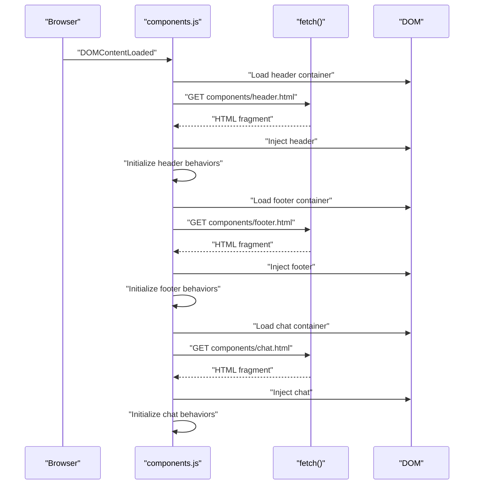

**Diagram sources**
- [components.js](file://assets/js/components.js)

**Section sources**
- [components.js](file://assets/js/components.js)

## Detailed Component Analysis

### Component Loader and Base Path Resolution
- Purpose: Dynamically load header, footer, and chat components into containers declared in entry pages.
- Base path detection: Inspects the current script’s src to compute a base path that works across local, root, and subdirectory deployments.
- Relative URL fix: Rewrites href/src attributes in loaded HTML to ensure assets resolve correctly when hosted under subpaths.
- Component initialization hooks: Dispatches events and invokes component-specific initialization routines after injection.

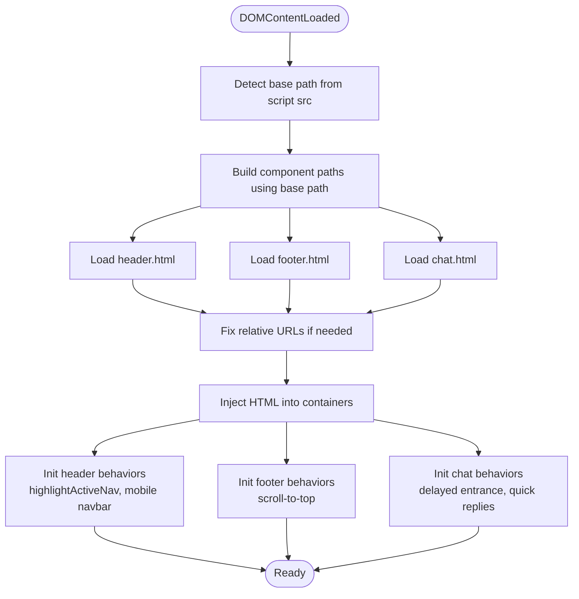

**Diagram sources**
- [components.js](file://assets/js/components.js)

**Section sources**
- [components.js](file://assets/js/components.js)

### Header Component
- Structure: Fixed-position glass navbar with logo, navigation links, and a call-to-action button.
- Behaviors: Active link highlighting based on current page; mobile menu toggle with overlay and outside-click close.
- Integration: Loaded by the component loader; triggers a header-loaded event for page scripts to attach scroll-aware behaviors.

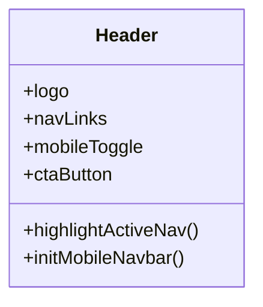

**Diagram sources**
- [header.html](file://components/header.html)
- [components.js](file://assets/js/components.js)

**Section sources**
- [header.html](file://components/header.html)
- [components.js](file://assets/js/components.js)

### Footer Component
- Structure: Sticky footer with CTA zone, grid links, newsletter form, and decorative elements.
- Behaviors: Scroll-to-top button toggles visibility on scroll; integrates with chat overlay to adjust layout.

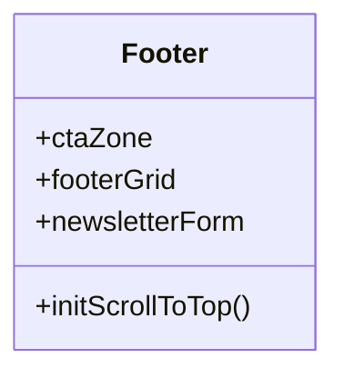

**Diagram sources**
- [footer.html](file://components/footer.html)
- [components.js](file://assets/js/components.js)

**Section sources**
- [footer.html](file://components/footer.html)
- [components.js](file://assets/js/components.js)

### Chat Component
- Structure: Floating action button with a slide-out panel.
- Behaviors: Appears after scrolling or timeout; toggles active state; supports quick replies and simulated bot responses; adjusts body layout to avoid overlap.

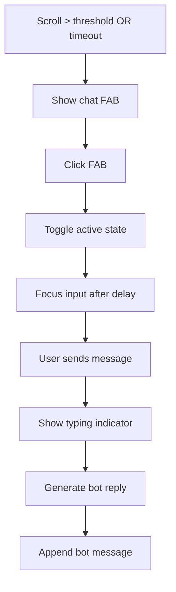

**Diagram sources**
- [components.js](file://assets/js/components.js)

**Section sources**
- [components.js](file://assets/js/components.js)

### Animation-Driven UI with GSAP and ScrollTrigger
- Smooth scrolling: Integrated with Lenis for buttery scroll behavior.
- Scroll-triggered reveals: Sections animate in as they enter the viewport.
- Magnetic buttons: Mouse-driven subtle repulsion/attraction with GSAP tweens.
- Navbar blend: Switches between dark and light modes based on scroll position.

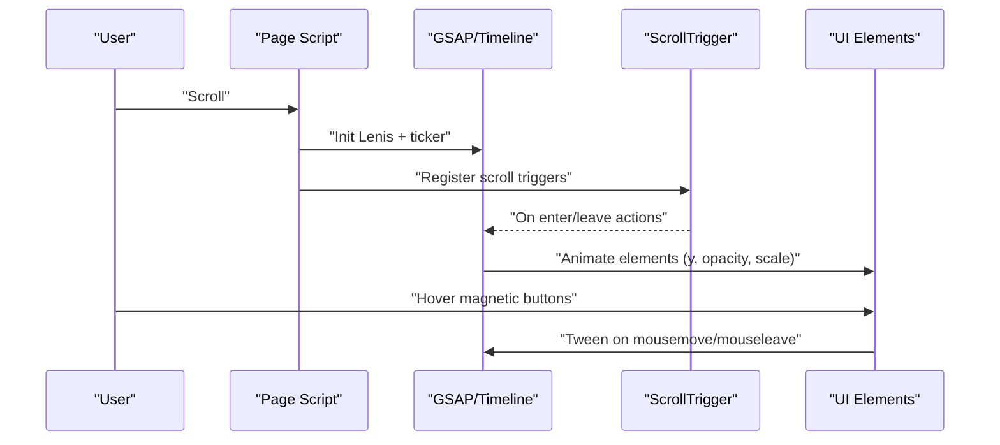

**Diagram sources**
- [index.js](file://assets/js/index.js)

**Section sources**
- [index.js](file://assets/js/index.js)

### Three.js 3D Graphics
- Hero 3D scene: Floating healthcare-themed objects rendered with physically-based materials and dynamic lighting.
- Course holograms: Interactive 3D models morphing on hover with coordinated lighting and glow.
- Performance: Deferred initialization and intersection observers prevent jank during initial load.

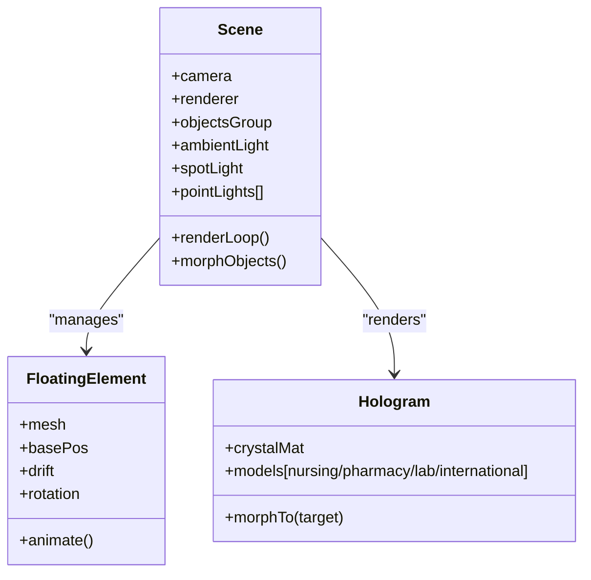

**Diagram sources**
- [index.js](file://assets/js/index.js)

**Section sources**
- [index.js](file://assets/js/index.js)

### Glass Morphism Design System
- CSS custom properties: Define brand colors, typography, and glass material variables.
- Shared styles: Header/footer styles leverage glass variables for consistent backdrop blur, borders, and shadows.
- Responsive scaling: Media queries adapt typography and spacing for tablets and phones.

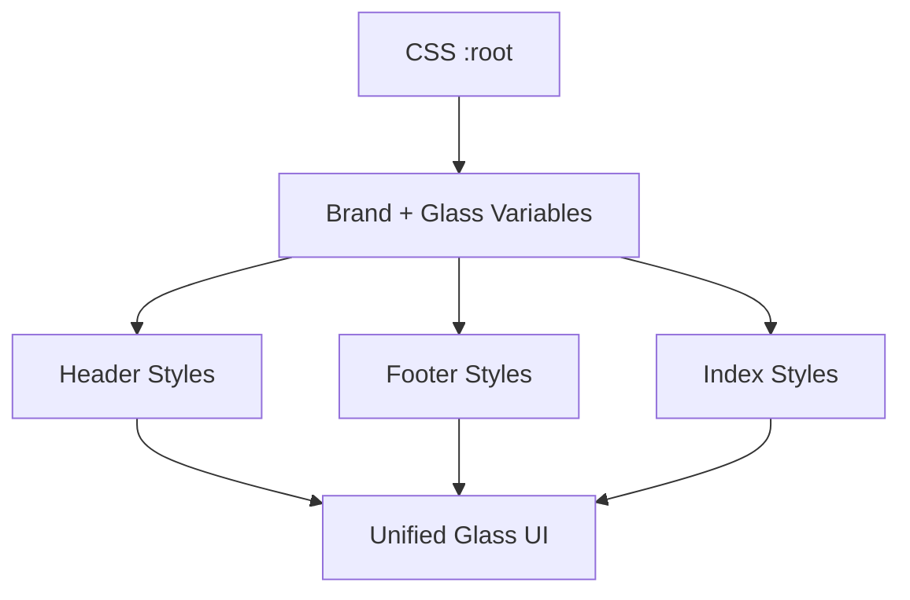

**Diagram sources**
- [index.css](file://assets/css/index.css)
- [header-footer.css](file://assets/css/header-footer.css)

**Section sources**
- [index.css](file://assets/css/index.css)
- [header-footer.css](file://assets/css/header-footer.css)

### Component Interaction Patterns
- Header-to-content: The header is injected early; page scripts listen for a header-loaded event to safely attach scroll-aware behaviors.
- Footer-to-content: Footer is injected with a scroll-to-top button; chat overlay toggles body classes to avoid layout conflicts.
- Main content-to-animations: Page scripts orchestrate GSAP timelines and Three.js scenes, coordinating with scroll and mouse events.

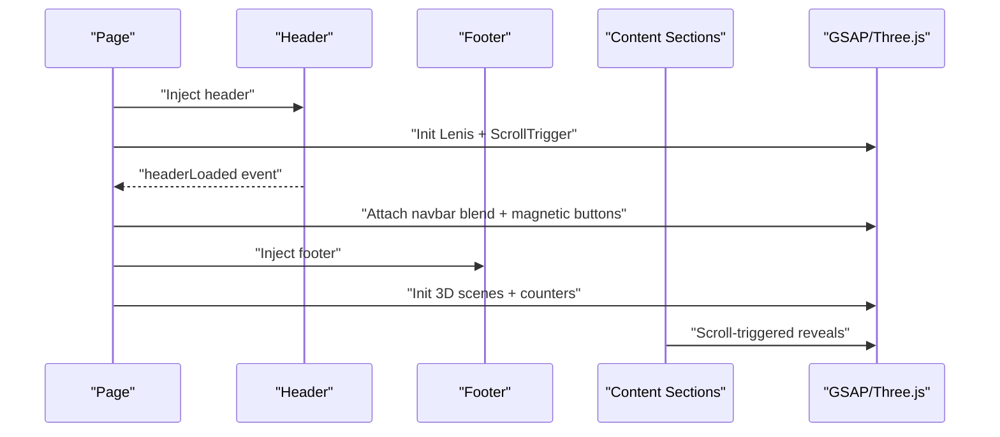

**Diagram sources**
- [components.js](file://assets/js/components.js)
- [index.js](file://assets/js/index.js)

**Section sources**
- [components.js](file://assets/js/components.js)
- [index.js](file://assets/js/index.js)

## Dependency Analysis
- Runtime dependencies:
  - GSAP and ScrollTrigger for animations and scroll-based triggers.
  - Three.js for 3D rendering.
  - Lenis for smooth scrolling integration.
- Build/runtime separation:
  - HTML entry pages declare styles and libraries.
  - Components are fetched and injected at runtime.
  - Page scripts initialize per-page features.

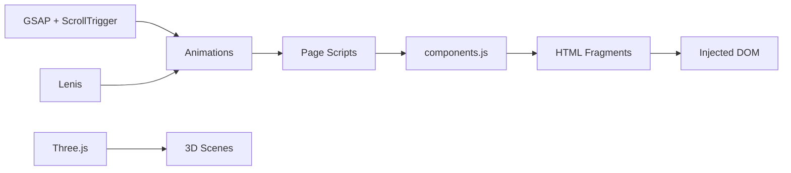

**Diagram sources**
- [index.js](file://assets/js/index.js)
- [components.js](file://assets/js/components.js)

**Section sources**
- [index.js](file://assets/js/index.js)
- [components.js](file://assets/js/components.js)

## Performance Considerations
- Deferred 3D initialization: Heavy WebGL initialization is delayed to prioritize hero entrance animations.
- Intersection observers: Used to pause expensive render loops when offscreen.
- Device pixel ratio limits: Renderer uses capped pixel ratios to balance quality and performance.
- Scroll performance: Passive listeners and throttled RAF ensure smooth interactions.
- Asset resolution: Base path detection avoids redundant network requests and ensures assets load correctly in subdirectories.

[No sources needed since this section provides general guidance]

## Troubleshooting Guide
- Components not loading:
  - Verify the base path detection and that relative asset paths are rewritten correctly.
  - Confirm the container IDs match between HTML and the loader.
- Chat panel overlaps content:
  - Ensure the chat overlay toggles body classes and that footer scroll-to-top respects the overlay state.
- Magnetic buttons not responding:
  - Check that mousemove events are attached and that requestAnimationFrame is not canceled prematurely.
- 3D scene not visible:
  - Confirm the container exists and that deferred initialization executes after the scene is appended.
- Scroll-triggered animations not firing:
  - Validate ScrollTrigger registration and that triggers/containers exist in the DOM.

**Section sources**
- [components.js](file://assets/js/components.js)
- [index.js](file://assets/js/index.js)

## Conclusion
Eduooz employs a clean, component-based architecture with a dynamic loader, a unified glass design system, and immersive animations powered by GSAP and Three.js. The approach balances modularity, reusability, and performance, delivering a polished experience across devices. By leveraging CSS custom properties, scroll-aware triggers, and deferred 3D initialization, the system remains maintainable and scalable.