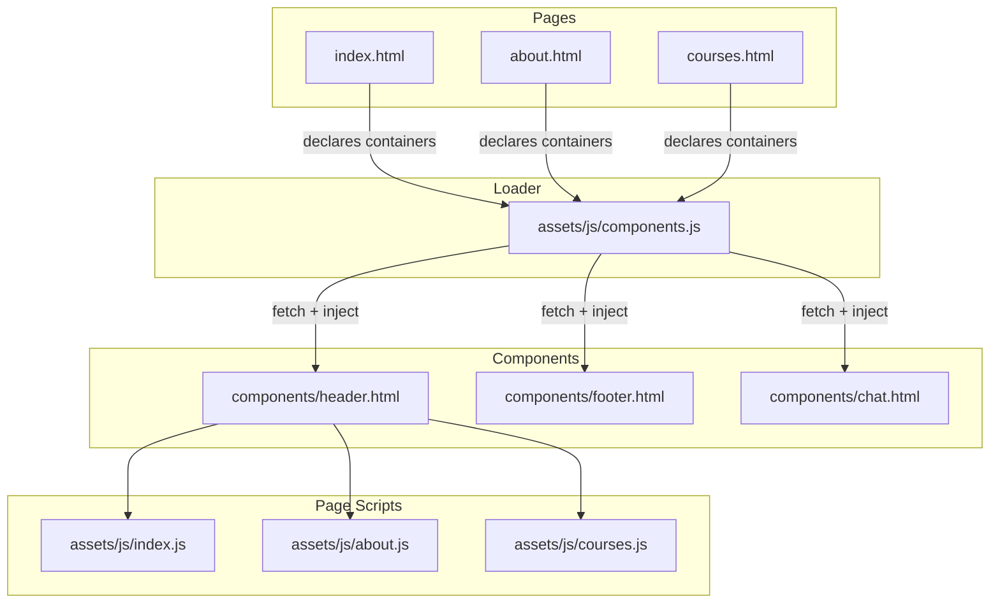
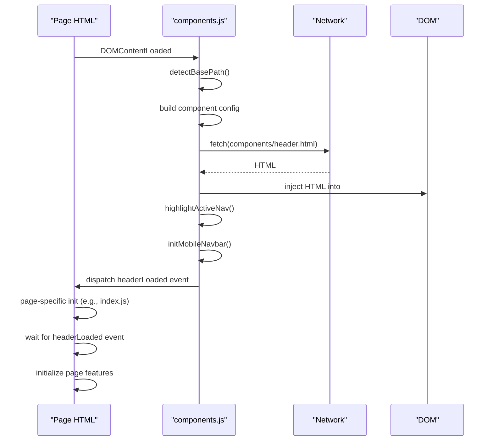
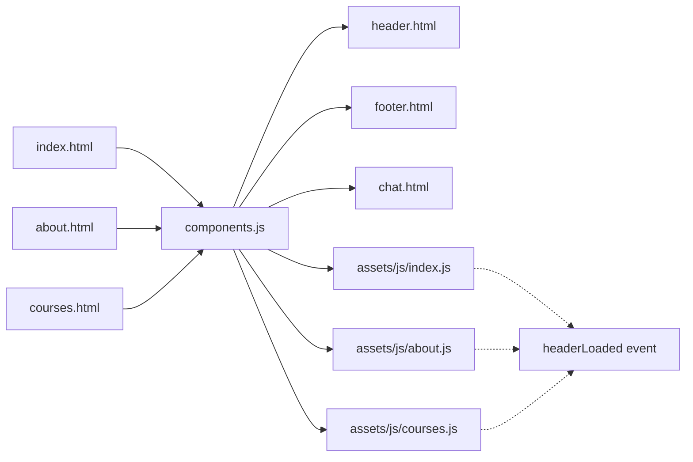

# Component System Design

<cite>
**Referenced Files in This Document**
- [components.js](file://assets/js/components.js)
- [header.html](file://components/header.html)
- [footer.html](file://components/footer.html)
- [chat.html](file://components/chat.html)
- [index.html](file://index.html)
- [about.html](file://about.html)
- [courses.html](file://courses.html)
- [index.js](file://assets/js/index.js)
- [about.js](file://assets/js/about.js)
- [courses.js](file://assets/js/courses.js)
</cite>

## Table of Contents
1. [Introduction](#introduction)
2. [Project Structure](#project-structure)
3. [Core Components](#core-components)
4. [Architecture Overview](#architecture-overview)
5. [Detailed Component Analysis](#detailed-component-analysis)
6. [Dependency Analysis](#dependency-analysis)
7. [Performance Considerations](#performance-considerations)
8. [Troubleshooting Guide](#troubleshooting-guide)
9. [Conclusion](#conclusion)

## Introduction
This document explains the Eduooz component system architecture, focusing on the modular HTML component design pattern and the dynamic component loading mechanism implemented in components.js. It covers the base path detection system for subdirectory support, active navigation highlighting, mobile navbar initialization, and the lifecycle from static HTML files to dynamic DOM manipulation. It also details integration patterns between reusable components and main page content, component configuration objects, loading sequences, error handling mechanisms, and the benefits of this architecture for maintainability, reusability, and performance optimization.

## Project Structure
The component system is organized around:
- Static component templates stored as separate HTML files under the components directory
- A centralized loader script that fetches and injects components into page containers
- Page-specific HTML files that declare containers for components
- Page-specific JavaScript that initializes page features and integrates with loaded components

**Diagram sources**
- [components.js:29-33](file://assets/js/components.js#L29-L33)
- [header.html:1-22](file://components/header.html#L1-L22)
- [footer.html:1-75](file://components/footer.html#L1-L75)
- [chat.html:1-78](file://components/chat.html#L1-L78)
- [index.html](file://index.html#L28)
- [about.html](file://about.html#L23)
- [courses.html](file://courses.html#L38)

**Section sources**
- [components.js:29-33](file://assets/js/components.js#L29-L33)
- [header.html:1-22](file://components/header.html#L1-L22)
- [footer.html:1-75](file://components/footer.html#L1-L75)
- [chat.html:1-78](file://components/chat.html#L1-L78)
- [index.html](file://index.html#L28)
- [about.html](file://about.html#L23)
- [courses.html](file://courses.html#L38)

## Core Components
- Component loader and base path detection
  - The loader determines the site’s base path to resolve component URLs correctly in root, subdirectory, or GitHub Pages contexts.
  - It defines component paths using the computed base path and stores them in a configuration object.
- Component injection pipeline
  - The loader fetches component HTML, optionally fixes relative asset paths, injects the HTML into a designated container, and triggers component-specific initialization hooks.
- Component-specific initializers
  - Navigation highlighting for active pages
  - Mobile navbar toggle and overlay behavior
  - Scroll-to-top button behavior
  - Premium chat widget with animated entrance, typing indicators, and quick replies

**Section sources**
- [components.js:9-26](file://assets/js/components.js#L9-L26)
- [components.js:29-33](file://assets/js/components.js#L29-L33)
- [components.js:40-76](file://assets/js/components.js#L40-L76)
- [components.js:109-285](file://assets/js/components.js#L109-L285)
- [components.js:287-314](file://assets/js/components.js#L287-L314)
- [components.js:316-337](file://assets/js/components.js#L316-L337)

## Architecture Overview
The component system follows a predictable lifecycle:
1. Page HTML declares containers for components (e.g., header-container, footer-container, chat-container).
2. The loader script detects the base path and loads component configurations.
3. The loader fetches each component and injects it into the appropriate container.
4. After injection, the loader triggers component-specific initialization routines.
5. Page scripts listen for component load events to initialize page-specific features that depend on the injected DOM.

**Diagram sources**
- [components.js:340-344](file://assets/js/components.js#L340-L344)
- [components.js:9-26](file://assets/js/components.js#L9-L26)
- [components.js:29-33](file://assets/js/components.js#L29-L33)
- [components.js:40-76](file://assets/js/components.js#L40-L76)
- [components.js:316-337](file://assets/js/components.js#L316-L337)
- [components.js:287-314](file://assets/js/components.js#L287-L314)
- [index.js:1-100](file://assets/js/index.js#L1-L100)

## Detailed Component Analysis

### Base Path Detection System
The base path detection ensures that component URLs are resolved correctly regardless of deployment location:
- It inspects the current script’s src attribute to determine whether the path is absolute, relative, or root-relative.
- It computes the base path up to the assets directory to construct correct URLs for components.

Benefits:
- Works on localhost, root domain, and subdirectory deployments.
- Eliminates hard-coded paths and reduces maintenance overhead.

**Section sources**
- [components.js:9-26](file://assets/js/components.js#L9-L26)

### Component Configuration and Loading Sequence
The loader maintains a configuration object mapping logical component names to computed URLs. The loading sequence is:
- Build component paths using the detected base path.
- On DOMContentLoaded, load header, footer, and chat components.
- Inject HTML into containers and run per-container initialization hooks.

Integration patterns:
- Containers are declared in page HTML with stable IDs.
- Initialization hooks are invoked after successful injection to set up interactive behaviors.

**Section sources**
- [components.js:29-33](file://assets/js/components.js#L29-L33)
- [components.js:340-344](file://assets/js/components.js#L340-L344)

### Active Navigation Highlighting
Behavior:
- Determines the current page from window.location.pathname.
- Compares each nav link’s href to the current page and toggles an “active” class accordingly.
- Handles special cases for home links and external/non-page links.

Lifecycle integration:
- Runs after the header component is injected and exposed via a custom event.

**Section sources**
- [components.js:316-337](file://assets/js/components.js#L316-L337)

### Mobile Navbar Initialization
Behavior:
- Toggles a mobile menu with overlay and overflow control.
- Closes the menu when a navigation link is clicked.
- Adjusts body styles to prevent background scrolling while the menu is open.

Lifecycle integration:
- Runs after the header component is injected.

**Section sources**
- [components.js:287-314](file://assets/js/components.js#L287-L314)

### Scroll-to-Top Button Initialization
Behavior:
- Shows/hides a fixed button based on scroll position.
- Smoothly scrolls to the top when clicked.

Lifecycle integration:
- Runs after the footer component is injected.

**Section sources**
- [components.js:81-101](file://assets/js/components.js#L81-L101)

### Premium Chat Widget
Behavior:
- Animated entrance after scrolling or timeout.
- Toggle panel open/close with body class adjustments.
- Message composition with quick replies, typing indicators, and simulated bot responses.
- Auto-scroll to bottom of messages.

Lifecycle integration:
- Runs after the chat component is injected.

**Section sources**
- [components.js:109-285](file://assets/js/components.js#L109-L285)
- [chat.html:1-78](file://components/chat.html#L1-L78)

### Component Templates and Containers
- Header template defines navigation links and responsive toggle.
- Footer template provides branding, links, newsletter, and legal notices.
- Chat template provides the floating action button and chat panel.

Page integration:
- Pages declare containers (e.g., header-container) where components are injected.

**Section sources**
- [header.html:1-22](file://components/header.html#L1-L22)
- [footer.html:1-75](file://components/footer.html#L1-L75)
- [chat.html:1-78](file://components/chat.html#L1-L78)
- [index.html](file://index.html#L28)
- [about.html](file://about.html#L23)
- [courses.html](file://courses.html#L38)

### Page Scripts Integration
- Page scripts listen for the headerLoaded event to initialize features that depend on the navbar being present.
- They coordinate with the loader to ensure proper sequencing of component-dependent initialization.

**Section sources**
- [index.js:1-100](file://assets/js/index.js#L1-L100)
- [about.js:1-100](file://assets/js/about.js#L1-L100)
- [courses.js:1-100](file://assets/js/courses.js#L1-L100)

## Dependency Analysis
The loader script orchestrates dependencies among components and pages:
- Components depend on the loader for fetching and injecting HTML.
- Page scripts depend on the headerLoaded event to initialize navbar-aware features.
- The chat component depends on DOM elements created by the chat template.

**Diagram sources**
- [components.js:29-33](file://assets/js/components.js#L29-L33)
- [components.js:340-344](file://assets/js/components.js#L340-L344)
- [index.html](file://index.html#L28)
- [about.html](file://about.html#L23)
- [courses.html](file://courses.html#L38)
- [index.js:1-100](file://assets/js/index.js#L1-L100)
- [about.js:1-100](file://assets/js/about.js#L1-L100)
- [courses.js:1-100](file://assets/js/courses.js#L1-L100)

**Section sources**
- [components.js:29-33](file://assets/js/components.js#L29-L33)
- [components.js:340-344](file://assets/js/components.js#L340-L344)
- [index.html](file://index.html#L28)
- [about.html](file://about.html#L23)
- [courses.html](file://courses.html#L38)
- [index.js:1-100](file://assets/js/index.js#L1-L100)
- [about.js:1-100](file://assets/js/about.js#L1-L100)
- [courses.js:1-100](file://assets/js/courses.js#L1-L100)

## Performance Considerations
- Deferred heavy WebGL initialization: The index page defers expensive 3D rendering to improve perceived performance during initial load.
- IntersectionObserver-based pausing: Heavy WebGL scenes pause when off-screen to conserve resources.
- Conditional initialization: Page scripts wait for headerLoaded to avoid redundant work and ensure DOM readiness.
- Efficient DOM updates: The loader replaces container innerHTML and avoids unnecessary reflows by batching operations.

[No sources needed since this section provides general guidance]

## Troubleshooting Guide
Common issues and resolutions:
- Components not loading
  - Verify the base path detection resolves correctly in your deployment context.
  - Ensure the component paths in the configuration object are valid.
  - Confirm the container IDs in page HTML match those used by the loader.
- Relative asset paths incorrect in subdirectories
  - The loader automatically prefixes relative URLs with the computed base path during injection.
- Navigation highlighting not working
  - Check that the current page filename matches the href values used in the header template.
  - Ensure the highlightActiveNav function runs after the header is injected.
- Mobile navbar not closing on link click
  - Confirm the presence of the mobile menu toggle and nav links in the header template.
  - Ensure the initMobileNavbar function executes after injection.
- Scroll-to-top button not appearing
  - Verify the button element exists and the initScrollToTop function runs after footer injection.
- Chat widget not responding
  - Confirm the chat container exists and the initChatFab function runs after injection.
  - Check for missing DOM elements (e.g., input, send button) that would prevent message submission.

**Section sources**
- [components.js:9-26](file://assets/js/components.js#L9-L26)
- [components.js:29-33](file://assets/js/components.js#L29-L33)
- [components.js:40-76](file://assets/js/components.js#L40-L76)
- [components.js:81-101](file://assets/js/components.js#L81-L101)
- [components.js:109-285](file://assets/js/components.js#L109-L285)
- [components.js:287-314](file://assets/js/components.js#L287-L314)
- [components.js:316-337](file://assets/js/components.js#L316-L337)

## Conclusion
The Eduooz component system leverages a centralized loader to modularize UI components, enabling reuse across pages while supporting flexible deployment scenarios. The base path detection, component lifecycle hooks, and event-driven coordination between components and page scripts provide a robust foundation for maintainable, scalable front-end architecture. The integration of interactive widgets (chat, mobile navbar, scroll-to-top) demonstrates how reusable components can encapsulate complex behaviors while remaining easy to deploy and update.