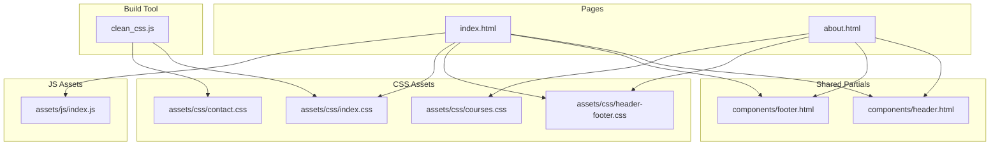
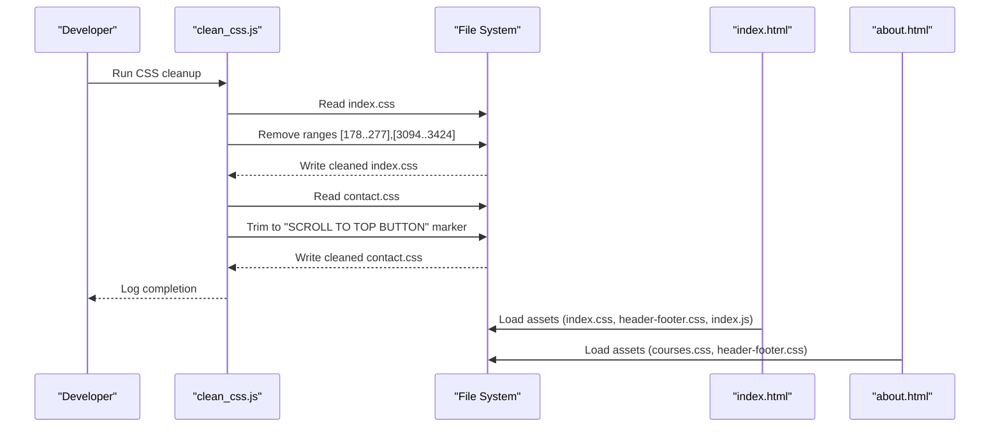
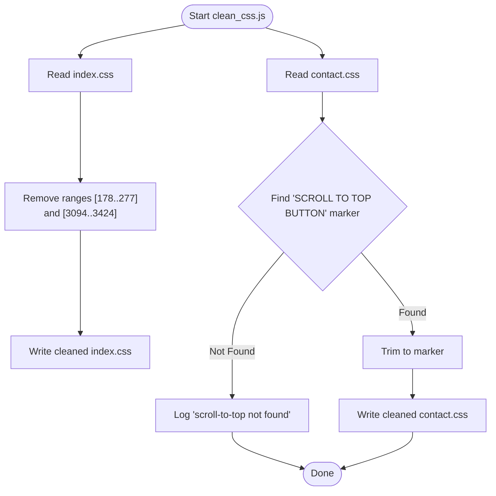
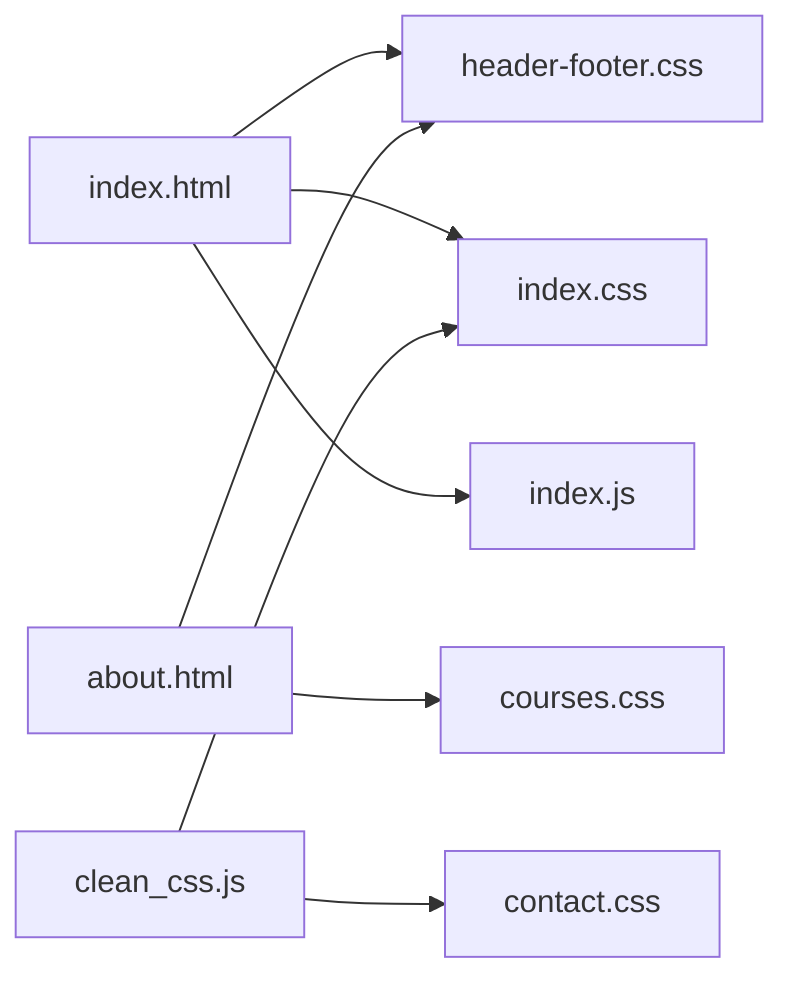

# Build and Optimization

<cite>
**Referenced Files in This Document**
- [clean_css.js](file://clean_css.js)
- [index.html](file://index.html)
- [about.html](file://about.html)
- [header.html](file://components/header.html)
- [footer.html](file://components/footer.html)
- [index.css](file://assets/css/index.css)
- [contact.css](file://assets/css/contact.css)
- [header-footer.css](file://assets/css/header-footer.css)
- [courses.css](file://assets/css/courses.css)
- [index.js](file://assets/js/index.js)
</cite>

## Table of Contents
1. [Introduction](#introduction)
2. [Project Structure](#project-structure)
3. [Core Components](#core-components)
4. [Architecture Overview](#architecture-overview)
5. [Detailed Component Analysis](#detailed-component-analysis)
6. [Dependency Analysis](#dependency-analysis)
7. [Performance Considerations](#performance-considerations)
8. [Troubleshooting Guide](#troubleshooting-guide)
9. [Conclusion](#conclusion)

## Introduction
This document explains the Eduooz build process and performance optimization strategies. It focuses on the CSS cleaning and optimization performed by the dedicated script, asset minification considerations, production deployment preparation, performance monitoring techniques, bundle optimization, and loading performance improvements. It also covers asset management strategies for images and fonts, CDN integration and caching strategies, and practical approaches for collecting performance metrics, identifying bottlenecks, and continuously optimizing the build pipeline.

## Project Structure
Eduooz is a static site composed of HTML pages, shared header/footer partials, CSS assets, and JavaScript assets. The build pipeline centers on:
- HTML pages that include shared header/footer partials and link to CSS and JS assets.
- CSS assets organized per page and shared components.
- A dedicated Node.js script to perform targeted CSS cleanup.
- JavaScript assets that drive animations and interactive experiences.

**Diagram sources**
- [index.html](file://index.html)
- [about.html](file://about.html)
- [header.html](file://components/header.html)
- [footer.html](file://components/footer.html)
- [header-footer.css](file://assets/css/header-footer.css)
- [index.css](file://assets/css/index.css)
- [contact.css](file://assets/css/contact.css)
- [courses.css](file://assets/css/courses.css)
- [index.js](file://assets/js/index.js)
- [clean_css.js](file://clean_css.js)

**Section sources**
- [index.html](file://index.html)
- [about.html](file://about.html)
- [header.html](file://components/header.html)
- [footer.html](file://components/footer.html)
- [header-footer.css](file://assets/css/header-footer.css)
- [index.css](file://assets/css/index.css)
- [contact.css](file://assets/css/contact.css)
- [courses.css](file://assets/css/courses.css)
- [index.js](file://assets/js/index.js)
- [clean_css.js](file://clean_css.js)

## Core Components
- CSS Cleaning Script: Removes unused or conditional sections from index.css and contact.css to reduce CSS payload for production.
- Shared Header/Footer Styles: Consolidated styles in header-footer.css to avoid duplication and improve maintainability.
- Page-Specific Styles: index.css and courses.css encapsulate page-specific visuals and layouts.
- JavaScript Animation Engine: index.js orchestrates smooth scrolling, 3D scenes, and animated UI elements with performance-conscious patterns.

**Section sources**
- [clean_css.js](file://clean_css.js)
- [header-footer.css](file://assets/css/header-footer.css)
- [index.css](file://assets/css/index.css)
- [contact.css](file://assets/css/contact.css)
- [courses.css](file://assets/css/courses.css)
- [index.js](file://assets/js/index.js)

## Architecture Overview
The build and optimization architecture integrates static asset inclusion, targeted CSS cleanup, and runtime performance strategies.

**Diagram sources**
- [clean_css.js](file://clean_css.js)
- [index.html](file://index.html)
- [about.html](file://about.html)
- [index.css](file://assets/css/index.css)
- [contact.css](file://assets/css/contact.css)
- [header-footer.css](file://assets/css/header-footer.css)
- [courses.css](file://assets/css/courses.css)
- [index.js](file://assets/js/index.js)

## Detailed Component Analysis

### CSS Cleaning and Optimization Pipeline
The script performs targeted removals:
- index.css: Removes a header range and a footer/mobile/scroll region by line ranges.
- contact.css: Locates a “SCROLL TO TOP BUTTON” marker and truncates the file at that point.

**Diagram sources**
- [clean_css.js](file://clean_css.js)
- [index.css](file://assets/css/index.css)
- [contact.css](file://assets/css/contact.css)

**Section sources**
- [clean_css.js](file://clean_css.js)
- [index.css](file://assets/css/index.css)
- [contact.css](file://assets/css/contact.css)

### Asset Minification Strategy
- CSS: The cleaning script reduces file sizes by removing unused regions. For further minification, consider:
  - Post-processing with a CSS minifier to remove comments, whitespace, and redundant declarations.
  - Critical CSS extraction for above-the-fold content and deferred loading of non-critical CSS.
- JavaScript: The index.js file already defers heavy WebGL initialization until after the hero entrance to preserve 60 FPS. To further optimize:
  - Split bundles by page to avoid loading unnecessary scripts on other pages.
  - Enable tree shaking and module bundling to eliminate dead code.
  - Compress and cache-bust JS assets.
- Images and Fonts:
  - Prefer modern formats (AVIF/WebP) with fallbacks.
  - Lazy-load offscreen images and use srcset for responsive images.
  - Preload critical fonts and use font-display: swap to avoid FOIT/FOUT.

[No sources needed since this section provides general guidance]

### Production Deployment Preparation
- Static Hosting: Serve HTML/CSS/JS via a static host or CDN.
- Asset Versioning: Append content hashes to filenames to enable long-term caching.
- Compression: Enable gzip/Brotli on the server.
- Caching Headers: Set appropriate Cache-Control and immutable headers for static assets.
- CDN Integration: Place assets on a CDN with global edge locations; configure cache policies per asset type.
- Progressive Loading: Inline critical CSS and defer non-critical CSS; defer non-critical JS.

[No sources needed since this section provides general guidance]

### Performance Monitoring and Metrics Collection
- Core Web Vitals: Track LCP, FID, and CLS in production.
- Resource Timing: Use PerformanceObserver to capture asset load times.
- Bundle Analysis: Use webpack-bundle-analyzer or similar to inspect bundle composition.
- Field Data: Collect real-user metrics via tools like Google Analytics or RUM providers.

[No sources needed since this section provides general guidance]

### Bundle Optimization and Loading Improvements
- Code Splitting: Separate page-specific JS and share common libraries.
- Lazy Initialization: Defer heavy computations and 3D scenes until needed (already present in index.js).
- Request Coalescing: Combine and minimize HTTP requests; leverage HTTP/2 multiplexing.
- Prefetch/Preload: Preload critical fonts and defer others; prefetch next-page assets.

[No sources needed since this section provides general guidance]

### Asset Management Strategies
- Images:
  - Optimize with automated tools (e.g., Sharp for Node).
  - Use responsive images and lazy loading.
- Fonts:
  - Subset critical font weights and character sets.
  - Use font-display: swap and preload critical font variants.
- Videos and 3D Scenes:
  - Compress video assets and consider adaptive streaming.
  - Use level-of-detail techniques for 3D scenes.

[No sources needed since this section provides general guidance]

### Performance Bottlenecks and Continuous Optimization
- Bottlenecks:
  - Heavy CSS parsing or layout thrashing.
  - Blocking JS execution during critical path.
  - Unoptimized rasterization of 3D scenes.
- Remediation:
  - Audit with browser devtools and Lighthouse.
  - Implement incremental improvements with A/B testing.
  - Automate performance checks in CI.

[No sources needed since this section provides general guidance]

## Dependency Analysis
The pages depend on shared and page-specific assets. The cleaning script modifies CSS files consumed by the pages.

**Diagram sources**
- [index.html](file://index.html)
- [about.html](file://about.html)
- [header-footer.css](file://assets/css/header-footer.css)
- [index.css](file://assets/css/index.css)
- [contact.css](file://assets/css/contact.css)
- [courses.css](file://assets/css/courses.css)
- [index.js](file://assets/js/index.js)
- [clean_css.js](file://clean_css.js)

**Section sources**
- [index.html](file://index.html)
- [about.html](file://about.html)
- [header-footer.css](file://assets/css/header-footer.css)
- [index.css](file://assets/css/index.css)
- [contact.css](file://assets/css/contact.css)
- [courses.css](file://assets/css/courses.css)
- [index.js](file://assets/js/index.js)
- [clean_css.js](file://clean_css.js)

## Performance Considerations
- CSS Cleanup: Reduces parse and layout work by eliminating unused rules.
- Deferred Heavy JS: The hero animation defers WebGL initialization to preserve frame rate.
- Critical Rendering Path: Inline critical CSS and defer non-critical CSS and JS.
- Asset Compression: Enable compression and leverage CDN caching.
- Observability: Instrument performance metrics and monitor regressions.

[No sources needed since this section provides general guidance]

## Troubleshooting Guide
- CSS Cleanup Failures:
  - Verify line ranges match the actual file offsets.
  - Ensure the script targets the correct file paths.
- Missing Scroll-to-Top Marker:
  - Confirm the marker text exists in contact.css.
  - Adjust the search pattern if the marker text changes.
- Performance Regression:
  - Use Performance panel to identify long tasks.
  - Measure Core Web Vitals and compare against baselines.

**Section sources**
- [clean_css.js](file://clean_css.js)
- [contact.css](file://assets/css/contact.css)

## Conclusion
Eduooz employs a pragmatic build and optimization approach: targeted CSS cleanup, shared componentization, and performance-conscious JavaScript initialization. By extending the pipeline with automated minification, critical CSS extraction, asset versioning, CDN caching, and continuous performance monitoring, the project can achieve faster load times, improved interactivity, and reliable user experiences at scale.