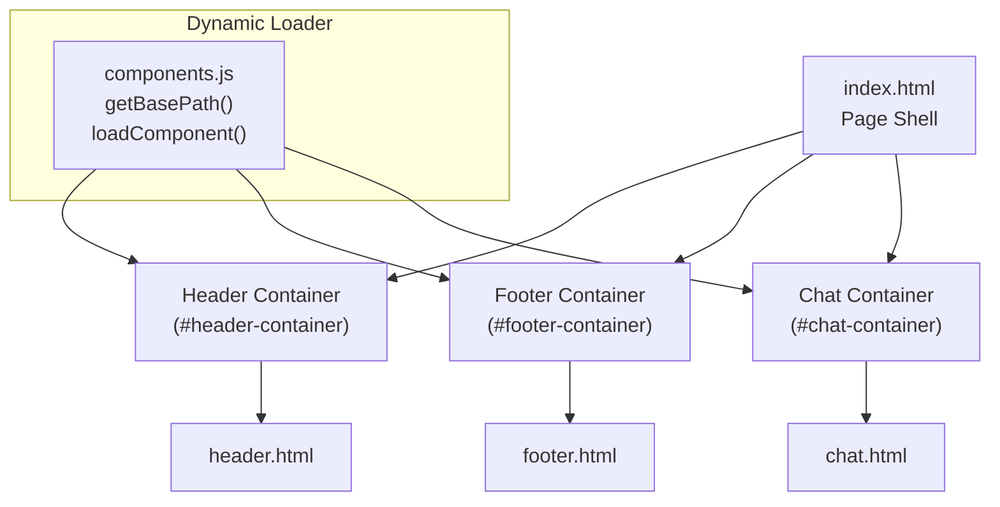
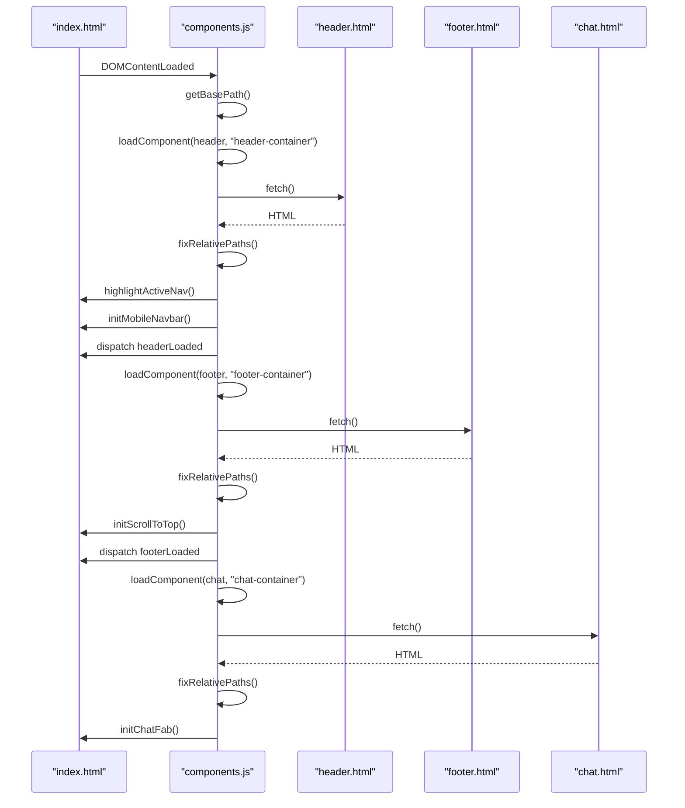
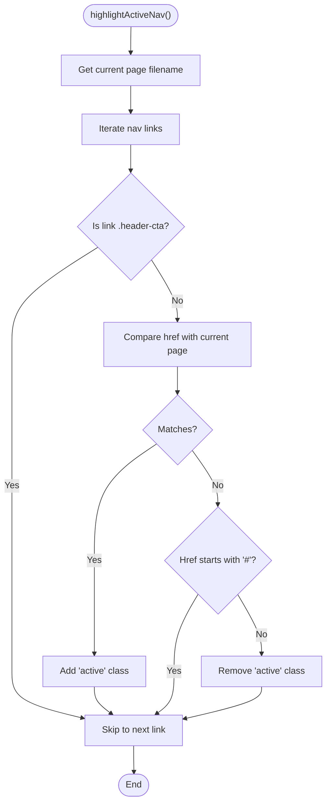
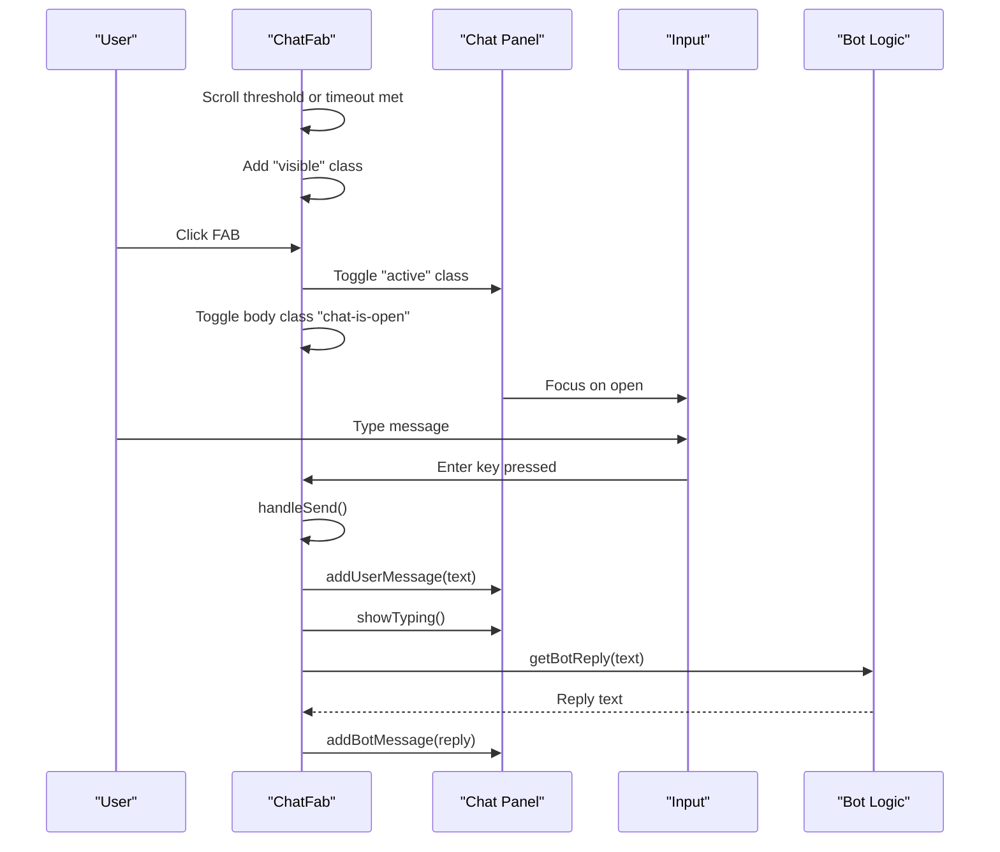
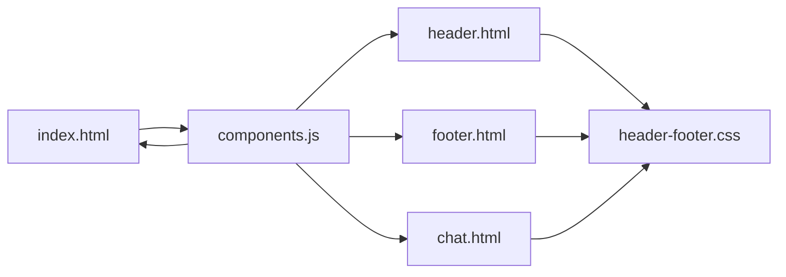

# Component System

<cite>
**Referenced Files in This Document**
- [components.js](file://assets/js/components.js)
- [header.html](file://components/header.html)
- [footer.html](file://components/footer.html)
- [chat.html](file://components/chat.html)
- [index.html](file://index.html)
- [header-footer.css](file://assets/css/header-footer.css)
- [index.js](file://assets/js/index.js)
</cite>

## Table of Contents
1. [Introduction](#introduction)
2. [Project Structure](#project-structure)
3. [Core Components](#core-components)
4. [Architecture Overview](#architecture-overview)
5. [Detailed Component Analysis](#detailed-component-analysis)
6. [Dependency Analysis](#dependency-analysis)
7. [Performance Considerations](#performance-considerations)
8. [Troubleshooting Guide](#troubleshooting-guide)
9. [Conclusion](#conclusion)

## Introduction
This document explains the Eduooz component system implementation, focusing on the modular HTML component architecture, dynamic loading mechanisms, base path detection for subdirectory support, and active navigation highlighting. It covers the header, footer, and chat widget components, detailing their initialization, DOM manipulation, event handling, and integration with the broader page lifecycle. The document also outlines the component loading workflow, error handling strategies, and performance optimizations used in the dynamic component system.

## Project Structure
The component system is built around three primary HTML components:
- Header component: Navigation bar with logo, menu links, and responsive behavior
- Footer component: Newsletter subscription, social media links, and contact information
- Chat widget: Floating action button with chat panel, quick replies, and simulated bot responses

These components are dynamically loaded into the page via a centralized loader script that detects the deployment base path and injects component HTML into designated containers.

**Diagram sources**
- [index.html:28](file://index.html#L28)
- [index.html:1585](file://index.html#L1585)
- [index.html:1590](file://index.html#L1590)
- [components.js:26](file://assets/js/components.js#L26)
- [components.js:40](file://assets/js/components.js#L40)
- [header.html:1](file://components/header.html#L1)
- [footer.html:1](file://components/footer.html#L1)
- [chat.html:1](file://components/chat.html#L1)

**Section sources**
- [index.html:28](file://index.html#L28)
- [index.html:1585](file://index.html#L1585)
- [index.html:1590](file://index.html#L1590)
- [components.js:26](file://assets/js/components.js#L26)
- [components.js:40](file://assets/js/components.js#L40)

## Core Components
This section summarizes the responsibilities and key behaviors of each component.

- Header component
  - Provides navigation links and a responsive mobile menu
  - Integrates with the dynamic loader to enable active link highlighting and mobile toggling
  - Uses CSS for responsive design and theme transitions

- Footer component
  - Displays brand information, program links, platform links, and newsletter subscription
  - Includes social media links and legal information
  - Implements a scroll-to-top button with visibility logic

- Chat widget
  - Floating action button with animated entrance and tooltip
  - Chat panel with message history, quick replies, and simulated bot responses
  - Handles user input, typing indicators, and focus management

**Section sources**
- [header.html:1](file://components/header.html#L1)
- [footer.html:1](file://components/footer.html#L1)
- [chat.html:1](file://components/chat.html#L1)
- [header-footer.css:4](file://assets/css/header-footer.css#L4)
- [header-footer.css:123](file://assets/css/header-footer.css#L123)
- [header-footer.css:492](file://assets/css/header-footer.css#L492)

## Architecture Overview
The component system follows a modular, dynamic loading pattern:
- A base path is detected to support local development, root domains, and subdirectory deployments
- Component paths are constructed using the base path
- Components are fetched via fetch and injected into containers
- After injection, component-specific initialization routines run (navigation highlighting, mobile menu, scroll-to-top, chat panel)
- Events are dispatched to coordinate with other page scripts

**Diagram sources**
- [components.js:9](file://assets/js/components.js#L9)
- [components.js:40](file://assets/js/components.js#L40)
- [components.js:58](file://assets/js/components.js#L58)
- [components.js:64](file://assets/js/components.js#L64)
- [components.js:69](file://assets/js/components.js#L69)
- [index.html:1598](file://index.html#L1598)

**Section sources**
- [components.js:9](file://assets/js/components.js#L9)
- [components.js:40](file://assets/js/components.js#L40)
- [components.js:58](file://assets/js/components.js#L58)
- [components.js:64](file://assets/js/components.js#L64)
- [components.js:69](file://assets/js/components.js#L69)
- [index.html:1598](file://index.html#L1598)

## Detailed Component Analysis

### Base Path Detection and Component Loading
- Base path detection
  - The loader locates itself in the DOM and derives the base path for assets
  - Supports root-relative and subdirectory deployments
  - Ensures correct asset resolution across environments

- Component loading
  - Each component is fetched via fetch and injected into its container
  - Relative paths are corrected when the site is deployed in a subdirectory
  - Initialization hooks run after successful injection

- Event coordination
  - The loader dispatches custom events when components finish loading
  - Other scripts listen for these events to initialize dependent functionality

**Section sources**
- [components.js:9](file://assets/js/components.js#L9)
- [components.js:26](file://assets/js/components.js#L26)
- [components.js:40](file://assets/js/components.js#L40)
- [components.js:50](file://assets/js/components.js#L50)
- [components.js:61](file://assets/js/components.js#L61)
- [components.js:67](file://assets/js/components.js#L67)
- [components.js:69](file://assets/js/components.js#L69)

### Header Component
- Structure and navigation
  - Contains logo, mobile menu toggle, and navigation links
  - Links include Home, About Us, Courses, Course Launch, Gallery, Testimonials, Placements, and Contact Us
  - Includes a prominent call-to-action button

- Active navigation highlighting
  - The loader triggers a function that compares the current page path with each link's href
  - Special handling for home links and external links
  - Adds/removes an "active" class to reflect the current page

- Mobile navigation
  - Initializes a mobile menu toggle that opens/closes a full-screen overlay
  - Closes the menu when a navigation link is clicked
  - Manages body overflow to prevent scrolling when the menu is open

- Responsive behavior
  - CSS defines breakpoints and styles for mobile and desktop layouts
  - Menu transforms into a full-screen overlay on smaller screens

**Diagram sources**
- [components.js:319](file://assets/js/components.js#L319)
- [components.js:337](file://assets/js/components.js#L337)

**Section sources**
- [header.html:1](file://components/header.html#L1)
- [header.html:10](file://components/header.html#L10)
- [components.js:319](file://assets/js/components.js#L319)
- [components.js:337](file://assets/js/components.js#L337)
- [header-footer.css:320](file://assets/css/header-footer.css#L320)

### Footer Component
- Layout and content
  - Features a decorative background, CTA zone, grid of columns, and bottom bar
  - Includes brand information, program links, platform links, newsletter subscription, and social media links
  - Displays legal links and copyright information

- Scroll-to-top functionality
  - Initializes a scroll-to-top button that appears when scrolling down
  - Smoothly scrolls the page to the top on click
  - Hides when the chat panel is open

- Newsletter subscription
  - Provides a form with an email input and submit button
  - Uses a glass-morphism design with focus effects

- Social media and contact
  - Social links styled as glass buttons
  - Contact information and legal links included in the bottom bar

**Section sources**
- [footer.html:1](file://components/footer.html#L1)
- [footer.html:55](file://components/footer.html#L55)
- [header-footer.css:394](file://assets/css/header-footer.css#L394)

### Chat Widget
- Floating action button
  - Animated entrance with pulsing rings and orbital ring
  - Gradient background and shimmer effect
  - Tooltip with online status indicator

- Chat panel
  - Header with avatar and online status
  - Message area with welcome message and quick replies
  - Input area with send button and placeholder

- Behavior and interactions
  - Button appears after scrolling or after a delay
  - Opens/closes the panel on click, toggling a body class to hide the scroll-to-top button
  - Focuses the input field when the panel opens
  - Processes user messages with simulated typing and bot responses
  - Quick replies pre-fill the input and trigger bot responses

- Message simulation
  - Adds user messages immediately
  - Shows a typing indicator after a short delay
  - Returns contextual bot replies based on keywords

**Diagram sources**
- [components.js:109](file://assets/js/components.js#L109)
- [components.js:232](file://assets/js/components.js#L232)
- [components.js:245](file://assets/js/components.js#L245)
- [components.js:222](file://assets/js/components.js#L222)

**Section sources**
- [chat.html:1](file://components/chat.html#L1)
- [chat.html:27](file://components/chat.html#L27)
- [chat.html:46](file://components/chat.html#L46)
- [chat.html:67](file://components/chat.html#L67)
- [components.js:109](file://assets/js/components.js#L109)
- [components.js:232](file://assets/js/components.js#L232)
- [components.js:245](file://assets/js/components.js#L245)
- [components.js:222](file://assets/js/components.js#L222)

### Component Initialization and DOM Manipulation
- Container injection
  - Each component is injected into a container identified by a specific ID
  - The loader sets innerHTML to the fetched HTML content

- Path correction
  - When deployed in a subdirectory, relative URLs (href/src) are prefixed with the base path
  - This ensures images, links, and assets resolve correctly regardless of deployment location

- Event dispatching
  - After injecting the header, the loader dispatches a custom "headerLoaded" event
  - After injecting the footer, the loader dispatches a custom "footerLoaded" event
  - Other scripts can listen for these events to initialize dependent functionality

**Section sources**
- [components.js:40](file://assets/js/components.js#L40)
- [components.js:50](file://assets/js/components.js#L50)
- [components.js:61](file://assets/js/components.js#L61)
- [components.js:67](file://assets/js/components.js#L67)

## Dependency Analysis
The component system exhibits low coupling and clear separation of concerns:
- components.js depends on:
  - The presence of specific container elements in the page shell
  - The availability of component HTML files
  - CSS for styling and responsive behavior
- Components depend on:
  - CSS for visual presentation and responsive layouts
  - The loader for initialization and event coordination

**Diagram sources**
- [index.html:1598](file://index.html#L1598)
- [components.js:26](file://assets/js/components.js#L26)
- [header-footer.css:4](file://assets/css/header-footer.css#L4)

**Section sources**
- [index.html:1598](file://index.html#L1598)
- [components.js:26](file://assets/js/components.js#L26)
- [header-footer.css:4](file://assets/css/header-footer.css#L4)

## Performance Considerations
- Subdirectory-aware asset resolution
  - Base path detection prevents unnecessary network requests and broken assets in subdirectory deployments
- Minimal DOM manipulation
  - Components are injected once during initialization; subsequent interactions are handled via event listeners
- Event-driven initialization
  - Other scripts listen for "headerLoaded" and "footerLoaded" events to avoid race conditions and redundant work
- CSS-driven animations
  - Animations and transitions are handled via CSS classes and transforms, reducing JavaScript overhead
- Chat widget optimizations
  - Typing indicators and message rendering are lightweight and debounced where appropriate
  - Body class toggles minimize layout thrashing when opening/closing the chat panel

[No sources needed since this section provides general guidance]

## Troubleshooting Guide
Common issues and resolutions:
- Components not loading
  - Verify container IDs exist in the page shell
  - Confirm component HTML files are accessible at the computed paths
  - Check browser console for fetch errors

- Incorrect asset paths in subdirectory deployments
  - Ensure the base path detection logic runs before loading components
  - Confirm relative URLs are being prefixed correctly

- Navigation highlighting not working
  - Verify the current page filename matches the expected href values
  - Check for special cases like home links and external links

- Chat widget not responding
  - Ensure the chat container exists and the loader initializes the chat fab
  - Check for console errors related to event listeners or DOM queries

- Scroll-to-top conflicts with chat
  - Confirm the body class toggle logic is functioning to hide the scroll-to-top button when the chat panel is open

**Section sources**
- [components.js:40](file://assets/js/components.js#L40)
- [components.js:50](file://assets/js/components.js#L50)
- [components.js:319](file://assets/js/components.js#L319)
- [components.js:109](file://assets/js/components.js#L109)
- [header-footer.css:436](file://assets/css/header-footer.css#L436)

## Conclusion
The Eduooz component system provides a robust, modular foundation for building dynamic, responsive pages. By detecting the base path, loading components asynchronously, and coordinating initialization through events, the system supports flexible deployments and maintainable code. The header, footer, and chat widget components integrate seamlessly with the page lifecycle, offering rich interactivity while preserving performance and accessibility.

[No sources needed since this section summarizes without analyzing specific files]