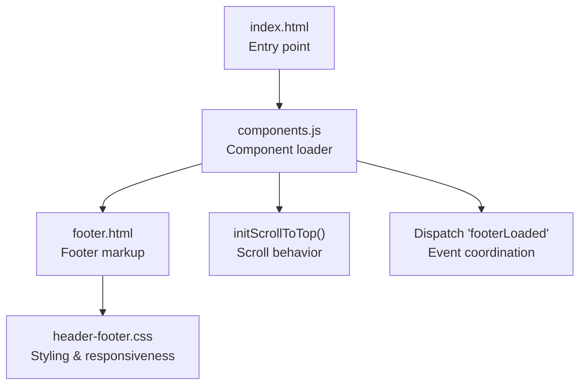
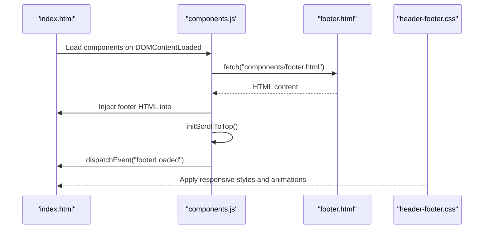
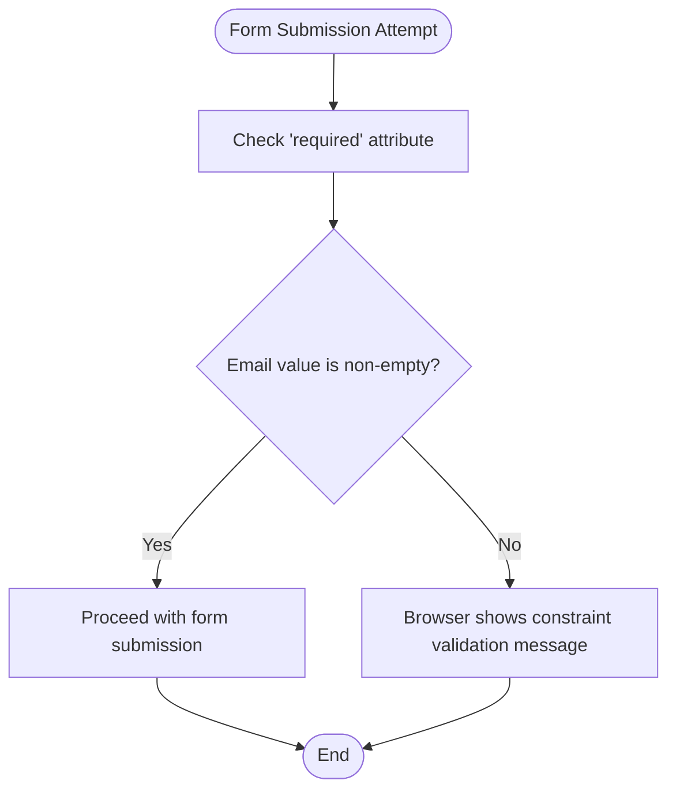
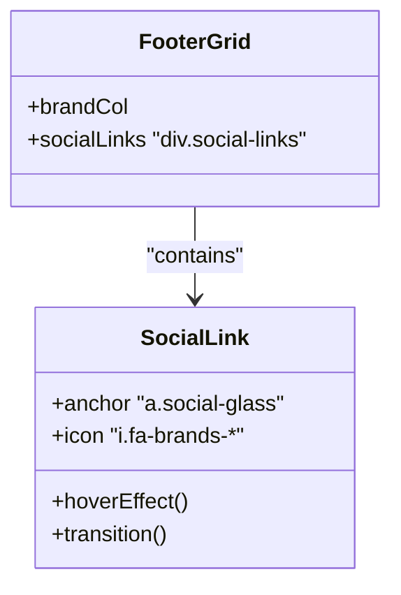
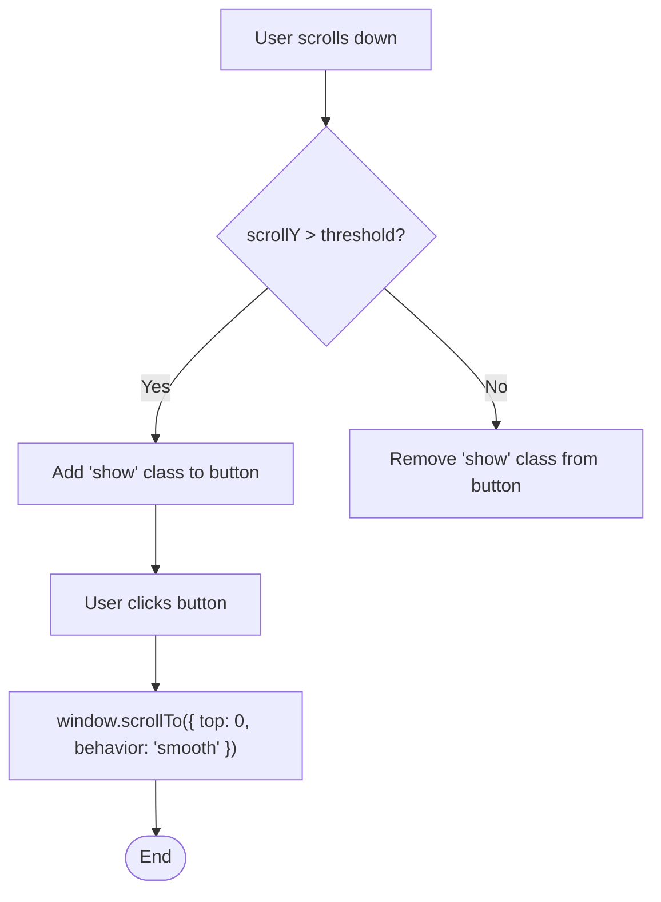
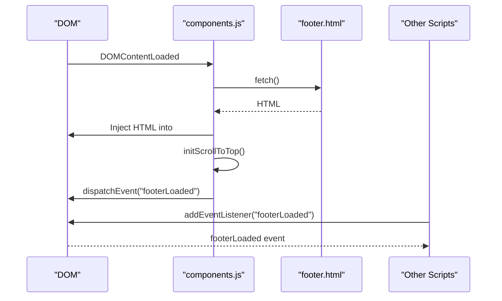
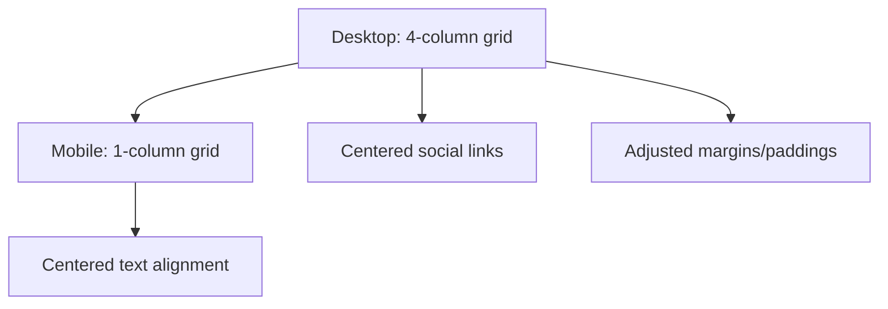
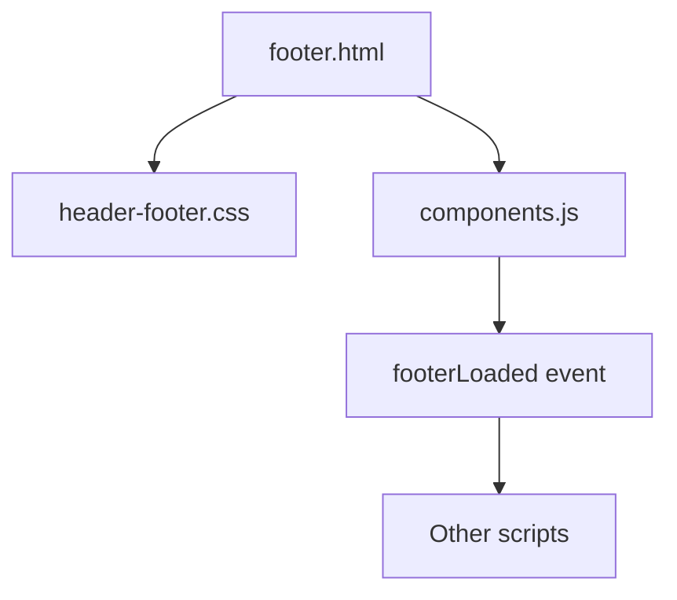

# Footer Component

<cite>
**Referenced Files in This Document**
- [footer.html](file://components/footer.html)
- [components.js](file://assets/js/components.js)
- [header-footer.css](file://assets/css/header-footer.css)
- [index.html](file://index.html)
</cite>

## Table of Contents
1. [Introduction](#introduction)
2. [Project Structure](#project-structure)
3. [Core Components](#core-components)
4. [Architecture Overview](#architecture-overview)
5. [Detailed Component Analysis](#detailed-component-analysis)
6. [Dependency Analysis](#dependency-analysis)
7. [Performance Considerations](#performance-considerations)
8. [Troubleshooting Guide](#troubleshooting-guide)
9. [Conclusion](#conclusion)

## Introduction
This document explains the Eduooz footer component, focusing on its newsletter subscription system, social media integration, contact information display, scroll-to-top button behavior, and the footer loading workflow. It also covers responsive design elements, accessibility features, and how the footer integrates with the global component system to enhance user experience.

## Project Structure
The footer is implemented as a reusable component that is dynamically loaded into pages. The component system uses a single JavaScript module to fetch and inject HTML fragments, initialize interactive behaviors, and coordinate events across the site.

**Diagram sources**
- [index.html:1590-1602](file://index.html#L1590-L1602)
- [components.js:40-76](file://assets/js/components.js#L40-L76)
- [footer.html:1-75](file://components/footer.html#L1-L75)
- [header-footer.css:123-487](file://assets/css/header-footer.css#L123-L487)

**Section sources**
- [index.html:1590-1602](file://index.html#L1590-L1602)
- [components.js:29-33](file://assets/js/components.js#L29-L33)

## Core Components
- Footer HTML structure defines branding, navigation links, social media links, newsletter subscription area, and legal links.
- Newsletter form uses semantic HTML with client-side validation via the required attribute.
- Social media links integrate with Font Awesome icons and use glass-morphism styling.
- Scroll-to-top button is present in the page and controlled by the component initialization logic.
- The component loader initializes footer-specific behaviors and dispatches a footerLoaded event for cross-module coordination.

**Section sources**
- [footer.html:15-69](file://components/footer.html#L15-L69)
- [header-footer.css:196-225](file://assets/css/header-footer.css#L196-L225)
- [components.js:81-101](file://assets/js/components.js#L81-L101)

## Architecture Overview
The footer component participates in a global component architecture. The loader fetches the footer HTML, injects it into the DOM, initializes scroll-to-top behavior, and dispatches a footerLoaded event. Other scripts listen for this event to coordinate animations and interactions.

**Diagram sources**
- [components.js:340-344](file://assets/js/components.js#L340-L344)
- [components.js:40-76](file://assets/js/components.js#L40-L76)
- [components.js:64-67](file://assets/js/components.js#L64-L67)
- [header-footer.css:123-487](file://assets/css/header-footer.css#L123-L487)

## Detailed Component Analysis

### Newsletter Subscription System
- Form structure: The newsletter form is a semantic HTML5 form with an email input and submit button. The input uses the required attribute for basic client-side validation.
- Styling: The form uses a rounded glass container with focus effects and a prominent submit button styled with a glass effect.
- Validation: The required attribute enforces presence of an email address before submission. No JavaScript validation logic is present in the component loader for this form.
- Accessibility: The input does not specify an aria-label or aria-describedby attribute. Consider adding an accessible label for assistive technologies.

**Diagram sources**
- [footer.html:55-58](file://components/footer.html#L55-L58)
- [header-footer.css:208-225](file://assets/css/header-footer.css#L208-L225)

**Section sources**
- [footer.html:55-58](file://components/footer.html#L55-L58)
- [header-footer.css:208-225](file://assets/css/header-footer.css#L208-L225)

### Social Media Integration
- Links: The footer includes three social media links styled as glass buttons with Font Awesome icons.
- Styling: Each link is a square glass button with hover effects and transitions.
- Accessibility: The anchor elements lack explicit aria-label attributes. Adding descriptive labels improves accessibility for screen readers.

**Diagram sources**
- [footer.html:25-29](file://components/footer.html#L25-L29)
- [header-footer.css:196-205](file://assets/css/header-footer.css#L196-L205)

**Section sources**
- [footer.html:25-29](file://components/footer.html#L25-L29)
- [header-footer.css:196-205](file://assets/css/header-footer.css#L196-L205)

### Contact Information Display and Location-Based Services
- The footer includes a brand column with logo, description, and social links. There is no dedicated contact information block within the footer component itself.
- Location-based services are not implemented in the footer component. Any location-specific content would be handled elsewhere in the application.

**Section sources**
- [footer.html:22-29](file://components/footer.html#L22-L29)

### Scroll-to-Top Button Implementation
- Presence: The scroll-to-top button exists in the page and is styled with a glass appearance and smooth visibility transitions.
- Behavior: The component initializes scroll-to-top behavior by listening to scroll events and toggling a visibility class when scroll distance exceeds a threshold. Clicking triggers smooth scrolling to the top of the page.
- Visibility conditions: The button becomes visible when the user scrolls down sufficiently and is hidden when scrolled near the top.
- Interaction with chat panel: When the chat panel opens, the scroll-to-top button is hidden via a body class to prevent overlap.

**Diagram sources**
- [components.js:85-100](file://assets/js/components.js#L85-L100)
- [header-footer.css:394-442](file://assets/css/header-footer.css#L394-L442)

**Section sources**
- [components.js:81-101](file://assets/js/components.js#L81-L101)
- [header-footer.css:394-442](file://assets/css/header-footer.css#L394-L442)

### Footer Loading Workflow and Event Dispatching
- Component loading: On DOMContentLoaded, the loader fetches the footer HTML and injects it into the designated container.
- Initialization: After injection, the loader calls initScrollToTop() to set up scroll behavior and dispatches a footerLoaded event for other modules to coordinate.
- Event listeners: Other scripts can listen for the footerLoaded event to synchronize animations or interactions.

**Diagram sources**
- [components.js:340-344](file://assets/js/components.js#L340-L344)
- [components.js:64-67](file://assets/js/components.js#L64-L67)

**Section sources**
- [components.js:40-76](file://assets/js/components.js#L40-L76)
- [components.js:64-67](file://assets/js/components.js#L64-L67)

### Responsive Design Elements
- Desktop layout: The footer grid uses a four-column layout optimized for larger screens.
- Tablet/mobile layout: On smaller screens, the grid stacks into a single column, links are centered, and spacing adjusts for readability.
- Animations: Floating background shapes and subtle animations enhance the visual experience while maintaining responsiveness.

**Diagram sources**
- [header-footer.css:185-190](file://assets/css/header-footer.css#L185-L190)
- [header-footer.css:379-389](file://assets/css/header-footer.css#L379-L389)

**Section sources**
- [header-footer.css:185-190](file://assets/css/header-footer.css#L185-L190)
- [header-footer.css:379-389](file://assets/css/header-footer.css#L379-L389)

### Accessibility Features
- Scroll-to-top button: Includes an aria-label for assistive technologies.
- Social media links: Lacking explicit aria-labels; consider adding descriptive labels for screen readers.
- Newsletter input: Lacks an accessible label; consider adding aria-label or aria-describedby for improved accessibility.

**Section sources**
- [index.html:1593](file://index.html#L1593)
- [footer.html:25-29](file://components/footer.html#L25-L29)
- [footer.html:55-58](file://components/footer.html#L55-L58)

## Dependency Analysis
The footer component depends on:
- HTML structure from footer.html
- Styling from header-footer.css
- Initialization logic from components.js
- Global event coordination for cross-module synchronization

**Diagram sources**
- [footer.html:1-75](file://components/footer.html#L1-L75)
- [header-footer.css:123-487](file://assets/css/header-footer.css#L123-L487)
- [components.js:64-67](file://assets/js/components.js#L64-L67)

**Section sources**
- [components.js:29-33](file://assets/js/components.js#L29-L33)
- [components.js:64-67](file://assets/js/components.js#L64-L67)

## Performance Considerations
- Passive scroll listeners: The scroll-to-top handler uses a passive listener to improve scroll performance.
- Minimal reflows: CSS transforms and opacity changes are used for visibility transitions to avoid layout thrashing.
- Event-driven coordination: Using footerLoaded avoids unnecessary polling and keeps initialization efficient.

**Section sources**
- [components.js:92](file://assets/js/components.js#L92)
- [header-footer.css:416-426](file://assets/css/header-footer.css#L416-L426)

## Troubleshooting Guide
- Newsletter form not submitting: Verify the required attribute is present on the email input and that the form is not prevented from submitting by other scripts.
- Social media links not accessible: Add aria-label attributes to anchor elements for screen reader support.
- Scroll-to-top button not appearing: Ensure the button element exists with the correct ID and that the scroll threshold is appropriate for the page length.
- Footer animations not triggering: Confirm that other scripts listen for the footerLoaded event and that the event is dispatched after DOM injection.

**Section sources**
- [footer.html:55-58](file://components/footer.html#L55-L58)
- [footer.html:25-29](file://components/footer.html#L25-L29)
- [components.js:64-67](file://assets/js/components.js#L64-L67)

## Conclusion
The Eduooz footer component provides a cohesive, accessible, and responsive interface for users. Its modular design integrates seamlessly with the global component system, enabling coordinated behavior across the application. Enhancing accessibility attributes and ensuring consistent event handling will further improve the user experience.