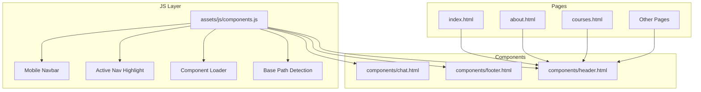
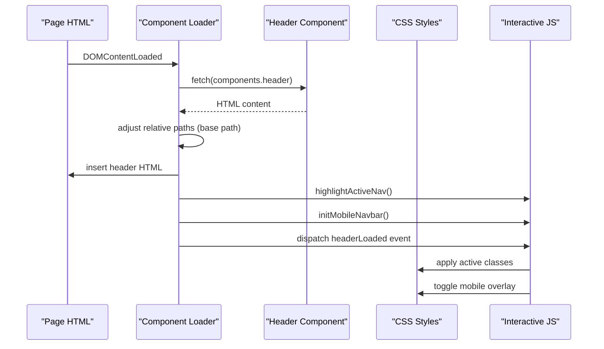
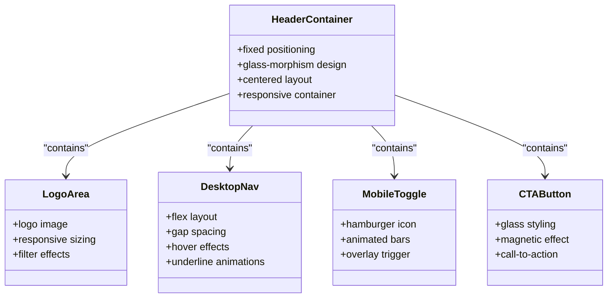
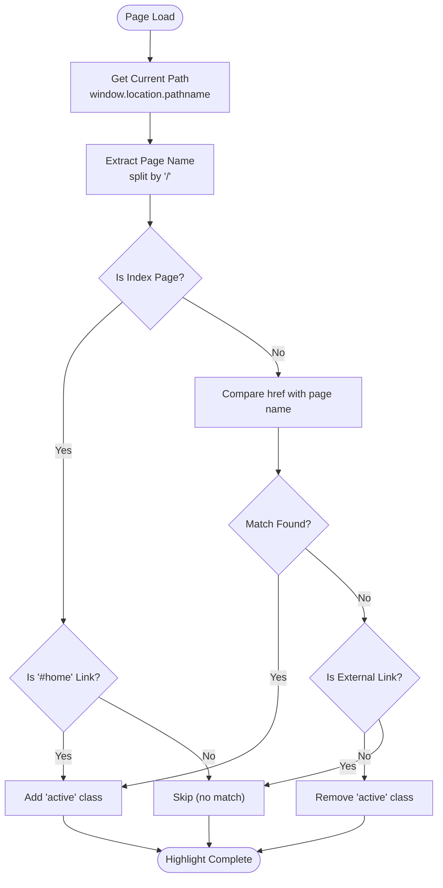
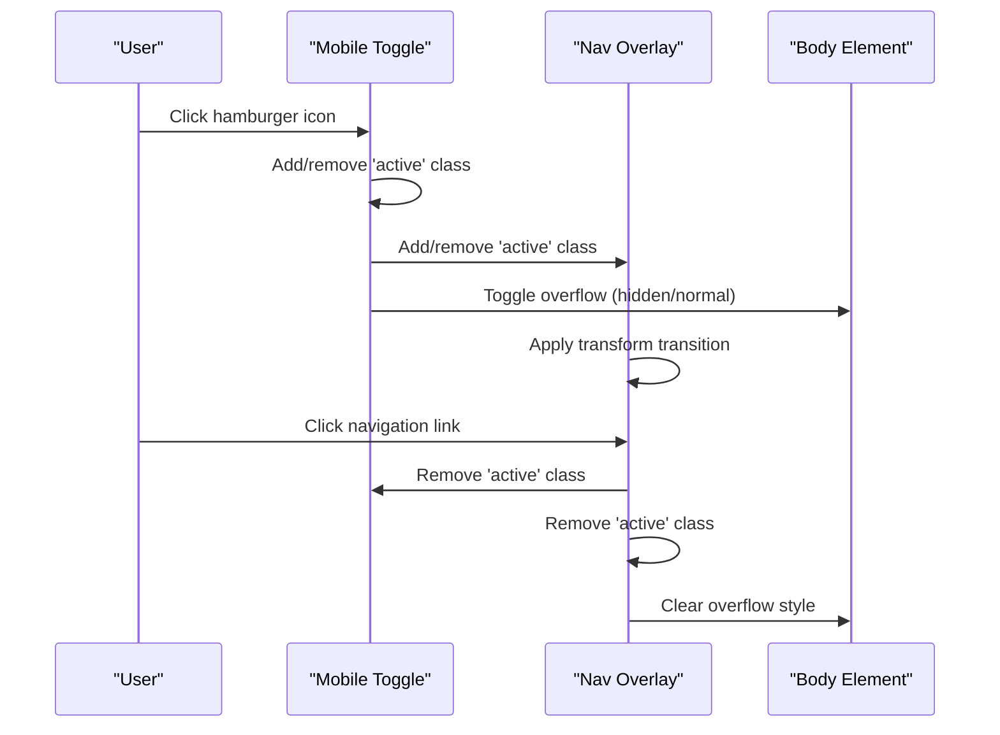
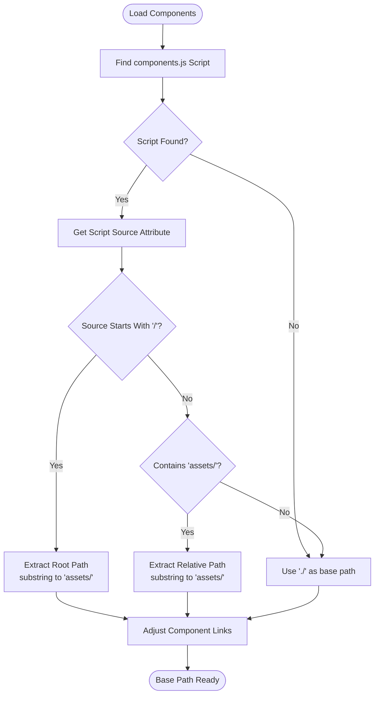
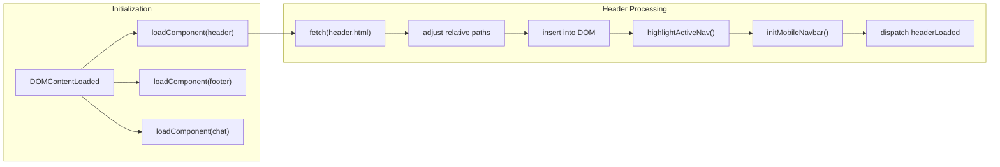
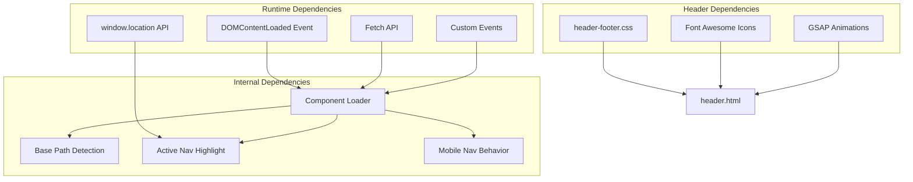

# Header Component

<cite>
**Referenced Files in This Document**
- [header.html](file://components/header.html)
- [components.js](file://assets/js/components.js)
- [header-footer.css](file://assets/css/header-footer.css)
- [index.html](file://index.html)
- [about.html](file://about.html)
- [courses.html](file://courses.html)
- [structure.html](file://structure.html)
</cite>

## Table of Contents
1. [Introduction](#introduction)
2. [Project Structure](#project-structure)
3. [Core Components](#core-components)
4. [Architecture Overview](#architecture-overview)
5. [Detailed Component Analysis](#detailed-component-analysis)
6. [Dependency Analysis](#dependency-analysis)
7. [Performance Considerations](#performance-considerations)
8. [Troubleshooting Guide](#troubleshooting-guide)
9. [Conclusion](#conclusion)

## Introduction
This document provides comprehensive documentation for the Eduooz header component implementation. It covers the HTML structure, navigation menu, logo integration, responsive design, active navigation highlighting, mobile navbar functionality, base path detection system, and integration with the component loading system. The goal is to explain how the header component fits into the overall page structure and how dynamic behaviors are implemented through event listeners and DOM manipulation.

## Project Structure
The header component is implemented as a reusable HTML partial that is dynamically loaded into pages via a component loader. The loader determines the base path for assets and components, adjusts relative URLs for subdirectory deployments, and initializes interactive behaviors after the component loads.

**Diagram sources**
- [index.html:28](file://index.html#L28)
- [about.html:23](file://about.html#L23)
- [courses.html:38](file://courses.html#L38)
- [components/header.html:1-22](file://components/header.html#L1-L22)
- [assets/js/components.js:1-347](file://assets/js/components.js#L1-L347)

**Section sources**
- [index.html:28](file://index.html#L28)
- [about.html:23](file://about.html#L23)
- [courses.html:38](file://courses.html#L38)
- [components/header.html:1-22](file://components/header.html#L1-L22)
- [assets/js/components.js:1-347](file://assets/js/components.js#L1-L347)

## Core Components
The header component consists of:
- Fixed glass-morphism navigation bar with logo area
- Desktop navigation links for site sections
- Mobile hamburger menu toggle
- Call-to-action button styled as a glass button
- Responsive layout that adapts to desktop and mobile screens

Key implementation aspects:
- The header uses a fixed positioning system with centered layout
- Navigation links are styled with hover effects and underline animations
- Mobile menu transforms from a hamburger icon to a full-screen overlay
- Active navigation highlighting is handled dynamically based on current page
- Base path detection ensures proper asset and component loading in subdirectory deployments

**Section sources**
- [components/header.html:1-22](file://components/header.html#L1-L22)
- [assets/css/header-footer.css:4-118](file://assets/css/header-footer.css#L4-L118)
- [assets/js/components.js:287-337](file://assets/js/components.js#L287-L337)

## Architecture Overview
The header component follows a modular architecture with clear separation of concerns:

**Diagram sources**
- [assets/js/components.js:39-76](file://assets/js/components.js#L39-L76)
- [assets/js/components.js:287-344](file://assets/js/components.js#L287-L344)

The architecture ensures:
- Dynamic component loading with base path awareness
- Automatic active navigation detection
- Mobile-first responsive behavior
- Event-driven initialization for page integration

## Detailed Component Analysis

### HTML Structure and Navigation Menu
The header HTML defines the complete navigation structure:

**Diagram sources**
- [components/header.html:1-22](file://components/header.html#L1-L22)
- [assets/css/header-footer.css:4-118](file://assets/css/header-footer.css#L4-L118)

Navigation menu structure includes:
- Home page link with special handling for index.html and empty paths
- About Us, Courses, Course Launch, Gallery, Testimonials, Placements, and Contact Us
- Free Demo call-to-action button with magnetic button effect
- Mobile menu toggle with animated hamburger icon

**Section sources**
- [components/header.html:10-21](file://components/header.html#L10-L21)

### Active Navigation Highlighting Mechanism
The active navigation highlighting system automatically detects the current page and applies active classes:

**Diagram sources**
- [assets/js/components.js:316-337](file://assets/js/components.js#L316-L337)

The system handles special cases:
- Index page detection for both index.html and empty paths
- Header CTA button exclusion from active highlighting
- External links (starting with #) bypassing active class assignment

**Section sources**
- [assets/js/components.js:316-337](file://assets/js/components.js#L316-L337)

### Mobile Navbar Functionality
The mobile navbar implements a sophisticated overlay system with multiple interaction modes:

**Diagram sources**
- [assets/js/components.js:287-314](file://assets/js/components.js#L287-L314)
- [assets/css/header-footer.css:333-378](file://assets/css/header-footer.css#L333-L378)

Mobile behavior features:
- Full-screen overlay with backdrop blur effect
- Smooth transform transitions for slide-in/slide-out
- Body overflow control to prevent background scrolling
- Automatic closure when navigation links are clicked
- Animated hamburger icon transforming to X shape

**Section sources**
- [assets/js/components.js:287-314](file://assets/js/components.js#L287-L314)
- [assets/css/header-footer.css:333-378](file://assets/css/header-footer.css#L333-L378)

### Base Path Detection System
The base path detection system ensures proper linking in subdirectory deployments:

**Diagram sources**
- [assets/js/components.js:9-26](file://assets/js/components.js#L9-L26)

The system handles multiple deployment scenarios:
- Local file system (no protocol prefix)
- Root domain deployment
- Subdirectory hosting (GitHub Pages, etc.)
- Mixed protocol environments

**Section sources**
- [assets/js/components.js:9-26](file://assets/js/components.js#L9-L26)

### Component Loading Integration
The header integrates seamlessly with the component loading system:

**Diagram sources**
- [assets/js/components.js:339-344](file://assets/js/components.js#L339-L344)
- [assets/js/components.js:40-76](file://assets/js/components.js#L40-L76)

Integration benefits:
- Automatic initialization of header behaviors
- Event-driven communication with other page components
- Consistent behavior across all pages using the header
- Proper cleanup and re-initialization when components reload

**Section sources**
- [assets/js/components.js:339-344](file://assets/js/components.js#L339-L344)
- [assets/js/components.js:40-76](file://assets/js/components.js#L40-L76)

## Dependency Analysis
The header component has minimal external dependencies and maintains loose coupling with other system components:

**Diagram sources**
- [assets/js/components.js:1-347](file://assets/js/components.js#L1-L347)
- [assets/css/header-footer.css:1-1220](file://assets/css/header-footer.css#L1-L1220)

Dependency characteristics:
- **Low coupling**: Header HTML is self-contained with minimal runtime dependencies
- **Event-driven architecture**: Uses custom events for inter-component communication
- **Progressive enhancement**: Falls back gracefully when JavaScript is disabled
- **Asset independence**: Relies on external CSS for styling, allowing easy customization

**Section sources**
- [assets/js/components.js:1-347](file://assets/js/components.js#L1-L347)
- [assets/css/header-footer.css:1-1220](file://assets/css/header-footer.css#L1-L1220)

## Performance Considerations
The header component is optimized for performance through several mechanisms:

- **Minimal DOM manipulation**: Active navigation highlighting uses efficient query selectors and class toggling
- **CSS transitions**: Mobile overlay uses hardware-accelerated transforms for smooth animations
- **Lazy loading**: Components are loaded asynchronously after page content
- **Memory management**: Event listeners are attached once and reused across page navigations
- **Responsive design**: Media queries optimize rendering for different screen sizes

Best practices for maintaining performance:
- Keep CSS transitions simple and hardware-accelerated
- Minimize DOM queries by caching element references
- Use passive event listeners for scroll and resize events
- Avoid layout thrashing by batching DOM updates
- Leverage browser caching for static assets

## Troubleshooting Guide

### Common Issues and Solutions

**Active Navigation Not Highlighting**
- Verify that page filenames match the href attributes in the navigation
- Check that the current page path is correctly detected by the highlighting function
- Ensure the headerLoaded event is firing before attempting to highlight navigation

**Mobile Menu Not Working**
- Confirm that the mobile toggle element exists in the DOM
- Verify that CSS media queries are not overriding the mobile styles
- Check that JavaScript event listeners are attached after DOMContentLoaded

**Base Path Issues in Subdirectories**
- Ensure the components.js script is included in the page
- Verify that the script source attribute contains the correct path information
- Check that relative paths are properly adjusted for the detected base path

**Styling Problems**
- Confirm that header-footer.css is loaded after the component is inserted
- Verify that CSS specificity is sufficient to override other styles
- Check for conflicting CSS rules from other page stylesheets

**Event Listener Conflicts**
- Ensure that event listeners are attached after the component is fully loaded
- Use unique event names to avoid conflicts with other page components
- Implement proper cleanup of event listeners when components are reloaded

**Section sources**
- [assets/js/components.js:316-337](file://assets/js/components.js#L316-L337)
- [assets/js/components.js:287-314](file://assets/js/components.js#L287-L314)
- [assets/js/components.js:9-26](file://assets/js/components.js#L9-L26)

## Conclusion
The Eduooz header component demonstrates a well-architected, modular approach to building reusable navigation interfaces. Its design emphasizes:

- **Separation of concerns**: Clear distinction between structure, presentation, and behavior
- **Responsive design**: Adaptive layouts that work across all device sizes
- **Dynamic behavior**: Intelligent path detection and automatic page integration
- **Performance optimization**: Efficient DOM manipulation and hardware-accelerated animations
- **Maintainability**: Clean code structure and event-driven architecture

The component successfully integrates with the broader page ecosystem through its component loading system, providing a consistent user experience across all Eduooz pages while accommodating various deployment scenarios. The implementation serves as a robust foundation for scalable web applications requiring sophisticated navigation and responsive behavior.