# Live Chat Widget

<cite>
**Referenced Files in This Document**
- [chat.html](file://components/chat.html)
- [components.js](file://assets/js/components.js)
- [header-footer.css](file://assets/css/header-footer.css)
- [index.html](file://index.html)
</cite>

## Table of Contents
1. [Introduction](#introduction)
2. [Project Structure](#project-structure)
3. [Core Components](#core-components)
4. [Architecture Overview](#architecture-overview)
5. [Detailed Component Analysis](#detailed-component-analysis)
6. [Dependency Analysis](#dependency-analysis)
7. [Performance Considerations](#performance-considerations)
8. [Troubleshooting Guide](#troubleshooting-guide)
9. [Conclusion](#conclusion)

## Introduction
This document explains the Eduooz live chat widget implementation. It covers the Floating Action Button (FAB) with delayed entrance animation and toggle behavior, the chat panel layout and message bubbles, the bot messaging system with keyword-based responses, the typing indicator animation, quick reply functionality, user input handling including keyboard shortcuts, and scroll management with auto-focus behavior. It also outlines the initialization flow and event handling patterns used across the implementation.

## Project Structure
The chat widget is composed of:
- A reusable chat component template (HTML)
- A component loader that injects the chat into pages
- Styles for the FAB, panel, messages, and animations
- JavaScript that initializes the chat, handles events, and manages bot responses

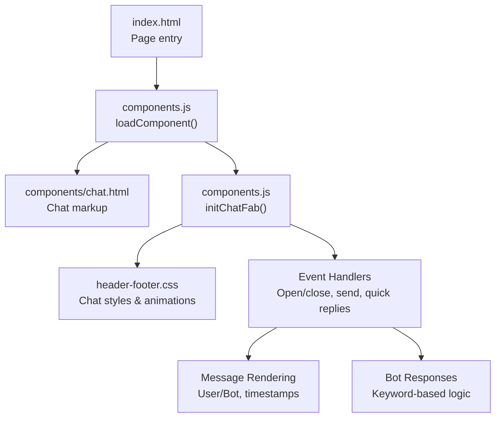

**Diagram sources**
- [index.html:1-120](file://index.html#L1-L120)
- [components.js:339-347](file://assets/js/components.js#L339-L347)
- [components.js:109-285](file://assets/js/components.js#L109-L285)
- [header-footer.css:490-1220](file://assets/css/header-footer.css#L490-L1220)

**Section sources**
- [index.html:1-120](file://index.html#L1-L120)
- [components.js:339-347](file://assets/js/components.js#L339-L347)

## Core Components
- Floating Action Button (FAB): A prominent animated button that appears after scrolling or after a delay, toggles the chat panel, and shows a tooltip and pulsing rings.
- Chat Panel: A glass-like panel that slides open from the FAB, containing the header, message area, and input area.
- Message Bubbles: Distinct user and bot message containers with avatars and timestamps.
- Quick Replies: Predefined buttons that quickly send common messages and trigger bot responses.
- Bot Messaging: Intelligent responses based on keywords such as “course”, “admission”, “placement”, and “call”.
- Typing Indicator: Animated dots indicating that the bot is replying.
- Scroll Management: Automatic scrolling to the bottom of the message area and auto-focus behavior when opening the panel.

**Section sources**
- [chat.html:1-78](file://components/chat.html#L1-L78)
- [components.js:109-285](file://assets/js/components.js#L109-L285)
- [header-footer.css:806-1220](file://assets/css/header-footer.css#L806-L1220)

## Architecture Overview
The chat widget is loaded into pages via a component loader. On DOMContentLoaded, the loader fetches the chat HTML and injects it into a container. After injection, the loader initializes the chat FAB and its event handlers. The chat panel is styled with CSS animations and transitions. JavaScript manages user interactions, message rendering, bot replies, and UI state.

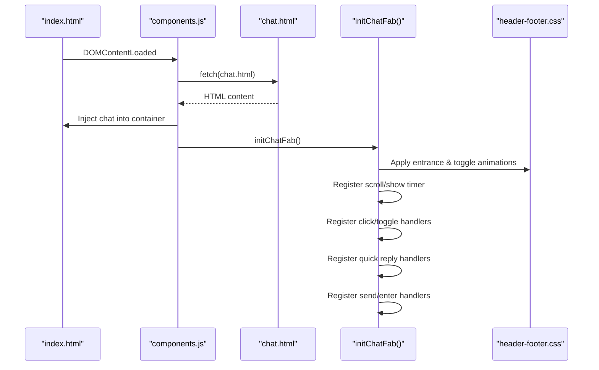

**Diagram sources**
- [components.js:339-347](file://assets/js/components.js#L339-L347)
- [components.js:109-285](file://assets/js/components.js#L109-L285)
- [header-footer.css:514-533](file://assets/css/header-footer.css#L514-L533)

## Detailed Component Analysis

### Floating Action Button (FAB)
- Entrance animation: The FAB fades in and scales with a custom easing after either:
  - Scrolling past a threshold, or
  - A fixed delay timer.
- Toggle behavior: Clicking the FAB toggles the active state, which opens the chat panel and adjusts the body class to hide the scroll-to-top button.
- Visual effects: Pulsing rings, orbital ring, gradient shimmer, and tooltip appear on hover. Icons switch between chat and close states when the panel is active.

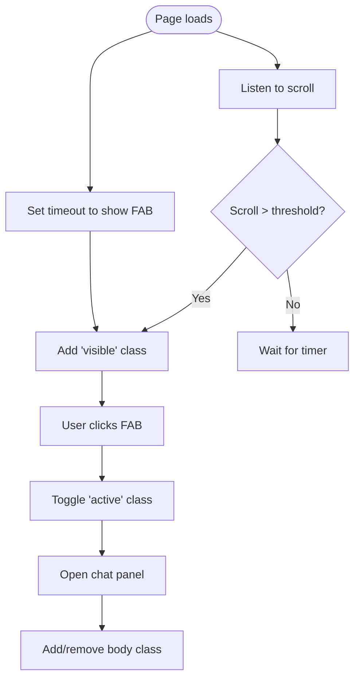

**Diagram sources**
- [components.js:121-145](file://assets/js/components.js#L121-L145)
- [header-footer.css:514-533](file://assets/css/header-footer.css#L514-L533)

**Section sources**
- [components.js:121-145](file://assets/js/components.js#L121-L145)
- [header-footer.css:490-778](file://assets/css/header-footer.css#L490-L778)

### Chat Panel Interface
- Header: Contains the Eduooz avatar, name, and online status indicator.
- Messages Area: A scrollable container for message bubbles and quick replies.
- Input Area: A text input with a send button and a powered-by note.

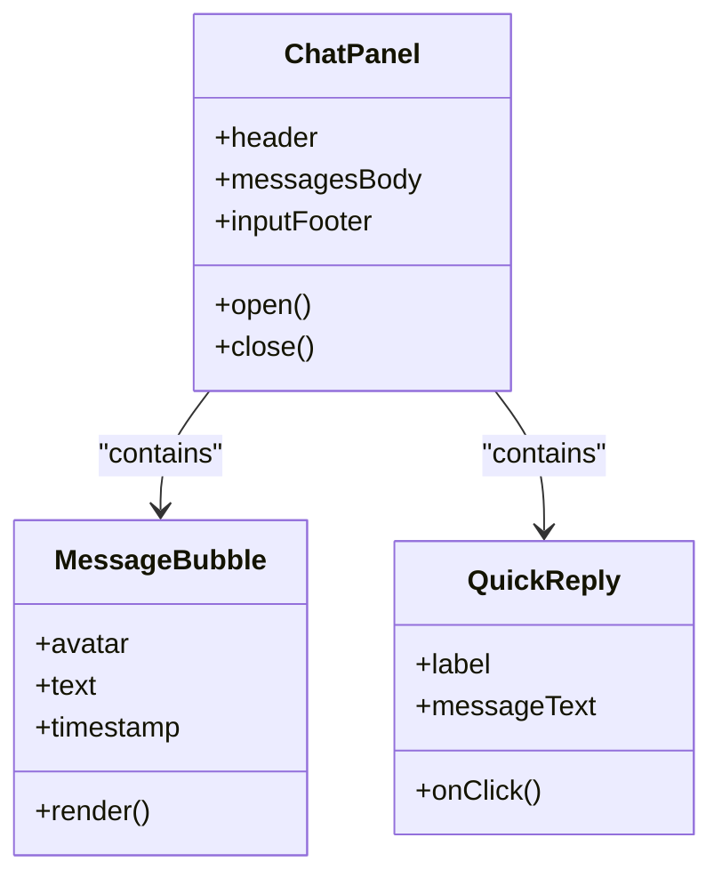

**Diagram sources**
- [chat.html:27-76](file://components/chat.html#L27-L76)
- [header-footer.css:806-1184](file://assets/css/header-footer.css#L806-L1184)

**Section sources**
- [chat.html:27-76](file://components/chat.html#L27-L76)
- [header-footer.css:806-1184](file://assets/css/header-footer.css#L806-L1184)

### Message Bubbles, Avatars, and Timestamp Formatting
- User messages: Right-aligned with a distinct avatar and timestamp.
- Bot messages: Left-aligned with Eduooz avatar and timestamp.
- Timestamps: Generated using a helper that formats the current time as HH:MM.

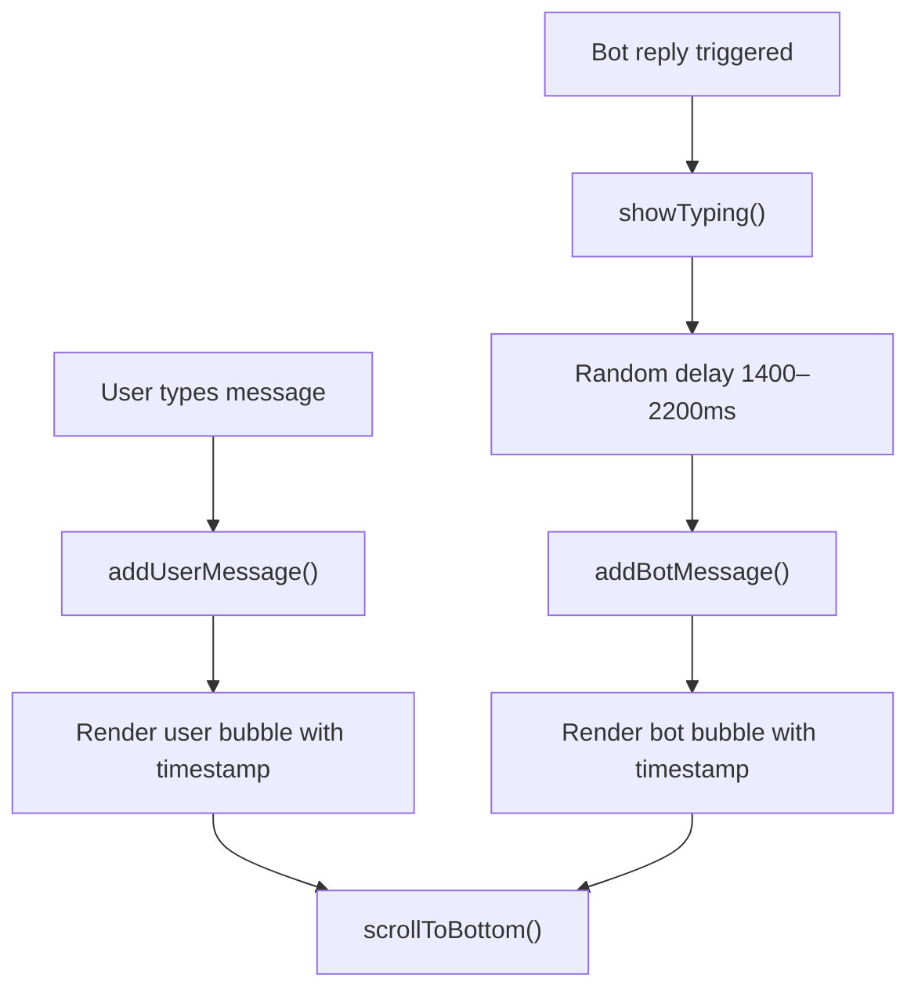

**Diagram sources**
- [components.js:168-219](file://assets/js/components.js#L168-L219)
- [components.js:156-166](file://assets/js/components.js#L156-L166)

**Section sources**
- [components.js:156-219](file://assets/js/components.js#L156-L219)
- [header-footer.css:992-1074](file://assets/css/header-footer.css#L992-L1074)

### Bot Messaging System
- Keyword-based responses:
  - “course”: Links to course offerings.
  - “admission”: Mentions open admissions and offers application details.
  - “placement”: Highlights placement statistics and reports.
  - “call” or “talk”: Offers callback and contact number.
- Default response: A friendly acknowledgment when no keywords match.

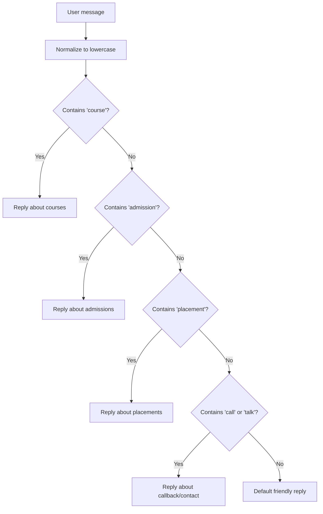

**Diagram sources**
- [components.js:222-229](file://assets/js/components.js#L222-L229)

**Section sources**
- [components.js:222-229](file://assets/js/components.js#L222-L229)

### Typing Indicator Animation
- A typing indicator is inserted into the message area when the user sends a message.
- It consists of three animated dots with staggered delays to simulate typing.

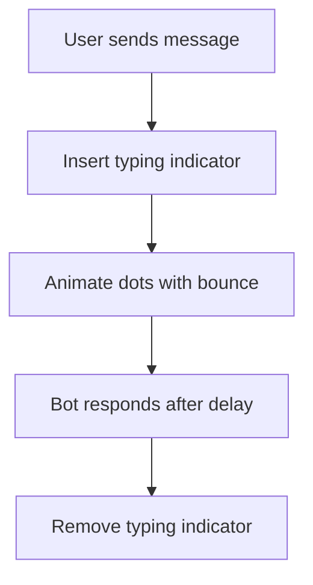

**Diagram sources**
- [components.js:183-203](file://assets/js/components.js#L183-L203)
- [header-footer.css:1186-1208](file://assets/css/header-footer.css#L1186-L1208)

**Section sources**
- [components.js:183-203](file://assets/js/components.js#L183-L203)
- [header-footer.css:1186-1208](file://assets/css/header-footer.css#L1186-L1208)

### Quick Reply Functionality
- Four quick reply buttons are shown initially.
- Clicking a quick reply removes the quick replies, sends the predefined message, shows the typing indicator, and displays the bot’s response.

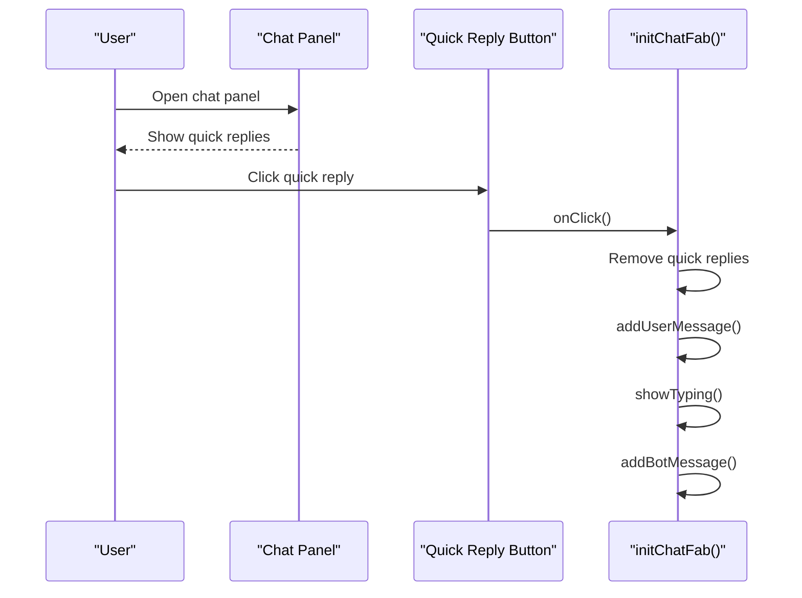

**Diagram sources**
- [chat.html:57-63](file://components/chat.html#L57-L63)
- [components.js:266-284](file://assets/js/components.js#L266-L284)

**Section sources**
- [chat.html:57-63](file://components/chat.html#L57-L63)
- [components.js:266-284](file://assets/js/components.js#L266-L284)

### User Input Handling and Keyboard Shortcuts
- Send button: Triggers message sending and clears the input.
- Enter key: Sends the message when pressed in the input field.
- First message: Removes quick replies immediately after sending.

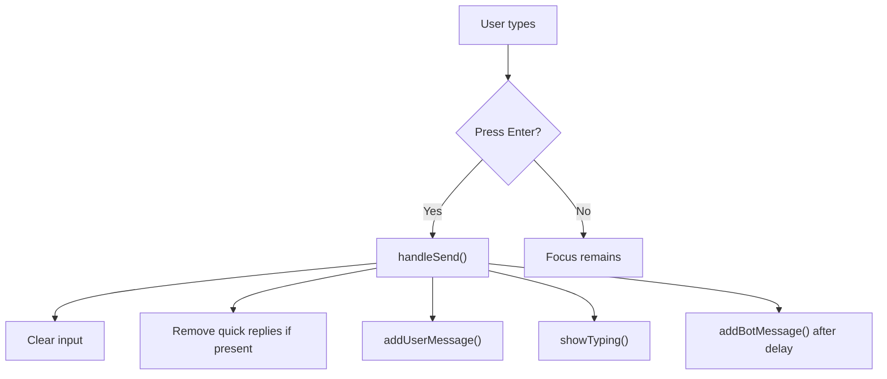

**Diagram sources**
- [components.js:232-264](file://assets/js/components.js#L232-L264)

**Section sources**
- [components.js:232-264](file://assets/js/components.js#L232-L264)

### Scroll Management and Auto-Focus Behavior
- Auto-focus: When the panel opens, the input receives focus after a short delay to improve UX.
- Scroll to bottom: Every time a new message is added, the panel scrolls to the latest message.

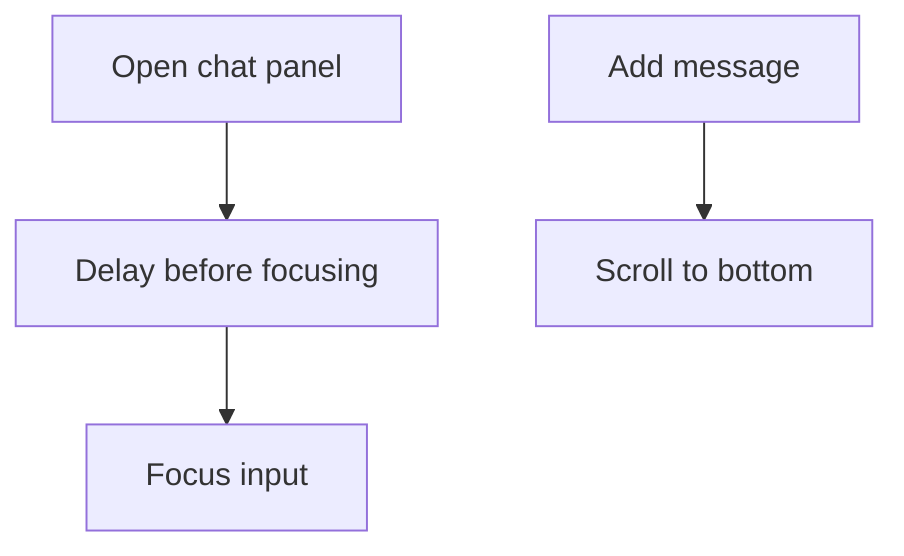

**Diagram sources**
- [components.js:142-144](file://assets/js/components.js#L142-L144)
- [components.js:160-166](file://assets/js/components.js#L160-L166)

**Section sources**
- [components.js:142-144](file://assets/js/components.js#L142-L144)
- [components.js:160-166](file://assets/js/components.js#L160-L166)

### Chat Initialization and Event Handling Patterns
- Component loading: The loader fetches the chat HTML and injects it into a container on DOMContentLoaded.
- Chat initialization: After injection, the loader calls the chat initializer to set up event listeners and UI behaviors.
- Event delegation: Quick reply buttons are bound after the panel is opened; send and enter events are bound to the input and button.

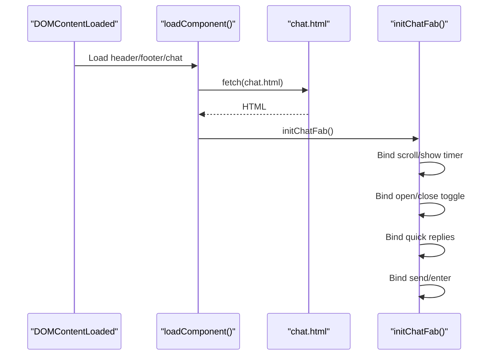

**Diagram sources**
- [components.js:339-347](file://assets/js/components.js#L339-L347)
- [components.js:69-71](file://assets/js/components.js#L69-L71)
- [components.js:109-285](file://assets/js/components.js#L109-L285)

**Section sources**
- [components.js:339-347](file://assets/js/components.js#L339-L347)
- [components.js:69-71](file://assets/js/components.js#L69-L71)
- [components.js:109-285](file://assets/js/components.js#L109-L285)

## Dependency Analysis
- HTML dependency: The chat component is injected into pages via the component loader.
- CSS dependency: The chat relies on styles for animations, transitions, and responsive behavior.
- JavaScript dependency: The chat initializer depends on DOM elements and helper functions for time formatting, scrolling, and message rendering.

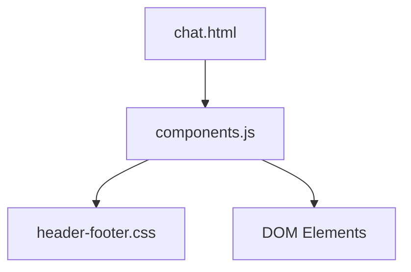

**Diagram sources**
- [components.js:339-347](file://assets/js/components.js#L339-L347)
- [header-footer.css:490-1220](file://assets/css/header-footer.css#L490-L1220)

**Section sources**
- [components.js:339-347](file://assets/js/components.js#L339-L347)
- [header-footer.css:490-1220](file://assets/css/header-footer.css#L490-L1220)

## Performance Considerations
- Animations: Entrance and panel open/close use CSS transforms and opacity with easing for smooth performance.
- Scroll handling: Scroll listener uses passive options to avoid layout thrashing.
- Message rendering: New messages are appended and scrolled to; quick replies are removed once the first message is sent to reduce DOM churn.
- Typing indicator: Uses lightweight CSS animations with minimal JavaScript updates.

[No sources needed since this section provides general guidance]

## Troubleshooting Guide
- FAB does not appear:
  - Verify the scroll threshold and timeout logic are not blocked by other scripts.
  - Ensure the container exists and the loader runs on DOMContentLoaded.
- Panel does not open:
  - Confirm the active class toggle and body class adjustments are applied.
  - Check that the close button handler removes the active class.
- Messages not appearing:
  - Ensure the message area element exists and helpers for adding messages are invoked.
  - Verify the scroll-to-bottom helper executes after appending messages.
- Quick replies not responding:
  - Confirm the quick reply buttons are re-attached after the panel opens.
  - Ensure the click handler removes quick replies and triggers bot response.
- Typing indicator not visible:
  - Verify the typing indicator element is inserted and CSS animations are applied.
- Input not focused:
  - Check the focus delay and ensure the input element exists when the panel opens.

**Section sources**
- [components.js:121-145](file://assets/js/components.js#L121-L145)
- [components.js:160-166](file://assets/js/components.js#L160-L166)
- [components.js:232-264](file://assets/js/components.js#L232-L264)
- [components.js:266-284](file://assets/js/components.js#L266-L284)

## Conclusion
The Eduooz live chat widget integrates a polished FAB with entrance and toggle animations, a responsive chat panel, intelligent bot responses, and smooth UX behaviors like auto-focus and scroll management. Its modular design allows easy reuse across pages through a component loader, while CSS-driven animations ensure performance and visual appeal.