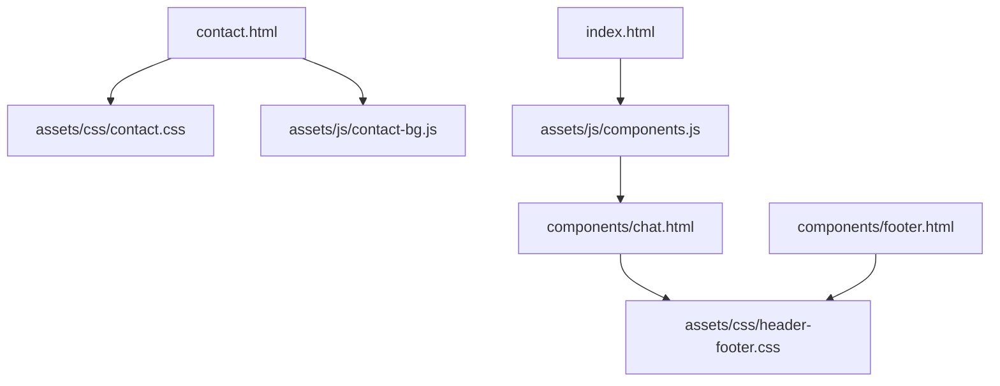
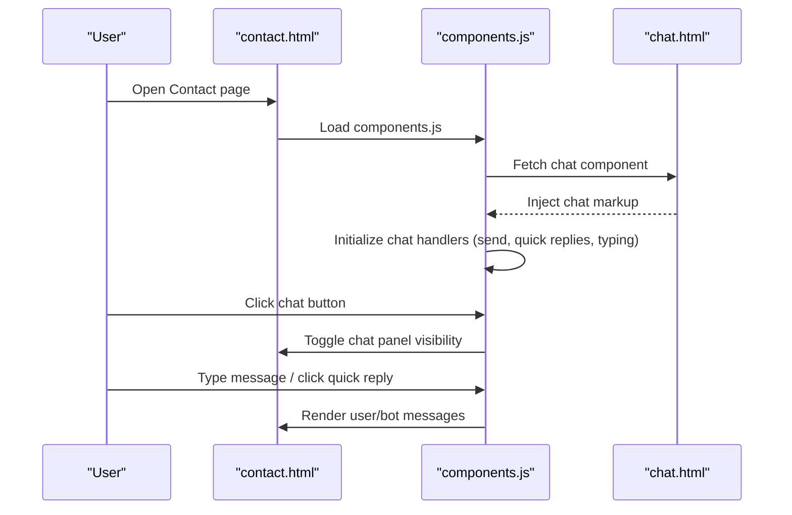
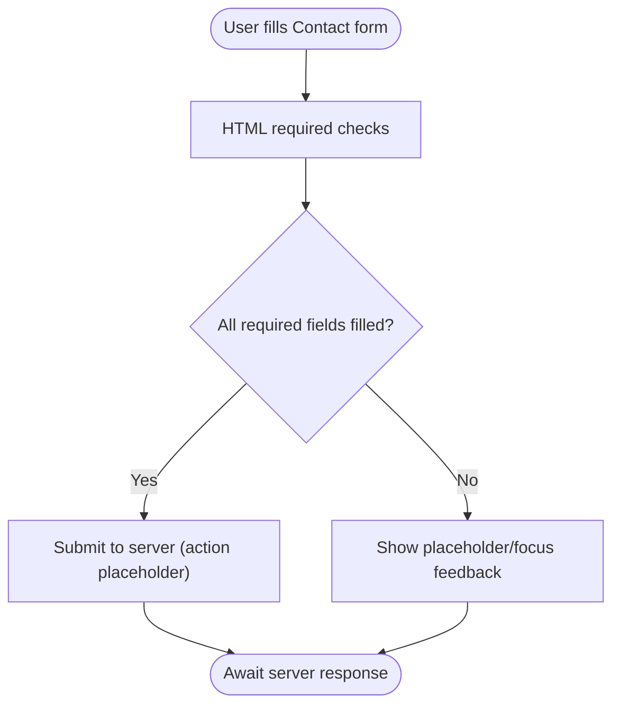
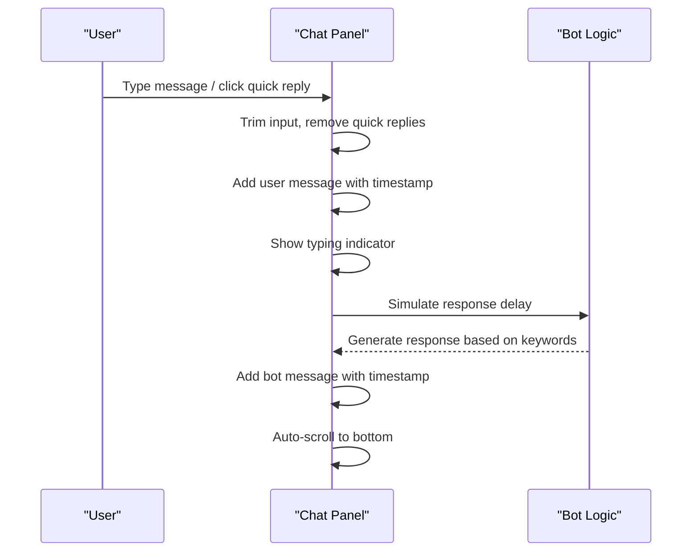
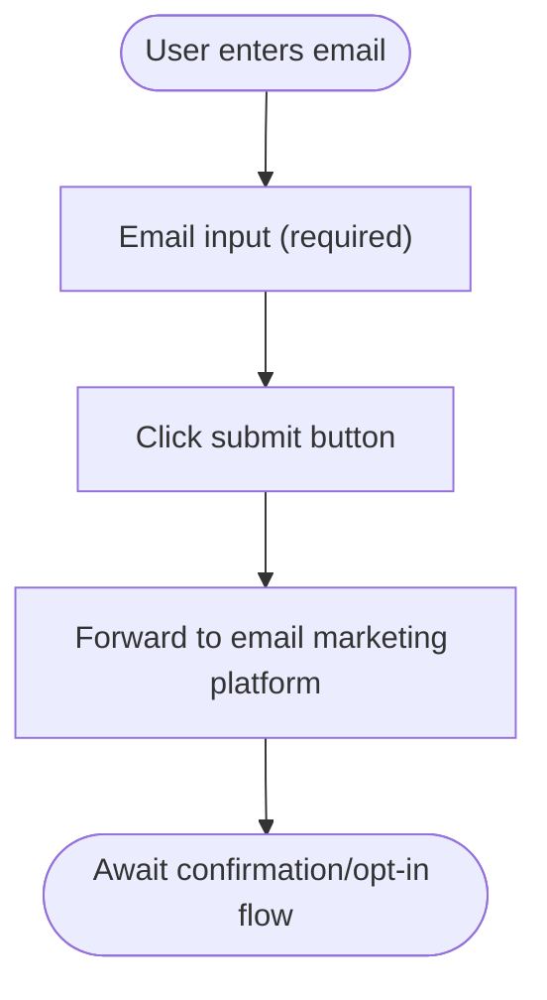
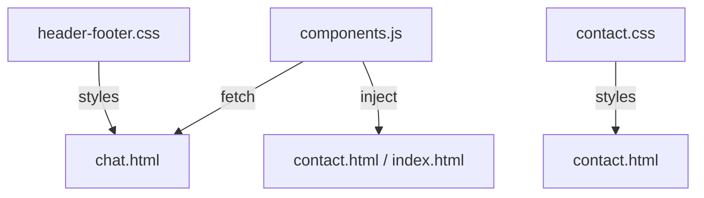

# Contact and Communication

<cite>
**Referenced Files in This Document**
- [contact.html](file://contact.html)
- [contact.css](file://assets/css/contact.css)
- [contact-bg.js](file://assets/js/contact-bg.js)
- [components.js](file://assets/js/components.js)
- [chat.html](file://components/chat.html)
- [header-footer.css](file://assets/css/header-footer.css)
- [index.html](file://index.html)
</cite>

## Table of Contents
1. [Introduction](#introduction)
2. [Project Structure](#project-structure)
3. [Core Components](#core-components)
4. [Architecture Overview](#architecture-overview)
5. [Detailed Component Analysis](#detailed-component-analysis)
6. [Dependency Analysis](#dependency-analysis)
7. [Performance Considerations](#performance-considerations)
8. [Troubleshooting Guide](#troubleshooting-guide)
9. [Conclusion](#conclusion)

## Introduction
This document describes the contact and communication systems implemented in the Eduooz website. It covers:
- The contact form on the Contact page, including validation, submission handling, and user feedback.
- The live chat widget for student support, including real-time interaction, quick replies, and integration hooks.
- The newsletter subscription system, including email collection and presentation.
- Technical details on form processing, error handling, and security considerations.
- Examples of data structures, configuration, and implementation patterns.
- Responsive design, accessibility considerations, and performance optimization.

## Project Structure
The communication features are distributed across several files:
- Contact page and form: contact.html and assets/css/contact.css
- Interactive background and UI enhancements: assets/js/contact-bg.js
- Component loader and chat widget initialization: assets/js/components.js
- Live chat markup and styles: components/chat.html and assets/css/header-footer.css
- Newsletter subscription: components/footer.html (referenced via header-footer.css)
- Additional contact form pattern: index.html

**Diagram sources**
- [contact.html:1-173](file://contact.html#L1-L173)
- [contact.css:1-522](file://assets/css/contact.css#L1-L522)
- [contact-bg.js:1-193](file://assets/js/contact-bg.js#L1-L193)
- [components.js:1-347](file://assets/js/components.js#L1-L347)
- [chat.html:1-78](file://components/chat.html#L1-L78)
- [header-footer.css:1-800](file://assets/css/header-footer.css#L1-L800)
- [index.html:1520-1602](file://index.html#L1520-L1602)

**Section sources**
- [contact.html:1-173](file://contact.html#L1-L173)
- [contact.css:1-522](file://assets/css/contact.css#L1-L522)
- [contact-bg.js:1-193](file://assets/js/contact-bg.js#L1-L193)
- [components.js:1-347](file://assets/js/components.js#L1-L347)
- [chat.html:1-78](file://components/chat.html#L1-L78)
- [header-footer.css:1-800](file://assets/css/header-footer.css#L1-L800)
- [index.html:1520-1602](file://index.html#L1520-L1602)

## Core Components
- Contact form on the Contact page
  - Fields: name, email, phone number, subject, comments/questions.
  - Validation: HTML required attributes; client-side feedback via focus styles and placeholder colors.
  - Submission: action attribute set to a placeholder; no client-side handler is present in the Contact page.
  - Feedback: visual focus states and placeholder styling indicate validity and interaction.

- Live chat widget
  - Floating action button with animated entrance, tooltip, and pulsing rings.
  - Chat panel with header, messages area, quick replies, and input area.
  - Behavior: appears after scrolling or timeout; toggles open/close; supports quick replies and typing indicators.

- Newsletter subscription
  - Footer newsletter form with email input and submit button.
  - Styling: glass-like rounded input with gradient submit button.
  - No client-side handler is present in the footer; submission is not implemented in the current code.

- Additional contact form pattern
  - A glass-form pattern exists on the homepage with name, phone, course selection, and message fields.
  - Submission currently triggers a client-side alert; server-side handling is not implemented.

**Section sources**
- [contact.html:96-125](file://contact.html#L96-L125)
- [contact.css:271-294](file://assets/css/contact.css#L271-L294)
- [chat.html:11-76](file://components/chat.html#L11-L76)
- [components.js:109-285](file://assets/js/components.js#L109-L285)
- [header-footer.css:208-225](file://assets/css/header-footer.css#L208-L225)
- [index.html:1547-1577](file://index.html#L1547-L1577)

## Architecture Overview
The communication architecture combines static markup with dynamic JavaScript:
- Static markup defines the form and chat panel structure.
- Components loader fetches and injects chat markup into the page.
- Chat widget initializes with event handlers for send, quick replies, and typing simulation.
- Newsletter and contact forms are defined in separate templates and styled independently.

**Diagram sources**
- [contact.html:161-170](file://contact.html#L161-L170)
- [components.js:340-347](file://assets/js/components.js#L340-L347)
- [chat.html:1-78](file://components/chat.html#L1-L78)

## Detailed Component Analysis

### Contact Form on Contact Page
- Implementation highlights
  - Two-column layout for name/email and phone/subject.
  - Single-column layout for message.
  - Required fields enforced via HTML attributes.
  - Focus styles and placeholder styling provide immediate feedback.
  - Submit button styled with gradient and shadow.

- Data model (field-level)
  - name: text, required
  - email: email, required
  - phone_number: text, required
  - subject: text, required
  - comments_questions: textarea, required

- Processing logic
  - No client-side validation or submission handler is present.
  - The form action is set to a placeholder; submission behavior is not implemented in the current code.

- Accessibility and responsiveness
  - Labels associated with inputs; placeholders act as hints.
  - Responsive breakpoints adjust layout and spacing for tablets and phones.

- Security considerations
  - No CSRF protection or input sanitization is implemented.
  - Consider adding server-side validation, sanitization, and rate limiting.

**Diagram sources**
- [contact.html:96-125](file://contact.html#L96-L125)
- [contact.css:271-294](file://assets/css/contact.css#L271-L294)

**Section sources**
- [contact.html:96-125](file://contact.html#L96-L125)
- [contact.css:248-314](file://assets/css/contact.css#L248-L314)
- [contact-bg.js:145-156](file://assets/js/contact-bg.js#L145-L156)

### Live Chat Widget
- Implementation highlights
  - Floating action button with animated entrance and tooltip.
  - Chat panel with avatar, online status, welcome message, quick replies, and input area.
  - Handlers for send, quick replies, typing indicator, and auto-scroll to bottom.

- Data model (messages)
  - User message: contains text and timestamp.
  - Bot message: contains text and timestamp.
  - Typing indicator: temporary UI element shown while simulating bot response.

- Processing logic
  - On send: trim input, remove quick replies, add user message, simulate typing, then add bot reply.
  - Quick replies: pre-defined prompts mapped to bot responses.
  - Timing: typing indicator delay plus randomized delay for bot reply.

- Accessibility and responsiveness
  - Tooltip and icons include aria-labels.
  - Styles adapt to smaller screens with reduced dimensions.

- Security considerations
  - No input sanitization or moderation is implemented.
  - Consider adding sanitization and keyword filtering for sensitive contexts.

**Diagram sources**
- [components.js:168-284](file://assets/js/components.js#L168-L284)
- [chat.html:46-76](file://components/chat.html#L46-L76)

**Section sources**
- [chat.html:11-76](file://components/chat.html#L11-L76)
- [components.js:109-285](file://assets/js/components.js#L109-L285)
- [header-footer.css:492-800](file://assets/css/header-footer.css#L492-L800)

### Newsletter Subscription
- Implementation highlights
  - Newsletter form in the footer with email input and submit button.
  - Glass-like styling with gradient submit button.
  - No client-side handler is present; submission is not implemented.

- Data model (subscription)
  - email: email, required

- Processing logic
  - No client-side validation or submission handler is present.
  - The form relies on external integration (e.g., email marketing platform) for processing.

- Accessibility and responsiveness
  - Input field uses placeholder and required attribute.
  - Layout adjusts for mobile with centered and stacked elements.

- Security considerations
  - No input sanitization or CAPTCHA is implemented.
  - Consider adding server-side validation and rate limiting.

**Diagram sources**
- [header-footer.css:208-225](file://assets/css/header-footer.css#L208-L225)
- [components/footer.html:55-58](file://components/footer.html#L55-L58)

**Section sources**
- [header-footer.css:208-225](file://assets/css/header-footer.css#L208-L225)
- [components/footer.html:55-58](file://components/footer.html#L55-L58)

### Additional Contact Form Pattern (Homepage)
- Implementation highlights
  - Glass-form with name, phone, course category, and message.
  - Submission currently triggers a client-side alert; server-side handling is not implemented.

- Data model (field-level)
  - name: text, required
  - phone: tel, required
  - course_category: select, required
  - message: textarea, required

- Processing logic
  - No client-side validation or submission handler is present.
  - The form action prevents default submission and shows a test alert.

- Accessibility and responsiveness
  - Labels and placeholders are used; responsive adjustments for mobile.

- Security considerations
  - No input sanitization or rate limiting is implemented.
  - Consider adding server-side validation and anti-abuse measures.

**Section sources**
- [index.html:1547-1577](file://index.html#L1547-L1577)

## Dependency Analysis
- Component loading
  - components.js dynamically loads header, footer, and chat components via fetch.
  - Relative paths are corrected when served from subdirectories.

- Chat widget lifecycle
  - Chat component is injected into the page.
  - Chat handlers are attached after injection completes.

- Styles and animations
  - contact.css provides form and layout styles.
  - header-footer.css provides chat widget styles and animations.

**Diagram sources**
- [components.js:40-76](file://assets/js/components.js#L40-L76)
- [chat.html:1-78](file://components/chat.html#L1-L78)
- [header-footer.css:492-800](file://assets/css/header-footer.css#L492-L800)
- [contact.css:117-162](file://assets/css/contact.css#L117-L162)

**Section sources**
- [components.js:26-76](file://assets/js/components.js#L26-L76)
- [header-footer.css:492-800](file://assets/css/header-footer.css#L492-L800)
- [contact.css:117-162](file://assets/css/contact.css#L117-L162)

## Performance Considerations
- Chat widget
  - Uses requestAnimationFrame for smooth animations and GSAP integration.
  - Body class toggling hides scroll-to-top when chat is open to reduce repaints.

- Contact page background
  - Three.js particle system with pixel ratio clamping and resize handling.
  - GSAP and Lenis integration for smooth scroll and entrance animations.

- Recommendations
  - Defer non-critical scripts to improve LCP.
  - Use lazy loading for background canvas and chat panel.
  - Minimize reflows by batching DOM updates in chat handlers.

**Section sources**
- [contact-bg.js:145-156](file://assets/js/contact-bg.js#L145-L156)
- [contact-bg.js:187-193](file://assets/js/contact-bg.js#L187-L193)
- [header-footer.css:437-442](file://assets/css/header-footer.css#L437-L442)

## Troubleshooting Guide
- Contact form does not submit
  - Cause: action attribute points to a placeholder; no client-side handler.
  - Resolution: Implement a client-side handler or configure server endpoint.

- Chat widget not appearing
  - Cause: Component fetch failed or chat container not present.
  - Resolution: Verify chat container exists and network allows component fetch.

- Newsletter form does nothing on submit
  - Cause: No client-side handler; form action not configured.
  - Resolution: Implement a handler or integrate with an email marketing platform.

- Accessibility issues
  - Ensure labels are programmatically associated with inputs.
  - Provide ARIA attributes for chat tooltips and buttons.

- Security hardening
  - Add server-side validation, sanitization, and rate limiting.
  - Consider CAPTCHA for forms and implement CSRF protection.

**Section sources**
- [components.js:73-75](file://assets/js/components.js#L73-L75)
- [contact.html:96](file://contact.html#L96)
- [header-footer.css:208-225](file://assets/css/header-footer.css#L208-L225)

## Conclusion
The Eduooz website implements a visually rich contact experience with a responsive contact form, a live chat widget, and a newsletter subscription area. While the UI and interactions are polished, the current implementation lacks client-side handlers for form submissions and chat messaging. To deliver a robust, secure, and accessible communication system, integrate server-side processing, implement input validation and sanitization, and enhance accessibility and performance.