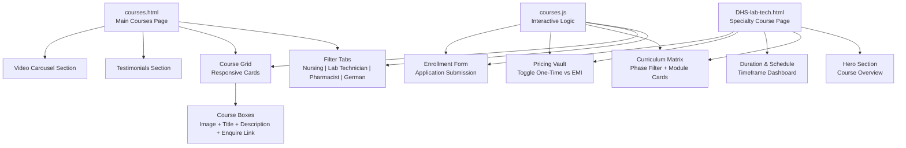
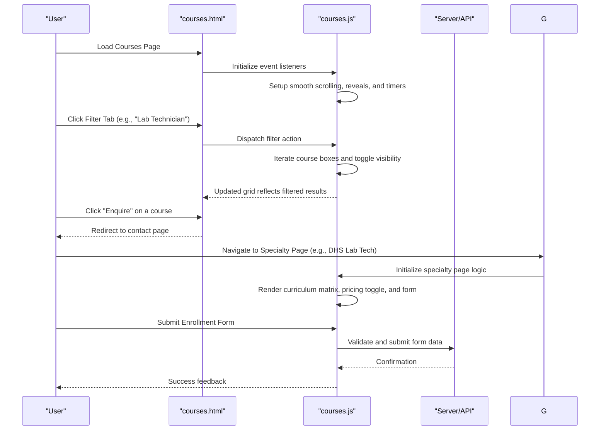
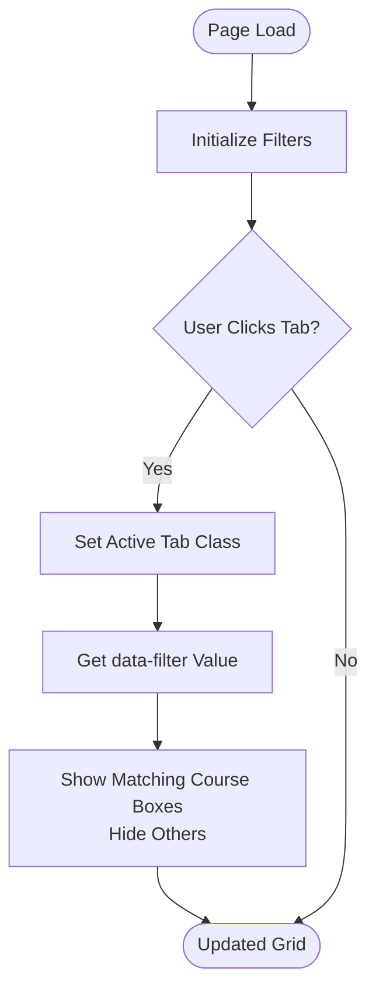
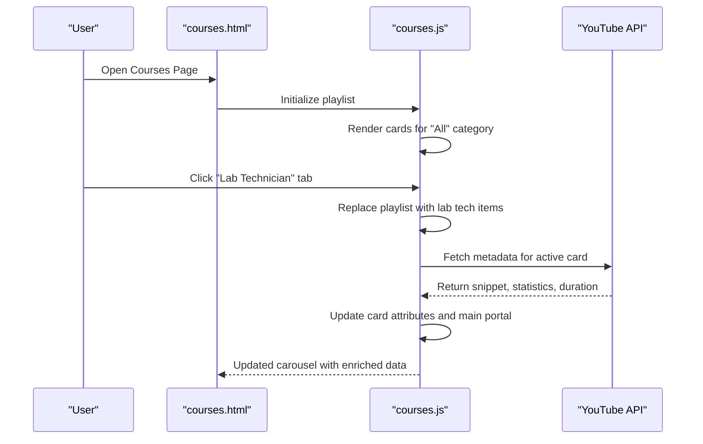
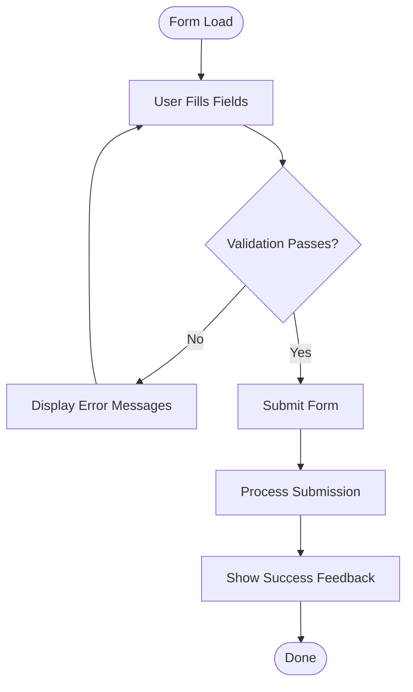
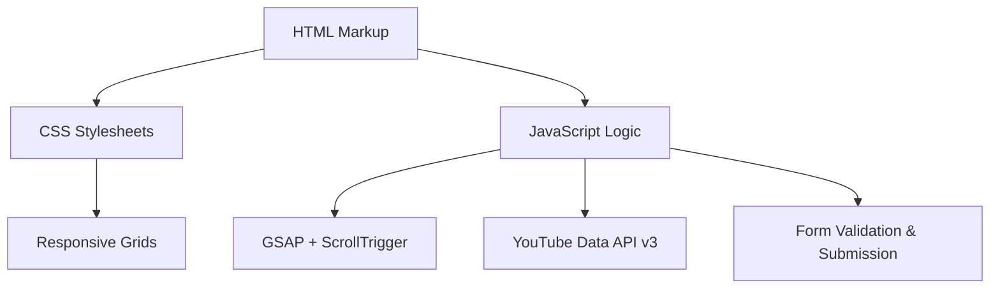

# Course Catalog System

<cite>
**Referenced Files in This Document**
- [courses.html](file://courses.html)
- [courses.js](file://assets/js/courses.js)
- [courses.css](file://assets/css/courses.css)
- [DHS-lab-tech.html](file://courses/lab-tech/DHS-lab-tech.html)
- [courses-landing.css](file://assets/css/courses-landing.css)
</cite>

## Table of Contents
1. [Introduction](#introduction)
2. [Project Structure](#project-structure)
3. [Core Components](#core-components)
4. [Architecture Overview](#architecture-overview)
5. [Detailed Component Analysis](#detailed-component-analysis)
6. [Dependency Analysis](#dependency-analysis)
7. [Performance Considerations](#performance-considerations)
8. [Troubleshooting Guide](#troubleshooting-guide)
9. [Conclusion](#conclusion)

## Introduction
This document describes the Eduooz course catalog system implementation, focusing on specialty-based course organization across nursing coaching, pharmacist preparation, and laboratory technician training. It covers the filtering and categorization system, course detail presentation, enrollment form integration, responsive design patterns, and dynamic content rendering. Concrete examples illustrate course data structures, filtering algorithms, and the integration between course listings and enrollment processes.

## Project Structure
The course catalog system comprises:
- A main courses landing page that lists all specialty offerings with category filters
- Specialty-specific course pages (e.g., nursing, pharmacist, lab technician)
- A dedicated course page for DHS lab technician training
- Shared styles for responsive course cards, feature highlights, and call-to-action elements
- JavaScript logic for interactive filtering, dynamic content rendering, and enrollment form handling

**Diagram sources**
- [courses.html:80-609](file://courses.html#L80-L609)
- [DHS-lab-tech.html:31-509](file://courses/lab-tech/DHS-lab-tech.html#L31-L509)
- [courses.js:176-800](file://assets/js/courses.js#L176-L800)

**Section sources**
- [courses.html:1-967](file://courses.html#L1-L967)
- [DHS-lab-tech.html:1-1616](file://courses/lab-tech/DHS-lab-tech.html#L1-L1616)
- [courses.js:1-1408](file://assets/js/courses.js#L1-L1408)
- [courses.css:1-1238](file://assets/css/courses.css#L1-L1238)
- [courses-landing.css:1-2032](file://assets/css/courses-landing.css#L1-L2032)

## Core Components
- Specialty-based course grid with category filtering
- Dynamic course cards featuring images, titles, descriptions, and enrollment links
- Specialty-specific course pages with curriculum matrices, duration dashboards, pricing toggles, and enrollment forms
- Interactive YouTube playlist carousel with category tabs
- Responsive design with glass morphism, hover effects, and animated reveals

Key implementation highlights:
- Filtering mechanism uses data attributes on course boxes and tab buttons to show/hide categories
- Course data for YouTube playlists is stored in JavaScript arrays and rendered dynamically
- Enrollment form integrates with a terminal-style card and form validation

**Section sources**
- [courses.html:80-609](file://courses.html#L80-L609)
- [courses.js:176-800](file://assets/js/courses.js#L176-L800)
- [DHS-lab-tech.html:416-1599](file://courses/lab-tech/DHS-lab-tech.html#L416-L1599)

## Architecture Overview
The system follows a modular front-end architecture:
- HTML defines the structure for course listings and specialty pages
- CSS provides responsive layouts, animations, and visual themes
- JavaScript handles interactivity, filtering, dynamic rendering, and form submission

**Diagram sources**
- [courses.html:80-609](file://courses.html#L80-L609)
- [courses.js:1-1408](file://assets/js/courses.js#L1-L1408)
- [DHS-lab-tech.html:416-1599](file://courses/lab-tech/DHS-lab-tech.html#L416-L1599)

## Detailed Component Analysis

### Specialty-Based Course Organization
The main courses page organizes offerings by specialty using filter tabs and course boxes:
- Filter tabs: All Specialties, Nursing, Lab Technician, Pharmacist, German Language
- Course boxes: Each contains an image, title, description, and an "Enquire" call-to-action link

Implementation pattern:
- Each course box has a data-category attribute matching the tab filter values
- JavaScript listens for tab clicks and toggles visibility of matching course boxes

**Diagram sources**
- [courses.html:80-87](file://courses.html#L80-L87)
- [courses.js:176-243](file://assets/js/courses.js#L176-L243)

**Section sources**
- [courses.html:80-609](file://courses.html#L80-L609)
- [courses.js:176-243](file://assets/js/courses.js#L176-L243)

### Course Filtering and Categorization System
Filtering algorithm:
- Collect all course boxes and filter buttons
- On tab click, remove active class from all buttons and set clicked button as active
- Read the data-filter attribute to determine target category
- Loop through course boxes and show/hide based on data-category match
- Maintain visual feedback with CSS transitions

Performance characteristics:
- O(n) filtering per tab click where n is the number of course boxes
- Minimal DOM manipulation; uses class toggling and display property changes
- No external dependencies for filtering logic

**Section sources**
- [courses.html:80-87](file://courses.html#L80-L87)
- [courses.js:176-243](file://assets/js/courses.js#L176-L243)

### Course Detail Presentation and Specialty Pages
Specialty pages present comprehensive course details:
- Hero section with course overview and CTA buttons
- Curriculum matrix with phase-based modules and expandable topics
- Duration and schedule dashboard with animated counters
- Pricing vault with one-time vs EMI toggle and feature comparisons
- Enrollment form with validation and submission handling

DHS Lab Technician course page exemplifies this structure:
- Hero grid with course vitals dashboard and urgency indicators
- Masterclass video portal with lazy-loaded YouTube iframe
- Curriculum phases with interactive module cards
- Pricing tiers with holographic vault styling
- Terminal-style enrollment form with secure submission

**Section sources**
- [DHS-lab-tech.html:31-509](file://courses/lab-tech/DHS-lab-tech.html#L31-L509)
- [DHS-lab-tech.html:511-1599](file://courses/lab-tech/DHS-lab-tech.html#L511-L1599)

### Responsive Course Card Design and Feature Highlighting
Course cards employ glass morphism and hover effects:
- Gradient overlays, blurred backgrounds, and subtle borders
- Animated reveals using GSAP for entrance effects
- Hover states with elevation, glow, and content transitions
- Feature highlighting through icons, badges, and progress indicators

Responsive behavior:
- Grid layout adjusts columns based on viewport width
- Mobile-specific adaptations for touch interactions and reduced animations
- Sticky positioning for key sections on larger screens

**Section sources**
- [courses.css:124-253](file://assets/css/courses.css#L124-L253)
- [courses-landing.css:168-255](file://assets/css/courses-landing.css#L168-L255)

### Call-to-Action Elements and Navigation
Call-to-action patterns:
- Enquire links on course cards redirect to contact page
- Primary CTAs in hero sections use liquid button effects
- Secondary CTAs utilize glass morphism styling
- Navigation anchors enable smooth scrolling to sections

Integration:
- Anchor links connect course listings to specialty pages
- Form submissions integrate with backend systems (configured via JavaScript)

**Section sources**
- [courses.html:90-609](file://courses.html#L90-L609)
- [DHS-lab-tech.html:416-1599](file://courses/lab-tech/DHS-lab-tech.html#L416-L1599)

### Dynamic Content Rendering and YouTube Integration
Dynamic rendering mechanisms:
- YouTube playlist carousel with category tabs
- Real-time metadata fetching using YouTube Data API v3
- Centered active card with smooth horizontal transitions
- Auto-slide functionality with manual override

Category data structure:
- Arrays for nursing, pharmacist, lab technician, and German language playlists
- Interleaved "All" playlist combining entries from all categories
- Each playlist item includes thumbnail, title, description, statistics, and duration

**Diagram sources**
- [courses.js:641-780](file://assets/js/courses.js#L641-L780)
- [courses.js:456-530](file://assets/js/courses.js#L456-L530)

**Section sources**
- [courses.js:456-530](file://assets/js/courses.js#L456-L530)
- [courses.js:641-780](file://assets/js/courses.js#L641-L780)

### Enrollment Form Integration and Validation
Form integration patterns:
- Terminal-style form embedded within the specialty page
- Input fields for name, phone, email, and course selection
- Secure submission with visual feedback and encryption note

Validation and submission handling:
- Required field validation for essential inputs
- Select dropdown for course track selection
- Submission handler triggers form processing and confirmation

**Diagram sources**
- [DHS-lab-tech.html:1551-1589](file://courses/lab-tech/DHS-lab-tech.html#L1551-L1589)
- [DHS-lab-tech.html:1542-1599](file://courses/lab-tech/DHS-lab-tech.html#L1542-L1599)

**Section sources**
- [DHS-lab-tech.html:1542-1599](file://courses/lab-tech/DHS-lab-tech.html#L1542-L1599)

## Dependency Analysis
Component relationships:
- HTML provides structural markup for courses and specialty pages
- CSS defines visual styles, responsive grids, and interactive states
- JavaScript orchestrates filtering, dynamic rendering, and form handling
- External libraries (GSAP, ScrollTrigger) enhance animations and scroll-based interactions

**Diagram sources**
- [courses.html:1-967](file://courses.html#L1-L967)
- [courses.js:1-1408](file://assets/js/courses.js#L1-L1408)
- [courses.css:1-1238](file://assets/css/courses.css#L1-L1238)
- [courses-landing.css:1-2032](file://assets/css/courses-landing.css#L1-L2032)

**Section sources**
- [courses.html:1-967](file://courses.html#L1-L967)
- [courses.js:1-1408](file://assets/js/courses.js#L1-L1408)
- [courses.css:1-1238](file://assets/css/courses.css#L1-L1238)
- [courses-landing.css:1-2032](file://assets/css/courses-landing.css#L1-L2032)

## Performance Considerations
- Efficient filtering: O(n) pass over course boxes; minimal DOM updates
- Lazy loading: YouTube thumbnails loaded initially; iframe injected on demand
- Animations: GSAP-powered animations optimized for smoothness; disabled on lower-end devices via CSS media queries
- Responsive design: Grid layouts adapt to viewport; mobile touch interactions reduce heavy hover effects
- Asset delivery: CDN-hosted libraries minimize local bandwidth usage

## Troubleshooting Guide
Common issues and resolutions:
- Filter tabs not working: Verify data-filter attributes match data-category values on course boxes
- YouTube carousel not updating: Confirm API key configuration and CORS policy
- Form validation errors: Ensure required attributes are present and labels are properly associated
- Mobile responsiveness: Check media query breakpoints and touch-friendly element sizes

**Section sources**
- [courses.js:176-243](file://assets/js/courses.js#L176-L243)
- [courses.js:456-530](file://assets/js/courses.js#L456-L530)
- [DHS-lab-tech.html:1551-1589](file://courses/lab-tech/DHS-lab-tech.html#L1551-L1589)

## Conclusion
The Eduooz course catalog system delivers a modern, responsive, and interactive platform for specialty-based healthcare education. Through intuitive filtering, dynamic content rendering, and seamless enrollment integration, it provides an engaging user experience across desktop and mobile devices. The modular architecture supports easy maintenance and future enhancements, including expanded course offerings and advanced analytics.