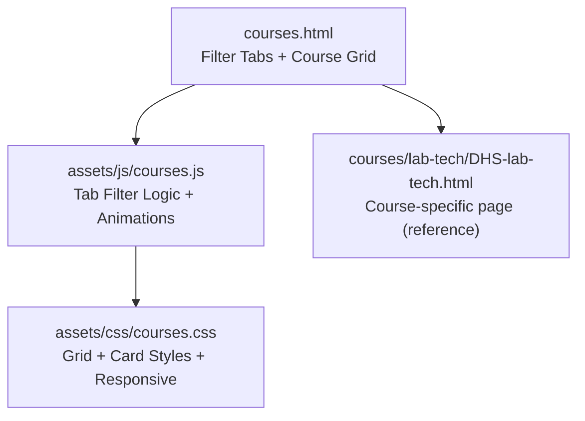
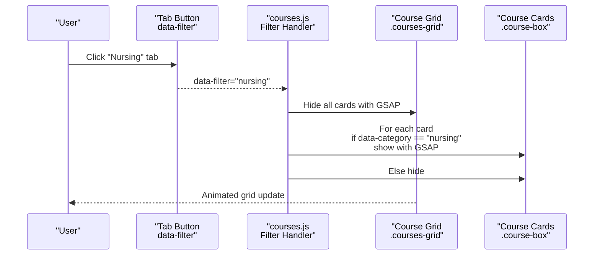
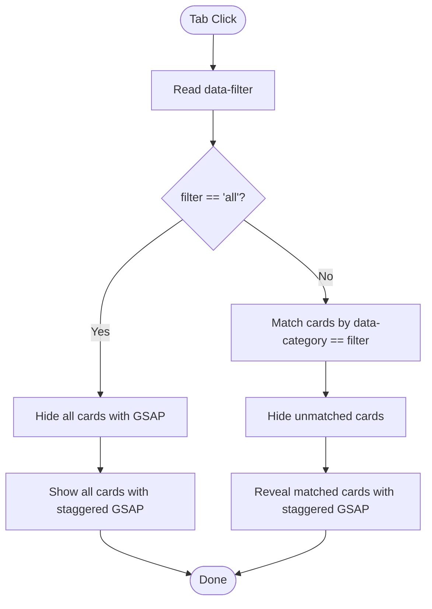
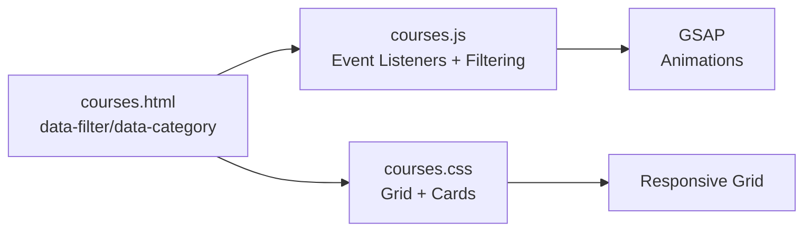

# Course Organization and Filtering

<cite>
**Referenced Files in This Document**
- [courses.html](file://courses.html)
- [courses.js](file://assets/js/courses.js)
- [courses.css](file://assets/css/courses.css)
- [DHS-lab-tech.html](file://courses/lab-tech/DHS-lab-tech.html)
</cite>

## Table of Contents
1. [Introduction](#introduction)
2. [Project Structure](#project-structure)
3. [Core Components](#core-components)
4. [Architecture Overview](#architecture-overview)
5. [Detailed Component Analysis](#detailed-component-analysis)
6. [Dependency Analysis](#dependency-analysis)
7. [Performance Considerations](#performance-considerations)
8. [Troubleshooting Guide](#troubleshooting-guide)
9. [Conclusion](#conclusion)

## Introduction
This document explains the course organization and filtering system used on the platform. It covers the tab-based filtering mechanism for specialty categories (nursing, lab technician, pharmacist, German language), the HTML data-category attributes driving filtering, the JavaScript implementation powering the filter transitions, and the responsive grid layout. It also details the course card structure (image wrapper, content overlay, and footer), provides examples for extending the system with new categories and custom filters, and outlines performance optimization strategies for large course catalogs.

## Project Structure
The course catalog is implemented as a single-page application with:
- A main courses landing page that renders the course grid and filter tabs
- A JavaScript module that manages tab switching, animations, and responsive behavior
- A CSS module that defines the grid layout, card styles, and responsive breakpoints

**Diagram sources**
- [courses.html:80-87](file://courses.html#L80-L87)
- [courses.js:1181-1212](file://assets/js/courses.js#L1181-L1212)
- [courses.css:169-173](file://assets/css/courses.css#L169-L173)

**Section sources**
- [courses.html:80-87](file://courses.html#L80-L87)
- [courses.js:1181-1212](file://assets/js/courses.js#L1181-L1212)
- [courses.css:169-173](file://assets/css/courses.css#L169-L173)

## Core Components
- Filter Tabs: Interactive buttons with data-filter attributes that control visibility of course cards
- Course Grid: Responsive CSS Grid layout containing course cards
- Course Cards: Individual course items with data-category attributes and nested structure for image, content, and footer
- JavaScript Filter Engine: Handles tab activation, hides/shows cards with GSAP animations, and manages responsive behavior

Key implementation references:
- Filter tabs and grid structure: [courses.html:80-87](file://courses.html#L80-L87), [courses.html:89-607](file://courses.html#L89-L607)
- Course card structure (image wrapper, content, footer): [courses.html:90-105](file://courses.html#L90-L105)
- JavaScript filtering logic: [courses.js:1181-1212](file://assets/js/courses.js#L1181-L1212)
- Responsive grid: [courses.css:169-173](file://assets/css/courses.css#L169-L173), [courses.css:1202-1238](file://assets/css/courses.css#L1202-L1238)

**Section sources**
- [courses.html:80-87](file://courses.html#L80-L87)
- [courses.html:89-607](file://courses.html#L89-L607)
- [courses.html:90-105](file://courses.html#L90-L105)
- [courses.js:1181-1212](file://assets/js/courses.js#L1181-L1212)
- [courses.css:169-173](file://assets/css/courses.css#L169-L173)
- [courses.css:1202-1238](file://assets/css/courses.css#L1202-L1238)

## Architecture Overview
The filtering system follows a data-driven pattern:
- HTML data attributes define categories and filter keys
- JavaScript listens for tab clicks, reads the data-filter or data-category values, and animates visibility
- CSS Grid controls the responsive layout and card appearance

**Diagram sources**
- [courses.html:80-87](file://courses.html#L80-L87)
- [courses.js:1181-1212](file://assets/js/courses.js#L1181-L1212)

## Detailed Component Analysis

### Filter Tabs and Data Attributes
- Filter tabs use data-filter attributes to specify which category to display
- The "All Specialties" tab uses data-filter="all" to show all courses
- Course cards use data-category attributes to associate with specialties

References:
- Tabs: [courses.html:80-87](file://courses.html#L80-L87)
- Course cards: [courses.html:90-105](file://courses.html#L90-L105), [courses.html:377-452](file://courses.html#L377-L452), [courses.html:454-560](file://courses.html#L454-L560), [courses.html:561-607](file://courses.html#L561-L607)

**Section sources**
- [courses.html:80-87](file://courses.html#L80-L87)
- [courses.html:90-105](file://courses.html#L90-L105)
- [courses.html:377-452](file://courses.html#L377-L452)
- [courses.html:454-560](file://courses.html#L454-L560)
- [courses.html:561-607](file://courses.html#L561-L607)

### JavaScript Filtering Logic
The filtering logic:
- Adds click listeners to tab buttons
- Reads data-filter attribute
- Hides all cards with a quick fade/scale animation
- Shows only cards whose data-category matches the selected filter
- Uses staggered GSAP animations for smooth reveal
- Supports responsive behavior by adjusting grid columns via CSS media queries

Implementation highlights:
- Event binding and filter evaluation: [courses.js:1181-1212](file://assets/js/courses.js#L1181-L1212)
- GSAP animations for hide/reveal: [courses.js:1191-1210](file://assets/js/courses.js#L1191-L1210)

**Diagram sources**
- [courses.js:1181-1212](file://assets/js/courses.js#L1181-L1212)

**Section sources**
- [courses.js:1181-1212](file://assets/js/courses.js#L1181-L1212)
- [courses.js:1191-1210](file://assets/js/courses.js#L1191-L1210)

### Responsive Grid Layout
The grid layout is controlled by CSS Grid with responsive breakpoints:
- Desktop: 4 columns
- Tablet: 3 columns
- Mobile: 2 columns
- Narrow mobile: 1 column

CSS references:
- Grid definition: [courses.css:169-173](file://assets/css/courses.css#L169-L173)
- Responsive overrides: [courses.css:1202-1238](file://assets/css/courses.css#L1202-L1238)

**Section sources**
- [courses.css:169-173](file://assets/css/courses.css#L169-L173)
- [courses.css:1202-1238](file://assets/css/courses.css#L1202-L1238)

### Course Card Structure
Each course card consists of:
- Image wrapper: Full-bleed background image with hover zoom
- Content wrapper: Title, description, and footer
- Footer: Price indicator and action button

Structure references:
- Card container and overlay: [courses.html:90-105](file://courses.html#L90-L105)
- Image wrapper: [courses.css:1164-1184](file://assets/css/courses.css#L1164-L1184)
- Content wrapper: [courses.css:1187-1199](file://assets/css/courses.css#L1187-L1199)
- Footer: [courses.css:245-252](file://assets/css/courses.css#L245-L252)

**Section sources**
- [courses.html:90-105](file://courses.html#L90-L105)
- [courses.css:1164-1184](file://assets/css/courses.css#L1164-L1184)
- [courses.css:1187-1199](file://assets/css/courses.css#L1187-L1199)
- [courses.css:245-252](file://assets/css/courses.css#L245-L252)

### Example: Adding a New Specialty Category
Steps to add a new specialty (e.g., "Radiology"):
1. Add a new tab button with data-filter="radiology"
2. Add new course cards with data-category="radiology"
3. Optionally add a new course section under the grid for radiology courses

References:
- New tab example: [courses.html:80-87](file://courses.html#L80-L87)
- New course example: [courses.html:90-105](file://courses.html#L90-L105)

**Section sources**
- [courses.html:80-87](file://courses.html#L80-L87)
- [courses.html:90-105](file://courses.html#L90-L105)

### Example: Modifying Filter Buttons
To modify the filter set:
- Change existing data-filter values to reflect new categories
- Update course cards to use matching data-category values
- Keep "All Specialties" as data-filter="all"

References:
- Tabs: [courses.html:80-87](file://courses.html#L80-L87)
- Cards: [courses.html:90-105](file://courses.html#L90-L105)

**Section sources**
- [courses.html:80-87](file://courses.html#L80-L87)
- [courses.html:90-105](file://courses.html#L90-L105)

### Example: Implementing Custom Filtering Criteria
To filter by additional attributes (e.g., difficulty level):
1. Add data-difficulty attributes to course cards
2. Extend the JavaScript filter to compare data-difficulty alongside data-category
3. Add new filter buttons with data-filter values that include difficulty

Reference for extending filtering logic:
- Current filtering implementation: [courses.js:1181-1212](file://assets/js/courses.js#L1181-L1212)

**Section sources**
- [courses.js:1181-1212](file://assets/js/courses.js#L1181-L1212)

## Dependency Analysis
The filtering system has minimal external dependencies and relies on:
- Native DOM APIs for event handling and attribute access
- GSAP for smooth animations
- CSS Grid for responsive layout

**Diagram sources**
- [courses.html:80-87](file://courses.html#L80-L87)
- [courses.js:1181-1212](file://assets/js/courses.js#L1181-L1212)
- [courses.css:169-173](file://assets/css/courses.css#L169-L173)

**Section sources**
- [courses.html:80-87](file://courses.html#L80-L87)
- [courses.js:1181-1212](file://assets/js/courses.js#L1181-L1212)
- [courses.css:169-173](file://assets/css/courses.css#L169-L173)

## Performance Considerations
- Use CSS Grid for efficient layout rendering; avoid expensive reflows by toggling display rather than removing nodes
- Leverage GSAP for hardware-accelerated animations; minimize layout thrashing by batching DOM updates
- For large catalogs, consider virtualizing the grid to limit DOM nodes rendered at once
- Debounce resize handlers if adding dynamic calculations; the existing responsive grid uses CSS media queries which are efficient
- Keep filter logic simple (single attribute comparison) to maintain smooth interactions on low-end devices

[No sources needed since this section provides general guidance]

## Troubleshooting Guide
Common issues and resolutions:
- Tabs not responding: Verify data-filter attributes match data-category values on cards
- Cards not hiding/showing: Ensure GSAP is loaded and the filter handler executes before attempting to animate
- Layout glitches on mobile: Confirm CSS media queries are applied and grid-template-columns are correct for small screens

References:
- Filter handler: [courses.js:1181-1212](file://assets/js/courses.js#L1181-L1212)
- Responsive grid: [courses.css:1202-1238](file://assets/css/courses.css#L1202-L1238)

**Section sources**
- [courses.js:1181-1212](file://assets/js/courses.js#L1181-L1212)
- [courses.css:1202-1238](file://assets/css/courses.css#L1202-L1238)

## Conclusion
The course organization and filtering system combines semantic HTML data attributes with a concise JavaScript filter engine and a responsive CSS Grid layout. The design is extensible—adding new categories, modifying filters, and implementing custom criteria is straightforward. For large catalogs, consider virtualization and performance monitoring to maintain smooth interactions across devices.