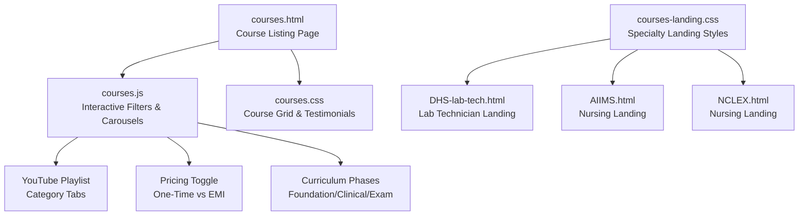
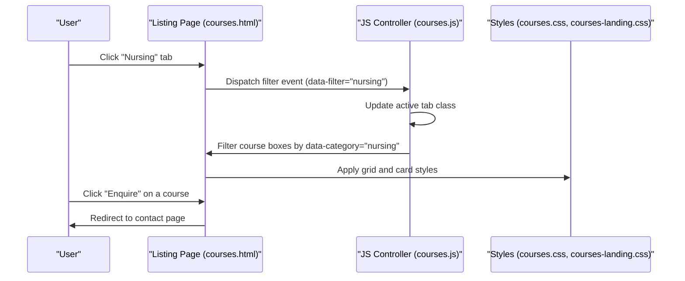
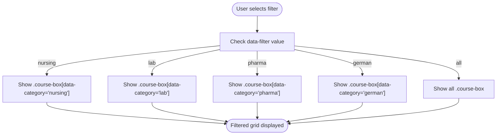
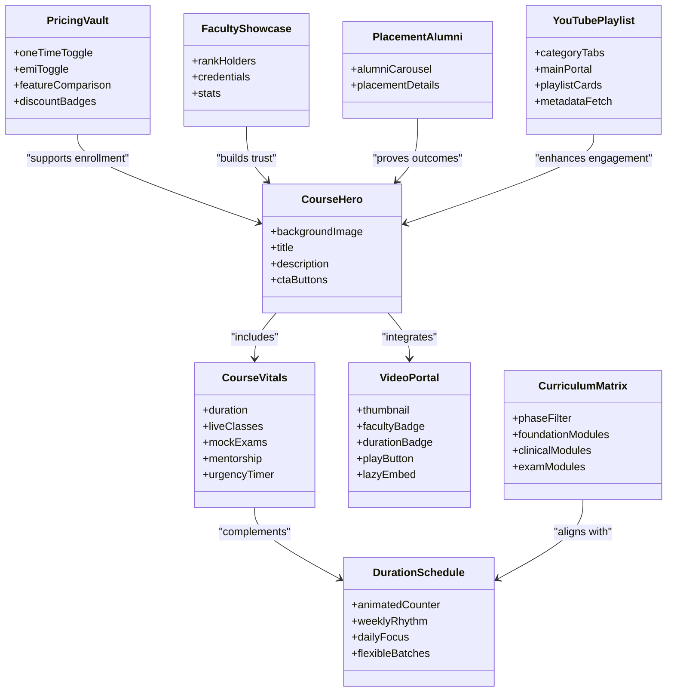
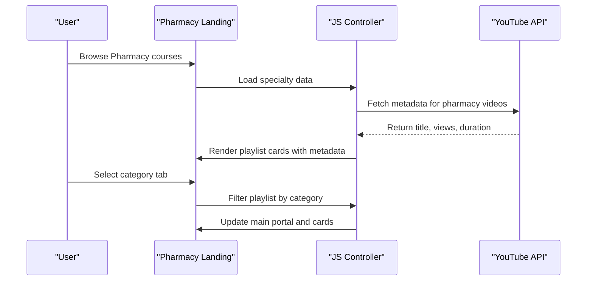
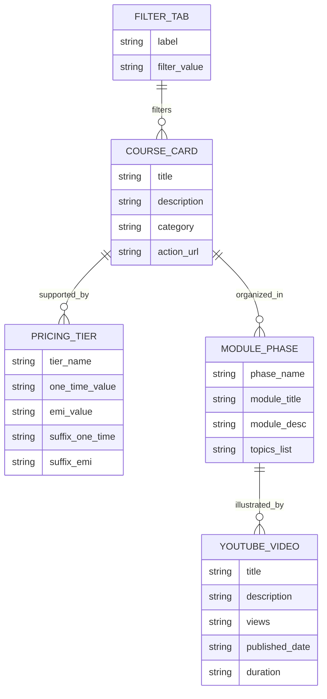
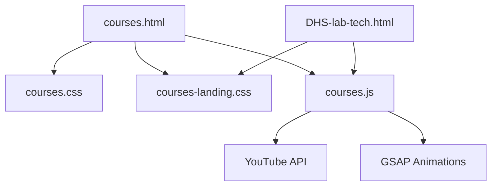

# Specialty Course Implementations

<cite>
**Referenced Files in This Document**
- [courses.html](file://courses.html)
- [courses.js](file://assets/js/courses.js)
- [courses.css](file://assets/css/courses.css)
- [courses-landing.css](file://assets/css/courses-landing.css)
- [DHS-lab-tech.html](file://courses/lab-tech/DHS-lab-tech.html)
- [AIIMS.html](file://courses/nursing/AIIMS.html)
- [NCLEX.html](file://courses/nursing/NCLEX.html)
</cite>

## Table of Contents
1. [Introduction](#introduction)
2. [Project Structure](#project-structure)
3. [Core Components](#core-components)
4. [Architecture Overview](#architecture-overview)
5. [Detailed Component Analysis](#detailed-component-analysis)
6. [Dependency Analysis](#dependency-analysis)
7. [Performance Considerations](#performance-considerations)
8. [Troubleshooting Guide](#troubleshooting-guide)
9. [Conclusion](#conclusion)

## Introduction
This document provides comprehensive technical documentation for specialty-specific course implementations across nursing, pharmacy, laboratory technician, and German language programs. It explains course data structures, specialized content layouts, and unique features for each specialty, along with course listing patterns, detailed course descriptions, pricing information display, and enrollment call-to-action elements. Examples include comprehensive nursing exam preparation courses, pharmacist certification programs, and German language courses tailored for healthcare professionals. The document also details specialty-specific navigation, course categorization, and content organization strategies.

## Project Structure
The course platform consists of:
- A centralized course listing page with specialty filters and course cards
- Specialty landing pages with detailed course content, curriculum, duration, pricing, and testimonials
- Shared styling for responsive layouts and glass-morphism effects
- JavaScript for interactive filtering, video carousels, pricing toggles, and dynamic content

**Diagram sources**
- [courses.html:80-608](file://courses.html#L80-L608)
- [courses.js:781-800](file://assets/js/courses.js#L781-L800)
- [courses.css:124-664](file://assets/css/courses.css#L124-L664)
- [courses-landing.css:88-550](file://assets/css/courses-landing.css#L88-L550)
- [DHS-lab-tech.html:31-132](file://courses/lab-tech/DHS-lab-tech.html#L31-L132)
- [AIIMS.html:1-1](file://courses/nursing/AIIMS.html#L1-L1)
- [NCLEX.html:1-1](file://courses/nursing/NCLEX.html#L1-L1)

**Section sources**
- [courses.html:1-967](file://courses.html#L1-L967)
- [courses.js:1-1408](file://assets/js/courses.js#L1-L1408)
- [courses.css:1-1238](file://assets/css/courses.css#L1-L1238)
- [courses-landing.css:1-2032](file://assets/css/courses-landing.css#L1-L2032)

## Core Components
This section outlines the primary components used across specialty course implementations:

- Course Grid and Filtering
  - Specialty tabs (All, Nursing, Lab Technician, Pharmacist, German Language)
  - Course cards with image, title, description, and "Enquire" action
  - Category-based filtering via data attributes and JavaScript

- Specialty Landing Pages
  - Hero section with background imagery and CTA buttons
  - Course vitals dashboard with urgency indicators
  - Video masterclass portal with lazy-loaded YouTube embeds
  - Interactive curriculum matrix with phase-based modules
  - Duration and schedule cards with animated counters
  - Pricing vault with one-time and EMI toggle
  - Faculty showcase and placement alumni carousel
  - YouTube category tabs with dynamic playlists

- Styling and Responsiveness
  - Glass-morphism cards with hover effects and glows
  - Responsive grids and sticky sections for optimal viewing
  - Theme blending and gradient overlays for depth

**Section sources**
- [courses.html:80-608](file://courses.html#L80-L608)
- [courses.js:781-800](file://assets/js/courses.js#L781-L800)
- [courses.css:124-664](file://assets/css/courses.css#L124-L664)
- [courses-landing.css:88-550](file://assets/css/courses-landing.css#L88-L550)

## Architecture Overview
The course platform follows a modular architecture:
- Listing page aggregates all specialties and enables filtering
- Specialty landing pages encapsulate detailed course information
- JavaScript handles dynamic interactions (filters, pricing, videos)
- CSS provides reusable styles for consistent layouts across specialities

**Diagram sources**
- [courses.html:80-105](file://courses.html#L80-L105)
- [courses.js:781-800](file://assets/js/courses.js#L781-L800)
- [courses.css:124-252](file://assets/css/courses.css#L124-L252)

## Detailed Component Analysis

### Course Listing and Filtering
The listing page provides a unified interface for browsing specialty courses:
- Filter Tabs: "All Specialties", "Nursing", "Lab Technician", "Pharmacist", "German Language"
- Course Grid: Responsive grid of course cards with category data attributes
- Footer Elements: Price display set to "View Details" and "Enquire" actions

Implementation highlights:
- Tab buttons use data-filter attributes to control visibility
- Course boxes use data-category attributes for filtering
- JavaScript toggles active states and animates grid transitions

**Diagram sources**
- [courses.html:80-105](file://courses.html#L80-L105)
- [courses.js:781-800](file://assets/js/courses.js#L781-L800)

**Section sources**
- [courses.html:80-608](file://courses.html#L80-L608)
- [courses.js:781-800](file://assets/js/courses.js#L781-L800)

### Specialty Landing Pages: Nursing
Nursing specialty landing pages demonstrate advanced content organization:
- Hero Section: Background imagery, course title, description, and CTA buttons
- Course Vitals: Duration, live classes, mock exams, mentorship with urgency indicators
- Video Masterclass Portal: Lazy-loaded YouTube embeds with cinematic UI
- Curriculum Matrix: Phase-based modules (Foundations, Clinical Core, Exam Mastery)
- Duration & Schedule: Animated month counter and flexible batch options
- Pricing Vault: One-time vs EMI toggle with feature comparisons
- Faculty & Placements: Showcased mentors and alumni outcomes
- YouTube Category Tabs: Dynamic playlists filtered by specialty

**Diagram sources**
- [DHS-lab-tech.html:31-132](file://courses/lab-tech/DHS-lab-tech.html#L31-L132)
- [DHS-lab-tech.html:136-188](file://courses/lab-tech/DHS-lab-tech.html#L136-L188)
- [DHS-lab-tech.html:190-345](file://courses/lab-tech/DHS-lab-tech.html#L190-L345)
- [DHS-lab-tech.html:347-414](file://courses/lab-tech/DHS-lab-tech.html#L347-L414)
- [DHS-lab-tech.html:416-509](file://courses/lab-tech/DHS-lab-tech.html#L416-L509)
- [DHS-lab-tech.html:511-715](file://courses/lab-tech/DHS-lab-tech.html#L511-L715)
- [DHS-lab-tech.html:717-760](file://courses/lab-tech/DHS-lab-tech.html#L717-L760)

**Section sources**
- [DHS-lab-tech.html:31-760](file://courses/lab-tech/DHS-lab-tech.html#L31-L760)
- [courses-landing.css:88-550](file://assets/css/courses-landing.css#L88-L550)

### Specialty Landing Pages: Pharmacy
Pharmacy specialty landing pages mirror the nursing structure with subject-specific emphasis:
- Hero Section: Background imagery aligned with pharmaceutical themes
- Course Vitals: Duration, live classes, mock exams, mentorship
- Video Masterclass Portal: Subject-focused masterclasses
- Curriculum Matrix: Modules covering pharmacology, therapeutics, and regulatory exams
- Duration & Schedule: Flexible batch options for working professionals
- Pricing Vault: Tiered plans with feature differentiation
- Faculty & Placements: Mentors with pharmacy-specific credentials
- YouTube Category Tabs: Pharmacy-focused playlists

**Diagram sources**
- [courses.js:645-689](file://assets/js/courses.js#L645-L689)
- [courses.js:708-776](file://assets/js/courses.js#L708-L776)

**Section sources**
- [courses.js:645-689](file://assets/js/courses.js#L645-L689)
- [courses.js:708-776](file://assets/js/courses.js#L708-L776)

### Specialty Landing Pages: Laboratory Technician
Laboratory Technician landing pages emphasize practical and technical training:
- Hero Section: Medical lab imagery and course overview
- Course Vitals: Practical hours, hands-on training, certification pathways
- Video Masterclass Portal: Demonstrations of lab techniques and protocols
- Curriculum Matrix: Modules on hematology, chemistry, microbiology, and instrumentation
- Duration & Schedule: Intensive short-term batches for quick skill acquisition
- Pricing Vault: Plans tailored to lab assistant and superintendent roles
- Faculty & Placements: Experienced lab professionals and placement outcomes
- YouTube Category Tabs: Lab-specific tutorial playlists

**Section sources**
- [DHS-lab-tech.html:31-132](file://courses/lab-tech/DHS-lab-tech.html#L31-L132)
- [DHS-lab-tech.html:190-345](file://courses/lab-tech/DHS-lab-tech.html#L190-L345)
- [DHS-lab-tech.html:416-509](file://courses/lab-tech/DHS-lab-tech.html#L416-L509)

### Specialty Landing Pages: German Language
German language courses for healthcare professionals integrate linguistic and cultural competencies:
- Hero Section: International imagery and healthcare-focused messaging
- Course Vitals: Intensive language modules, cultural adaptation, and certification alignment
- Video Masterclass Portal: Conversational practice and medical terminology
- Curriculum Matrix: A1-B1 fast track, B2 specialization, and nursing adaptation pathways
- Duration & Schedule: Accelerated schedules for career mobility
- Pricing Vault: Flexible payment options for international learners
- Faculty & Placements: Multilingual instructors and global placement stories
- YouTube Category Tabs: Healthcare German playlists

**Section sources**
- [courses.html:561-606](file://courses.html#L561-L606)
- [courses.js:684-688](file://assets/js/courses.js#L684-L688)

### Course Data Structures and Organization
Course listings and specialty pages rely on consistent data structures:
- Course Cards: Title, description, category, and "Enquire" action
- Specialty Filters: Tab buttons mapped to category values
- Pricing Data: One-time and EMI values with suffixes for display
- Curriculum Modules: Phase-based structure with topic lists
- YouTube Metadata: Title, description, view count, publish date, duration

**Diagram sources**
- [courses.html:80-608](file://courses.html#L80-L608)
- [courses.js:302-361](file://assets/js/courses.js#L302-L361)
- [courses.js:645-689](file://assets/js/courses.js#L645-L689)

**Section sources**
- [courses.html:80-608](file://courses.html#L80-L608)
- [courses.js:302-361](file://assets/js/courses.js#L302-L361)
- [courses.js:645-689](file://assets/js/courses.js#L645-L689)

### Navigation and Content Organization Strategies
Navigation and organization strategies ensure seamless user experiences:
- Specialty Navigation: Tab-based filtering on the listing page
- Course Categorization: Category attributes enable targeted filtering
- Content Organization: Landing pages follow a consistent sequence: Hero → Vitals → Video → Curriculum → Duration → Pricing → Faculty → Placements → YouTube
- Responsive Design: Grids and sticky sections adapt to various screen sizes
- Interactive Elements: Hover effects, animations, and transitions enhance engagement

**Section sources**
- [courses.html:80-105](file://courses.html#L80-L105)
- [courses.css:124-252](file://assets/css/courses.css#L124-L252)
- [courses-landing.css:88-550](file://assets/css/courses-landing.css#L88-L550)

## Dependency Analysis
The course platform exhibits clear separation of concerns:
- HTML defines structure and semantic markup
- CSS provides styling and responsive behavior
- JavaScript orchestrates interactivity and dynamic content
- Specialty landing pages depend on shared styles and scripts

**Diagram sources**
- [courses.html:1-967](file://courses.html#L1-L967)
- [courses.js:1-1408](file://assets/js/courses.js#L1-L1408)
- [courses.css:1-1238](file://assets/css/courses.css#L1-L1238)
- [courses-landing.css:1-2032](file://assets/css/courses-landing.css#L1-L2032)

**Section sources**
- [courses.html:1-967](file://courses.html#L1-L967)
- [courses.js:1-1408](file://assets/js/courses.js#L1-L1408)
- [courses.css:1-1238](file://assets/css/courses.css#L1-L1238)
- [courses-landing.css:1-2032](file://assets/css/courses-landing.css#L1-L2032)

## Performance Considerations
- Lazy Loading: YouTube thumbnails and iframes improve initial load times
- CSS Animations: Efficient use of transforms and opacity for smooth transitions
- JavaScript Optimization: Event delegation and selective DOM updates minimize reflows
- Responsive Images: Proper sizing and compression reduce bandwidth usage
- Minimal Third-Party Dependencies: Core functionality relies on native APIs and lightweight libraries

## Troubleshooting Guide
Common issues and resolutions:
- YouTube API Key: Ensure a valid API key is configured for metadata fetching; otherwise, fallback to static attributes
- Filter Not Working: Verify data-filter and data-category attributes match tab values
- Pricing Toggle: Confirm data attributes for one-time and EMI values are present
- Video Portal: Check data-yt-id attribute and lazy-load logic for iframe injection
- Mobile Responsiveness: Validate media queries and grid configurations for smaller screens

**Section sources**
- [courses.js:457-529](file://assets/js/courses.js#L457-L529)
- [courses.js:134-166](file://assets/js/courses.js#L134-L166)
- [courses.js:302-361](file://assets/js/courses.js#L302-L361)

## Conclusion
The specialty course implementations leverage a cohesive architecture combining HTML structure, CSS styling, and JavaScript interactivity. Specialty-specific landing pages deliver comprehensive content through organized sections, while the listing page provides efficient discovery via filtering. Consistent data structures and responsive designs ensure scalability and maintainability across nursing, pharmacy, laboratory technician, and German language programs.