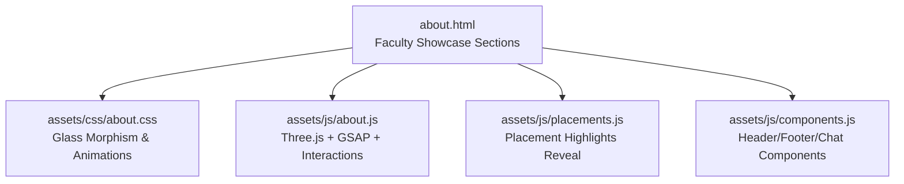
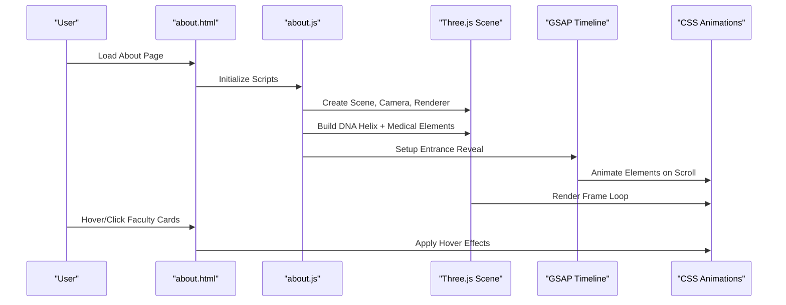
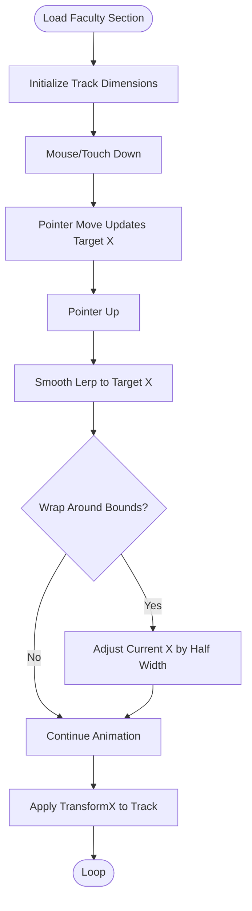
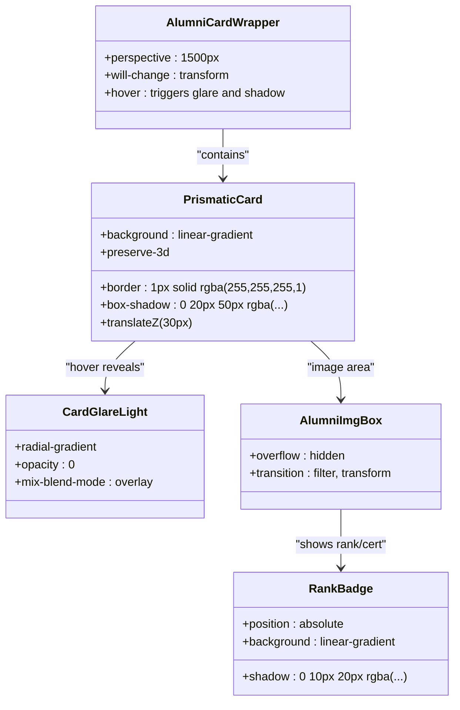
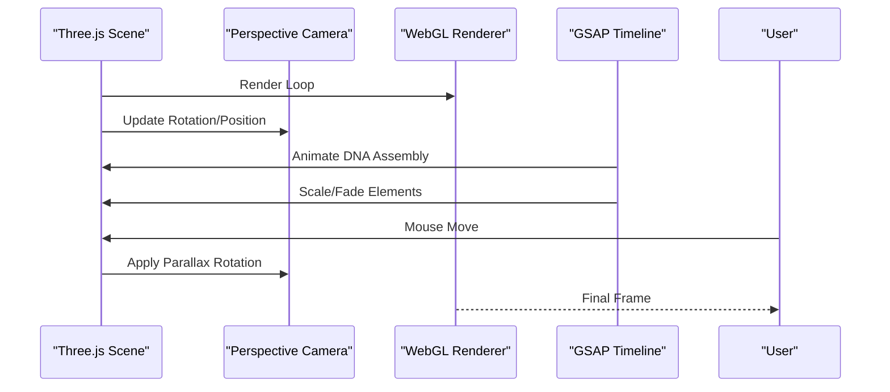
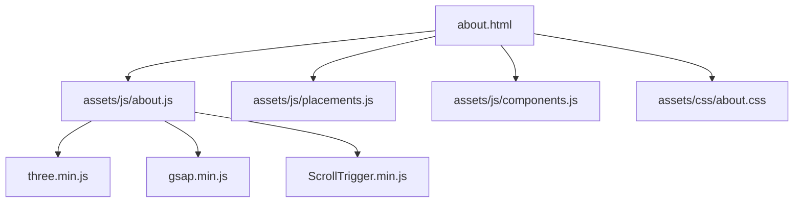

# Faculty Profile System

<cite>
**Referenced Files in This Document**
- [about.html](file://about.html)
- [about.css](file://assets/css/about.css)
- [about.js](file://assets/js/about.js)
- [placements.js](file://assets/js/placements.js)
- [components.js](file://assets/js/components.js)
</cite>

## Table of Contents
1. [Introduction](#introduction)
2. [Project Structure](#project-structure)
3. [Core Components](#core-components)
4. [Architecture Overview](#architecture-overview)
5. [Detailed Component Analysis](#detailed-component-analysis)
6. [Dependency Analysis](#dependency-analysis)
7. [Performance Considerations](#performance-considerations)
8. [Troubleshooting Guide](#troubleshooting-guide)
9. [Conclusion](#conclusion)

## Introduction
This document describes the Eduooz faculty profile system implemented in the About page. It covers the faculty showcase presentation, including expert faculty member profiles, international certification displays, and achievement highlighting. It documents the filmstrip carousel design for faculty members, prismatic card animations with hover effects, and responsive grid layouts. It also outlines the data structure requirements for faculty profiles, provides examples of HTML markup, CSS styling for glass morphism effects, and JavaScript interactions for carousel functionality. Additionally, it explains the integration with three.js background elements and GSAP animations for entrance effects, the badge system for displaying faculty affiliations and achievements, and responsive design patterns for mobile optimization.

## Project Structure
The faculty showcase is primarily implemented in the About page with supporting styles and scripts:
- HTML: Faculty showcase sections are embedded in the About page.
- CSS: Glass morphism, prismatic cards, filmstrip carousel, and responsive grids are styled here.
- JavaScript: Three.js background, GSAP animations, and interactive behaviors are handled here.

**Diagram sources**
- [about.html](file://about.html)
- [about.css](file://assets/css/about.css)
- [about.js](file://assets/js/about.js)
- [placements.js](file://assets/js/placements.js)
- [components.js](file://assets/js/components.js)

**Section sources**
- [about.html](file://about.html)
- [about.css](file://assets/css/about.css)
- [about.js](file://assets/js/about.js)
- [placements.js](file://assets/js/placements.js)
- [components.js](file://assets/js/components.js)

## Core Components
- Filmstrip Carousel for faculty profiles with draggable behavior and animated reveals.
- Prismatic card grid showcasing expert faculty with hover effects and glass morphism.
- Three.js animated background with DNA helix and floating medical elements.
- GSAP entrance animations and scroll-triggered reveals.
- Badge system for certifications, ranks, and international credentials.

**Section sources**
- [about.html](file://about.html)
- [about.css](file://assets/css/about.css)
- [about.js](file://assets/js/about.js)

## Architecture Overview
The faculty showcase integrates several technologies:
- HTML markup defines the structure for faculty cards and showcases.
- CSS applies glass morphism, gradients, and responsive layouts.
- JavaScript initializes Three.js scenes, animates with GSAP, and manages interactivity.

**Diagram sources**
- [about.html](file://about.html)
- [about.js](file://assets/js/about.js)
- [about.css](file://assets/css/about.css)

## Detailed Component Analysis

### Filmstrip Carousel for Faculty Members
The filmstrip carousel presents faculty profiles with a draggable interface and animated reveals. It uses a flex container with dynamic width and seamless transitions.

Key features:
- Draggable track with mouse/touch support.
- Animated reveals on scroll.
- Hover and focus states expand details with glass morphism overlays.
- Responsive sizing for tablets and desktops.

**Diagram sources**
- [about.html](file://about.html)
- [about.css](file://assets/css/about.css)

**Section sources**
- [about.html](file://about.html)
- [about.css](file://assets/css/about.css)

### Prismatic Card Grid with Hover Effects
The prismatic card grid showcases expert faculty with:
- Glass morphism background and simulated frosted texture.
- Hover glare effect with blend modes for iridescent sheen.
- 3D depth with translateZ pushes content forward.
- Rank badges and achievement highlights.

Responsive behavior:
- On mobile, 3D transforms are disabled for readability.
- Grid switches to single-column layout.

**Diagram sources**
- [about.html](file://about.html)
- [about.css](file://assets/css/about.css)

**Section sources**
- [about.html](file://about.html)
- [about.css](file://assets/css/about.css)

### Three.js Background Elements and GSAP Animations
The About page features a sophisticated three.js background with:
- DNA helix assembly animation using GSAP.
- Floating medical elements (cross, capsule, test tube, stethoscope).
- Mouse parallax and responsive positioning.
- Fog and lighting for realistic glass refraction.

Entrance effects:
- GSAP timelines orchestrate text reveals and section entrances.
- Scroll-triggered reveals enhance storytelling.

**Diagram sources**
- [about.js](file://assets/js/about.js)
- [about.css](file://assets/css/about.css)

**Section sources**
- [about.js](file://assets/js/about.js)
- [about.css](file://assets/css/about.css)

### Badge System for Certifications and Achievements
Badges are used extensively to highlight:
- International credentials (e.g., DHA, HAAD, NCLEX).
- Academic ranks (e.g., Rank 1, Rank 4).
- Specializations and achievements.

Implementation:
- Inline badges with color-coded backgrounds.
- Hover states and subtle glows for emphasis.
- Consistent typography and spacing.

**Section sources**
- [about.html](file://about.html)
- [about.css](file://assets/css/about.css)

### Data Structure Requirements for Faculty Profiles
Each faculty profile requires the following fields:
- Name: Displayed prominently in the overlay.
- Specialization: Role or subject area.
- Certifications/Ranks: Visible badges and highlights.
- International Credentials: Badge indicators for global exams.
- Achievement Highlights: Short descriptive text about notable accomplishments.

Example structure (conceptual):
- name: string
- role: string
- image: string (URL or asset path)
- badges: string[]
- achievements: string[]
- internationalCredentials: string[]

Mapping to HTML/CSS:
- Name and role map to `.fac-name` and `.fac-role`.
- Badges map to `.fac-badge` and `.rank-badge`.
- Achievements map to `.placement-dest` content.

**Section sources**
- [about.html](file://about.html)
- [about.css](file://assets/css/about.css)

### HTML Markup Examples for Faculty Cards
- Filmstrip card structure includes portrait image, glass panel, visible header with badge/name, and hidden details grid.
- Prismatic card structure includes image box, overlay text, rank badge, and achievement panel.

Reference paths:
- [Filmstrip Card Markup:543-555](file://about.html#L543-L555)
- [Prismatic Card Markup:646-667](file://about.html#L646-L667)

**Section sources**
- [about.html](file://about.html)

### CSS Styling for Glass Morphism Effects
Key selectors and properties:
- Glass morphism: `backdrop-filter`, `background`, `border`, `box-shadow`.
- Prismatic glare: `radial-gradient`, `mix-blend-mode`, `opacity` transitions.
- Filmstrip details: `grid-template-rows`, `opacity`, `transform` for smooth expansion.
- Responsive adjustments: media queries for tablet/desktop/mobile.

Reference paths:
- [Filmstrip Styles:1589-1651](file://assets/css/about.css#L1589-L1651)
- [Prismatic Card Styles:1709-1844](file://assets/css/about.css#L1709-L1844)
- [Glass Morphism Utilities:1740-1784](file://assets/css/about.css#L1740-L1784)

**Section sources**
- [about.css](file://assets/css/about.css)

### JavaScript Interactions for Carousel and Animations
- Filmstrip drag: measures track width, calculates half-width, updates transformX with lerp, wraps around bounds.
- Hover/focus: scales cards, adjusts filters, expands hidden details.
- Three.js: builds DNA helix, adds colored rungs, floats medical elements, applies fog/lighting, responds to mouse movement.
- GSAP: entrance reveals, scroll-triggered animations, timeline sequencing.

Reference paths:
- [Filmstrip Drag Logic:135-211](file://assets/js/about.js#L135-L211)
- [Three.js Assembly:203-492](file://assets/js/about.js#L203-L492)
- [GSAP Reveal:35-48](file://assets/js/about.js#L35-L48)
- [Placement Reveal:123-135](file://assets/js/placements.js#L123-L135)

**Section sources**
- [about.js](file://assets/js/about.js)
- [placements.js](file://assets/js/placements.js)

## Dependency Analysis
The faculty showcase depends on:
- Three.js for 3D background elements.
- GSAP for smooth animations and scroll-triggered effects.
- Local CSS for glass morphism and responsive layouts.
- Component loader for modular header/footer/chat.

**Diagram sources**
- [about.html](file://about.html)
- [about.js](file://assets/js/about.js)
- [placements.js](file://assets/js/placements.js)
- [components.js](file://assets/js/components.js)
- [about.css](file://assets/css/about.css)

**Section sources**
- [about.html](file://about.html)
- [about.js](file://assets/js/about.js)
- [placements.js](file://assets/js/placements.js)
- [components.js](file://assets/js/components.js)
- [about.css](file://assets/css/about.css)

## Performance Considerations
- Three.js rendering is paused when off-screen to conserve resources.
- CSS transforms and will-change optimize GPU acceleration for animations.
- GSAP scroll-triggered animations throttle updates and use efficient easing.
- Media queries reduce complexity on mobile devices (e.g., disabling 3D transforms).

[No sources needed since this section provides general guidance]

## Troubleshooting Guide
Common issues and resolutions:
- Three.js not rendering: Verify CDN availability and script loading order.
- GSAP scroll-trigger not firing: Ensure ScrollTrigger is loaded and initialized after DOM content.
- Filmstrip not draggable: Confirm event listeners are attached and pointer events are enabled.
- Glass morphism not visible: Check backdrop-filter support and ensure parent containers have sufficient contrast.

**Section sources**
- [about.js](file://assets/js/about.js)
- [placements.js](file://assets/js/placements.js)

## Conclusion
The Eduooz faculty profile system combines modern web technologies to deliver an immersive, responsive, and visually rich showcase of expert faculty. The filmstrip carousel, prismatic cards, and three.js background create a cohesive narrative, while GSAP animations and glass morphism effects elevate the user experience. The badge system and responsive design ensure accessibility and clarity across devices.