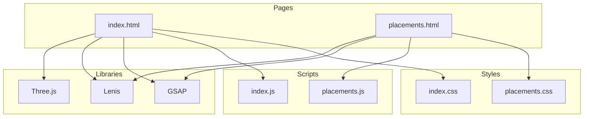
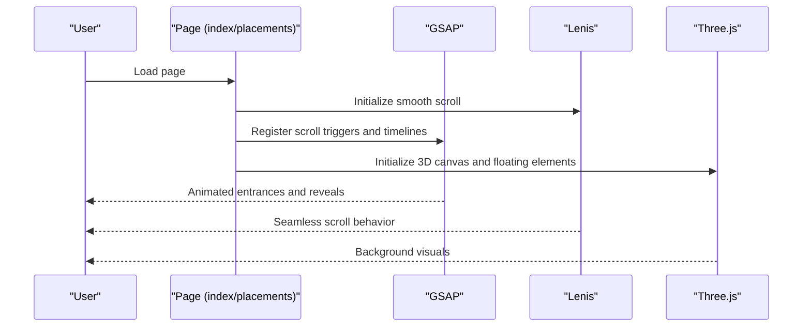
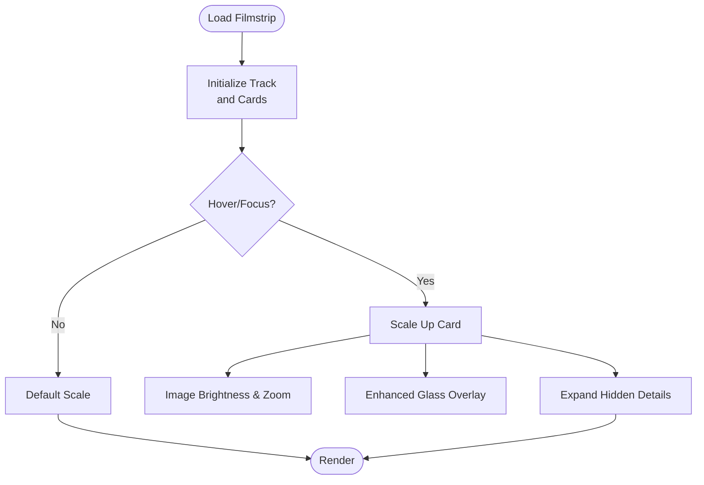
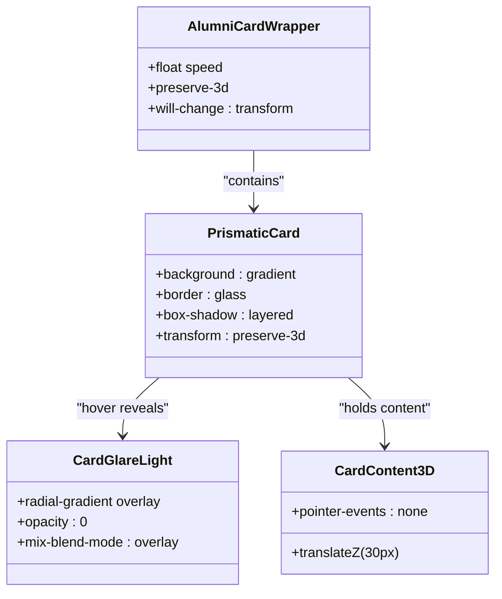
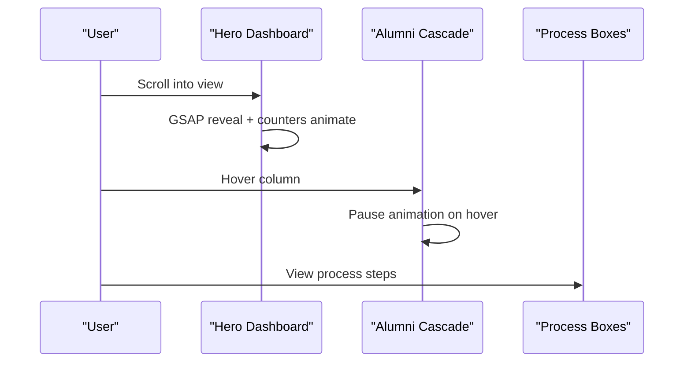
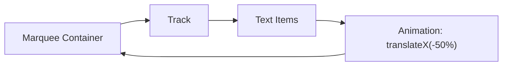
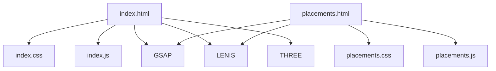

# Faculty and Placement Showcase

<cite>
**Referenced Files in This Document**
- [placements.html](file://placements.html)
- [placements.js](file://assets/js/placements.js)
- [placements.css](file://assets/css/placements.css)
- [index.html](file://index.html)
- [index.js](file://assets/js/index.js)
- [index.css](file://assets/css/index.css)
</cite>

## Table of Contents
1. [Introduction](#introduction)
2. [Project Structure](#project-structure)
3. [Core Components](#core-components)
4. [Architecture Overview](#architecture-overview)
5. [Detailed Component Analysis](#detailed-component-analysis)
6. [Dependency Analysis](#dependency-analysis)
7. [Performance Considerations](#performance-considerations)
8. [Troubleshooting Guide](#troubleshooting-guide)
9. [Conclusion](#conclusion)

## Introduction
This document explains the Eduooz faculty profiles and placement results showcase system. It covers how faculty members are presented with expert credentials and achievements, how placement statistics and alumni success stories are visualized, and how interactive UI elements like the filmstrip carousel, prismatic cards, and marquee effects are implemented. It also documents responsive design strategies, visual design elements (glass morphism, gradients, hover states), and integration points with placement tracking systems.

## Project Structure
The showcase spans two primary pages:
- Faculty and placement highlights: [index.html](file://index.html) and [index.css](file://assets/css/index.css)
- Dedicated placement dashboard: [placements.html](file://placements.html) and [placements.css](file://assets/css/placements.css)

Both pages share common libraries (GSAP, Lenis, Three.js) and rely on modular JavaScript for animations and interactions.

**Diagram sources**
- [index.html:1-25](file://index.html#L1-L25)
- [placements.html:1-20](file://placements.html#L1-L20)
- [index.js:1-57](file://assets/js/index.js#L1-L57)
- [placements.js:1-33](file://assets/js/placements.js#L1-L33)
- [index.css:1-24](file://assets/css/index.css#L1-L24)
- [placements.css:1-14](file://assets/css/placements.css#L1-L14)

**Section sources**
- [index.html:1-25](file://index.html#L1-L25)
- [placements.html:1-20](file://placements.html#L1-L20)

## Core Components
- Faculty showcase carousel (filmstrip): Presents expert faculty with badges, names, roles, and placement destinations.
- Prismatic card grid: Highlights faculty achievements with glass morphism, gradient overlays, and interactive hover states.
- Placement dashboard: Live statistics, alumni wall with infinite cascade, and process explanation.
- Marquee scrolling: Branding and typographic rivers for visual continuity.

Key implementation references:
- Filmstrip carousel: [index.html:571-658](file://index.html#L571-L658), [index.css:2517-2622](file://assets/css/index.css#L2517-L2622)
- Prismatic cards: [index.html:661-766](file://index.html#L661-L766), [index.css:2674-2800](file://assets/css/index.css#L2674-L2800)
- Placement dashboard: [placements.html:31-215](file://placements.html#L31-L215), [placements.css:108-262](file://assets/css/placements.css#L108-L262)
- Infinite marquee: [index.css:918-961](file://assets/css/index.css#L918-L961), [index.css:2650-2673](file://assets/css/index.css#L2650-L2673)

**Section sources**
- [index.html:571-766](file://index.html#L571-L766)
- [placements.html:31-215](file://placements.html#L31-L215)
- [index.css:2517-2800](file://assets/css/index.css#L2517-L2800)
- [placements.css:108-262](file://assets/css/placements.css#L108-L262)

## Architecture Overview
The showcase leverages:
- GSAP timelines for entrance and reveal animations
- Lenis for smooth scrolling integration
- Three.js for immersive background elements
- CSS grid, flexbox, and custom animations for layout and motion

**Diagram sources**
- [index.js:22-57](file://assets/js/index.js#L22-L57)
- [placements.js:3-33](file://assets/js/placements.js#L3-L33)
- [index.css:131-140](file://assets/css/index.css#L131-L140)

**Section sources**
- [index.js:1-120](file://assets/js/index.js#L1-L120)
- [placements.js:1-33](file://assets/js/placements.js#L1-L33)

## Detailed Component Analysis

### Faculty Filmstrip Carousel
The filmstrip presents faculty profiles in a horizontally scrollable, draggable strip. Each card includes:
- Portrait image with grayscale/brightness transitions on hover
- Glass panel overlay with badge, name, role, and description
- Smooth scaling and elevation on focus

**Diagram sources**
- [index.html:2556-2617](file://index.html#L2556-L2617)
- [index.css:2538-2617](file://assets/css/index.css#L2538-L2617)

**Section sources**
- [index.html:2556-2617](file://index.html#L2556-L2617)
- [index.css:2538-2617](file://assets/css/index.css#L2538-L2617)

### Prismatic Card Grid (Faculty Achievements)
The prismatic card grid showcases faculty with:
- Glass morphism surfaces and simulated frosted textures
- Gradient overlays and iridescent glare on hover
- 3D depth via transform and preserve-3d
- Parallax wrappers to avoid hover jitter

**Diagram sources**
- [index.html:687-761](file://index.html#L687-L761)
- [index.css:2674-2800](file://assets/css/index.css#L2674-L2800)

**Section sources**
- [index.html:687-761](file://index.html#L687-L761)
- [index.css:2674-2800](file://assets/css/index.css#L2674-L2800)

### Placement Dashboard and Alumni Cascade
The placement dashboard includes:
- Hero section with live statistics counters
- Infinite alumni cascade with three synchronized columns
- Process explanation boxes with glow effects

**Diagram sources**
- [placements.html:31-215](file://placements.html#L31-L215)
- [placements.css:108-262](file://assets/css/placements.css#L108-L262)
- [placements.js:123-174](file://assets/js/placements.js#L123-L174)

**Section sources**
- [placements.html:31-215](file://placements.html#L31-L215)
- [placements.css:108-262](file://assets/css/placements.css#L108-L262)
- [placements.js:123-174](file://assets/js/placements.js#L123-L174)

### Marquee Scrolling Effects
Two marquee implementations:
- Branding strip for continuous text flow
- Typographic rivers behind prismatic cards for depth

**Diagram sources**
- [index.css:918-961](file://assets/css/index.css#L918-L961)
- [index.css:2650-2673](file://assets/css/index.css#L2650-L2673)

**Section sources**
- [index.css:918-961](file://assets/css/index.css#L918-L961)
- [index.css:2650-2673](file://assets/css/index.css#L2650-L2673)

### Data Structures and Examples
Representative data structures used across the showcase:

- Faculty profile
  - Fields: portrait image, name, role, description, badge, rank badge, overlay text
  - Example references:
    - [index.html:586-654](file://index.html#L586-L654)
    - [index.html:694-731](file://index.html#L694-L731)

- Placement statistics
  - Fields: countries reached, alumni placed, hiring partners, placement rate
  - Example references:
    - [placements.html:63-91](file://placements.html#L63-L91)
    - [placements.js:137-174](file://assets/js/placements.js#L137-L174)

- Alumni achievement card
  - Fields: image, institution badge, name, role, description
  - Example references:
    - [placements.html:112-162](file://placements.html#L112-L162)
    - [placements.html:168-184](file://placements.html#L168-L184)

**Section sources**
- [index.html:586-731](file://index.html#L586-L731)
- [placements.html:63-184](file://placements.html#L63-L184)
- [placements.js:137-174](file://assets/js/placements.js#L137-L174)

## Dependency Analysis
- Page-level dependencies:
  - Both pages import GSAP, Lenis, and Three.js for animations and smooth scrolling.
  - Stylesheets define shared design tokens and responsive grids.
- Component-level dependencies:
  - Filmstrip carousel depends on CSS grid/flex and hover-triggered transforms.
  - Prismatic cards depend on gradient overlays and mixed blend modes.
  - Placement dashboard depends on GSAP ScrollTrigger for counters and reveals.

**Diagram sources**
- [index.html:1-24](file://index.html#L1-L24)
- [placements.html:1-19](file://placements.html#L1-L19)
- [index.js:1-21](file://assets/js/index.js#L1-L21)
- [placements.js:1-16](file://assets/js/placements.js#L1-L16)

**Section sources**
- [index.html:1-24](file://index.html#L1-L24)
- [placements.html:1-19](file://placements.html#L1-L19)
- [index.js:1-21](file://assets/js/index.js#L1-L21)
- [placements.js:1-16](file://assets/js/placements.js#L1-L16)

## Performance Considerations
- GPU acceleration: Use will-change and transform-style to offload animations to GPU.
- Backdrop filters: Prefer gradient-based frosted textures for prismatic cards to avoid expensive blur recomputation.
- Scroll performance: Lenis integrates with GSAP ScrollTrigger to reduce jank during scroll-driven animations.
- Three.js optimization: Defer heavy WebGL initialization and use intersection observers to pause rendering when offscreen.

[No sources needed since this section provides general guidance]

## Troubleshooting Guide
Common issues and resolutions:
- Lenis not initializing: Verify external script loads and check console warnings.
  - Reference: [placements.js:4-8](file://assets/js/placements.js#L4-L8)
- GSAP ScrollTrigger not firing: Ensure targets exist in DOM and ScrollTrigger is registered.
  - Reference: [placements.js:123-135](file://assets/js/placements.js#L123-L135)
- Three.js canvas not rendering: Confirm container exists and resize handler is invoked.
  - Reference: [index.js:414-432](file://assets/js/index.js#L414-L432)
- Counters not animating: Validate data-target attributes and ScrollTrigger triggers.
  - Reference: [placements.js:137-174](file://assets/js/placements.js#L137-L174)

**Section sources**
- [placements.js:4-8](file://assets/js/placements.js#L4-L8)
- [placements.js:123-174](file://assets/js/placements.js#L123-L174)
- [index.js:414-432](file://assets/js/index.js#L414-L432)

## Conclusion
The Eduooz faculty and placement showcase combines immersive animations, glass morphism design, and responsive layouts to present expert faculty and global placement outcomes. The filmstrip carousel, prismatic cards, and placement dashboard leverage modern web technologies to deliver a polished, high-performance user experience across devices.