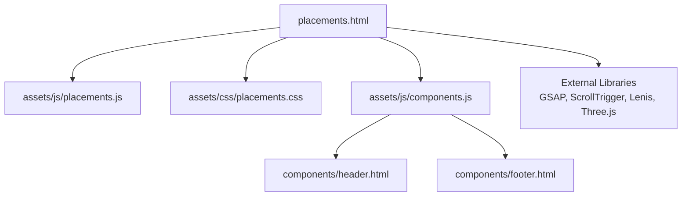
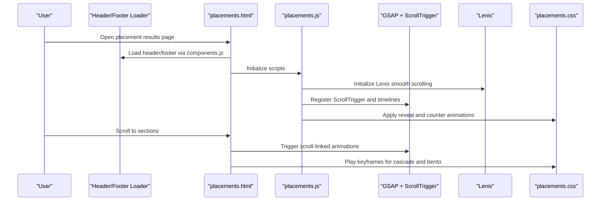
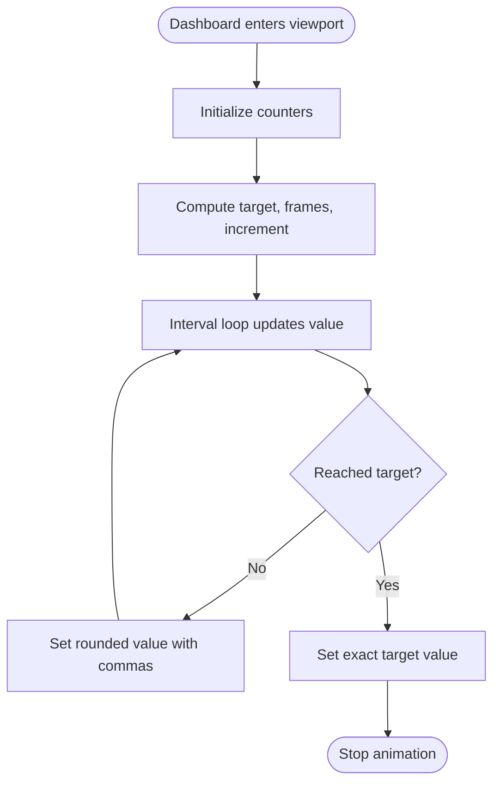
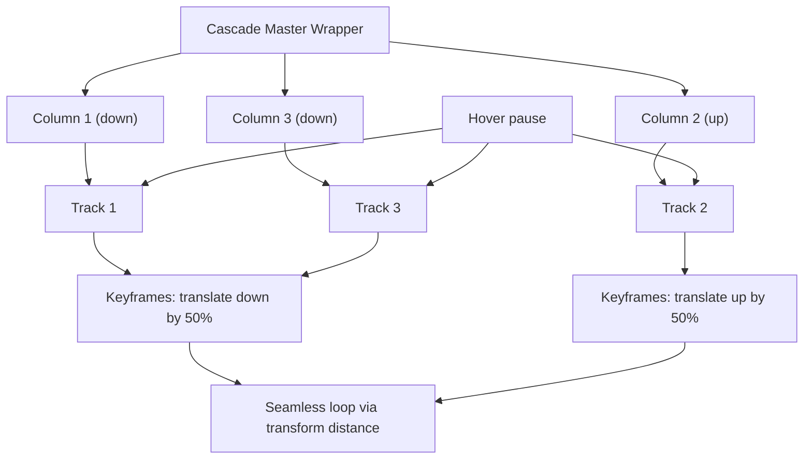
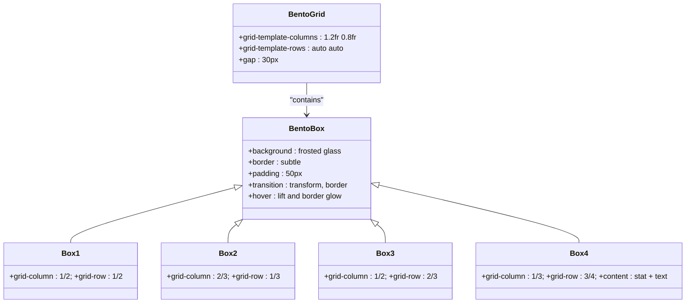
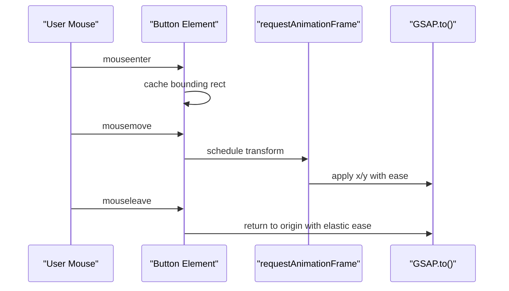
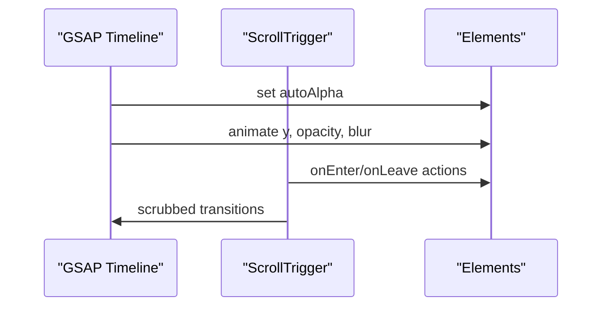
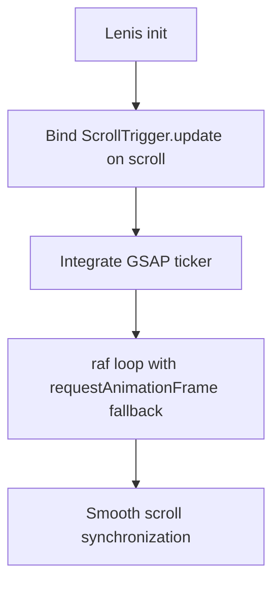
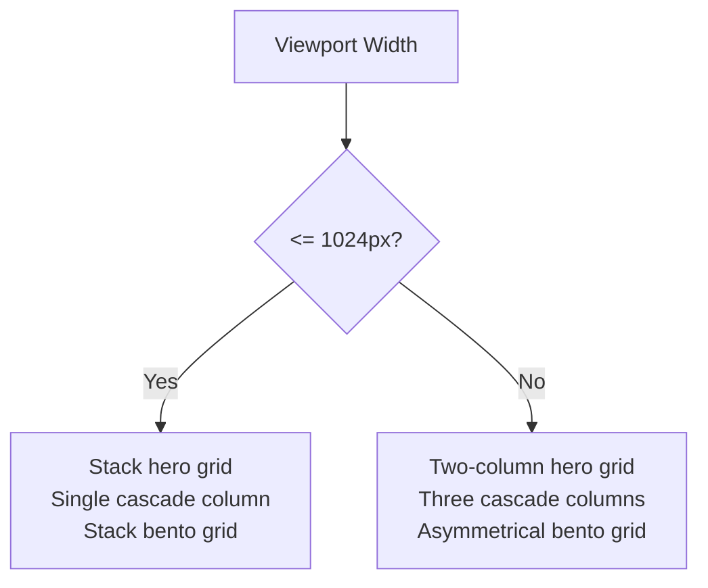
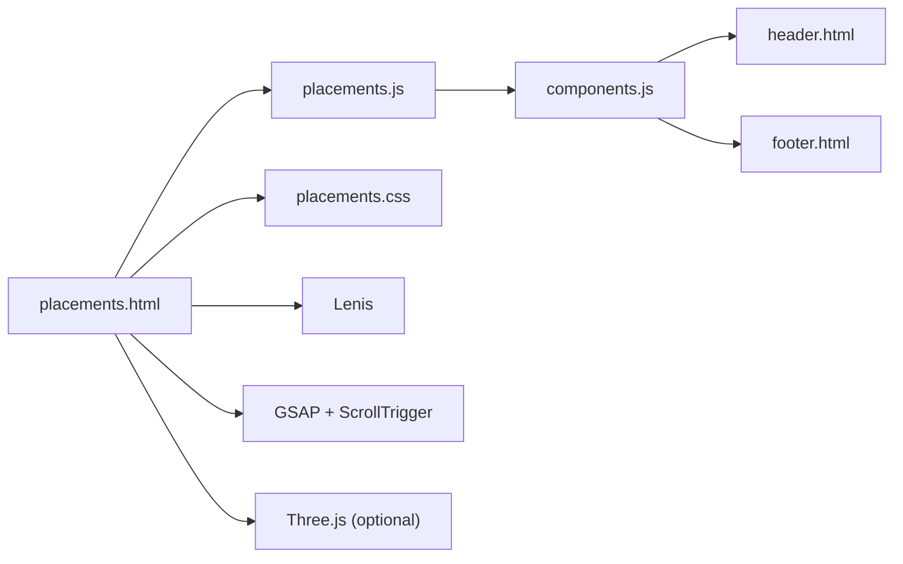

# Placement Results Showcase

<cite>
**Referenced Files in This Document**
- [placements.html](file://placements.html)
- [placements.js](file://assets/js/placements.js)
- [placements.css](file://assets/css/placements.css)
- [index.html](file://index.html)
- [index.js](file://assets/js/index.js)
- [components.js](file://assets/js/components.js)
- [header.html](file://components/header.html)
- [footer.html](file://components/footer.html)
</cite>

## Table of Contents
1. [Introduction](#introduction)
2. [Project Structure](#project-structure)
3. [Core Components](#core-components)
4. [Architecture Overview](#architecture-overview)
5. [Detailed Component Analysis](#detailed-component-analysis)
6. [Dependency Analysis](#dependency-analysis)
7. [Performance Considerations](#performance-considerations)
8. [Troubleshooting Guide](#troubleshooting-guide)
9. [Conclusion](#conclusion)

## Introduction
This document explains the placement results showcase system built for Eduooz, focusing on:
- Alumni network visualization with a cascading wall of excellence
- Infinite scrolling columns and masking effects
- Live statistics dashboard with animated counters
- Placement process explanation through a bento box grid
- Cascade animation implementation, marquee-style scrolling, and responsive design patterns
- Data structures for placement statistics, alumni achievements, and international placement tracking
- Integration with GSAP timelines, magnetic button effects, and visual hierarchy
- Performance optimization techniques for smooth scrolling animations and responsive breakpoints

## Project Structure
The placement showcase is implemented as a standalone page with shared components and styles:
- Page: placements.html
- Scripts: assets/js/placements.js, assets/js/components.js
- Styles: assets/css/placements.css
- Shared UI: components/header.html, components/footer.html
- Additional magnetic button and GSAP integration is present in index.js and index.html

**Diagram sources**
- [placements.html:1-235](file://placements.html#L1-L235)
- [placements.js:1-176](file://assets/js/placements.js#L1-L176)
- [placements.css:1-262](file://assets/css/placements.css#L1-L262)
- [components.js:1-347](file://assets/js/components.js#L1-L347)
- [header.html:1-22](file://components/header.html#L1-L22)
- [footer.html:1-75](file://components/footer.html#L1-L75)

**Section sources**
- [placements.html:1-235](file://placements.html#L1-L235)
- [placements.css:1-262](file://assets/css/placements.css#L1-L262)
- [placements.js:1-176](file://assets/js/placements.js#L1-L176)
- [components.js:1-347](file://assets/js/components.js#L1-L347)
- [header.html:1-22](file://components/header.html#L1-L22)
- [footer.html:1-75](file://components/footer.html#L1-L75)

## Core Components
- Placement hero with live statistics dashboard and animated entrance
- Alumni cascade wall with three synchronized, infinite-scrolling columns
- Bento box grid explaining the placement process
- Magnetic buttons powered by GSAP
- Lenis smooth scrolling integrated with ScrollTrigger
- Responsive breakpoints and mobile-first design

**Section sources**
- [placements.html:31-99](file://placements.html#L31-L99)
- [placements.html:101-164](file://placements.html#L101-L164)
- [placements.html:166-215](file://placements.html#L166-L215)
- [placements.js:123-176](file://assets/js/placements.js#L123-L176)
- [placements.css:110-262](file://assets/css/placements.css#L110-L262)

## Architecture Overview
The page integrates:
- Header and footer loaded via components.js
- GSAP timelines for entrance and reveal animations
- ScrollTrigger for scroll-linked effects
- Lenis for smooth scrolling synchronization with GSAP
- Magnetic buttons with mouse-follow transforms
- CSS grid and keyframe animations for cascading and bento layouts

**Diagram sources**
- [placements.html:23-234](file://placements.html#L23-L234)
- [placements.js:1-176](file://assets/js/placements.js#L1-L176)
- [placements.css:110-262](file://assets/css/placements.css#L110-L262)
- [components.js:1-347](file://assets/js/components.js#L1-L347)

## Detailed Component Analysis

### Placement Hero and Live Statistics Dashboard
- The hero grid displays narrative content and a glass-morphism dashboard.
- The dashboard contains four animated counters for countries reached, alumni placed, hiring partners, and placement rate.
- Counters animate once when the dashboard enters the viewport using ScrollTrigger and a custom interval-based animation.

Implementation highlights:
- GSAP reveal for hero elements
- Scroll-triggered counter animation with a single-run flag
- Pulse animation for live indicator

**Diagram sources**
- [placements.js:137-173](file://assets/js/placements.js#L137-L173)

**Section sources**
- [placements.html:31-99](file://placements.html#L31-L99)
- [placements.css:110-148](file://assets/css/placements.css#L110-L148)
- [placements.js:123-176](file://assets/js/placements.js#L123-L176)

### Alumni Cascade Wall of Excellence
- A master wrapper constrains the height and masks top/bottom edges for a polished look.
- Three columns stack identical tracks; each track animates vertically at different speeds to simulate independent movement.
- Columns alternate directions to create a natural, cascading effect.
- Hover pauses the animation for interactivity.

**Diagram sources**
- [placements.html:101-164](file://placements.html#L101-L164)
- [placements.css:158-203](file://assets/css/placements.css#L158-L203)

**Section sources**
- [placements.html:101-164](file://placements.html#L101-L164)
- [placements.css:158-203](file://assets/css/placements.css#L158-L203)

### Placement Process: Bento Box Grid
- The bento grid uses an asymmetric layout to visually separate process steps.
- Box 4 prominently displays a placement assurance stat with a bold, centered presentation.
- Hover effects elevate and adjust borders for depth.

**Diagram sources**
- [placements.html:166-215](file://placements.html#L166-L215)
- [placements.css:211-246](file://assets/css/placements.css#L211-L246)

**Section sources**
- [placements.html:166-215](file://placements.html#L166-L215)
- [placements.css:211-246](file://assets/css/placements.css#L211-L246)

### Magnetic Button Effects
- Magnetic buttons apply mouse-follow transforms using GSAP with requestAnimationFrame for smoothness.
- On mouseleave, buttons return with an elastic ease.
- Buttons are present in both header/footer and placement hero.

**Diagram sources**
- [index.js:58-84](file://assets/js/index.js#L58-L84)
- [placements.js:112-120](file://assets/js/placements.js#L112-L120)

**Section sources**
- [index.js:58-84](file://assets/js/index.js#L58-L84)
- [placements.js:112-120](file://assets/js/placements.js#L112-L120)
- [header.html:10-21](file://components/header.html#L10-L21)
- [footer.html:16-29](file://components/footer.html#L16-L29)

### GSAP Timelines and Scroll-Linked Effects
- Entrance reveals use GSAP timelines with staggered delays.
- Scroll-triggered animations reveal content as the user scrolls.
- Footer uses matchMedia to optimize performance on larger screens.

**Diagram sources**
- [placements.js:57-99](file://assets/js/placements.js#L57-L99)
- [placements.js:123-135](file://assets/js/placements.js#L123-L135)

**Section sources**
- [placements.js:57-99](file://assets/js/placements.js#L57-L99)
- [placements.js:123-135](file://assets/js/placements.js#L123-L135)

### Lenis Smooth Scrolling Integration
- Lenis initializes with a custom easing curve and integrates with GSAP ticker.
- Scroll events update ScrollTrigger, and requestAnimationFrame drives the render loop.

**Diagram sources**
- [placements.js:3-32](file://assets/js/placements.js#L3-L32)

**Section sources**
- [placements.js:3-32](file://assets/js/placements.js#L3-L32)

### Responsive Design Patterns
- Custom grid system with container, row, and column classes.
- Breakpoints adapt hero grid, dashboard layout, cascade columns, and bento grid for tablets and phones.
- Cascade columns collapse to a single column on small screens.

**Diagram sources**
- [placements.css:31-46](file://assets/css/placements.css#L31-L46)
- [placements.css:249-262](file://assets/css/placements.css#L249-L262)

**Section sources**
- [placements.css:31-46](file://assets/css/placements.css#L31-L46)
- [placements.css:249-262](file://assets/css/placements.css#L249-L262)

### Data Structures and Tracking
- Placement statistics are represented as DOM counters with numeric targets.
- Alumni achievements are modeled as card components with badges and metadata.
- International placement tracking is implicit through badges and locations shown in the cascade.

Representative structures:
- Counter nodes: icon, target value, label
- Alumni card: image, badge, name, role
- Bento boxes: icon, headline, description, stat

**Section sources**
- [placements.html:63-92](file://placements.html#L63-L92)
- [placements.html:112-160](file://placements.html#L112-L160)
- [placements.html:177-213](file://placements.html#L177-L213)

## Dependency Analysis
- External libraries: GSAP, ScrollTrigger, Lenis, Three.js
- Internal dependencies: components.js loads header/footer, placements.js orchestrates animations and counters
- CSS grid and keyframes drive layout and motion

**Diagram sources**
- [placements.html:14-16](file://placements.html#L14-L16)
- [placements.js:1-176](file://assets/js/placements.js#L1-176)
- [placements.css:1-262](file://assets/css/placements.css#L1-262)
- [components.js:1-347](file://assets/js/components.js#L1-347)
- [header.html:1-22](file://components/header.html#L1-22)
- [footer.html:1-75](file://components/footer.html#L1-75)

**Section sources**
- [placements.html:14-16](file://placements.html#L14-L16)
- [placements.js:1-176](file://assets/js/placements.js#L1-176)
- [placements.css:1-262](file://assets/css/placements.css#L1-262)
- [components.js:1-347](file://assets/js/components.js#L1-347)

## Performance Considerations
- Use will-change and transform for smoother animations (cascade tracks).
- Prefer transform and opacity over layout-affecting properties.
- Integrate Lenis with GSAP ticker to avoid redundant scroll handlers.
- Defer heavy WebGL initialization in hero pages to preserve 60fps during entrance sequences.
- Use ScrollTrigger scrubbing for smooth, non-jittery parallax and reveal effects.
- Limit DOM reads/writes by batching updates and using requestAnimationFrame.

[No sources needed since this section provides general guidance]

## Troubleshooting Guide
Common issues and resolutions:
- Lenis not initializing: Verify external script loading and check console warnings.
- ScrollTrigger not updating: Ensure Lenis is bound to ScrollTrigger.update.
- Magnetic buttons not responding: Confirm GSAP availability and event listener registration.
- Cascade animation stutter: Check transform distances and ensure seamless loop offsets.
- Counters not animating: Verify ScrollTrigger trigger element and once-flag logic.

**Section sources**
- [placements.js:3-32](file://assets/js/placements.js#L3-L32)
- [placements.js:137-173](file://assets/js/placements.js#L137-L173)
- [placements.css:172-183](file://assets/css/placements.css#L172-L183)

## Conclusion
The placement results showcase combines a cascading alumni visualization, a live statistics dashboard, and a bento box process explanation to communicate Eduooz’s global impact and methodology. Through GSAP timelines, Lenis smooth scrolling, magnetic buttons, and responsive CSS grids, the page delivers a cohesive, high-performance experience across devices.