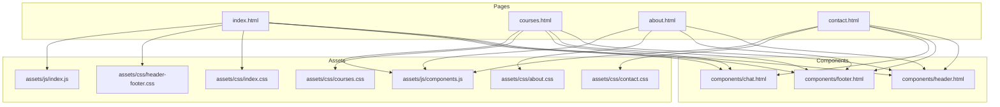
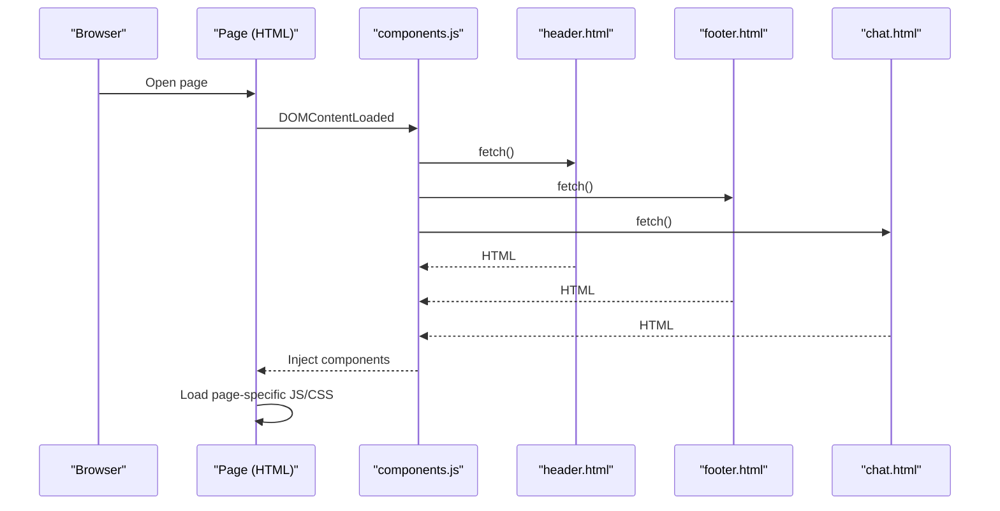
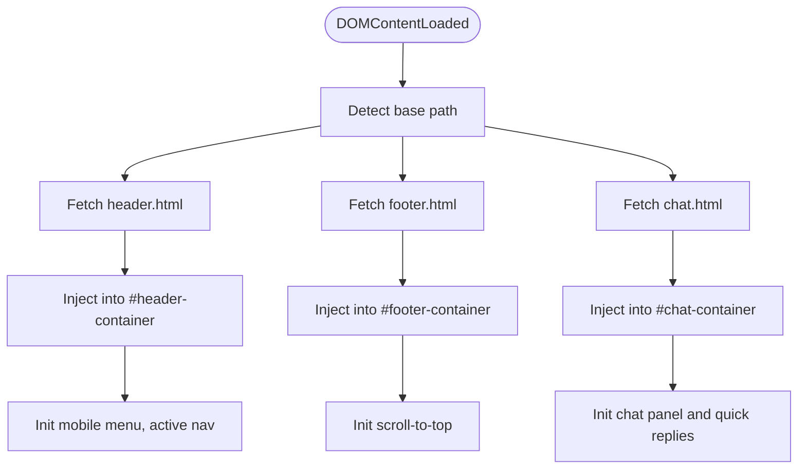
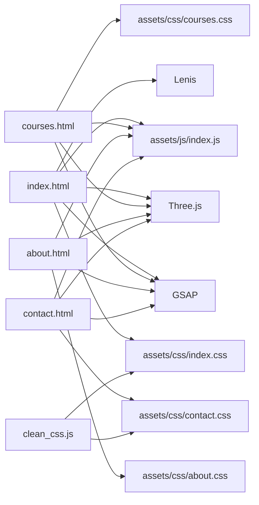

# Getting Started

<cite>
**Referenced Files in This Document**
- [index.html](file://index.html)
- [clean_css.js](file://clean_css.js)
- [assets/js/index.js](file://assets/js/index.js)
- [assets/js/components.js](file://assets/js/components.js)
- [components/header.html](file://components/header.html)
- [components/footer.html](file://components/footer.html)
- [components/chat.html](file://components/chat.html)
- [courses.html](file://courses.html)
- [about.html](file://about.html)
- [contact.html](file://contact.html)
- [assets/css/index.css](file://assets/css/index.css)
</cite>

## Table of Contents
1. [Introduction](#introduction)
2. [Project Structure](#project-structure)
3. [Core Components](#core-components)
4. [Architecture Overview](#architecture-overview)
5. [Detailed Component Analysis](#detailed-component-analysis)
6. [Dependency Analysis](#dependency-analysis)
7. [Performance Considerations](#performance-considerations)
8. [Troubleshooting Guide](#troubleshooting-guide)
9. [Conclusion](#conclusion)
10. [Appendices](#appendices)

## Introduction
This guide helps you set up and run the Eduooz website locally, understand the component-based architecture, and build optimized assets. The site emphasizes modern web technologies, interactive animations, and reusable UI components. You will learn how to:
- Prepare your environment and launch the development server
- Navigate the educational platform’s pages
- Understand the build process for CSS optimization
- Troubleshoot common setup issues

## Project Structure
The project is organized into static HTML pages, shared components, and modular assets:
- Pages: index.html, courses.html, about.html, contact.html, plus others
- Shared components: header, footer, chat panels
- Assets: CSS for each page and shared styles, JavaScript for interactivity and 3D animations
- Build tooling: a Node.js script to optimize CSS

**Diagram sources**
- [index.html](file://index.html)
- [courses.html](file://courses.html)
- [about.html](file://about.html)
- [contact.html](file://contact.html)
- [components/header.html](file://components/header.html)
- [components/footer.html](file://components/footer.html)
- [components/chat.html](file://components/chat.html)
- [assets/css/index.css](file://assets/css/index.css)
- [assets/css/header-footer.css](file://assets/css/header-footer.css)
- [assets/css/courses.css](file://assets/css/courses.css)
- [assets/css/about.css](file://assets/css/about.css)
- [assets/css/contact.css](file://assets/css/contact.css)
- [assets/js/index.js](file://assets/js/index.js)
- [assets/js/components.js](file://assets/js/components.js)

**Section sources**
- [index.html](file://index.html)
- [courses.html](file://courses.html)
- [about.html](file://about.html)
- [contact.html](file://contact.html)
- [components/header.html](file://components/header.html)
- [components/footer.html](file://components/footer.html)
- [components/chat.html](file://components/chat.html)
- [assets/css/index.css](file://assets/css/index.css)

## Core Components
- Component loader: Dynamically injects header, footer, and chat panels into pages. It detects the base path to resolve assets correctly across local and hosted contexts.
- Navigation: Header navigation links map to platform sections and internal anchors.
- Interactive UI: Chat panel with quick replies, animated buttons, and scroll-to-top functionality.
- Page-specific scripts: Each page loads its own JavaScript for animations and interactions.

Key responsibilities:
- assets/js/components.js: Loads shared components, initializes chat, mobile menu, and scroll-to-top behavior
- components/header.html: Provides navigation and branding
- components/footer.html: Provides links, newsletter, and legal notices
- components/chat.html: Provides the floating chat interface and bot replies

**Section sources**
- [assets/js/components.js](file://assets/js/components.js)
- [components/header.html](file://components/header.html)
- [components/footer.html](file://components/footer.html)
- [components/chat.html](file://components/chat.html)

## Architecture Overview
The site uses a component-based architecture with shared UI injected into individual pages. Pages rely on external libraries for animations and 3D rendering, and a small Node.js script optimizes CSS.

**Diagram sources**
- [assets/js/components.js](file://assets/js/components.js)
- [components/header.html](file://components/header.html)
- [components/footer.html](file://components/footer.html)
- [components/chat.html](file://components/chat.html)

## Detailed Component Analysis

### Component Loader (components.js)
Responsibilities:
- Determine base path for assets regardless of hosting location
- Fetch and inject header, footer, and chat panels
- Initialize mobile navigation, scroll-to-top, and chat interactions
- Highlight active navigation based on current page

Behavior highlights:
- Uses fetch to load component HTML and injects into containers
- Adjusts relative URLs inside loaded HTML to match deployment base path
- Emits custom events when components finish loading to coordinate initialization

**Diagram sources**
- [assets/js/components.js](file://assets/js/components.js)
- [components/header.html](file://components/header.html)
- [components/footer.html](file://components/footer.html)
- [components/chat.html](file://components/chat.html)

**Section sources**
- [assets/js/components.js](file://assets/js/components.js)
- [components/header.html](file://components/header.html)
- [components/footer.html](file://components/footer.html)
- [components/chat.html](file://components/chat.html)

### Header Navigation
- Provides primary navigation to Home, About, Courses, Gallery, Testimonials, Placements, and Contact
- Includes a prominent CTA for a demo
- Active link highlighting based on current page

Integration:
- Loaded by components.js and injected into each page’s header container

**Section sources**
- [components/header.html](file://components/header.html)
- [assets/js/components.js](file://assets/js/components.js)

### Footer and Newsletter
- Branding, links to programs and platform pages
- Newsletter signup form
- Legal links and copyright

Integration:
- Loaded by components.js and injected into each page’s footer container

**Section sources**
- [components/footer.html](file://components/footer.html)
- [assets/js/components.js](file://assets/js/components.js)

### Chat Panel
- Floating action button with tooltip and animated rings
- Chat panel with welcome message and quick replies
- Bot replies based on keywords (courses, admission, placement, call)
- Auto-focus on input when panel opens

Integration:
- Loaded by components.js and injected into each page’s chat container

**Section sources**
- [components/chat.html](file://components/chat.html)
- [assets/js/components.js](file://assets/js/components.js)

### Page Scripts and Animations
- index.html loads assets/js/index.js for hero animations, 3D scenes, and scroll-triggered reveals
- courses.html, about.html, contact.html load page-specific scripts and styles

Highlights:
- Three.js scenes for immersive backgrounds
- GSAP timelines for entrance animations and scroll-triggered effects
- Lenis smooth scrolling integration

**Section sources**
- [assets/js/index.js](file://assets/js/index.js)
- [index.html](file://index.html)
- [courses.html](file://courses.html)
- [about.html](file://about.html)
- [contact.html](file://contact.html)

## Dependency Analysis
External libraries used across pages:
- GSAP: Animation library for timelines and scroll triggers
- Three.js: 3D rendering for hero canvases
- Lenis: Smooth scrolling integration
- Font Awesome: Icons
- Google Fonts: Typography

Build-time dependency:
- Node.js script to optimize CSS by removing unused sections

**Diagram sources**
- [index.html](file://index.html)
- [courses.html](file://courses.html)
- [about.html](file://about.html)
- [contact.html](file://contact.html)
- [assets/js/index.js](file://assets/js/index.js)
- [assets/css/index.css](file://assets/css/index.css)
- [assets/css/courses.css](file://assets/css/courses.css)
- [assets/css/about.css](file://assets/css/about.css)
- [assets/css/contact.css](file://assets/css/contact.css)
- [clean_css.js](file://clean_css.js)

**Section sources**
- [index.html](file://index.html)
- [courses.html](file://courses.html)
- [about.html](file://about.html)
- [contact.html](file://contact.html)
- [assets/js/index.js](file://assets/js/index.js)
- [assets/css/index.css](file://assets/css/index.css)
- [clean_css.js](file://clean_css.js)

## Performance Considerations
- Deferred 3D initialization: The hero 3D scene starts after a short delay to prioritize hero animations and ensure smooth initial load.
- Responsive camera and pixel ratio adjustments: Camera settings adapt to viewport size and device pixel ratio to balance quality and performance.
- Intersection observers: 3D scenes pause rendering when off-screen to reduce CPU/GPU usage.
- CSS optimization: The build script removes unused CSS regions to reduce payload.

[No sources needed since this section provides general guidance]

## Troubleshooting Guide
Common setup and runtime issues:

- Local server not serving components
  - Ensure the development server serves files from the repository root so relative paths resolve correctly.
  - Confirm components are being fetched and injected by checking the DOM for injected containers.

- Broken images or assets after moving to a subdirectory
  - components.js adjusts relative URLs based on the script’s location. Verify the script path and ensure assets are served from the expected base.

- 3D scenes not rendering
  - Check browser console for Three.js errors.
  - Ensure WebGL is enabled and supported by the browser.

- CSS not applying or animations not triggering
  - Verify that the correct CSS files are linked in each page head.
  - Confirm that page-specific JavaScript is loaded and executed.

- Scroll-to-top button not visible
  - Confirm the button exists and is toggled by the component loader’s initialization.

- Chat panel not opening
  - Ensure the chat component is injected and the initialization code runs after DOMContentLoaded.

**Section sources**
- [assets/js/components.js](file://assets/js/components.js)
- [components/header.html](file://components/header.html)
- [components/footer.html](file://components/footer.html)
- [components/chat.html](file://components/chat.html)

## Conclusion
You now have the essentials to run the Eduooz website locally, understand the component-based architecture, and optimize CSS for production. Use the component loader to maintain shared UI across pages, leverage page-specific scripts for rich interactions, and apply the CSS cleanup process to keep assets lean.

[No sources needed since this section summarizes without analyzing specific files]

## Appendices

### A. Local Development Setup
- Prerequisites
  - Modern browser with WebGL support for 3D animations
  - Node.js installed for running the CSS optimization script
- Steps
  - Serve the repository root via a local development server
  - Open index.html in your browser
  - Run the CSS optimization script to clean CSS files
  - Refresh the browser to see optimized styles

**Section sources**
- [clean_css.js](file://clean_css.js)

### B. Running the CSS Optimization Script
- Purpose: Remove unused CSS regions from index.css and contact.css to reduce file size
- Execution: Run the Node.js script from the repository root
- Output: Modified CSS files with targeted sections removed

**Section sources**
- [clean_css.js](file://clean_css.js)

### C. Browser Compatibility Notes
- WebGL is required for 3D animations in hero sections
- Latest versions of Chrome, Firefox, Safari, and Edge recommended
- If WebGL is unavailable, 3D scenes will not render; animations will still work without Three.js

[No sources needed since this section provides general guidance]