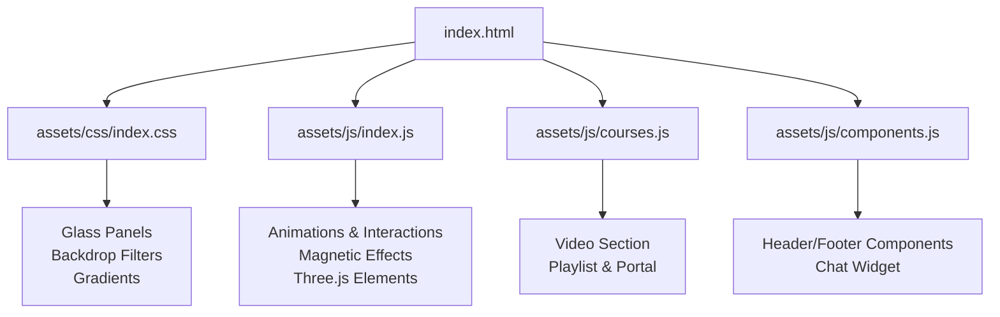
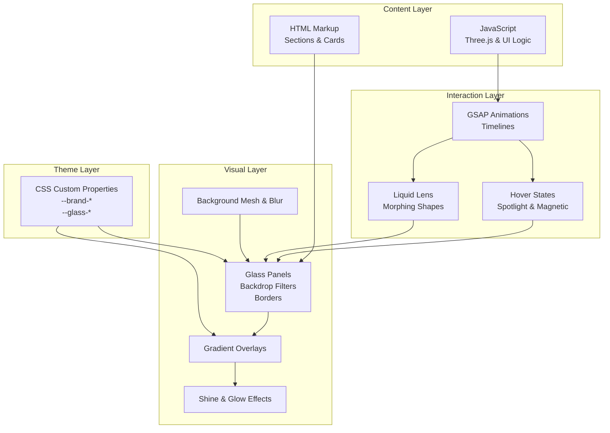
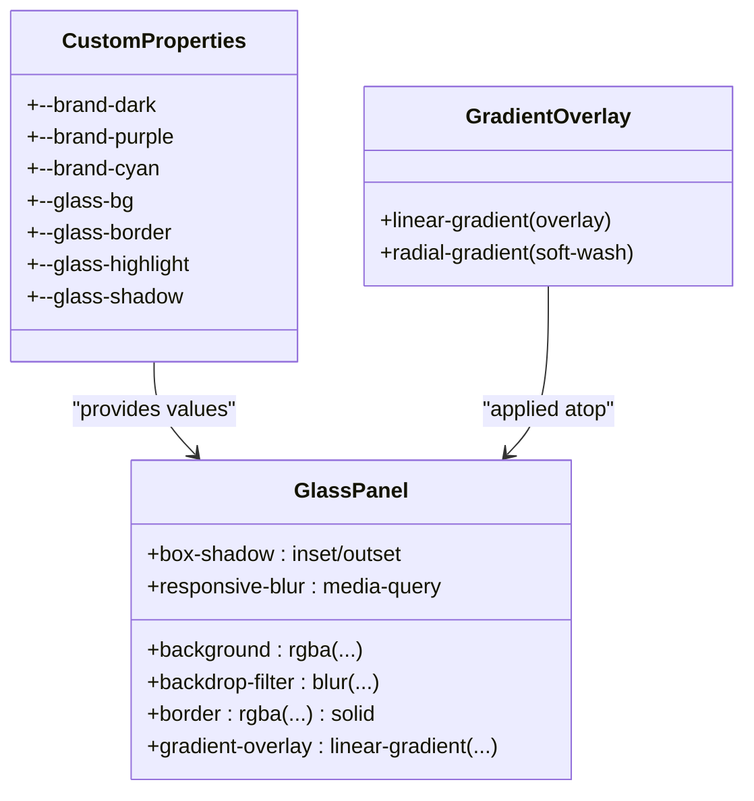
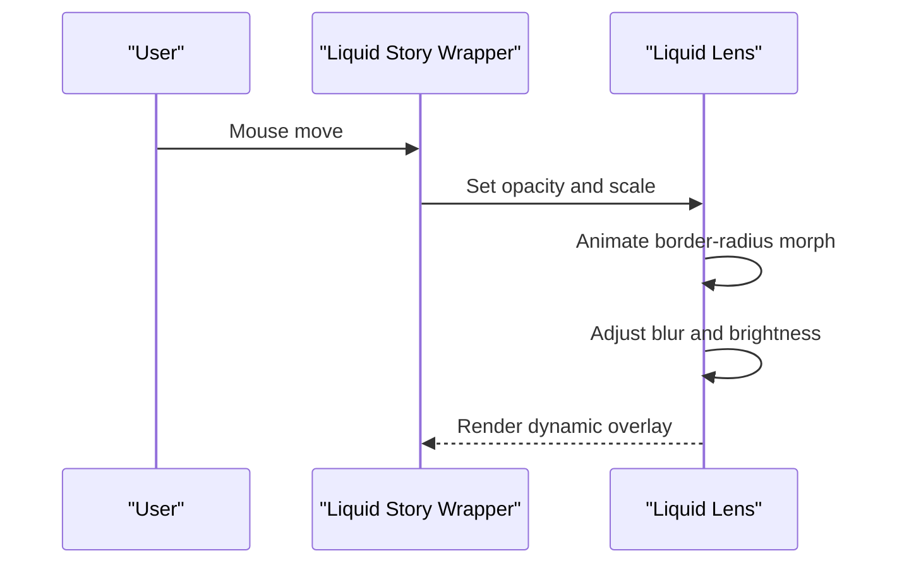
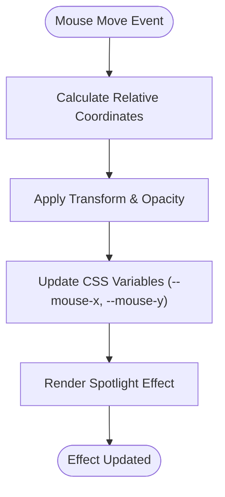
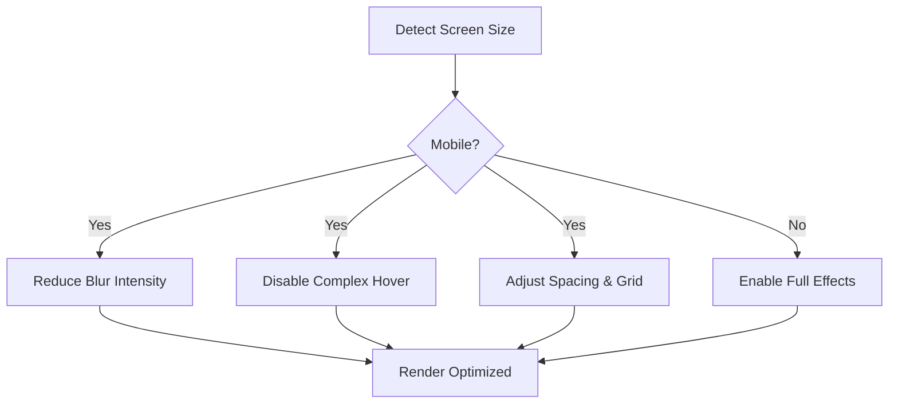
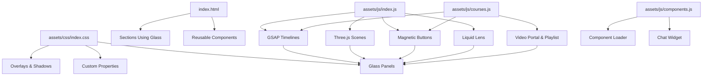

# Glass Morphism Design Elements

<cite>
**Referenced Files in This Document**
- [index.html](file://index.html)
- [index.css](file://assets/css/index.css)
- [index.js](file://assets/js/index.js)
- [courses.js](file://assets/js/courses.js)
- [components.js](file://assets/js/components.js)
</cite>

## Table of Contents
1. [Introduction](#introduction)
2. [Project Structure](#project-structure)
3. [Core Components](#core-components)
4. [Architecture Overview](#architecture-overview)
5. [Detailed Component Analysis](#detailed-component-analysis)
6. [Dependency Analysis](#dependency-analysis)
7. [Performance Considerations](#performance-considerations)
8. [Troubleshooting Guide](#troubleshooting-guide)
9. [Conclusion](#conclusion)

## Introduction
This document provides comprehensive technical documentation for the glass morphism design system implemented across the Eduooz website. It explains how frosted glass panels are created using backdrop-filter, border transparency effects, and gradient overlays. It documents the custom property system for consistent theming, the layered design approach with blur effects and depth perception, interactive liquid overlays and shine effects, responsive behavior across screen sizes, and performance implications of blur effects. Finally, it offers guidelines for extending the system with new components.

## Project Structure
The glass morphism system is primarily implemented in the main index stylesheet and HTML markup, with supporting JavaScript for animations and interactivity. Key locations:
- Glass styles and components: assets/css/index.css
- Page markup using glass elements: index.html
- Animations and interactive behaviors: assets/js/index.js, assets/js/courses.js
- Component loading and chat functionality: assets/js/components.js

**Diagram sources**
- [index.html](file://index.html)
- [index.css](file://assets/css/index.css)
- [index.js](file://assets/js/index.js)
- [courses.js](file://assets/js/courses.js)
- [components.js](file://assets/js/components.js)

**Section sources**
- [index.html](file://index.html)
- [index.css](file://assets/css/index.css)

## Core Components
This section outlines the foundational building blocks of the glass morphism system and how they work together.

- Custom Property System
  - Centralized theme tokens are defined in CSS custom properties for consistent color and effect values across components.
  - Examples include brand colors, text colors, and glass-specific variables such as background, border, highlight gradients, and shadow values.
  - These variables enable easy theming and maintain uniformity across dark/light modes and components.

- Frosted Glass Panels
  - Implemented using background and border transparency with backdrop-filter blur for soft focus effects.
  - Common patterns include:
    - Main glass cards with high blur and subtle borders
    - Stat bars with moderate blur and dividers
    - Video frames and playlist cards with layered blur and inner borders
  - Gradient overlays enhance depth and visual interest without sacrificing readability.

- Layered Design and Depth Perception
  - Multiple layers are stacked to simulate depth:
    - Background blur and mesh filters
    - Inner gradient overlays
    - Outer box-shadows and inner glows
  - Z-index stacking and transform properties (scale, translate) further reinforce perceived depth.

- Liquid Overlays and Shine Effects
  - Liquid lens with organic morphing and blur/brightness adjustments creates a dynamic, interactive surface.
  - Shine effects achieved via gradient overlays, glossy borders, and subtle glow transitions.
  - Magnetic cursor effects and hover states add tactile responsiveness.

- Interactive Hover States
  - Hover scaling, elevation, and border glow transitions
  - Spotlight effects that follow mouse movement across cards
  - Smooth opacity and transform animations for reveal/hide mechanics

- Responsive Behavior
  - Media queries adjust blur intensity, spacing, and layout for tablets and phones
  - Mobile-optimized hover interactions disabled or simplified to preserve performance and usability

**Section sources**
- [index.css](file://assets/css/index.css)
- [index.js](file://assets/js/index.js)
- [courses.js](file://assets/js/courses.js)

## Architecture Overview
The glass morphism system integrates CSS custom properties, layered visual effects, and JavaScript-driven interactions to create immersive, responsive experiences.

**Diagram sources**
- [index.css](file://assets/css/index.css)
- [index.js](file://assets/js/index.js)
- [courses.js](file://assets/js/courses.js)

## Detailed Component Analysis

### Glass Panel System
The glass panel system uses a combination of background transparency, backdrop-filter blur, border transparency, and gradient overlays to achieve the frosted look.

**Diagram sources**
- [index.css](file://assets/css/index.css)

Implementation highlights:
- Custom properties define consistent brand and glass tokens
- Panels use backdrop-filter blur with rgba backgrounds for translucency
- Borders use semi-transparent rgba values to maintain edge definition
- Gradient overlays add depth and highlight areas

**Section sources**
- [index.css](file://assets/css/index.css)

### Liquid Lens and Liquid Glass Effects
Liquid overlays simulate fluid dynamics with morphing shapes, blur adjustments, and organic border-radius animations.

**Diagram sources**
- [index.css](file://assets/css/index.css)
- [index.js](file://assets/js/index.js)

Key behaviors:
- Liquid lens uses organic border-radius morphing and blur/brightness filters
- Opacity and scale transitions create a sense of weight and depth
- Morphing animation runs on a loop to simulate fluid motion

**Section sources**
- [index.css](file://assets/css/index.css)
- [index.js](file://assets/js/index.js)

### Spotlight and Magnetic Effects
Spotlight effects follow mouse movement to highlight interactive areas, while magnetic buttons respond to cursor proximity with smooth physics-based motion.

**Diagram sources**
- [index.css](file://assets/css/index.css)
- [index.js](file://assets/js/index.js)
- [courses.js](file://assets/js/courses.js)

Behavioral patterns:
- Spotlight uses radial gradients positioned via CSS variables
- Magnetic buttons use requestAnimationFrame for smooth tracking
- Video portal includes a magnetic play cursor that follows mouse movement

**Section sources**
- [index.css](file://assets/css/index.css)
- [index.js](file://assets/js/index.js)
- [courses.js](file://assets/js/courses.js)

### Responsive Glass Behaviors
Responsive adjustments ensure glass elements remain performant and visually coherent across devices.

**Diagram sources**
- [index.css](file://assets/css/index.css)
- [index.js](file://assets/js/index.js)
- [courses.js](file://assets/js/courses.js)

Responsive strategies:
- Media queries reduce blur intensity on smaller screens
- Hover effects are disabled or simplified on mobile to preserve performance
- Layout adjusts to maintain readability and depth perception

**Section sources**
- [index.css](file://assets/css/index.css)
- [index.js](file://assets/js/index.js)
- [courses.js](file://assets/js/courses.js)

### Extended Component Guidelines
Guidelines for adding new glass morphism components:

- Define theme tokens
  - Add new brand or glass-specific variables to the custom property section
  - Keep values consistent with existing tokens for cohesive design

- Implement the glass panel pattern
  - Use rgba backgrounds with backdrop-filter blur
  - Apply semi-transparent borders and inner glows
  - Add gradient overlays for depth and highlight

- Add interactive states
  - Implement hover scaling and elevation
  - Include spotlight or magnetic effects where appropriate
  - Use CSS transitions for smooth state changes

- Optimize for performance
  - Prefer CSS transforms and opacity over layout-affecting properties
  - Use will-change and transform-style: preserve-3d for complex animations
  - Test on low-power devices and disable heavy effects on mobile

- Ensure accessibility
  - Maintain sufficient contrast against blurred backgrounds
  - Provide alternative focus indicators for keyboard navigation
  - Avoid relying solely on motion for critical interactions

**Section sources**
- [index.css](file://assets/css/index.css)

## Dependency Analysis
The glass morphism system depends on several technologies and libraries working together.

**Diagram sources**
- [index.css](file://assets/css/index.css)
- [index.html](file://index.html)
- [index.js](file://assets/js/index.js)
- [courses.js](file://assets/js/courses.js)
- [components.js](file://assets/js/components.js)

Dependencies and interactions:
- CSS custom properties unify theming across components
- JavaScript enhances interactions with GSAP, magnetic effects, and Three.js
- HTML markup provides the structural foundation for glass elements
- Component loader manages modular page sections

**Section sources**
- [index.css](file://assets/css/index.css)
- [index.html](file://index.html)
- [index.js](file://assets/js/index.js)
- [courses.js](file://assets/js/courses.js)
- [components.js](file://assets/js/components.js)

## Performance Considerations
Glass morphism effects, particularly backdrop-filter blur, can be computationally expensive. The implementation includes several optimizations:

- Deferred WebGL initialization
  - Heavy Three.js scenes are initialized after the main hero entrance to avoid frame drops during initial load
  - Geometry compilation and render loops are delayed to prioritize critical animations

- Conditional blur intensity
  - Reduced blur on mobile devices to minimize GPU workload
  - Hover effects disabled on mobile to prevent unnecessary reflows and repaints

- Efficient animations
  - requestAnimationFrame used for smooth, low-level updates
  - GSAP timelines optimized for 60fps performance
  - will-change and transform-style preserve-3d for hardware-accelerated transforms

- Strategic masking and compositing
  - -webkit-backdrop-filter used alongside standard backdrop-filter for broader browser support
  - Masking applied to reduce overdraw in complex layered designs

- Component visibility checks
  - Intersection observers pause rendering when off-screen elements are not visible

**Section sources**
- [index.js](file://assets/js/index.js)
- [index.css](file://assets/css/index.css)

## Troubleshooting Guide
Common issues and solutions when working with the glass morphism system:

- Backdrop-filter not working
  - Ensure the parent element has sufficient background contrast or a background image
  - Verify -webkit-backdrop-filter is included for Safari compatibility

- Blur appears too intense or too faint
  - Adjust the blur radius in the relevant glass panel class
  - Consider reducing blur on mobile devices via media queries

- Hover effects feel sluggish
  - Confirm requestAnimationFrame is being used for smooth updates
  - Check for layout thrashing; prefer transform and opacity over layout-affecting properties

- Three.js scenes cause performance issues
  - Verify deferred initialization is enabled and not overridden
  - Reduce geometry complexity or use lower pixel ratios on mobile

- Liquid lens not animating
  - Ensure the wrapper container allows pointer events
  - Confirm CSS variables for mouse position are being updated

- Gradient overlays not visible
  - Check z-index stacking order; overlays should be above base content
  - Verify gradient stops and transparency values are set appropriately

**Section sources**
- [index.css](file://assets/css/index.css)
- [index.js](file://assets/js/index.js)
- [courses.js](file://assets/js/courses.js)

## Conclusion
The glass morphism design system in the Eduooz website combines a robust custom property theme system, layered visual effects, and sophisticated JavaScript interactions to deliver an immersive, responsive experience. By leveraging backdrop-filter blur, gradient overlays, and interactive elements like the liquid lens and magnetic effects, the system achieves a premium, modern aesthetic. The implementation includes strategic performance optimizations and responsive adaptations to ensure consistent quality across devices. Following the extension guidelines will help maintain design coherence and performance when adding new glass morphism components.