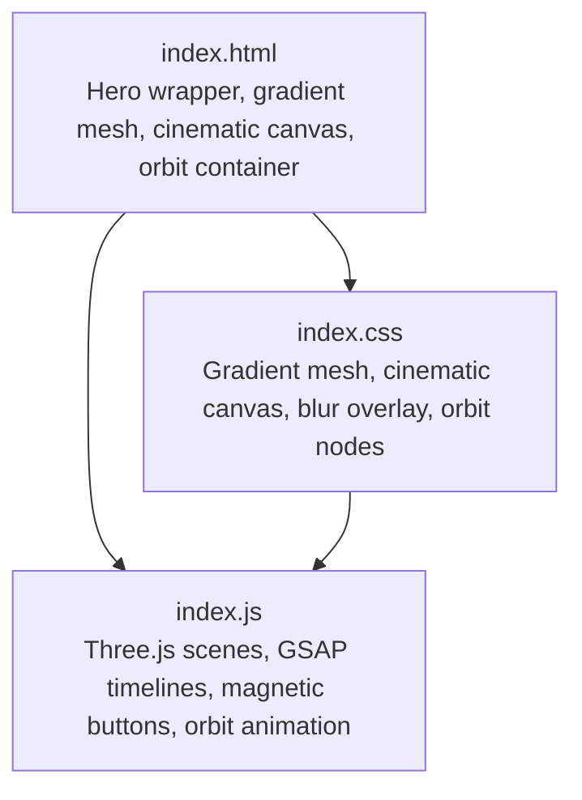
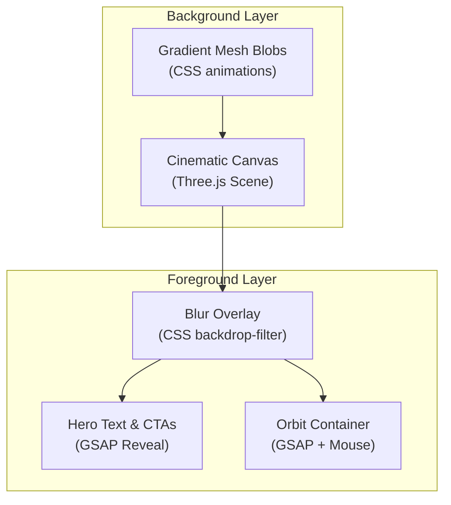
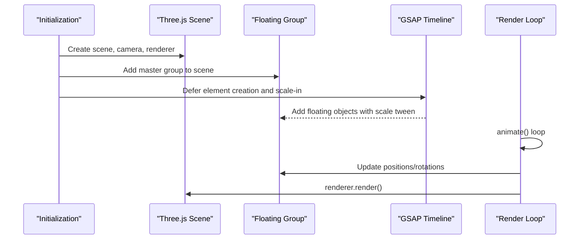
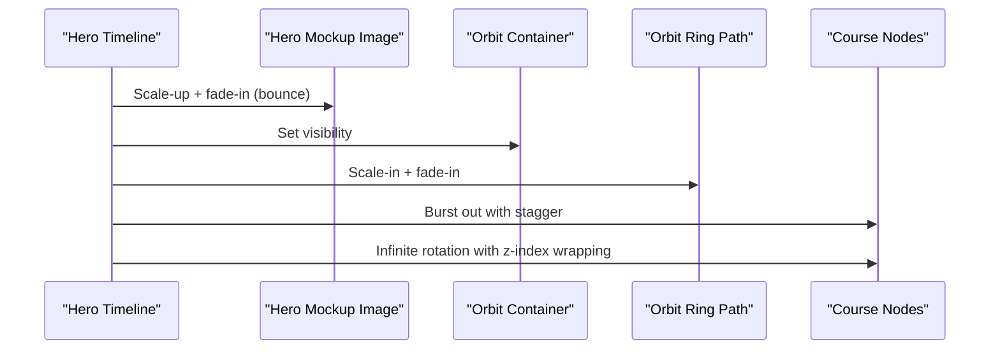
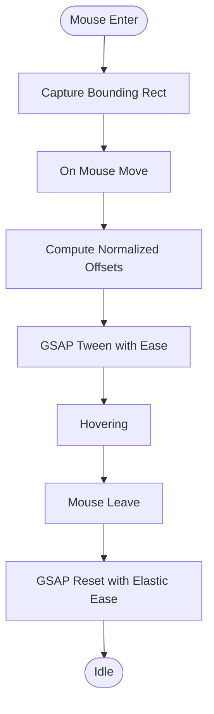
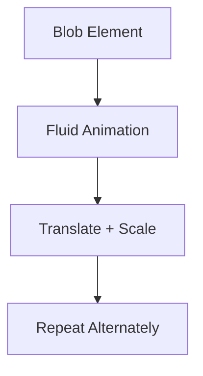
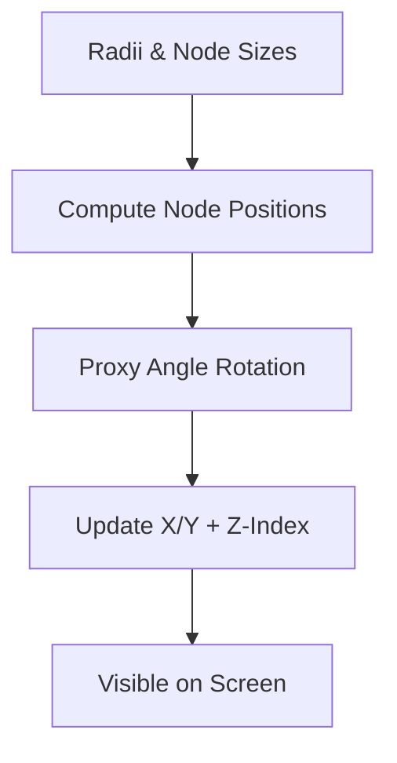
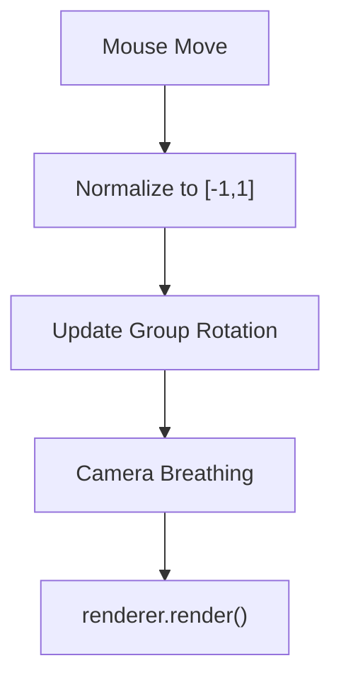
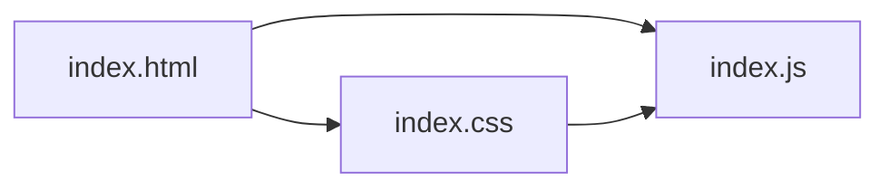

# Hero Section with 3D Animations

<cite>
**Referenced Files in This Document**
- [index.html](file://index.html)
- [index.js](file://assets/js/index.js)
- [index.css](file://assets/css/index.css)
</cite>

## Table of Contents
1. [Introduction](#introduction)
2. [Project Structure](#project-structure)
3. [Core Components](#core-components)
4. [Architecture Overview](#architecture-overview)
5. [Detailed Component Analysis](#detailed-component-analysis)
6. [Dependency Analysis](#dependency-analysis)
7. [Performance Considerations](#performance-considerations)
8. [Troubleshooting Guide](#troubleshooting-guide)
9. [Conclusion](#conclusion)

## Introduction
This document explains the hero section’s 3D animation implementation, focusing on the Three.js scene setup, floating medical equipment objects, GSAP timeline orchestration, gradient mesh background, and the interactive orbit container with magnetic button effects. It also covers performance optimizations and cross-browser considerations to ensure smooth, visually rich experiences across devices.

## Project Structure
The hero section is composed of:
- HTML structure defining the hero wrapper, gradient mesh background, cinematic canvas, overlay, and orbit container with course nodes.
- CSS styles for the gradient mesh blobs, cinematic canvas, blur overlay, and orbit nodes.
- JavaScript orchestrating Three.js scenes, GSAP timelines, magnetic buttons, and responsive behavior.

**Diagram sources**
- [index.html:32-102](file://index.html#L32-L102)
- [index.css:75-158](file://assets/css/index.css#L75-L158)
- [index.js:105-432](file://assets/js/index.js#L105-L432)

**Section sources**
- [index.html:32-102](file://index.html#L32-L102)
- [index.css:75-158](file://assets/css/index.css#L75-L158)
- [index.js:105-432](file://assets/js/index.js#L105-L432)

## Core Components
- Three.js cinematic scene with floating medical equipment (stethoscope, syringe/capsule, test tube/microscope).
- GSAP timelines for staggered reveals, magnetic button interactions, and scroll-triggered sequences.
- Gradient mesh background with animated blobs and color transitions.
- Orbit container with course nodes rotating around a central axis, responding to scroll and mouse interactions.
- Performance optimizations including deferred initialization, intersection observers, and responsive camera adjustments.

**Section sources**
- [index.js:105-432](file://assets/js/index.js#L105-L432)
- [index.js:434-497](file://assets/js/index.js#L434-L497)
- [index.css:75-158](file://assets/css/index.css#L75-L158)

## Architecture Overview
The hero section integrates Three.js and GSAP to deliver a layered experience:
- Background: Gradient mesh blobs and a cinematic canvas with floating 3D objects.
- Foreground: Hero text, CTAs, and orbit container with animated course nodes.
- Interactions: Magnetic buttons, scroll-triggered reveals, and responsive scaling.

**Diagram sources**
- [index.html:32-102](file://index.html#L32-L102)
- [index.css:75-158](file://assets/css/index.css#L75-L158)
- [index.js:105-432](file://assets/js/index.js#L105-L432)

## Detailed Component Analysis

### Three.js Scene Setup and Floating Medical Equipment
The hero scene initializes a Three.js scene with:
- A foggy dark background and a perspective camera positioned to frame the hero content.
- A master group to hold floating objects.
- Materials for frosted glass and emissive glows.
- Creation functions for:
  - Medical cross (Nursing)
  - Capsule/pill (Pharmacist)
  - Test tube/microscope (Lab Tech)
  - Stethoscope (Nursing)

Floating objects are spawned with randomized positions, rotations, and drift/rotation rates. A render loop animates their positions and rotations using sine waves for organic motion. Mouse movement influences the floating group rotation. Camera adjusts based on viewport size for optimal framing.

**Diagram sources**
- [index.js:105-432](file://assets/js/index.js#L105-L432)

**Section sources**
- [index.js:105-432](file://assets/js/index.js#L105-L432)

### GSAP Timeline Management for Hero Animations
The hero entrance uses a GSAP timeline to orchestrate:
- Staggered reveals for text and visuals.
- Phone mockup scale-up and fade-in with bounce.
- Orbit container visibility and ring path scale-in.
- Course nodes burst out from center with staggered timing.
- Infinite rotation of nodes with dynamic z-index wrapping to appear behind the phone.

**Diagram sources**
- [index.js:434-497](file://assets/js/index.js#L434-L497)

**Section sources**
- [index.js:434-497](file://assets/js/index.js#L434-L497)

### Magnetic Button Interactions
Magnetic buttons respond to mouse movement with a spring-like effect:
- On mouseenter, capture bounding rectangle.
- On mousemove, compute normalized offsets and apply GSAP tweens with easing.
- On mouseleave, return to rest with elastic easing.

**Diagram sources**
- [index.js:59-84](file://assets/js/index.js#L59-L84)

**Section sources**
- [index.js:59-84](file://assets/js/index.js#L59-L84)

### Gradient Mesh Background System
The background consists of animated blobs with blur filters:
- Purple, cyan, and magenta blobs with varying sizes and delays.
- Fluid animation keys translate and scale blobs over time.
- Fixed-positioned blobs with low opacity and blur filters create a soft gradient wash.

**Diagram sources**
- [index.css:75-129](file://assets/css/index.css#L75-L129)

**Section sources**
- [index.css:75-129](file://assets/css/index.css#L75-L129)

### Orbit Container with Interactive Course Nodes
The orbit container holds three course nodes (Nursing, Pharmacist, Lab Tech) arranged in a circle:
- Nodes are positioned using trigonometric calculations with configurable radii.
- Infinite rotation uses a proxy angle with onUpdate to compute positions and z-index based on Y position.
- Responsive sizing adjusts radii and node sizes for mobile/desktop.

**Diagram sources**
- [index.js:453-497](file://assets/js/index.js#L453-L497)
- [index.css:2421-2483](file://assets/css/index.css#L2421-L2483)

**Section sources**
- [index.js:453-497](file://assets/js/index.js#L453-L497)
- [index.css:2421-2483](file://assets/css/index.css#L2421-L2483)

### Mouse Interaction Handling
Mouse movement influences the floating group rotation and camera breathing:
- Mouse position normalized to [-1, 1] space updates group rotation.
- Camera gently moves vertically to simulate breathing.

**Diagram sources**
- [index.js:339-380](file://assets/js/index.js#L339-L380)

**Section sources**
- [index.js:339-380](file://assets/js/index.js#L339-L380)

## Dependency Analysis
- HTML provides containers for the gradient mesh, cinematic canvas, and orbit container.
- CSS defines background blobs, blur overlay, and orbit node styles.
- JavaScript initializes Three.js scenes, creates GSAP timelines, and manages interactions.

**Diagram sources**
- [index.html:32-102](file://index.html#L32-L102)
- [index.css:75-158](file://assets/css/index.css#L75-L158)
- [index.js:105-432](file://assets/js/index.js#L105-L432)

**Section sources**
- [index.html:32-102](file://index.html#L32-L102)
- [index.css:75-158](file://assets/css/index.css#L75-L158)
- [index.js:105-432](file://assets/js/index.js#L105-L432)

## Performance Considerations
- Deferred initialization: Heavy geometry and render loop are started after a short delay to prioritize hero entrance smoothness.
- Intersection observers: Scenes pause rendering when off-screen to reduce GPU/CPU usage.
- Responsive camera adjustments: Camera position and FOV adapt to viewport size with minimal overhead.
- Pixel ratio limits: Renderer pixel ratio capped to balance quality and performance.
- GSAP optimizations: quickTo for cursor portals, throttled RAF usage, and staggered reveals with minimal DOM churn.
- Memory management: Objects are created once and reused; cleanup occurs on visibility changes.

[No sources needed since this section provides general guidance]

## Troubleshooting Guide
- Scene not rendering:
  - Verify the cinematic canvas container exists and is appended to the DOM.
  - Confirm Three.js and GSAP scripts are loaded before initialization.
- Poor performance on mobile:
  - Reduce pixel ratio or simplify materials.
  - Disable shadows or use simpler geometries.
- Animations stuttering:
  - Ensure requestAnimationFrame is not blocked by heavy synchronous operations.
  - Use GSAP’s ticker and intersection observers to throttle updates.
- Magnetic buttons not responding:
  - Check mouseenter/mousemove event bindings and bounding rect availability.

**Section sources**
- [index.js:105-432](file://assets/js/index.js#L105-L432)
- [index.js:59-84](file://assets/js/index.js#L59-L84)

## Conclusion
The hero section combines a Three.js cinematic background with GSAP-driven storytelling to create a compelling, immersive experience. By deferring heavy initialization, leveraging intersection observers, and optimizing rendering and interactions, the implementation balances visual richness with performance and cross-browser stability.