# Homepage Implementation

<cite>
**Referenced Files in This Document**
- [index.html](file://index.html)
- [assets/js/index.js](file://assets/js/index.js)
- [assets/css/index.css](file://assets/css/index.css)
- [components/header.html](file://components/header.html)
- [components/footer.html](file://components/footer.html)
</cite>

## Table of Contents
1. [Introduction](#introduction)
2. [Project Structure](#project-structure)
3. [Core Components](#core-components)
4. [Architecture Overview](#architecture-overview)
5. [Detailed Component Analysis](#detailed-component-analysis)
6. [Dependency Analysis](#dependency-analysis)
7. [Performance Considerations](#performance-considerations)
8. [Troubleshooting Guide](#troubleshooting-guide)
9. [Conclusion](#conclusion)

## Introduction
This document provides a comprehensive technical guide to the Eduooz homepage implementation, focusing on interactive 3D animations, glass morphism UI design, and performance optimization. It covers the hero section’s floating medical equipment, interactive course selection orbit, magnetic button effects, GSAP timeline management, scroll-triggered effects, and Three.js scene setup. It also documents the counter section, course showcase, and responsive design considerations for cross-browser compatibility.

## Project Structure
The homepage is composed of:
- A single-page HTML structure with modular sections
- A centralized JavaScript module orchestrating animations, interactions, and Three.js scenes
- A stylesheet defining glass morphism, gradients, and responsive breakpoints

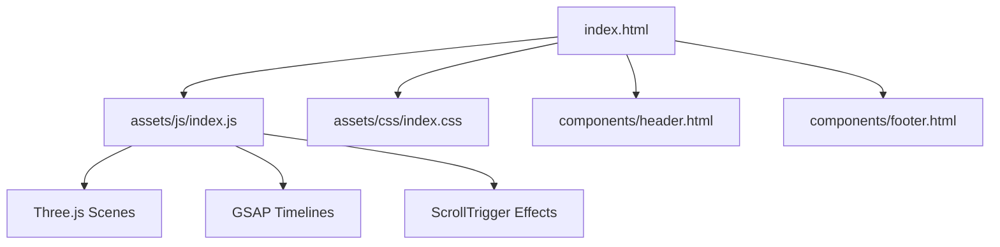

**Diagram sources**
- [index.html:1-1602](file://index.html#L1-L1602)
- [assets/js/index.js:1-2203](file://assets/js/index.js#L1-L2203)
- [assets/css/index.css:1-3513](file://assets/css/index.css#L1-L3513)

**Section sources**
- [index.html:1-1602](file://index.html#L1-L1602)
- [assets/js/index.js:1-2203](file://assets/js/index.js#L1-L2203)
- [assets/css/index.css:1-3513](file://assets/css/index.css#L1-L3513)

## Core Components
- Hero section with animated gradient mesh background, cinematic canvas, hero text, and interactive orbit nodes
- Glass morphism trust panel with animated counters
- Course showcase with detailed glass panels and interactive 3D holograms
- Magnetic button interactions
- Three.js floating medical equipment scene with lighting and animation loops
- Scroll-triggered reveals and parallax effects

**Section sources**
- [index.html:32-102](file://index.html#L32-L102)
- [index.html:104-132](file://index.html#L104-L132)
- [index.html:169-262](file://index.html#L169-L262)
- [assets/js/index.js:58-84](file://assets/js/index.js#L58-L84)
- [assets/js/index.js:105-432](file://assets/js/index.js#L105-L432)
- [assets/js/index.js:561-716](file://assets/js/index.js#L561-L716)

## Architecture Overview
The homepage integrates:
- HTML structure with semantic sections and interactive elements
- CSS for glass morphism, gradients, and responsive design
- JavaScript for:
  - GSAP timelines and ScrollTrigger-driven animations
  - Magnetic button physics
  - Three.js scenes for floating 3D equipment and course holograms
  - Intersection observers and resize handlers for performance

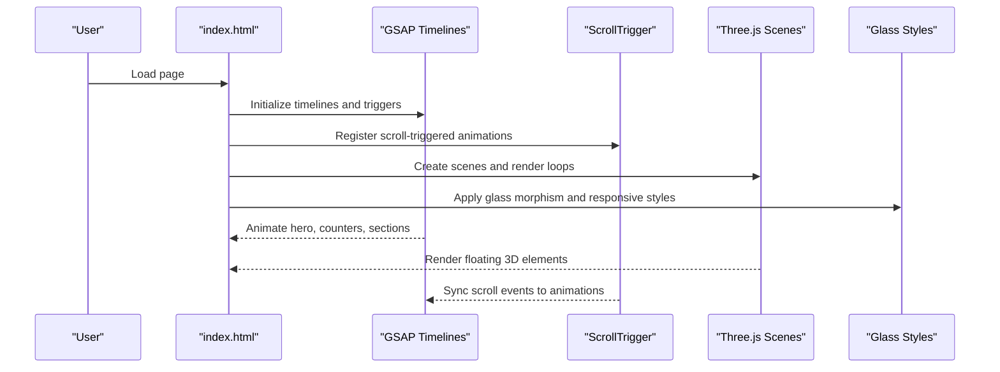

**Diagram sources**
- [assets/js/index.js:1-2203](file://assets/js/index.js#L1-L2203)
- [assets/css/index.css:1-3513](file://assets/css/index.css#L1-L3513)

## Detailed Component Analysis

### Hero Section: Floating Medical Equipment and Orbit
The hero section combines:
- Animated gradient mesh background for depth
- A Three.js canvas rendering floating 3D medical equipment
- A hero text area with animated entrance
- An interactive orbit container with course nodes

Implementation highlights:
- Three.js scene setup with fog, camera, renderer, and materials
- Floating elements created from geometric primitives and assembled into groups
- Organic drift and sway motion per element
- Mouse influence on camera and subtle breathing effect
- Performance optimization by deferring heavy initialization and using intersection observer

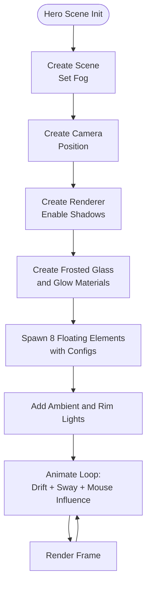

**Diagram sources**
- [assets/js/index.js:105-432](file://assets/js/index.js#L105-L432)

**Section sources**
- [index.html:32-102](file://index.html#L32-L102)
- [assets/js/index.js:105-432](file://assets/js/index.js#L105-L432)
- [assets/css/index.css:75-158](file://assets/css/index.css#L75-L158)

### Interactive Course Selection Orbit
The orbit container animates course nodes around a circular path with:
- Initial scale-up and staggered bursts
- Continuous rotation with dynamic z-index wrapping
- Responsive sizing and positioning

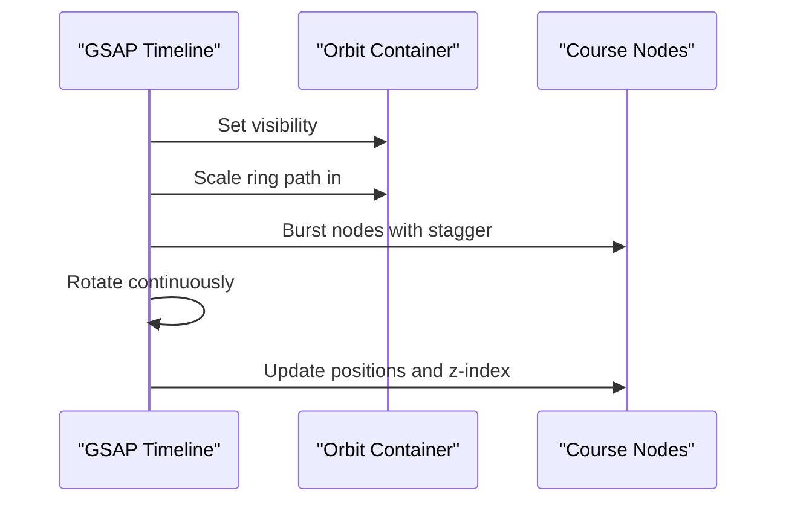

**Diagram sources**
- [assets/js/index.js:434-497](file://assets/js/index.js#L434-L497)

**Section sources**
- [index.html:78-96](file://index.html#L78-L96)
- [assets/js/index.js:434-497](file://assets/js/index.js#L434-L497)

### Magnetic Button Effects
Magnetic buttons respond to mouse movement with:
- Calculated offsets relative to button bounds
- RequestAnimationFrame throttling
- Elastic return animation on mouse leave

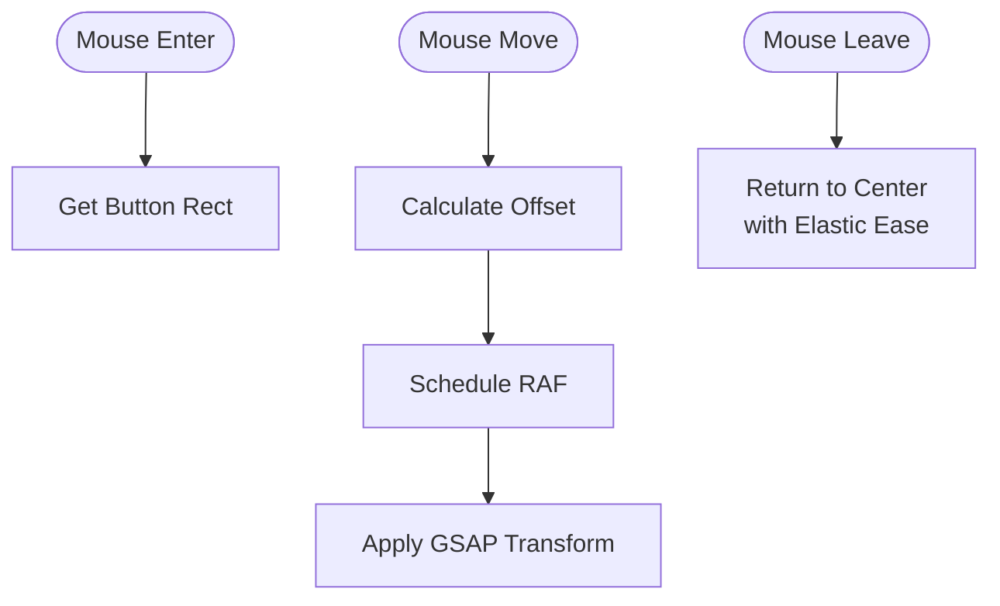

**Diagram sources**
- [assets/js/index.js:58-84](file://assets/js/index.js#L58-L84)

**Section sources**
- [assets/js/index.js:58-84](file://assets/js/index.js#L58-L84)

### GSAP Timeline Management for Hero Animations
The hero entrance uses a timeline coordinating:
- Text and visual elements with staggered fades and blur removal
- Phone mockup scaling and bouncing
- Orbit ring path reveal and node bursts
- Continuous orbit rotation with z-index management

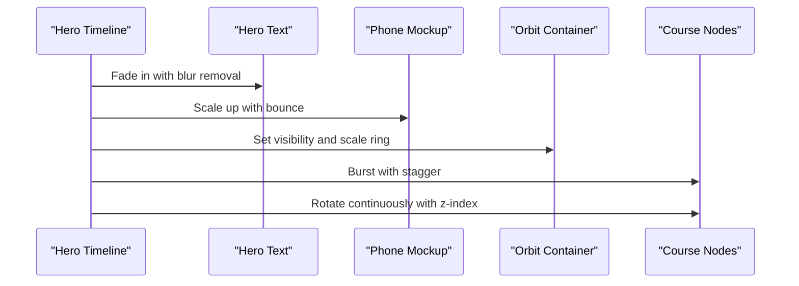

**Diagram sources**
- [assets/js/index.js:4-21](file://assets/js/index.js#L4-L21)
- [assets/js/index.js:434-497](file://assets/js/index.js#L434-L497)

**Section sources**
- [assets/js/index.js:4-21](file://assets/js/index.js#L4-L21)
- [assets/js/index.js:434-497](file://assets/js/index.js#L434-L497)

### Scroll-Triggered Effects
Scroll-triggered animations include:
- Trust panel fade-in and float
- Counter animations on panel entry
- Section entrances for courses and about sections
- Parallax effects for images within cards

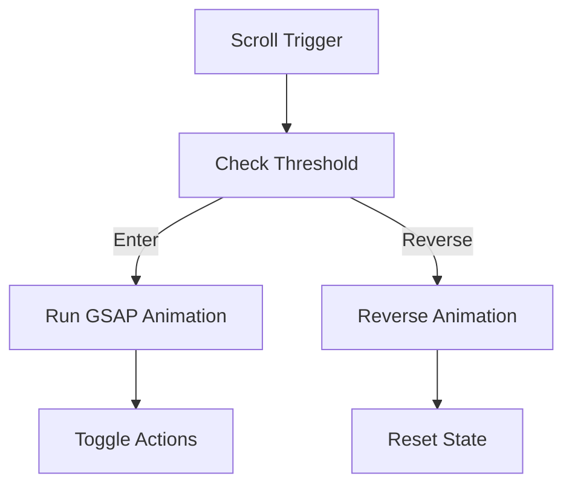

**Diagram sources**
- [assets/js/index.js:499-537](file://assets/js/index.js#L499-L537)
- [assets/js/index.js:546-559](file://assets/js/index.js#L546-L559)
- [assets/js/index.js:718-787](file://assets/js/index.js#L718-L787)

**Section sources**
- [assets/js/index.js:499-537](file://assets/js/index.js#L499-L537)
- [assets/js/index.js:546-559](file://assets/js/index.js#L546-L559)
- [assets/js/index.js:718-787](file://assets/js/index.js#L718-L787)

### Glass Morphism UI Elements
Glass morphism is implemented through:
- Frosted panels with backdrop filters and borders
- Gradient overlays and sheen effects
- Transparent design components with soft shadows
- Responsive adjustments for mobile and tablet

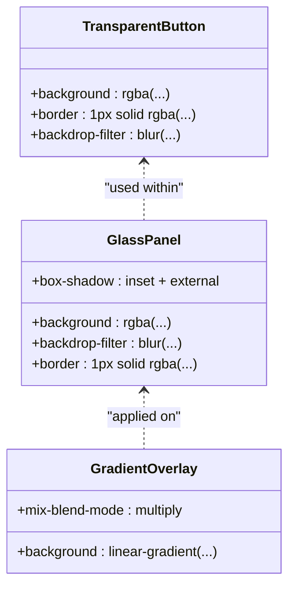

**Diagram sources**
- [assets/css/index.css:232-413](file://assets/css/index.css#L232-L413)

**Section sources**
- [assets/css/index.css:232-413](file://assets/css/index.css#L232-L413)

### Counter Section Implementation
The counter section features:
- Animated statistics display triggered on scroll
- Smooth counting from zero to target values
- ScrollTrigger integration for performance

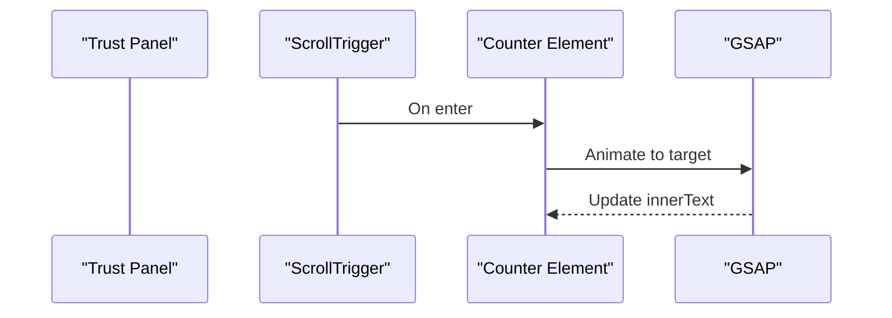

**Diagram sources**
- [assets/js/index.js:516-537](file://assets/js/index.js#L516-L537)

**Section sources**
- [index.html:104-132](file://index.html#L104-L132)
- [assets/js/index.js:516-537](file://assets/js/index.js#L516-L537)

### Course Showcase with Detailed Card Layouts
The course showcase includes:
- Glass panels with image overlays and feature lists
- Interactive magnetic buttons and hover states
- Responsive grid layout with mobile adjustments

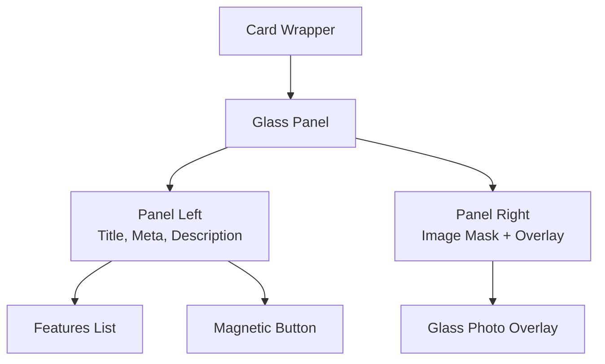

**Diagram sources**
- [index.html:169-262](file://index.html#L169-L262)

**Section sources**
- [index.html:169-262](file://index.html#L169-L262)

### Three.js Scene Setup, Animation Loops, and Lighting Systems
Three.js scenes are configured with:
- Physical materials for frosted glass and glow effects
- Ambient and rim lighting for depth
- Intersection observers to pause rendering when off-screen
- Responsive resize handling

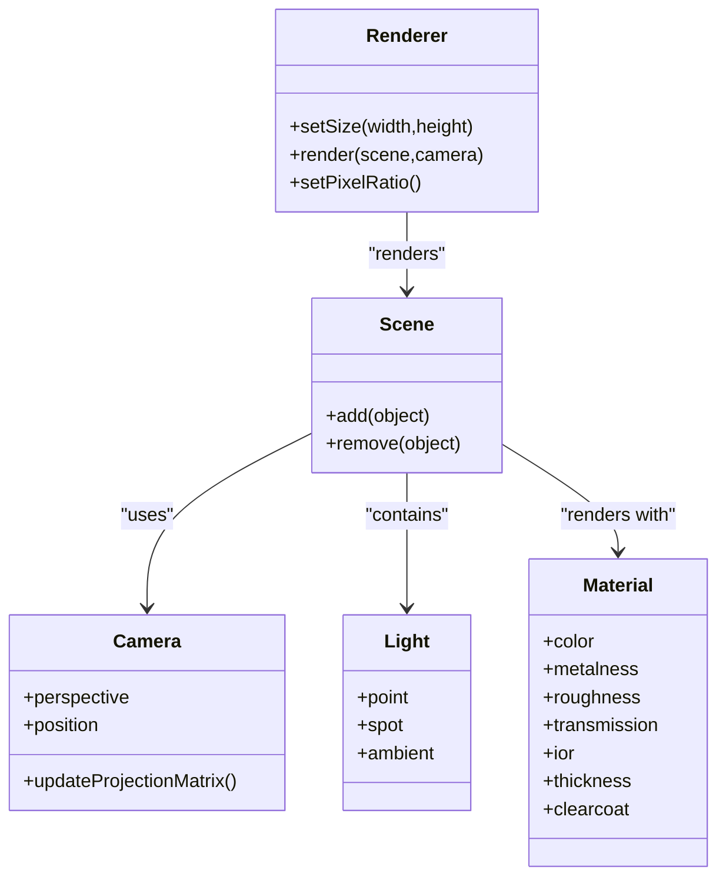

**Diagram sources**
- [assets/js/index.js:107-118](file://assets/js/index.js#L107-L118)
- [assets/js/index.js:310-333](file://assets/js/index.js#L310-L333)
- [assets/js/index.js:565-574](file://assets/js/index.js#L565-L574)
- [assets/js/index.js:633-640](file://assets/js/index.js#L633-L640)

**Section sources**
- [assets/js/index.js:107-118](file://assets/js/index.js#L107-L118)
- [assets/js/index.js:310-333](file://assets/js/index.js#L310-L333)
- [assets/js/index.js:565-574](file://assets/js/index.js#L565-L574)
- [assets/js/index.js:633-640](file://assets/js/index.js#L633-L640)

### Responsive Design and Cross-Browser Compatibility
Responsive design includes:
- Media queries for mobile and tablet layouts
- Flexible typography and spacing
- Performance-conscious viewport adjustments for Three.js cameras

Cross-browser considerations:
- Lenis smooth scrolling integration with GSAP ticker
- IntersectionObserver fallbacks for off-screen rendering pauses
- Pixel ratio adjustments for high-DPI displays

**Section sources**
- [assets/css/index.css:470-656](file://assets/css/index.css#L470-L656)
- [assets/js/index.js:420-432](file://assets/js/index.js#L420-L432)
- [assets/js/index.js:1615-1619](file://assets/js/index.js#L1615-L1619)

## Dependency Analysis
Key dependencies and relationships:
- HTML provides structural sections and interactive elements
- CSS defines glass morphism, gradients, and responsive behavior
- JavaScript orchestrates GSAP, ScrollTrigger, and Three.js
- Three.js relies on physical materials and lighting for realistic visuals
- IntersectionObserver and resize handlers optimize performance

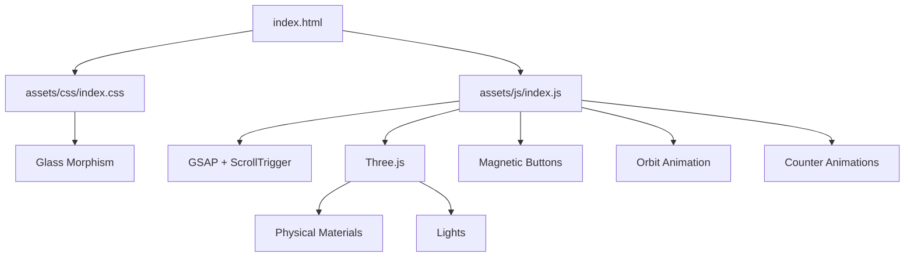

**Diagram sources**
- [index.html:1-1602](file://index.html#L1-L1602)
- [assets/js/index.js:1-2203](file://assets/js/index.js#L1-L2203)
- [assets/css/index.css:1-3513](file://assets/css/index.css#L1-L3513)

**Section sources**
- [index.html:1-1602](file://index.html#L1-L1602)
- [assets/js/index.js:1-2203](file://assets/js/index.js#L1-L2203)
- [assets/css/index.css:1-3513](file://assets/css/index.css#L1-L3513)

## Performance Considerations
- Deferred heavy WebGL payload to ensure hero entrance remains smooth
- Intersection observers pause rendering when off-screen
- RequestAnimationFrame throttling for magnetic buttons and carousel interactions
- Pixel ratio caps for high-DPI devices
- Scroll-trigger scrubbing for smooth parallax and entrance animations
- Efficient DOM measurement caching for carousels and responsive layouts

[No sources needed since this section provides general guidance]

## Troubleshooting Guide
Common issues and resolutions:
- Buttons not responding: verify magnetic button event listeners and requestAnimationFrame cancellation
- Three.js scene not rendering: confirm camera aspect updates and pixel ratio settings on resize
- Scroll-trigger animations not firing: ensure ScrollTrigger is registered and triggers are positioned correctly
- Glass morphism artifacts: verify backdrop-filter support and avoid excessive blur on low-end devices

**Section sources**
- [assets/js/index.js:58-84](file://assets/js/index.js#L58-L84)
- [assets/js/index.js:414-432](file://assets/js/index.js#L414-L432)
- [assets/js/index.js:499-537](file://assets/js/index.js#L499-L537)

## Conclusion
The Eduooz homepage achieves a visually immersive experience through the seamless integration of glass morphism, interactive 3D animations, and scroll-triggered storytelling. The implementation balances aesthetic appeal with performance, leveraging Three.js for realistic materials and GSAP for precise timing and cross-browser compatibility. The modular structure and responsive design ensure accessibility across devices while maintaining a premium feel.