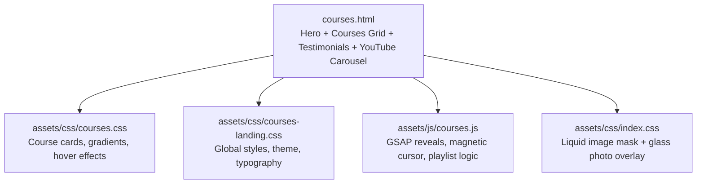
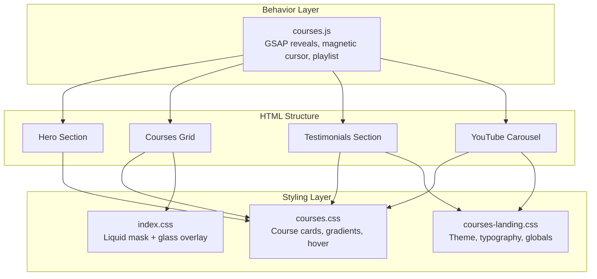
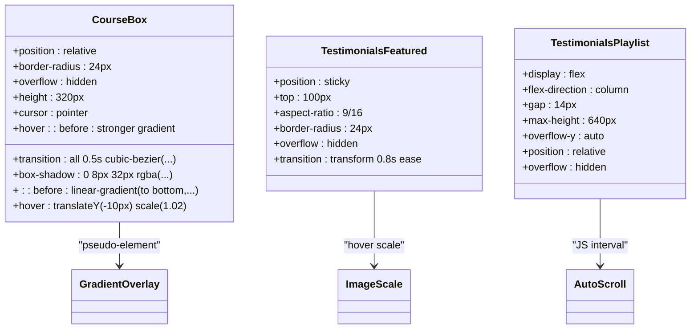
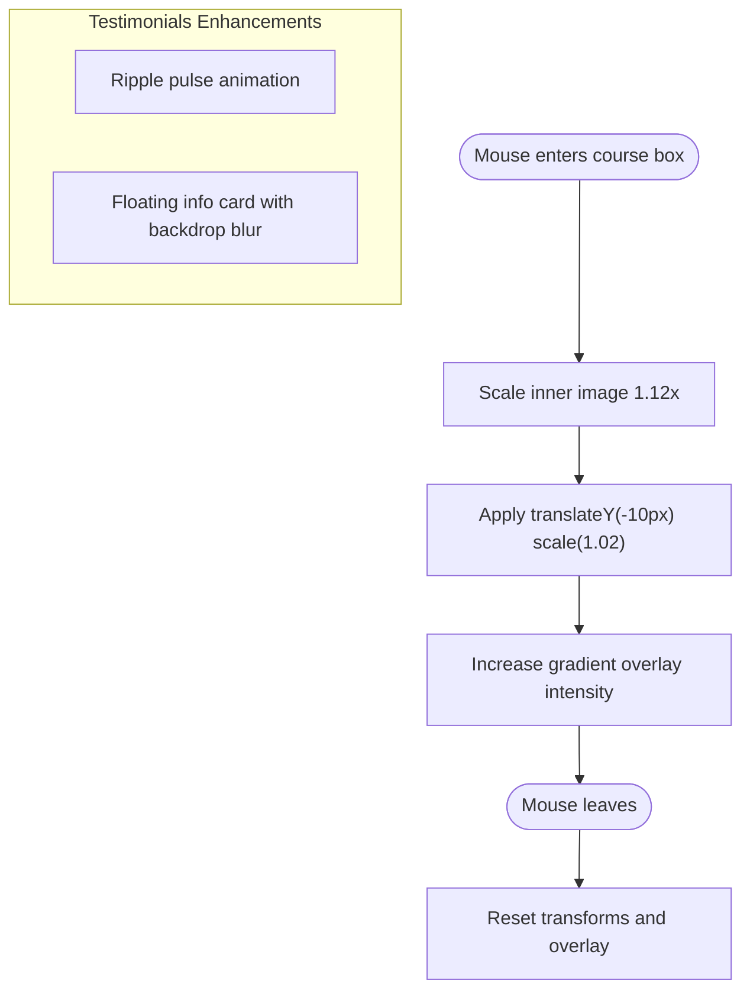
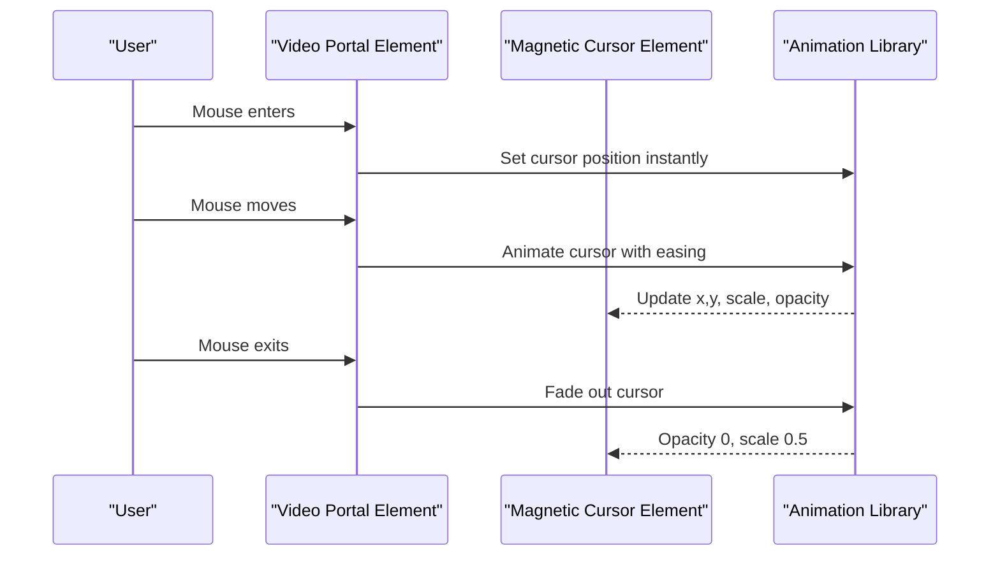
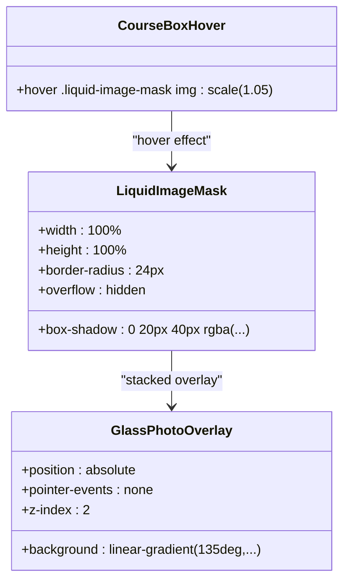
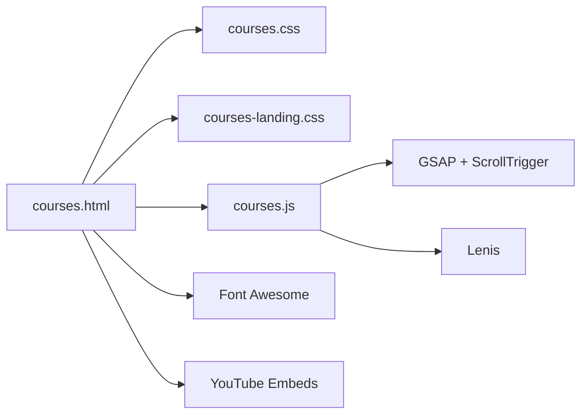

# Interactive Course Showcase

<cite>
**Referenced Files in This Document**
- [courses.html](file://courses.html)
- [courses.css](file://assets/css/courses.css)
- [courses-landing.css](file://assets/css/courses-landing.css)
- [courses.js](file://assets/js/courses.js)
- [index.css](file://assets/css/index.css)
</cite>

## Table of Contents
1. [Introduction](#introduction)
2. [Project Structure](#project-structure)
3. [Core Components](#core-components)
4. [Architecture Overview](#architecture-overview)
5. [Detailed Component Analysis](#detailed-component-analysis)
6. [Dependency Analysis](#dependency-analysis)
7. [Performance Considerations](#performance-considerations)
8. [Troubleshooting Guide](#troubleshooting-guide)
9. [Conclusion](#conclusion)

## Introduction
This document explains the interactive course showcase implementation, focusing on the stacked card system with sticky positioning, parallax-like hover animations, magnetic button effects, course card layout with image masking and gradient overlays, liquid image mask technique, glass photo overlay effects, responsive behavior, touch interactions, and accessibility considerations.

## Project Structure
The interactive showcase spans three main areas:
- Course hero and featured courses grid
- Video testimonials section with sticky panel
- YouTube carousel with dynamic playlist

**Diagram sources**
- [courses.html:40-609](file://courses.html#L40-L609)
- [courses.css:124-217](file://assets/css/courses.css#L124-L217)
- [courses-landing.css:1-120](file://assets/css/courses-landing.css#L1-L120)
- [courses.js:1-120](file://assets/js/courses.js#L1-L120)
- [index.css:2333-2348](file://assets/css/index.css#L2333-L2348)

**Section sources**
- [courses.html:40-609](file://courses.html#L40-L609)
- [courses.css:124-217](file://assets/css/courses.css#L124-L217)
- [courses-landing.css:1-120](file://assets/css/courses-landing.css#L1-L120)
- [courses.js:1-120](file://assets/js/courses.js#L1-L120)
- [index.css:2333-2348](file://assets/css/index.css#L2333-L2348)

## Core Components
- Stacked card system with gradient overlays and hover elevation
- Sticky testimonials panel with parallax-like image scaling
- Magnetic cursor effect for video portal
- Liquid image mask and glass photo overlay for course cards
- Responsive grid with adaptive heights and breakpoints
- Touch-friendly interactions for mobile devices

**Section sources**
- [courses.css:175-217](file://assets/css/courses.css#L175-L217)
- [courses.css:299-329](file://assets/css/courses.css#L299-L329)
- [courses.css:1163-1238](file://assets/css/courses.css#L1163-L1238)
- [courses.js:405-441](file://assets/js/courses.js#L405-L441)
- [index.css:2333-2348](file://assets/css/index.css#L2333-L2348)

## Architecture Overview
The showcase combines HTML semantic structure, layered CSS effects, and JavaScript-driven animations to deliver an immersive experience.

**Diagram sources**
- [courses.html:40-609](file://courses.html#L40-L609)
- [courses.css:124-217](file://assets/css/courses.css#L124-L217)
- [courses-landing.css:1-120](file://assets/css/courses-landing.css#L1-L120)
- [index.css:2333-2348](file://assets/css/index.css#L2333-L2348)
- [courses.js:1-120](file://assets/js/courses.js#L1-L120)

## Detailed Component Analysis

### Stacked Card System with Sticky Positioning
The course cards use layered pseudo-elements for gradient overlays and transform-based hover elevation. The testimonials section employs sticky positioning for a prominent video panel.

**Diagram sources**
- [courses.css:175-217](file://assets/css/courses.css#L175-L217)
- [courses.css:191-216](file://assets/css/courses.css#L191-L216)
- [courses.css:299-329](file://assets/css/courses.css#L299-L329)
- [courses.css:300-303](file://assets/css/courses.css#L300-L303)
- [courses.css:477-494](file://assets/css/courses.css#L477-L494)

**Section sources**
- [courses.css:175-217](file://assets/css/courses.css#L175-L217)
- [courses.css:191-216](file://assets/css/courses.css#L191-L216)
- [courses.css:299-329](file://assets/css/courses.css#L299-L329)
- [courses.css:300-303](file://assets/css/courses.css#L300-L303)
- [courses.css:477-494](file://assets/css/courses.css#L477-L494)

### Parallax Effects and Hover Animations
Course cards implement subtle image scaling on hover, simulating a parallax-like depth effect. The testimonials panel enhances this with animated play button ripples and floating info cards.

**Diagram sources**
- [courses.css:1181-1184](file://assets/css/courses.css#L1181-L1184)
- [courses.css:205-208](file://assets/css/courses.css#L205-L208)
- [courses.css:210-216](file://assets/css/courses.css#L210-L216)
- [courses.css:358-385](file://assets/css/courses.css#L358-L385)
- [courses.css:387-403](file://assets/css/courses.css#L387-L403)

**Section sources**
- [courses.css:1181-1184](file://assets/css/courses.css#L1181-L1184)
- [courses.css:205-208](file://assets/css/courses.css#L205-L208)
- [courses.css:210-216](file://assets/css/courses.css#L210-L216)
- [courses.css:358-385](file://assets/css/courses.css#L358-L385)
- [courses.css:387-403](file://assets/css/courses.css#L387-L403)

### Magnetic Button Effects and Cursor Interaction Detection
The showcase implements magnetic cursor behavior for the main video portal. The cursor snaps to the element on enter, follows mouse movement with easing, and fades out on exit. This creates a compelling "magnetic" feel for interactive elements.

**Diagram sources**
- [courses.js:405-441](file://assets/js/courses.js#L405-L441)

**Section sources**
- [courses.js:405-441](file://assets/js/courses.js#L405-L441)

### Course Card Layout: Image Masking and Gradient Overlays
Course cards utilize a liquid image mask pattern with a gradient overlay to enhance depth and readability. The mask scales the underlying image on hover, while the overlay adjusts for contrast.

**Diagram sources**
- [index.css:2333-2348](file://assets/css/index.css#L2333-L2348)

**Section sources**
- [index.css:2333-2348](file://assets/css/index.css#L2333-L2348)

### Liquid Image Mask Technique
The liquid image mask technique applies a scaled image inside a clipped container to achieve a subtle zoom effect. Combined with a gradient overlay, it improves visual hierarchy and readability.

Implementation highlights:
- Container with rounded corners and overflow hidden
- Full-bleed image with object-fit cover
- Hover transform to scale the image slightly
- Overlay gradient for text legibility

**Section sources**
- [index.css:2333-2348](file://assets/css/index.css#L2333-L2348)
- [courses.css:1174-1184](file://assets/css/courses.css#L1174-L1184)

### Glass Photo Overlay Effects
Glass photo overlays use layered gradients to simulate frosted glass and depth. They complement the liquid mask by softening edges and enhancing contrast.

Key features:
- Multi-stop gradient overlay
- Backdrop blur for depth perception
- Hover-triggered scaling for emphasis

**Section sources**
- [index.css:2343-2348](file://assets/css/index.css#L2343-L2348)
- [courses.css:1174-1184](file://assets/css/courses.css#L1174-L1184)

### Responsive Behavior and Touch Interaction Handling
The showcase adapts across screen sizes:
- Grid columns adjust from 4 (desktop) to 1 (mobile)
- Course card heights scale down for smaller screens
- Sticky behavior switches to static on smaller viewports
- Touch-friendly playlist items and hover states disabled on mobile

Responsive hooks:
- Media queries for grid template columns
- Sticky overrides for smaller screens
- Mobile-specific hover resets and touch toggles

**Section sources**
- [courses.css:169-173](file://assets/css/courses.css#L169-L173)
- [courses.css:1202-1238](file://assets/css/courses.css#L1202-L1238)
- [courses.css:631-645](file://assets/css/courses.css#L631-L645)
- [courses.css:647-663](file://assets/css/courses.css#L647-L663)

### Accessibility Considerations
- Focus management for interactive elements (buttons, cards)
- Reduced motion preferences respected via transform resets
- Sufficient color contrast maintained in gradient overlays
- Semantic HTML structure for navigation and content sections
- Keyboard navigable tabs and playlists

[No sources needed since this section provides general guidance]

## Dependency Analysis
The interactive showcase relies on:
- GSAP for smooth animations and scroll-triggered reveals
- Lenis for smooth scrolling integration
- Font Awesome icons for visual cues
- YouTube embeds for video content

**Diagram sources**
- [courses.html:1-33](file://courses.html#L1-L33)
- [courses.js:1-33](file://assets/js/courses.js#L1-L33)

**Section sources**
- [courses.html:1-33](file://courses.html#L1-L33)
- [courses.js:1-33](file://assets/js/courses.js#L1-L33)

## Performance Considerations
- Prefer transform and opacity for animations to leverage GPU acceleration
- Use will-change and transform3d hints sparingly to avoid jank
- Lazy-load heavy images and videos
- Debounce resize handlers and scroll listeners
- Minimize repaints by batching DOM reads/writes

[No sources needed since this section provides general guidance]

## Troubleshooting Guide
Common issues and resolutions:
- Magnetic cursor not appearing: Verify GSAP availability and element selectors
- Hover effects not firing: Confirm CSS hover states and z-index stacking
- Sticky panel misalignment: Check sticky offsets and viewport calculations
- Playlist auto-slide conflicts: Ensure animation state flags are properly managed

**Section sources**
- [courses.js:405-441](file://assets/js/courses.js#L405-L441)
- [courses.css:300-303](file://assets/css/courses.css#L300-L303)
- [courses.css:631-645](file://assets/css/courses.css#L631-L645)

## Conclusion
The interactive course showcase combines layered CSS effects, responsive design, and JavaScript-driven animations to create an engaging, accessible, and performant user experience. The stacked card system, sticky panel, magnetic cursor, and liquid image mask techniques work together to deliver a modern, polished interface suitable for showcasing educational content across devices.