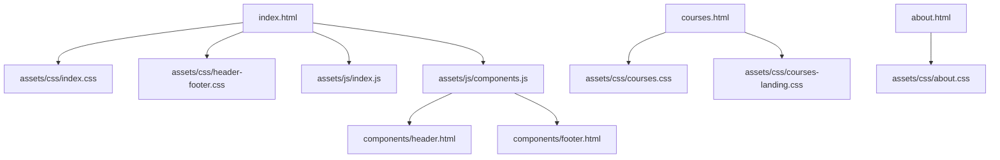
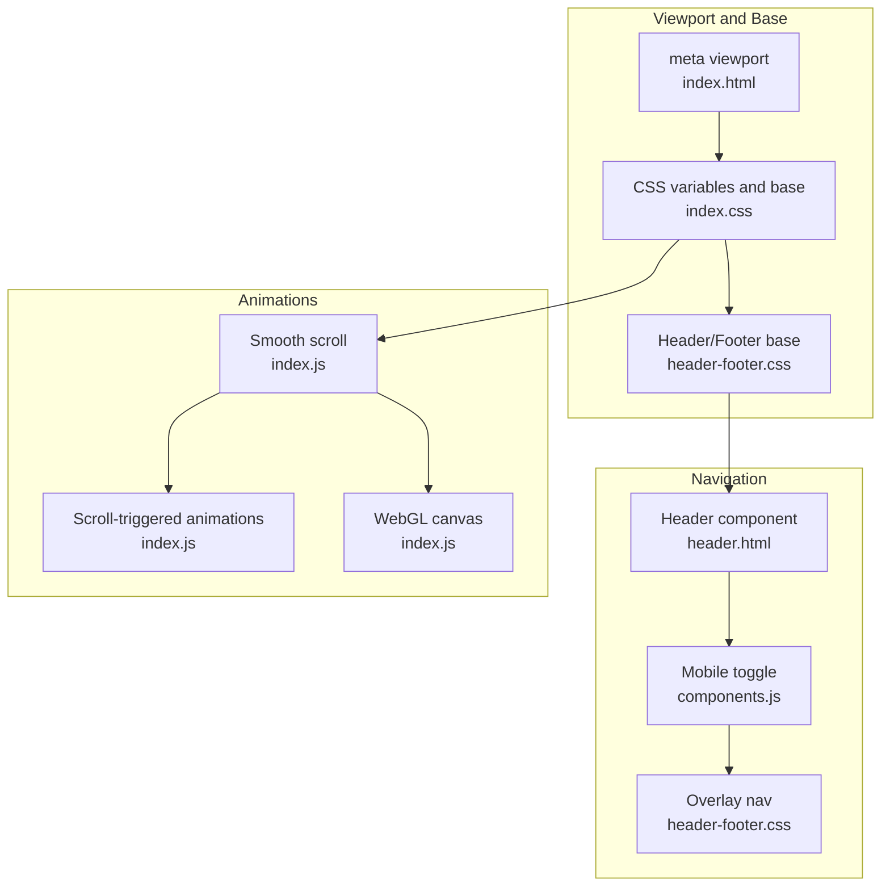
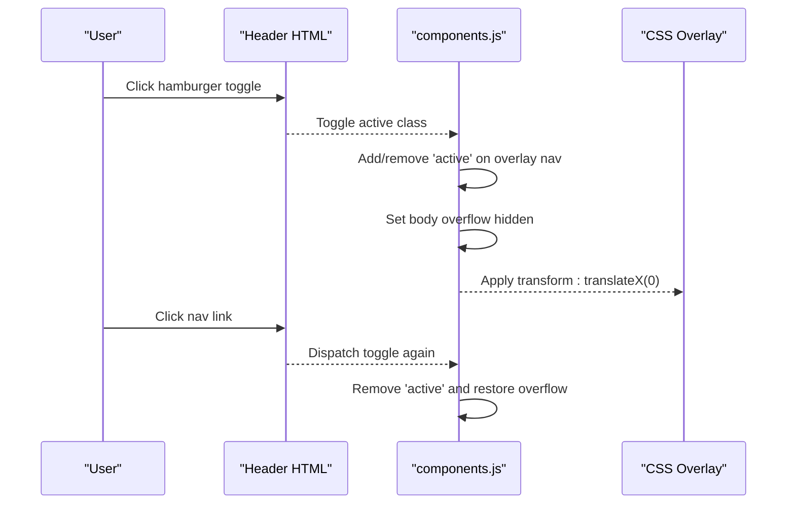
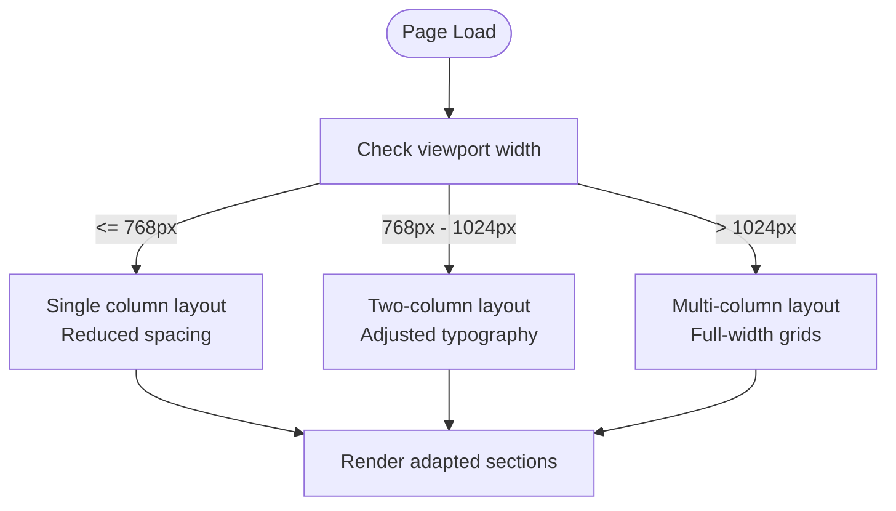
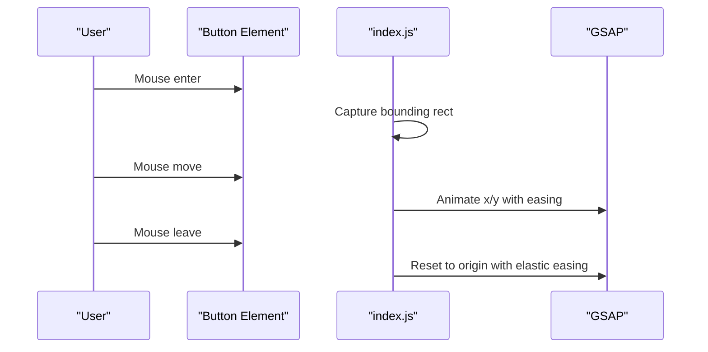
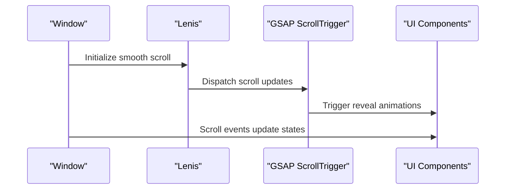
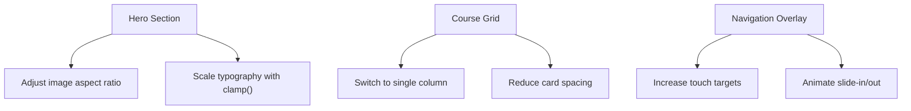
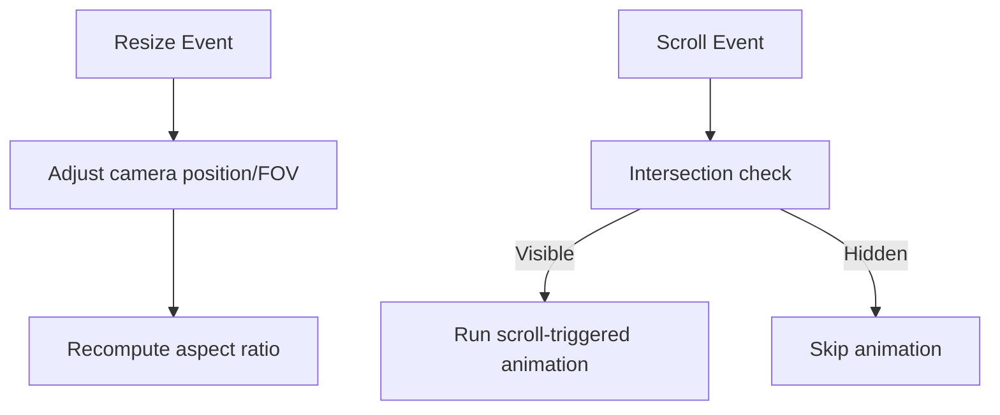
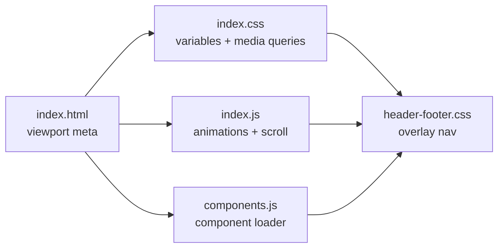

# Mobile Responsiveness

<cite>
**Referenced Files in This Document**
- [index.html](file://index.html)
- [index.css](file://assets/css/index.css)
- [header-footer.css](file://assets/css/header-footer.css)
- [index.js](file://assets/js/index.js)
- [components.js](file://assets/js/components.js)
- [header.html](file://components/header.html)
- [footer.html](file://components/footer.html)
- [courses.css](file://assets/css/courses.css)
- [courses-landing.css](file://assets/css/courses-landing.css)
- [about.css](file://assets/css/about.css)
</cite>

## Table of Contents
1. [Introduction](#introduction)
2. [Project Structure](#project-structure)
3. [Core Components](#core-components)
4. [Architecture Overview](#architecture-overview)
5. [Detailed Component Analysis](#detailed-component-analysis)
6. [Dependency Analysis](#dependency-analysis)
7. [Performance Considerations](#performance-considerations)
8. [Troubleshooting Guide](#troubleshooting-guide)
9. [Conclusion](#conclusion)

## Introduction
This document explains how the Eduooz website implements mobile responsiveness and touch interaction handling. It covers the mobile-first design approach, flexible grid system, adaptive layouts, mobile navigation with a hamburger menu, gesture-aware scroll behavior, and touch-friendly UI elements. It also documents viewport configuration, media queries, device-specific optimizations, responsive component adaptations, animation adjustments for mobile, and performance considerations for battery life and network efficiency.

## Project Structure
The project follows a component-driven structure with:
- A shared header and footer injected via a lightweight component loader
- Page-specific stylesheets for index, courses, and about
- A unified stylesheet for global responsive patterns and animations
- JavaScript modules for page-specific animations and mobile navigation

**Diagram sources**
- [index.html:1-25](file://index.html#L1-L25)
- [index.css:1-80](file://assets/css/index.css#L1-L80)
- [header-footer.css:1-120](file://assets/css/header-footer.css#L1-L120)
- [index.js:1-120](file://assets/js/index.js#L1-L120)
- [components.js:1-120](file://assets/js/components.js#L1-L120)
- [header.html:1-22](file://components/header.html#L1-L22)
- [footer.html:1-75](file://components/footer.html#L1-L75)
- [courses.css:1-120](file://assets/css/courses.css#L1-L120)
- [courses-landing.css:1-120](file://assets/css/courses-landing.css#L1-L120)
- [about.css:1-120](file://assets/css/about.css#L1-L120)

**Section sources**
- [index.html:1-25](file://index.html#L1-L25)
- [index.css:1-80](file://assets/css/index.css#L1-L80)
- [header-footer.css:1-120](file://assets/css/header-footer.css#L1-L120)
- [index.js:1-120](file://assets/js/index.js#L1-L120)
- [components.js:1-120](file://assets/js/components.js#L1-L120)
- [header.html:1-22](file://components/header.html#L1-L22)
- [footer.html:1-75](file://components/footer.html#L1-L75)
- [courses.css:1-120](file://assets/css/courses.css#L1-L120)
- [courses-landing.css:1-120](file://assets/css/courses-landing.css#L1-L120)
- [about.css:1-120](file://assets/css/about.css#L1-L120)

## Core Components
- Viewport and base styles: configured in the main HTML head and global CSS for mobile-first typography and layout.
- Navigation: a fixed glass header with a hamburger menu that transforms into a full-screen overlay on small screens.
- Animations and scroll: smooth scroll integration, scroll-triggered animations, and responsive WebGL canvases.
- Touch-friendly UI: large tap targets, magnetic buttons, and interactive cards optimized for finger input.

**Section sources**
- [index.html:4-24](file://index.html#L4-L24)
- [index.css:1-80](file://assets/css/index.css#L1-L80)
- [header-footer.css:1-120](file://assets/css/header-footer.css#L1-L120)
- [index.js:1-120](file://assets/js/index.js#L1-L120)
- [components.js:287-347](file://assets/js/components.js#L287-L347)

## Architecture Overview
The mobile responsiveness architecture combines:
- CSS Grid and Flexbox for flexible layouts
- Media queries targeting common breakpoints
- JavaScript-driven mobile navigation and scroll behavior
- Device-specific optimizations for camera and WebGL rendering

**Diagram sources**
- [index.html:4-24](file://index.html#L4-L24)
- [index.css:1-80](file://assets/css/index.css#L1-L80)
- [header-footer.css:1-120](file://assets/css/header-footer.css#L1-L120)
- [header.html:1-22](file://components/header.html#L1-L22)
- [components.js:287-347](file://assets/js/components.js#L287-L347)
- [index.js:1-120](file://assets/js/index.js#L1-L120)

## Detailed Component Analysis

### Mobile Navigation and Hamburger Menu
- The header component defines a desktop navigation bar and a hamburger toggle.
- On small screens, clicking the toggle slides in a full-screen overlay navigation with animated transforms.
- Outside clicks close the overlay, and body overflow is temporarily disabled to prevent background scroll.

**Diagram sources**
- [header.html:1-22](file://components/header.html#L1-L22)
- [components.js:287-347](file://assets/js/components.js#L287-L347)
- [header-footer.css:320-390](file://assets/css/header-footer.css#L320-L390)

**Section sources**
- [header.html:1-22](file://components/header.html#L1-L22)
- [components.js:287-347](file://assets/js/components.js#L287-L347)
- [header-footer.css:320-390](file://assets/css/header-footer.css#L320-L390)

### Responsive Grid System and Adaptive Layouts
- A custom CSS Grid system uses fractional widths and flexbox to adapt content across breakpoints.
- Media queries adjust column widths, spacing, and typography for tablets and phones.
- Sections reflow into single-column layouts on narrow screens to maintain readability.

**Diagram sources**
- [index.css:190-230](file://assets/css/index.css#L190-L230)
- [courses.css:169-175](file://assets/css/courses.css#L169-L175)
- [courses-landing.css:440-442](file://assets/css/courses-landing.css#L440-L442)
- [about.css:34-46](file://assets/css/about.css#L34-L46)

**Section sources**
- [index.css:190-230](file://assets/css/index.css#L190-L230)
- [courses.css:169-175](file://assets/css/courses.css#L169-L175)
- [courses-landing.css:440-442](file://assets/css/courses-landing.css#L440-L442)
- [about.css:34-46](file://assets/css/about.css#L34-L46)

### Touch Interaction Handling
- Magnetic buttons provide subtle parallax-like movement on hover/mousemove and animate back on leave.
- The chat FAB and tooltips are designed with large hit targets and clear affordances.
- Scroll behavior integrates smooth scrolling libraries and scroll-triggered animations.

**Diagram sources**
- [index.js:58-84](file://assets/js/index.js#L58-L84)
- [header-footer.css:492-534](file://assets/css/header-footer.css#L492-L534)

**Section sources**
- [index.js:58-84](file://assets/js/index.js#L58-L84)
- [header-footer.css:492-534](file://assets/css/header-footer.css#L492-L534)

### Gesture Support and Smooth Scrolling
- Smooth scroll integration is initialized and coordinated with scroll-triggered animations.
- Scroll events update UI states and trigger animations only when appropriate.

**Diagram sources**
- [index.js:22-57](file://assets/js/index.js#L22-L57)
- [index.css:35-56](file://assets/css/index.css#L35-L56)

**Section sources**
- [index.js:22-57](file://assets/js/index.js#L22-L57)
- [index.css:35-56](file://assets/css/index.css#L35-L56)

### Responsive Component Adaptations
- Hero sections adjust image proportions and text sizes for smaller screens.
- Cards and grids switch to single-column layouts and reduce spacing.
- Navigation overlays and buttons scale appropriately for touch.

**Diagram sources**
- [index.css:372-381](file://assets/css/index.css#L372-L381)
- [courses.css:169-175](file://assets/css/courses.css#L169-L175)
- [courses-landing.css:440-442](file://assets/css/courses-landing.css#L440-L442)
- [header-footer.css:320-390](file://assets/css/header-footer.css#L320-L390)

**Section sources**
- [index.css:372-381](file://assets/css/index.css#L372-L381)
- [courses.css:169-175](file://assets/css/courses.css#L169-L175)
- [courses-landing.css:440-442](file://assets/css/courses-landing.css#L440-L442)
- [header-footer.css:320-390](file://assets/css/header-footer.css#L320-L390)

### Mobile Animation Adjustments
- WebGL canvases adjust camera distance and field of view on resize to fit mobile screens.
- Animations use requestAnimationFrame and throttled updates to balance performance and smoothness.
- Scroll-triggered animations are scoped to avoid unnecessary work offscreen.

**Diagram sources**
- [index.js:414-432](file://assets/js/index.js#L414-L432)
- [index.js:684-707](file://assets/js/index.js#L684-L707)

**Section sources**
- [index.js:414-432](file://assets/js/index.js#L414-L432)
- [index.js:684-707](file://assets/js/index.js#L684-L707)

### Touch Event Handling Examples
- Magnetic buttons: mousemove triggers proportional movement; mouseleave resets with easing.
- Chat FAB: delayed entrance, click toggles active state, and body class hides other overlays.
- Navigation toggle: click/tap toggles overlay and manages body overflow.

**Section sources**
- [index.js:58-84](file://assets/js/index.js#L58-L84)
- [components.js:109-154](file://assets/js/components.js#L109-L154)
- [components.js:293-314](file://assets/js/components.js#L293-L314)

## Dependency Analysis
Responsive behavior depends on:
- HTML viewport meta tag for proper scaling
- CSS custom properties and media queries for layout adaptation
- JavaScript modules for navigation and scroll integration
- Component loader for consistent header/footer across pages

**Diagram sources**
- [index.html:4-24](file://index.html#L4-L24)
- [index.css:1-80](file://assets/css/index.css#L1-L80)
- [header-footer.css:1-120](file://assets/css/header-footer.css#L1-L120)
- [index.js:1-120](file://assets/js/index.js#L1-L120)
- [components.js:1-120](file://assets/js/components.js#L1-L120)

**Section sources**
- [index.html:4-24](file://index.html#L4-L24)
- [index.css:1-80](file://assets/css/index.css#L1-L80)
- [header-footer.css:1-120](file://assets/css/header-footer.css#L1-L120)
- [index.js:1-120](file://assets/js/index.js#L1-L120)
- [components.js:1-120](file://assets/js/components.js#L1-L120)

## Performance Considerations
- Battery optimization
  - Defer heavy WebGL initialization until after the hero entrance to maintain 60 FPS during initial load.
  - Use requestAnimationFrame and throttle scroll updates to reduce CPU usage.
  - Avoid expensive filters and shadows on low-end devices; rely on hardware-accelerated transforms.

- Network efficiency
  - Preconnect to external fonts and CDNs to reduce DNS and handshake latency.
  - Use responsive images and appropriate quality settings; lazy-load non-critical resources.

- Rendering performance
  - Prefer transform and opacity for animations; avoid layout thrashing.
  - Use will-change or transform-style: preserve-3d judiciously to leverage GPU acceleration.

[No sources needed since this section provides general guidance]

## Troubleshooting Guide
- Navigation overlay not closing
  - Verify the toggle handler removes the active class and restores body overflow.
  - Confirm click handlers on nav links remove the overlay.

- Smooth scroll conflicts
  - Ensure the smooth scroll library initializes before scroll-triggered animations.
  - Check that scroll events are not firing excessively without intersection checks.

- WebGL rendering issues on mobile
  - Validate resize handlers update camera FOV and position.
  - Confirm deferred initialization avoids blocking the main thread.

**Section sources**
- [components.js:293-314](file://assets/js/components.js#L293-L314)
- [index.js:22-57](file://assets/js/index.js#L22-L57)
- [index.js:414-432](file://assets/js/index.js#L414-L432)

## Conclusion
Eduooz achieves robust mobile responsiveness through a mobile-first CSS framework, adaptive grid layouts, and a dedicated mobile navigation system. Touch interactions are enhanced with magnetic buttons and gesture-aware overlays. Smooth scrolling and scroll-triggered animations provide engaging experiences without sacrificing performance. The design balances visual richness with practical usability across a wide range of devices.