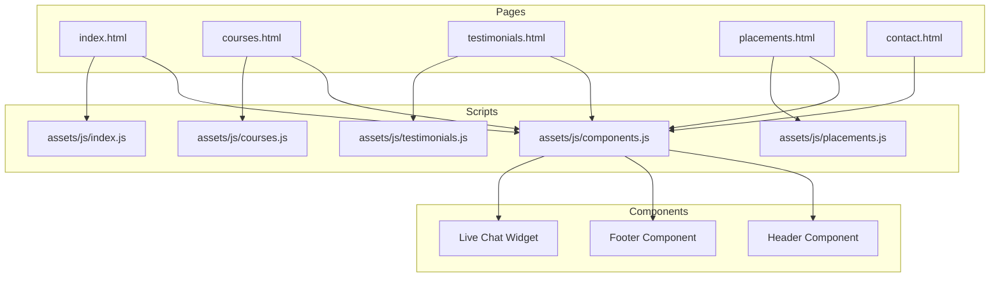
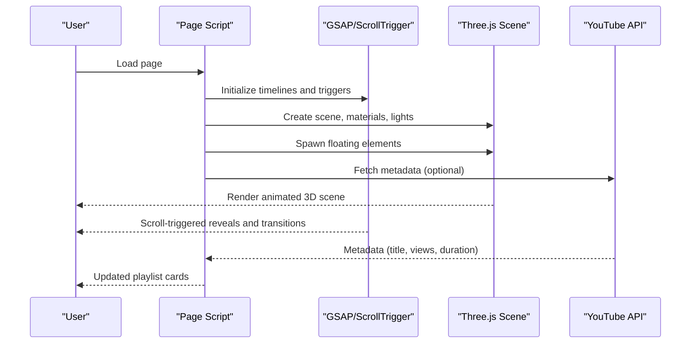
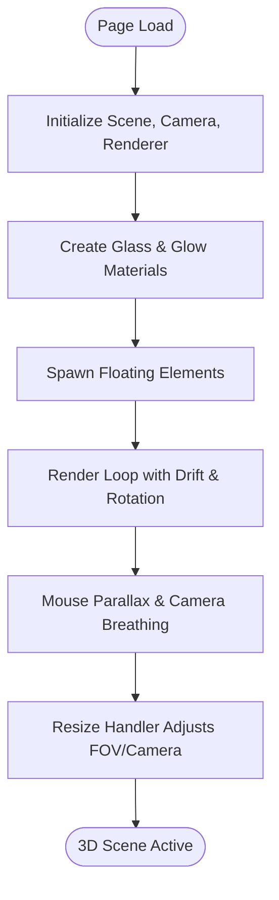
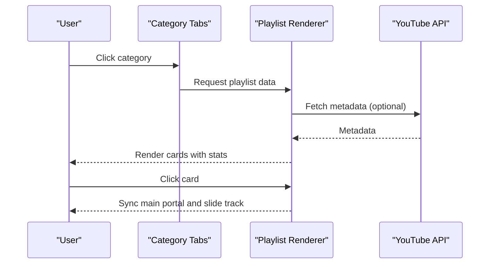
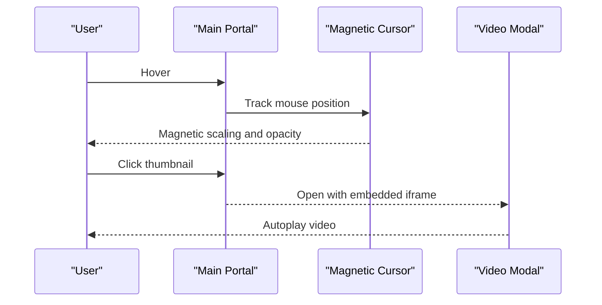
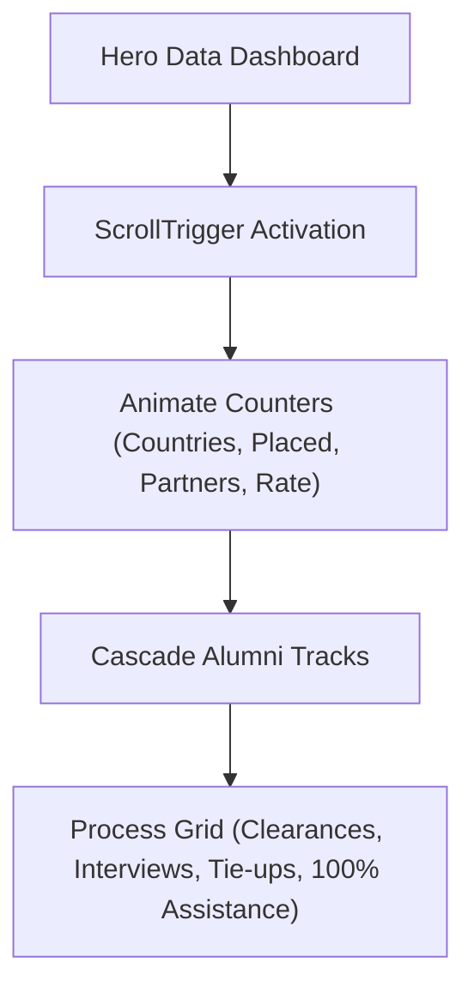
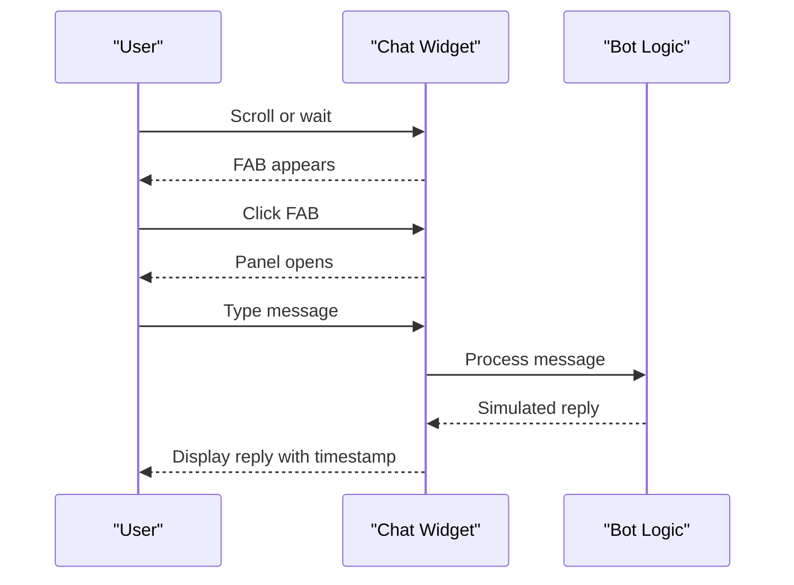
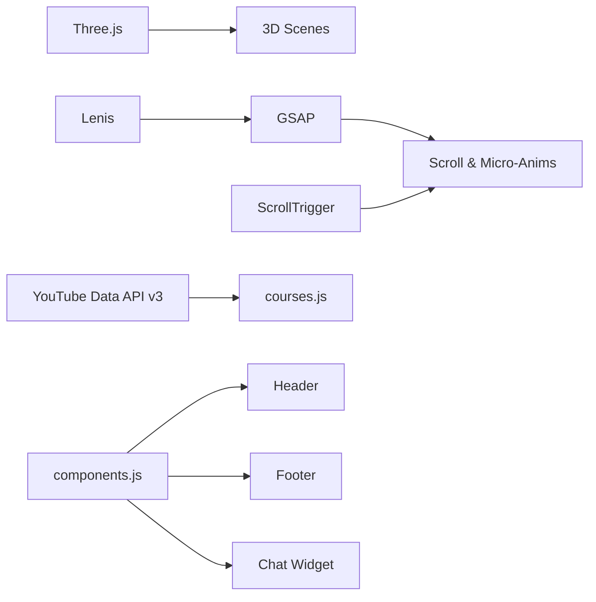

# Key Features and Capabilities

<cite>
**Referenced Files in This Document**
- [index.html](file://index.html)
- [courses.html](file://courses.html)
- [testimonials.html](file://testimonials.html)
- [placements.html](file://placements.html)
- [contact.html](file://contact.html)
- [index.js](file://assets/js/index.js)
- [courses.js](file://assets/js/courses.js)
- [testimonials.js](file://assets/js/testimonials.js)
- [placements.js](file://assets/js/placements.js)
- [components.js](file://assets/js/components.js)
</cite>

## Table of Contents
1. [Introduction](#introduction)
2. [Project Structure](#project-structure)
3. [Core Components](#core-components)
4. [Architecture Overview](#architecture-overview)
5. [Detailed Component Analysis](#detailed-component-analysis)
6. [Dependency Analysis](#dependency-analysis)
7. [Performance Considerations](#performance-considerations)
8. [Troubleshooting Guide](#troubleshooting-guide)
9. [Conclusion](#conclusion)

## Introduction
This document presents the key features and capabilities of the Eduooz educational platform, focusing on its immersive 3D healthcare-themed background animations, glass morphism UI design system, comprehensive course catalog with filtering, testimonial carousel with YouTube integration, faculty profiles with international certifications, placement results presentation, live chat widget, newsletter subscription system, and responsive mobile-first design. It also covers magnetic button interactions, scroll-triggered animations using GSAP, and a seamless component-based architecture that powers an engaging and effective platform for healthcare students.

## Project Structure
Eduooz follows a modular, component-based architecture:
- Static pages for each major section (Home, Courses, Testimonials, Placements, Contact)
- Shared UI components (header, footer, chat) loaded via a lightweight component loader
- Dedicated JavaScript modules for each page’s interactivity and animations
- CSS-driven glass morphism and responsive design

**Diagram sources**
- [index.html](file://index.html)
- [courses.html](file://courses.html)
- [testimonials.html](file://testimonials.html)
- [placements.html](file://placements.html)
- [contact.html](file://contact.html)
- [components.js](file://assets/js/components.js)
- [index.js](file://assets/js/index.js)
- [courses.js](file://assets/js/courses.js)
- [testimonials.js](file://assets/js/testimonials.js)
- [placements.js](file://assets/js/placements.js)

**Section sources**
- [index.html](file://index.html)
- [courses.html](file://courses.html)
- [testimonials.html](file://testimonials.html)
- [placements.html](file://placements.html)
- [contact.html](file://contact.html)
- [components.js](file://assets/js/components.js)

## Core Components
- Interactive 3D Healthcare Background: Three.js-powered floating medical icons (cross, capsule, test tube, stethoscope) with realistic materials and lighting, optimized with delayed initialization and intersection observers.
- Glass Morphism UI: Frosted glass materials, radial glows, and translucent overlays across hero sections, panels, and cards.
- Course Catalog with Filtering: Tabbed filters for specialties, dynamic playlist rendering, and responsive card layouts.
- Testimonial Carousel with YouTube Integration: Curated playlists with category tabs, metadata fetching, and magnetic play cursor.
- Faculty Profiles: Prismatic cards with international certifications and achievements.
- Placement Results: Live statistics counters, cascading alumni wall, and process incubator visuals.
- Live Chat Widget: Floating action button with quick replies, typing indicators, and simulated bot responses.
- Newsletter Subscription: Integrated form in contact hero and footer.
- Responsive Mobile-First Design: Flexible grids, mobile navigation, and optimized touch interactions.

**Section sources**
- [index.js](file://assets/js/index.js)
- [courses.js](file://assets/js/courses.js)
- [testimonials.js](file://assets/js/testimonials.js)
- [placements.js](file://assets/js/placements.js)
- [components.js](file://assets/js/components.js)

## Architecture Overview
The platform leverages:
- Three.js for 3D scenes with physically-based materials and dynamic lighting
- GSAP + ScrollTrigger for scroll-based animations and micro-interactions
- Lenis for smooth scrolling integration with GSAP
- Component loader for reusable UI fragments
- YouTube Data API v3 for dynamic metadata enrichment

**Diagram sources**
- [index.js](file://assets/js/index.js)
- [courses.js](file://assets/js/courses.js)
- [testimonials.js](file://assets/js/testimonials.js)

## Detailed Component Analysis

### Interactive 3D Healthcare Background (Three.js)
- Scene composition includes a fogged environment, physically-based glass materials, and rim lighting.
- Floating elements (medical cross, capsule, test tube, stethoscope) are spawned with randomized drift and rotation parameters.
- Mouse movement and camera breathing effects enhance immersion.
- Performance optimizations: delayed initialization, intersection observer pause, responsive camera adjustments.

**Diagram sources**
- [index.js](file://assets/js/index.js)

**Section sources**
- [index.js](file://assets/js/index.js)

### Glass Morphism UI Design System
- Frosted glass panels, radial glows, and translucent overlays unify the visual language across hero sections, course cards, and informational panels.
- Dynamic lighting and glow effects adapt to course themes (cyan/magenta, green/blue, amber/red, indigo/purple).
- Liquid overlays and sheen effects add depth to imagery and CTAs.

**Section sources**
- [index.html](file://index.html)
- [courses.html](file://courses.html)
- [testimonials.html](file://testimonials.html)
- [placements.html](file://placements.html)
- [contact.html](file://contact.html)

### Comprehensive Course Catalog with Filtering
- Specialty tabs (All, Nursing, Lab Technician, Pharmacist, German Language) drive dynamic playlist updates.
- Curated interleaved playlist for “All” tab; category-specific playlists for targeted content.
- Magnetic play cursor and playlist slider with centered active card and auto-slide.
- YouTube metadata enrichment via API v3 for titles, view counts, publication dates, and durations.

**Diagram sources**
- [courses.js](file://assets/js/courses.js)

**Section sources**
- [courses.html](file://courses.html)
- [courses.js](file://assets/js/courses.js)

### Testimonial Carousel with YouTube Integration
- Curated video testimonials with featured player and playlist carousel.
- Magnetic play cursor enhances hover interaction on the main portal.
- Infinite marquee for review cards with drag-and-drop support.
- Modal overlay for full-screen video playback.

**Diagram sources**
- [testimonials.js](file://assets/js/testimonials.js)
- [testimonials.html](file://testimonials.html)

**Section sources**
- [testimonials.html](file://testimonials.html)
- [testimonials.js](file://assets/js/testimonials.js)

### Faculty Profiles with International Certifications
- Prismatic cards with gradient glows and overlay text.
- Highlights include international certifications (e.g., NCLEX-RN, WHO PhD scholar) and specialized expertise.
- Marquee-style presentation for faculty branding and experience badges.

**Section sources**
- [index.html](file://index.html)

### Placement Results Presentation
- Live statistics counters animate on view with smooth increments.
- Cascading alumni wall with directional tracks for global placements.
- Incubator process grid explaining placement assistance and tie-ups.

**Diagram sources**
- [placements.js](file://assets/js/placements.js)
- [placements.html](file://placements.html)

**Section sources**
- [placements.html](file://placements.html)
- [placements.js](file://assets/js/placements.js)

### Live Chat Widget for Student Support
- Floating action button appears after scroll or timeout.
- Panel toggles with quick-reply suggestions and simulated bot responses.
- Typing indicators and timestamped messages improve conversational UX.
- Integrates with component loader for consistent placement across pages.

**Diagram sources**
- [components.js](file://assets/js/components.js)

**Section sources**
- [components.js](file://assets/js/components.js)

### Newsletter Subscription System
- Integrated newsletter form in contact hero and footer for continuous engagement.
- Magnetic button interactions reinforce call-to-action design.

**Section sources**
- [contact.html](file://contact.html)

### Responsive Mobile-First Design
- Flexible grids, mobile navigation toggle, and optimized touch targets.
- Scroll-to-top button with Lenis integration for smooth returns to top.
- Component loader adjusts relative paths for subdirectory deployments.

**Section sources**
- [components.js](file://assets/js/components.js)
- [index.js](file://assets/js/index.js)

## Dependency Analysis
- Three.js: Core 3D engine for floating elements and lighting
- GSAP + ScrollTrigger: Scroll-based animations and micro-interactions
- Lenis: Smooth scrolling synchronized with GSAP
- YouTube Data API v3: Dynamic metadata enrichment for playlists
- Component loader: Modular UI fragments (header, footer, chat)

**Diagram sources**
- [index.js](file://assets/js/index.js)
- [courses.js](file://assets/js/courses.js)
- [components.js](file://assets/js/components.js)

**Section sources**
- [index.js](file://assets/js/index.js)
- [courses.js](file://assets/js/courses.js)
- [components.js](file://assets/js/components.js)

## Performance Considerations
- Deferred Three.js initialization to prioritize hero animations and reduce initial load latency.
- Intersection observers pause rendering when off-screen to conserve resources.
- Responsive camera adjustments and reduced geometry complexity on smaller screens.
- Efficient GSAP timelines with staggered reveals and controlled animation lifecycles.
- Lazy-loading of YouTube iframes to minimize bandwidth and improve perceived performance.

[No sources needed since this section provides general guidance]

## Troubleshooting Guide
- Three.js scene not rendering:
  - Verify WebGL support and browser compatibility.
  - Confirm delayed initialization timing and resize handler activation.
- GSAP/ScrollTrigger conflicts:
  - Ensure Lenis integration is initialized before GSAP timelines.
  - Check for overlapping ScrollTrigger instances and proper cleanup.
- YouTube API errors:
  - Validate API key configuration and CORS restrictions.
  - Fallback to static attributes when API is unavailable.
- Component loader path issues:
  - Confirm base path detection for subdirectory deployments.
  - Ensure relative asset paths are prefixed correctly.

**Section sources**
- [index.js](file://assets/js/index.js)
- [courses.js](file://assets/js/courses.js)
- [components.js](file://assets/js/components.js)

## Conclusion
Eduooz combines cutting-edge 3D animations, a cohesive glass morphism design system, and robust interactive features to create an immersive and effective educational platform. The component-based architecture, scroll-triggered animations, magnetic interactions, and integrated live chat and newsletter systems collectively deliver a modern, responsive, and student-centric experience tailored for healthcare education.