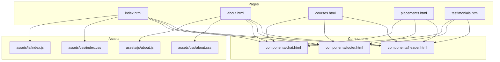
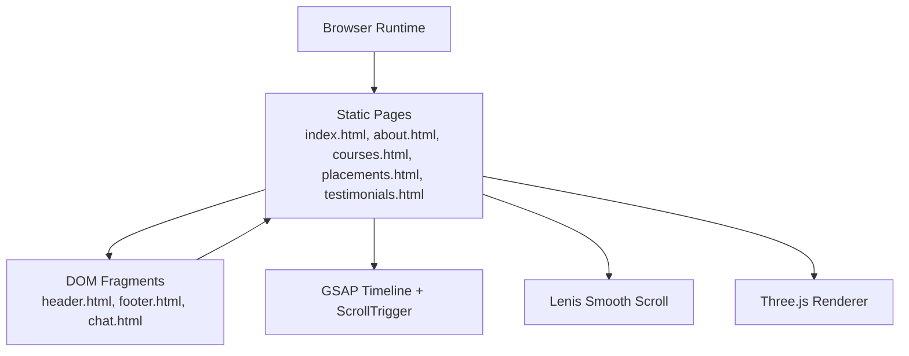
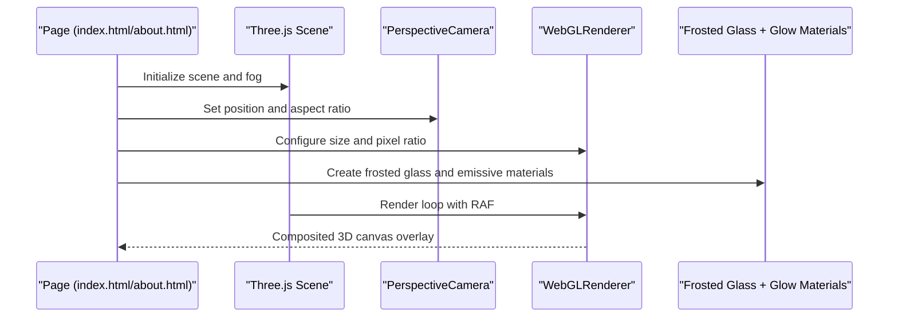
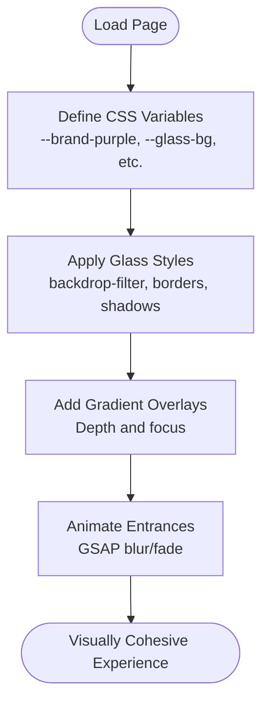
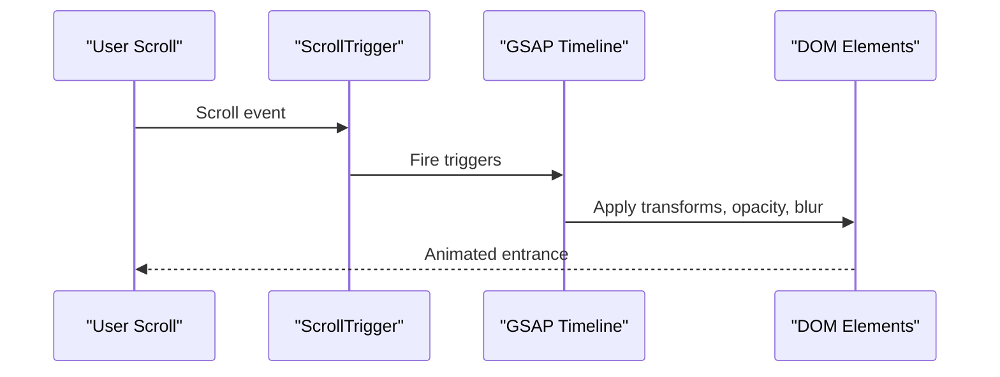
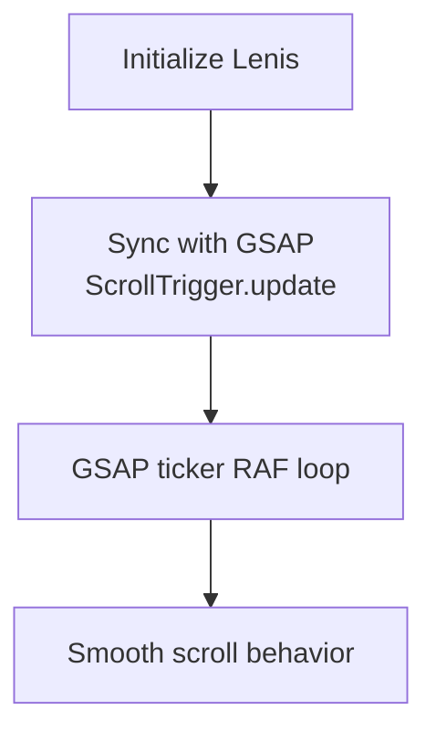
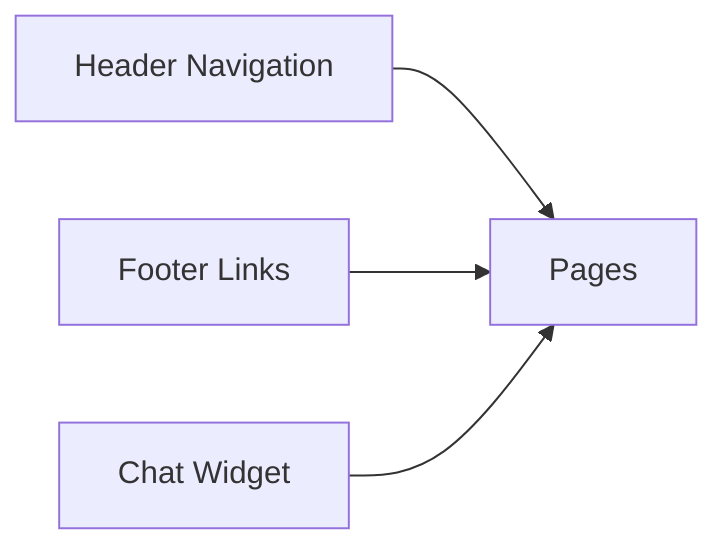
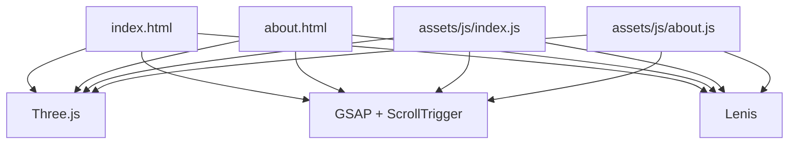

# Project Overview

<cite>
**Referenced Files in This Document**
- [index.html](file://index.html)
- [about.html](file://about.html)
- [courses.html](file://courses.html)
- [placements.html](file://placements.html)
- [testimonials.html](file://testimonials.html)
- [header.html](file://components/header.html)
- [footer.html](file://components/footer.html)
- [chat.html](file://components/chat.html)
- [index.css](file://assets/css/index.css)
- [about.css](file://assets/css/about.css)
- [index.js](file://assets/js/index.js)
- [about.js](file://assets/js/about.js)
</cite>

## Table of Contents
1. [Introduction](#introduction)
2. [Project Structure](#project-structure)
3. [Core Components](#core-components)
4. [Architecture Overview](#architecture-overview)
5. [Detailed Component Analysis](#detailed-component-analysis)
6. [Dependency Analysis](#dependency-analysis)
7. [Performance Considerations](#performance-considerations)
8. [Troubleshooting Guide](#troubleshooting-guide)
9. [Conclusion](#conclusion)

## Introduction
Eduooz International Academy is India’s most advanced coaching platform dedicated to premier healthcare education. The project’s mission is to bridge the gap between raw potential and top-tier government and international healthcare placements for nursing, pharmacy, and laboratory technician candidates. It positions itself as a precision-coaching ecosystem that combines rank-holder faculty, data-driven pedagogy, and immersive digital experiences to deliver proven results.

Key positioning pillars:
- Target audience: Aspiring healthcare professionals preparing for competitive government and international exams.
- Core values: Excellence, precision, methodology, and global placement outcomes.
- Educational mission: To democratize top-tier healthcare education and engineer success through structured, result-oriented coaching.

## Project Structure
The project follows a modular static site architecture with reusable components and a cohesive design system:
- Pages: Home, About, Courses, Placements, Testimonials, and supporting pages.
- Components: Shared header, footer, and chat widget for consistent navigation and engagement.
- Assets: CSS for design systems (glass morphism, gradients, animations), and JS for interactivity (GSAP, Three.js, Lenis smooth scroll).

**Diagram sources**
- [index.html](file://index.html)
- [about.html](file://about.html)
- [courses.html](file://courses.html)
- [placements.html](file://placements.html)
- [testimonials.html](file://testimonials.html)
- [header.html](file://components/header.html)
- [footer.html](file://components/footer.html)
- [chat.html](file://components/chat.html)
- [index.css](file://assets/css/index.css)
- [about.css](file://assets/css/about.css)
- [index.js](file://assets/js/index.js)
- [about.js](file://assets/js/about.js)

**Section sources**
- [index.html](file://index.html)
- [about.html](file://about.html)
- [courses.html](file://courses.html)
- [placements.html](file://placements.html)
- [testimonials.html](file://testimonials.html)
- [header.html](file://components/header.html)
- [footer.html](file://components/footer.html)
- [chat.html](file://components/chat.html)
- [index.css](file://assets/css/index.css)
- [about.css](file://assets/css/about.css)
- [index.js](file://assets/js/index.js)
- [about.js](file://assets/js/about.js)

## Core Components
- Interactive 3D background: Three.js-powered cinematic canvases that render floating, translucent healthcare-themed geometry with dynamic lighting and fog effects.
- Glass morphism design system: Extensive use of frosted glass panels, soft borders, glow accents, and layered transparency for a premium, immersive aesthetic.
- Motion orchestration: GSAP timelines and ScrollTrigger for staggered reveals, entrance sequences, and scroll-linked animations.
- Smooth scrolling: Lenis integration for silky vertical scroll behavior synchronized with GSAP.
- Magnetic UI: Interactive buttons with mouse-follow physics for delightful micro-interactions.
- Responsive grid: A custom CSS grid system enabling adaptive layouts across devices.

These components collectively create a visually rich, emotionally engaging, and methodically paced educational experience tailored to high-stakes exam preparation.

**Section sources**
- [index.css](file://assets/css/index.css)
- [about.css](file://assets/css/about.css)
- [index.js](file://assets/js/index.js)
- [about.js](file://assets/js/about.js)

## Architecture Overview
The architecture blends modern frontend technologies to deliver an immersive, performance-conscious experience:
- Frontend stack: HTML5 semantic markup, vanilla CSS with custom variables and mixins, and vanilla JavaScript.
- Animation and motion: GSAP for timeline-driven animations and ScrollTrigger for scroll-linked effects.
- 3D rendering: Three.js for WebGL scenes with physically-based materials, environment mapping, and soft shadow rendering.
- Smooth scrolling: Lenis for native-feeling scroll behavior with frame-perfect synchronization.
- Componentization: Shared header, footer, and chat widget injected via client-side DOM manipulation for maintainability.

**Diagram sources**
- [index.html](file://index.html)
- [about.html](file://about.html)
- [courses.html](file://courses.html)
- [placements.html](file://placements.html)
- [testimonials.html](file://testimonials.html)
- [header.html](file://components/header.html)
- [footer.html](file://components/footer.html)
- [chat.html](file://components/chat.html)
- [index.js](file://assets/js/index.js)
- [about.js](file://assets/js/about.js)

## Detailed Component Analysis

### Interactive 3D Backgrounds (Three.js)
The homepage and about pages feature cinematic 3D backgrounds that render translucent, glowing healthcare symbols (crosses, capsules, test tubes) with physically-based materials and environmental reflections. These scenes:
- Use PerspectiveCamera and WebGLRenderer with anti-aliasing and soft shadows.
- Apply MeshPhysicalMaterial for realistic refraction and clearcoat sheen.
- Feature fog for depth and atmospheric perspective.
- Animate floating elements with perlin-style movement and subtle rotations.

**Diagram sources**
- [index.js](file://assets/js/index.js)
- [about.js](file://assets/js/about.js)

**Section sources**
- [index.js](file://assets/js/index.js)
- [about.js](file://assets/js/about.js)

### Glass Morphism Design System
The design system centers on frosted glass panels, soft borders, glow accents, and layered transparency. Key elements:
- CSS custom properties define brand colors and glass variables.
- Gradient overlays and backdrop filters create depth and focus.
- Panels and cards use semi-transparent fills, subtle borders, and inner glows for premium feel.
- Animations blend blur transitions and fade-ins for smooth entrances.

**Diagram sources**
- [index.css](file://assets/css/index.css)
- [about.css](file://assets/css/about.css)

**Section sources**
- [index.css](file://assets/css/index.css)
- [about.css](file://assets/css/about.css)

### Motion Orchestration (GSAP + ScrollTrigger)
Animations are orchestrated with GSAP timelines and ScrollTrigger for scroll-linked effects:
- Staggered text reveals with blur and fade transitions.
- Card entrance sequences with 3D transforms and easing.
- Counter animations triggered on scroll into view.
- Magnetic button interactions with mouse-follow physics.

**Diagram sources**
- [index.js](file://assets/js/index.js)

**Section sources**
- [index.js](file://assets/js/index.js)

### Smooth Scrolling (Lenis)
Lenis integrates with GSAP to provide silky vertical scroll behavior:
- Configurable easing and duration for natural momentum.
- Frame-perfect synchronization with ScrollTrigger updates.
- Optional fallback RAF loop when GSAP/ScrollTrigger are unavailable.

**Diagram sources**
- [index.js](file://assets/js/index.js)

**Section sources**
- [index.js](file://assets/js/index.js)

### Navigation, Footer, and Chat Widget
- Header: Consistent navigation across pages with hover underlines and a prominent CTA.
- Footer: Brand presence, links to programs and platform sections, newsletter signup, and legal links.
- Chat: Floating action button with orbital rings, tooltip, and quick replies for instant support.

**Diagram sources**
- [header.html](file://components/header.html)
- [footer.html](file://components/footer.html)
- [chat.html](file://components/chat.html)

**Section sources**
- [header.html](file://components/header.html)
- [footer.html](file://components/footer.html)
- [chat.html](file://components/chat.html)

## Dependency Analysis
The project relies on a small set of external libraries and internal scripts:
- Three.js: 3D rendering and material systems.
- GSAP + ScrollTrigger: Motion orchestration and scroll-linked animations.
- Lenis: Smooth scroll behavior.
- Local assets: CSS and JS modules for page-specific behaviors.

**Diagram sources**
- [index.html](file://index.html)
- [about.html](file://about.html)
- [index.js](file://assets/js/index.js)
- [about.js](file://assets/js/about.js)

**Section sources**
- [index.html](file://index.html)
- [about.html](file://about.html)
- [index.js](file://assets/js/index.js)
- [about.js](file://assets/js/about.js)

## Performance Considerations
- Three.js rendering: Use device pixel ratio clamping and soft shadows judiciously to balance quality and performance.
- GSAP animations: Prefer transform and opacity changes; avoid layout-heavy properties.
- Lenis: Keep scroll updates minimal and throttle where necessary.
- Images and videos: Lazy-load media assets and use appropriate formats/resolutions.
- CSS: Minimize complex filters and shadows on low-power devices; leverage hardware acceleration where possible.

## Troubleshooting Guide
Common issues and resolutions:
- Three.js not rendering:
  - Verify Three.js library is loaded before initialization.
  - Ensure the container element exists and has dimensions.
  - Confirm camera and renderer sizes match the container.
- GSAP/ScrollTrigger not animating:
  - Confirm GSAP and ScrollTrigger are loaded and registered.
  - Check trigger elements exist and are visible in viewport.
- Lenis conflicts:
  - Ensure Lenis is initialized before GSAP ticker integration.
  - Disable smooth scrolling on embedded iframes to prevent pointer events issues.
- Magnetic buttons not responding:
  - Verify mousemove handlers are attached after DOMContentLoaded.
  - Ensure requestAnimationFrame is canceled on mouseleave.

**Section sources**
- [index.js](file://assets/js/index.js)
- [about.js](file://assets/js/about.js)

## Conclusion
Eduooz International Academy delivers a premium, immersive educational experience by combining precision coaching methodology with cutting-edge frontend technologies. Through interactive 3D backgrounds, glass morphism design, and smooth motion orchestration, the platform creates an emotionally resonant and methodically paced environment optimized for high-stakes healthcare exam preparation. Its commitment to excellence, data-driven pedagogy, and proven placement outcomes positions it as a leader in India’s healthcare coaching ecosystem.