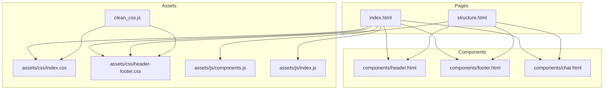
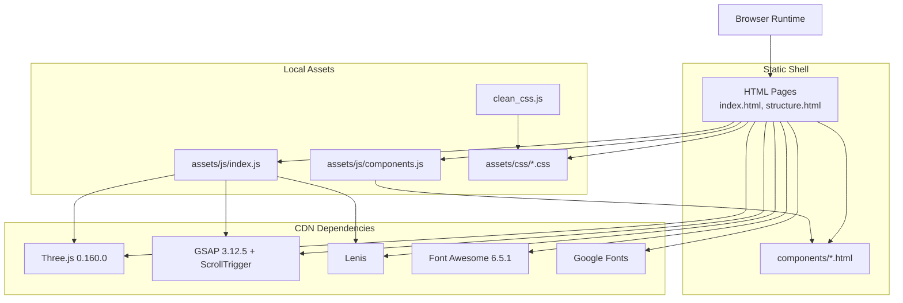
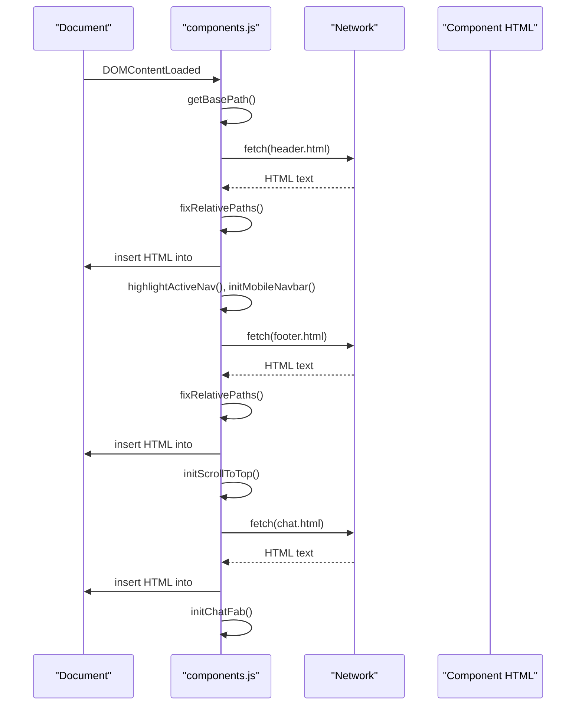
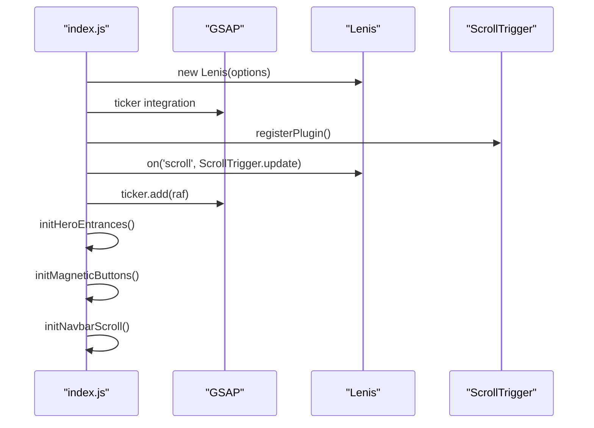
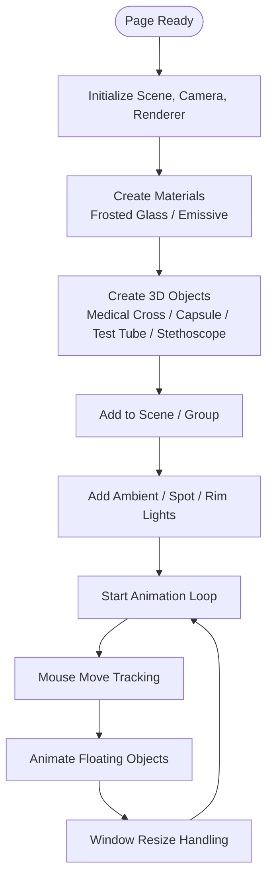
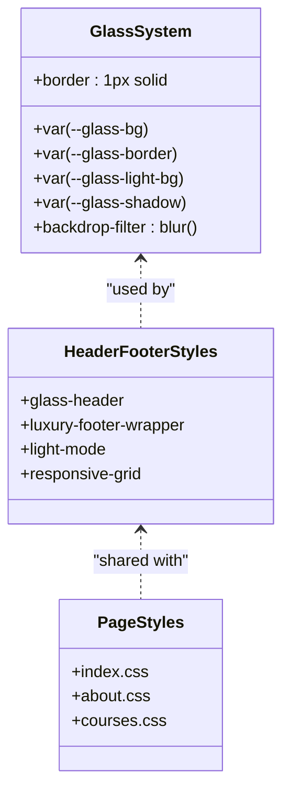
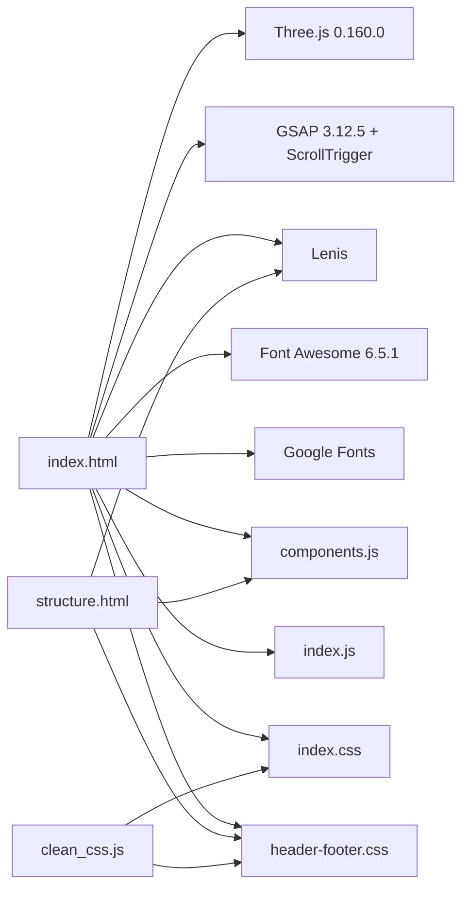

# Technology Stack Overview

<cite>
**Referenced Files in This Document**
- [index.html](file://index.html)
- [structure.html](file://structure.html)
- [clean_css.js](file://clean_css.js)
- [assets/js/components.js](file://assets/js/components.js)
- [assets/js/index.js](file://assets/js/index.js)
- [assets/css/index.css](file://assets/css/index.css)
- [assets/css/header-footer.css](file://assets/css/header-footer.css)
- [assets/css/about.css](file://assets/css/about.css)
- [assets/css/courses.css](file://assets/css/courses.css)
- [components/header.html](file://components/header.html)
- [components/footer.html](file://components/footer.html)
- [components/chat.html](file://components/chat.html)
</cite>

## Table of Contents
1. [Introduction](#introduction)
2. [Project Structure](#project-structure)
3. [Core Components](#core-components)
4. [Architecture Overview](#architecture-overview)
5. [Detailed Component Analysis](#detailed-component-analysis)
6. [Dependency Analysis](#dependency-analysis)
7. [Performance Considerations](#performance-considerations)
8. [Browser Compatibility and Optimization](#browser-compatibility-and-optimization)
9. [Troubleshooting Guide](#troubleshooting-guide)
10. [Conclusion](#conclusion)

## Introduction
This document presents a comprehensive overview of the Eduooz technology stack. The frontend is built with modern HTML5, CSS3, and ES6+ JavaScript to deliver an immersive, visually rich educational experience. The stack emphasizes:
- Immersive 3D graphics powered by Three.js 0.160.0
- Advanced animation orchestration with GSAP 3.12.5 and ScrollTrigger
- Smooth scrolling via Lenis
- Vector icons from Font Awesome 6.5.1 and typography from Google Fonts
- Component-based architecture with modular HTML/CSS/JS
- Optimized CSS delivery using a Node-based cleanup utility

Together, these technologies enable a glass morphism–inspired UI, responsive mobile-first design, and high-performance interactivity across devices.

## Project Structure
The project follows a component-based, static-first architecture:
- HTML pages define the shell and include shared components via client-side fetch
- Shared components (header, footer, chat) are loaded into containers at runtime
- Styles are split into modular CSS files for each page and shared header/footer
- JavaScript orchestrates animations, interactions, and 3D scenes per page

**Diagram sources**
- [index.html:1-120](file://index.html#L1-L120)
- [structure.html:1-49](file://structure.html#L1-L49)
- [assets/js/components.js:1-347](file://assets/js/components.js#L1-L347)
- [assets/js/index.js:1-800](file://assets/js/index.js#L1-L800)
- [assets/css/index.css:1-200](file://assets/css/index.css#L1-L200)
- [assets/css/header-footer.css:1-200](file://assets/css/header-footer.css#L1-L200)
- [clean_css.js:1-40](file://clean_css.js#L1-L40)

**Section sources**
- [index.html:1-120](file://index.html#L1-L120)
- [structure.html:1-49](file://structure.html#L1-L49)
- [assets/js/components.js:1-347](file://assets/js/components.js#L1-L347)
- [assets/css/index.css:1-200](file://assets/css/index.css#L1-L200)
- [assets/css/header-footer.css:1-200](file://assets/css/header-footer.css#L1-L200)
- [clean_css.js:1-40](file://clean_css.js#L1-L40)

## Core Components
- HTML5 Shell and Containers
  - Pages include shared component containers and external CDN resources for Three.js, GSAP, and Lenis.
  - Example: index.html loads fonts, icons, and libraries, then injects header, footer, and chat components via JavaScript.

- Component Loader (assets/js/components.js)
  - Dynamically fetches and injects header, footer, and chat HTML into designated containers
  - Adjusts relative asset paths for subdirectory deployments
  - Initializes UI behaviors on component load (mobile menu, scroll-to-top, chat FAB)

- Page Scripts (assets/js/index.js)
  - Orchestrates GSAP timelines for hero entrances and section reveals
  - Integrates Lenis smooth scrolling with GSAP ScrollTrigger
  - Implements Three.js scenes for immersive 3D backgrounds and interactive holograms

- Stylesheets
  - Modular CSS files for page-specific and shared styles
  - Extensive use of CSS variables, glass morphism effects, and responsive grids
  - Lenis-specific overrides for smooth scroll behavior

**Section sources**
- [index.html:1-120](file://index.html#L1-L120)
- [assets/js/components.js:1-347](file://assets/js/components.js#L1-L347)
- [assets/js/index.js:1-800](file://assets/js/index.js#L1-L800)
- [assets/css/index.css:1-200](file://assets/css/index.css#L1-L200)
- [assets/css/header-footer.css:1-200](file://assets/css/header-footer.css#L1-L200)

## Architecture Overview
The architecture blends static HTML shells with dynamic component injection and page-scoped scripts. External libraries are loaded via CDNs, while internal assets are served locally.

**Diagram sources**
- [index.html:1-120](file://index.html#L1-L120)
- [structure.html:1-49](file://structure.html#L1-L49)
- [assets/js/components.js:1-347](file://assets/js/components.js#L1-L347)
- [assets/js/index.js:1-800](file://assets/js/index.js#L1-L800)
- [assets/css/index.css:1-200](file://assets/css/index.css#L1-L200)
- [clean_css.js:1-40](file://clean_css.js#L1-L40)

## Detailed Component Analysis

### Component-Based Loading Pipeline
The loader resolves base paths, fetches component HTML, fixes relative URLs, injects markup, and initializes behaviors.

**Diagram sources**
- [assets/js/components.js:1-347](file://assets/js/components.js#L1-L347)
- [components/header.html:1-22](file://components/header.html#L1-L22)
- [components/footer.html:1-75](file://components/footer.html#L1-L75)
- [components/chat.html:1-78](file://components/chat.html#L1-L78)

**Section sources**
- [assets/js/components.js:1-347](file://assets/js/components.js#L1-L347)
- [components/header.html:1-22](file://components/header.html#L1-L22)
- [components/footer.html:1-75](file://components/footer.html#L1-L75)
- [components/chat.html:1-78](file://components/chat.html#L1-L78)

### GSAP + Lenis Integration for Smooth Animations
The index page initializes Lenis and integrates it with GSAP ScrollTrigger for coordinated scroll-driven animations.

**Diagram sources**
- [assets/js/index.js:1-120](file://assets/js/index.js#L1-L120)

**Section sources**
- [assets/js/index.js:1-120](file://assets/js/index.js#L1-L120)

### Three.js 3D Scenes and Interactions
Two major Three.js scenes are implemented:
- Hero cinematic background with floating 3D objects (medical cross, capsule, test tube, stethoscope)
- Course hologram viewer with morphing 3D objects and dynamic lighting

**Diagram sources**
- [assets/js/index.js:105-432](file://assets/js/index.js#L105-L432)

**Section sources**
- [assets/js/index.js:105-432](file://assets/js/index.js#L105-L432)

### Glass Morphism UI System
The design system relies on:
- CSS variables for theme tokens and glass effects
- Backdrop filters and semi-transparent borders for frosted glass
- Responsive grid and typography from Google Fonts
- Component-specific styles for each page

**Diagram sources**
- [assets/css/index.css:1-200](file://assets/css/index.css#L1-L200)
- [assets/css/header-footer.css:1-200](file://assets/css/header-footer.css#L1-L200)
- [assets/css/about.css:1-200](file://assets/css/about.css#L1-L200)
- [assets/css/courses.css:1-200](file://assets/css/courses.css#L1-L200)

**Section sources**
- [assets/css/index.css:1-200](file://assets/css/index.css#L1-L200)
- [assets/css/header-footer.css:1-200](file://assets/css/header-footer.css#L1-L200)
- [assets/css/about.css:1-200](file://assets/css/about.css#L1-L200)
- [assets/css/courses.css:1-200](file://assets/css/courses.css#L1-L200)

## Dependency Analysis
External and internal dependencies are organized as follows:
- External
  - Three.js 0.160.0 for WebGL 3D rendering
  - GSAP 3.12.5 and ScrollTrigger for animations and scroll-driven effects
  - Lenis for smooth scrolling
  - Font Awesome 6.5.1 for vector icons
  - Google Fonts for typography
- Internal
  - Component loader for modular HTML injection
  - Page-specific scripts for animations and 3D scenes
  - Modular CSS for styling and responsive layouts
  - Node-based CSS cleanup utility

**Diagram sources**
- [index.html:1-120](file://index.html#L1-L120)
- [structure.html:1-49](file://structure.html#L1-L49)
- [assets/js/components.js:1-347](file://assets/js/components.js#L1-L347)
- [assets/js/index.js:1-800](file://assets/js/index.js#L1-L800)
- [assets/css/index.css:1-200](file://assets/css/index.css#L1-L200)
- [assets/css/header-footer.css:1-200](file://assets/css/header-footer.css#L1-L200)
- [clean_css.js:1-40](file://clean_css.js#L1-L40)

**Section sources**
- [index.html:1-120](file://index.html#L1-L120)
- [structure.html:1-49](file://structure.html#L1-L49)
- [assets/js/components.js:1-347](file://assets/js/components.js#L1-L347)
- [assets/js/index.js:1-800](file://assets/js/index.js#L1-L800)
- [assets/css/index.css:1-200](file://assets/css/index.css#L1-L200)
- [assets/css/header-footer.css:1-200](file://assets/css/header-footer.css#L1-L200)
- [clean_css.js:1-40](file://clean_css.js#L1-L40)

## Performance Considerations
- Deferred Heavy Payloads
  - The Three.js hero scene initialization is delayed to ensure the primary hero entrance remains smooth and responsive.
- Pixel Ratio and Rendering Limits
  - Renderer pixel ratio capped to avoid unnecessary overhead on high-DPR devices.
- Intersection Observers
  - Visibility checks prevent rendering when off-screen.
- Scroll-Driven Optimization
  - ScrollTrigger throttles animations to maintain frame stability.
- CSS Cleanup
  - A Node script removes unused or duplicated CSS ranges to reduce bundle size.

Practical tips:
- Keep 3D scenes scoped to visible containers and observe intersection thresholds.
- Prefer requestAnimationFrame for micro-interactions and avoid layout thrashing.
- Lazy-load non-critical assets until after initial paint.

**Section sources**
- [assets/js/index.js:382-432](file://assets/js/index.js#L382-L432)
- [clean_css.js:1-40](file://clean_css.js#L1-L40)

## Browser Compatibility and Optimization
- Three.js 0.160.0
  - Requires modern WebGL support. Tested on current Chrome, Edge, Firefox, and Safari.
- GSAP 3.12.5 + ScrollTrigger
  - Works on modern browsers; ensure polyfills if targeting older environments.
- Lenis
  - Provides smooth scrolling with minimal JS overhead; tested on desktop and mobile.
- Font Awesome 6.5.1 and Google Fonts
  - CDN-hosted assets; ensure fallbacks or local copies if CDN availability is a concern.
- CSS
  - Extensive use of backdrop-filter and CSS variables; verify vendor prefixes if extending support to older browsers.

Optimization strategies:
- Use feature detection for WebGL and smooth scrolling capabilities.
- Implement progressive enhancement for older browsers.
- Minimize repaints by animating transform and opacity properties.

[No sources needed since this section provides general guidance]

## Troubleshooting Guide
Common issues and resolutions:
- Components Not Loading
  - Verify container IDs exist and the component loader executes after DOMContentLoaded.
  - Check network tab for failed fetches to component HTML files.
- Paths Incorrect in Subdirectories
  - The component loader adjusts relative paths; confirm base path resolution logic.
- Lenis Not Smooth
  - Ensure Lenis is initialized before ScrollTrigger updates and that the ticker is active.
- Three.js Scene Not Rendering
  - Confirm WebGL is enabled and the canvas container has dimensions.
  - Check for intersection observer visibility and resize handlers.
- CSS Not Applied
  - Use the cleanup script to remove unused ranges and re-validate selectors.

**Section sources**
- [assets/js/components.js:1-347](file://assets/js/components.js#L1-L347)
- [assets/js/index.js:1-120](file://assets/js/index.js#L1-L120)
- [clean_css.js:1-40](file://clean_css.js#L1-L40)

## Conclusion
Eduooz leverages a modern, component-based frontend stack to deliver an immersive, high-performance educational experience. Three.js powers compelling 3D visuals, GSAP orchestrates polished animations, Lenis ensures smooth scrolling, and Font Awesome plus Google Fonts provide consistent iconography and typography. The modular CSS and Node-based cleanup pipeline keep styles efficient and maintainable. Together, these choices support a glass morphism–driven UI with strong mobile responsiveness and robust performance across devices.