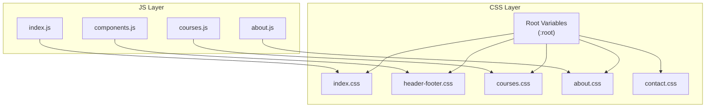
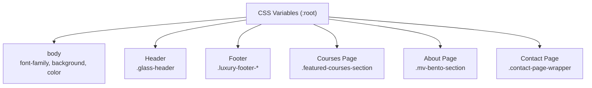
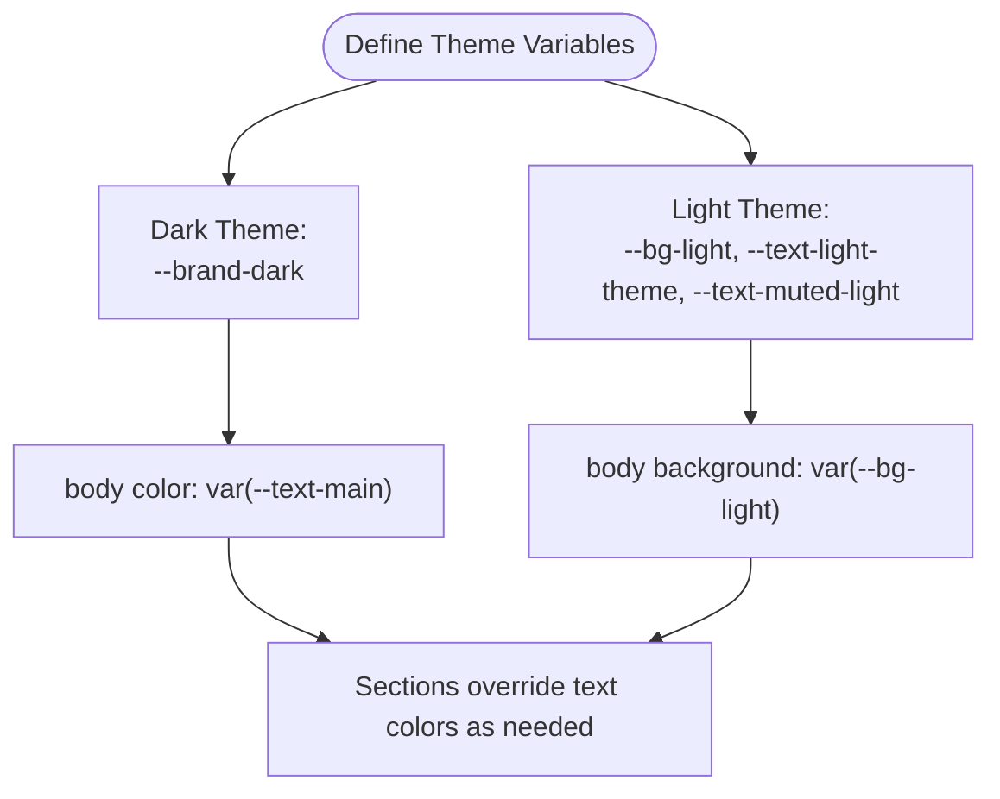
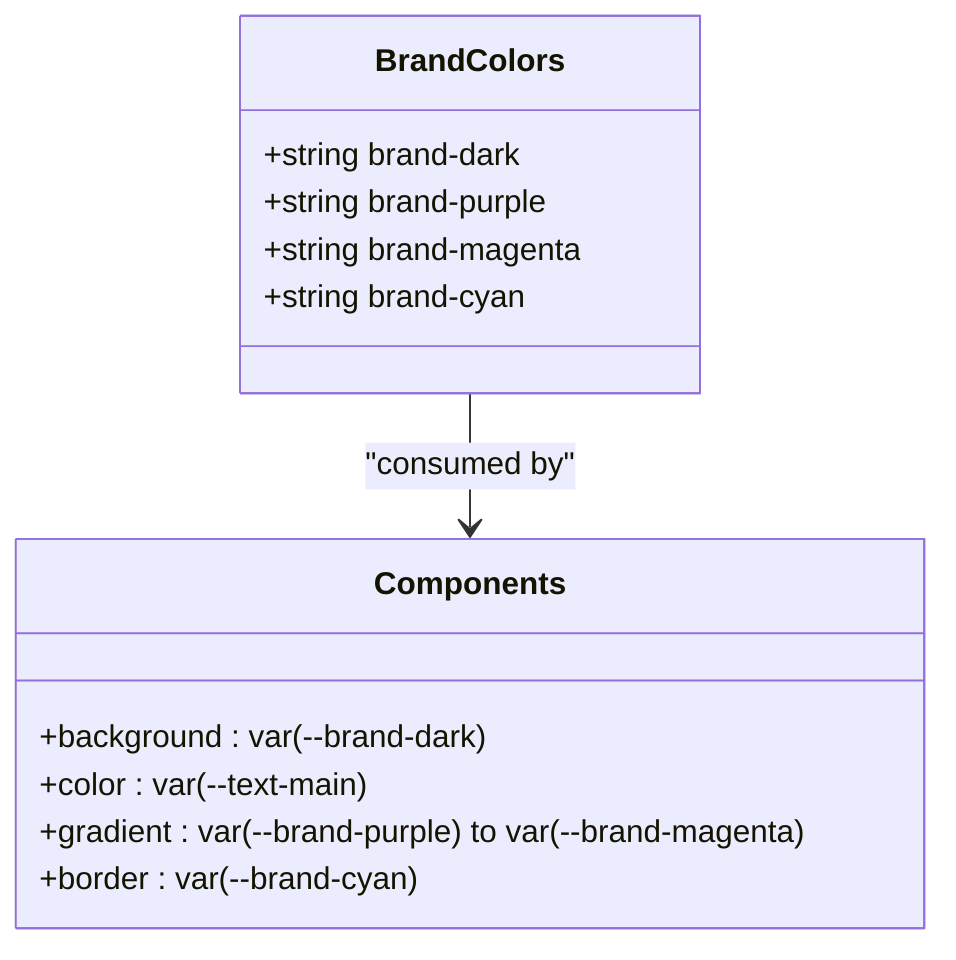
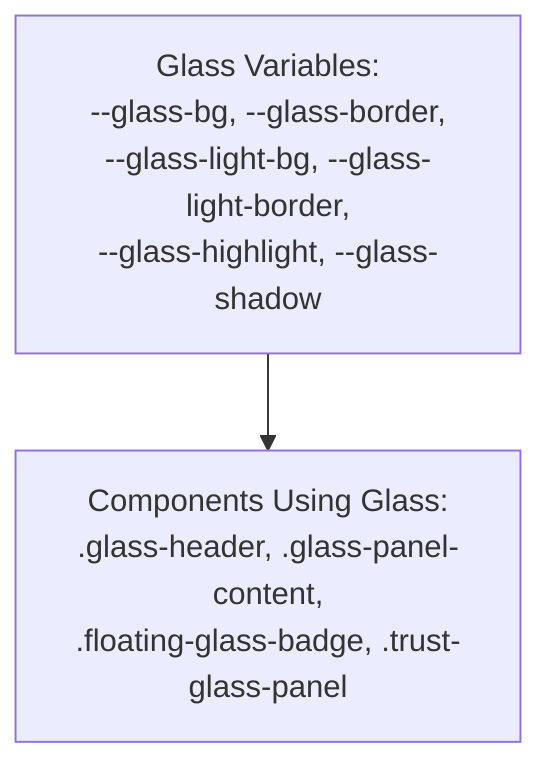
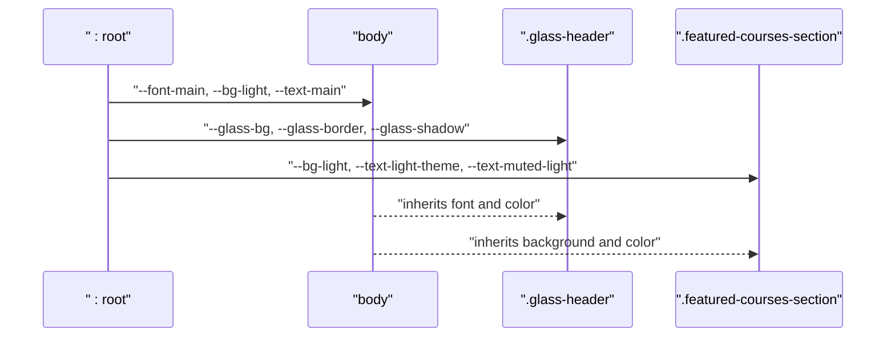
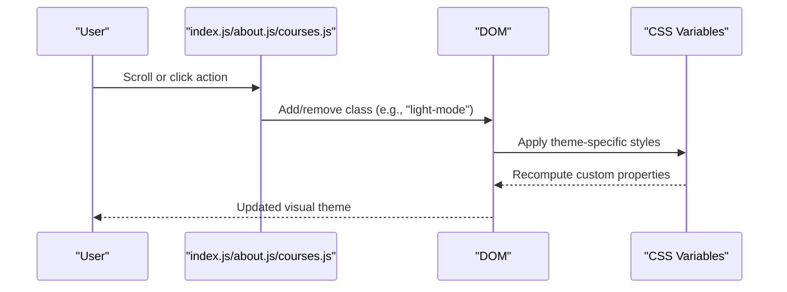
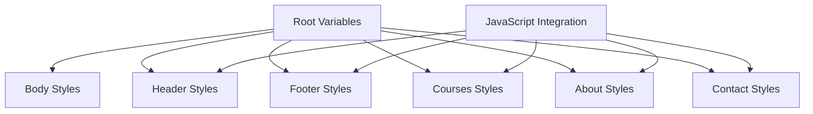

# CSS Custom Properties System

<cite>
**Referenced Files in This Document**
- [index.css](file://assets/css/index.css)
- [header-footer.css](file://assets/css/header-footer.css)
- [courses.css](file://assets/css/courses.css)
- [about.css](file://assets/css/about.css)
- [contact.css](file://assets/css/contact.css)
- [components.js](file://assets/js/components.js)
- [index.js](file://assets/js/index.js)
- [about.js](file://assets/js/about.js)
- [courses.js](file://assets/js/courses.js)
</cite>

## Table of Contents
1. [Introduction](#introduction)
2. [Project Structure](#project-structure)
3. [Core Components](#core-components)
4. [Architecture Overview](#architecture-overview)
5. [Detailed Component Analysis](#detailed-component-analysis)
6. [Dependency Analysis](#dependency-analysis)
7. [Performance Considerations](#performance-considerations)
8. [Troubleshooting Guide](#troubleshooting-guide)
9. [Conclusion](#conclusion)

## Introduction
This document explains the Eduooz CSS custom properties system that powers the application's theming architecture. It covers:
- Dark/light theme management using CSS variables
- Brand color system and text color schemes
- Glass morphism properties for frosted panel effects
- Typography system with font family management
- Practical cascading of custom properties across components
- Runtime theme switching mechanisms and extension patterns

## Project Structure
The theming system is centralized in CSS custom properties defined in shared stylesheets and consumed throughout the application. JavaScript components integrate with the theme system to enable runtime switching and interactive experiences.

**Diagram sources**
- [index.css:1-25](file://assets/css/index.css#L1-L25)
- [header-footer.css:1-80](file://assets/css/header-footer.css#L1-L80)
- [courses.css:1-80](file://assets/css/courses.css#L1-L80)
- [about.css:4-17](file://assets/css/about.css#L4-L17)
- [contact.css:2-25](file://assets/css/contact.css#L2-L25)
- [components.js:1-347](file://assets/js/components.js#L1-L347)
- [index.js:1-800](file://assets/js/index.js#L1-L800)
- [about.js:1-800](file://assets/js/about.js#L1-L800)
- [courses.js:1-800](file://assets/js/courses.js#L1-L800)

**Section sources**
- [index.css:1-25](file://assets/css/index.css#L1-L25)
- [header-footer.css:1-80](file://assets/css/header-footer.css#L1-L80)
- [courses.css:1-80](file://assets/css/courses.css#L1-L80)
- [about.css:4-17](file://assets/css/about.css#L4-L17)
- [contact.css:2-25](file://assets/css/contact.css#L2-L25)
- [components.js:1-347](file://assets/js/components.js#L1-L347)
- [index.js:1-800](file://assets/js/index.js#L1-L800)
- [about.js:1-800](file://assets/js/about.js#L1-L800)
- [courses.js:1-800](file://assets/js/courses.js#L1-L800)

## Core Components
The custom properties system is built around four primary categories:

- Theme color variables: dark and light theme palettes
- Brand color variables: primary and accent brand colors
- Text color variables: main and muted text colors for both themes
- Background variables: light theme background and related text colors
- Typography variables: primary font family
- Glass morphism variables: frosted panel backgrounds, borders, highlights, and shadows

These variables are defined in the root scope and consumed across components.

**Section sources**
- [index.css:1-25](file://assets/css/index.css#L1-L25)
- [header-footer.css:1-80](file://assets/css/header-footer.css#L1-L80)
- [courses.css:1-80](file://assets/css/courses.css#L1-L80)
- [about.css:4-17](file://assets/css/about.css#L4-L17)
- [contact.css:2-25](file://assets/css/contact.css#L2-L25)

## Architecture Overview
The theming architecture follows a layered approach:
- Root-level CSS variables define the theme palette and typography
- Components consume these variables to maintain consistent theming
- JavaScript integrates with the theme system for runtime interactions (e.g., navbar blend mode)
- Glass morphism effects are consistently applied using dedicated variables

**Diagram sources**
- [index.css:58-65](file://assets/css/index.css#L58-L65)
- [header-footer.css:4-25](file://assets/css/header-footer.css#L4-L25)
- [courses.css:125-139](file://assets/css/courses.css#L125-L139)
- [about.css:453-456](file://assets/css/about.css#L453-L456)
- [contact.css:117-120](file://assets/css/contact.css#L117-L120)

## Detailed Component Analysis

### Theme Color System
The theme color system defines:
- Dark theme base: --brand-dark
- Light theme background: --bg-light
- Text colors for each theme: --text-main (dark), --text-light-theme (light), --text-muted, --text-muted-light

These variables are used to set global body colors and are overridden in sections requiring theme-specific contrasts.

**Diagram sources**
- [index.css:1-15](file://assets/css/index.css#L1-L15)
- [index.css:58-65](file://assets/css/index.css#L58-L65)
- [courses.css:125-139](file://assets/css/courses.css#L125-L139)

**Section sources**
- [index.css:1-15](file://assets/css/index.css#L1-L15)
- [index.css:58-65](file://assets/css/index.css#L58-L65)
- [courses.css:125-139](file://assets/css/courses.css#L125-L139)

### Brand Color System
Brand colors provide primary and accent hues:
- Primary brand: --brand-purple, --brand-magenta, --brand-cyan
- Dark theme base: --brand-dark

Components use these variables for backgrounds, gradients, borders, and interactive states.

**Diagram sources**
- [index.css:2-8](file://assets/css/index.css#L2-L8)
- [index.css:267-274](file://assets/css/index.css#L267-L274)
- [courses.css:125-129](file://assets/css/courses.css#L125-L129)

**Section sources**
- [index.css:2-8](file://assets/css/index.css#L2-L8)
- [index.css:267-274](file://assets/css/index.css#L267-L274)
- [courses.css:125-129](file://assets/css/courses.css#L125-L129)

### Text Color Schemes
Text color schemes ensure readability across themes:
- Main theme text: --text-main (white on dark)
- Light theme text: --text-light-theme (dark gray on light)
- Muted text variants: --text-muted, --text-muted-light

These are applied to headings, paragraphs, and interactive elements.

**Section sources**
- [index.css:7-14](file://assets/css/index.css#L7-L14)
- [courses.css:131-139](file://assets/css/courses.css#L131-L139)

### Background Variations
Background variations support theme transitions:
- Light theme background: --bg-light
- Section overrides: Some sections override background and text colors for contrast

**Section sources**
- [index.css:10-14](file://assets/css/index.css#L10-L14)
- [courses.css:125-139](file://assets/css/courses.css#L125-L139)

### Typography System
Typography is centralized via:
- Font family variable: --font-main
- Applied globally to the body and inherited by components

**Section sources**
- [index.css:15-15](file://assets/css/index.css#L15-L15)
- [index.css:58-58](file://assets/css/index.css#L58-L58)
- [about.css:28-28](file://assets/css/about.css#L28-L28)

### Glass Morphism Property System
Glass morphism variables define frosted panel aesthetics:
- Background: --glass-bg, --glass-light-bg
- Borders: --glass-border, --glass-light-border
- Highlights and effects: --glass-highlight, --glass-shadow

These variables are used across components to achieve consistent frosted glass effects.

**Diagram sources**
- [index.css:17-24](file://assets/css/index.css#L17-L24)
- [header-footer.css:4-25](file://assets/css/header-footer.css#L4-L25)
- [courses.css:786-800](file://assets/css/courses.css#L786-L800)

**Section sources**
- [index.css:17-24](file://assets/css/index.css#L17-L24)
- [header-footer.css:4-25](file://assets/css/header-footer.css#L4-L25)
- [courses.css:786-800](file://assets/css/courses.css#L786-L800)

### Cascading Through the Component System
Custom properties cascade from :root to all components. For example:
- Global font and color defaults are set on body
- Header and footer components consume glass variables for consistent frosted effects
- Course sections override background and text colors for readability on light theme

**Diagram sources**
- [index.css:58-65](file://assets/css/index.css#L58-L65)
- [header-footer.css:4-25](file://assets/css/header-footer.css#L4-L25)
- [courses.css:125-139](file://assets/css/courses.css#L125-L139)

**Section sources**
- [index.css:58-65](file://assets/css/index.css#L58-L65)
- [header-footer.css:4-25](file://assets/css/header-footer.css#L4-L25)
- [courses.css:125-139](file://assets/css/courses.css#L125-L139)

### Relationship Between Custom Properties and Runtime Theme Switching
Runtime theme switching is primarily achieved through:
- CSS class toggles on containers (e.g., navbar light-mode)
- JavaScript event listeners that modify component classes
- Consistent use of custom properties ensures visual updates without code changes

**Diagram sources**
- [index.js:86-101](file://assets/js/index.js#L86-L101)
- [about.js:52-67](file://assets/js/about.js#L52-L67)
- [courses.js:39-54](file://assets/js/courses.js#L39-L54)

**Section sources**
- [index.js:86-101](file://assets/js/index.js#L86-L101)
- [about.js:52-67](file://assets/js/about.js#L52-L67)
- [courses.js:39-54](file://assets/js/courses.js#L39-L54)

### Extending the Color Palette and Adding New Theme Variants
To extend the system:
- Define new custom properties in :root (e.g., additional brand colors or semantic roles)
- Use variables consistently across components to maintain cohesion
- Introduce theme-specific classes and toggle them via JavaScript for runtime switching

Practical steps:
- Add new variables in the root stylesheet
- Reference variables in component styles
- Implement JavaScript logic to toggle theme classes on containers

**Section sources**
- [index.css:1-25](file://assets/css/index.css#L1-L25)
- [header-footer.css:50-54](file://assets/css/header-footer.css#L50-L54)
- [components.js:1-347](file://assets/js/components.js#L1-L347)

## Dependency Analysis
The custom properties system exhibits low coupling and high cohesion:
- Centralized definition in :root
- Wide consumption across components
- Minimal interdependencies between variables
- JavaScript enhances but does not replace CSS variable usage

**Diagram sources**
- [index.css:1-25](file://assets/css/index.css#L1-L25)
- [header-footer.css:1-80](file://assets/css/header-footer.css#L1-L80)
- [courses.css:1-80](file://assets/css/courses.css#L1-L80)
- [about.css:4-17](file://assets/css/about.css#L4-L17)
- [contact.css:2-25](file://assets/css/contact.css#L2-L25)
- [components.js:1-347](file://assets/js/components.js#L1-L347)

**Section sources**
- [index.css:1-25](file://assets/css/index.css#L1-L25)
- [header-footer.css:1-80](file://assets/css/header-footer.css#L1-L80)
- [courses.css:1-80](file://assets/css/courses.css#L1-L80)
- [about.css:4-17](file://assets/css/about.css#L4-L17)
- [contact.css:2-25](file://assets/css/contact.css#L2-L25)
- [components.js:1-347](file://assets/js/components.js#L1-L347)

## Performance Considerations
- CSS variables are computed efficiently by the browser; avoid excessive reflows by toggling classes rather than modifying inline styles
- Glass morphism effects rely on backdrop-filter and blur; test performance on lower-end devices and consider disabling effects via media queries if needed
- Keep the number of theme classes minimal to reduce selector specificity and improve rendering performance

## Troubleshooting Guide
Common issues and resolutions:
- Inconsistent colors across sections: Verify that sections override text/background variables appropriately
- Glass effects not visible: Ensure backdrop-filter and blur are supported and not disabled by user settings
- Typography not applied: Confirm --font-main is defined and inherited by the target elements

**Section sources**
- [index.css:58-65](file://assets/css/index.css#L58-L65)
- [header-footer.css:4-25](file://assets/css/header-footer.css#L4-L25)
- [courses.css:125-139](file://assets/css/courses.css#L125-L139)

## Conclusion
The Eduooz CSS custom properties system provides a robust, scalable foundation for theming. By centralizing variables in :root and consuming them consistently across components, the system enables easy maintenance, predictable visual outcomes, and flexible runtime theme switching. Extending the palette or adding new variants requires minimal effort and preserves design coherence.