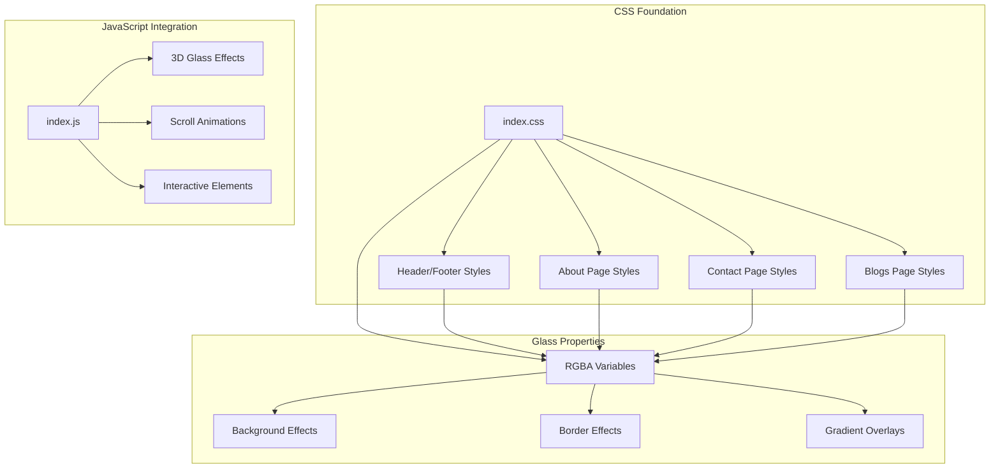
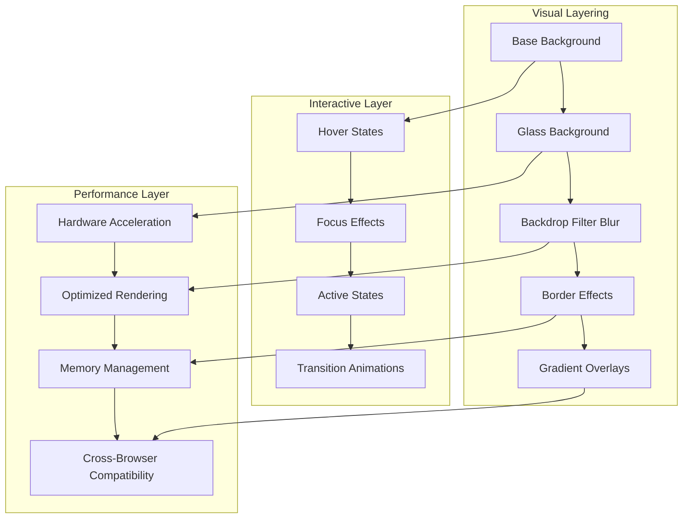
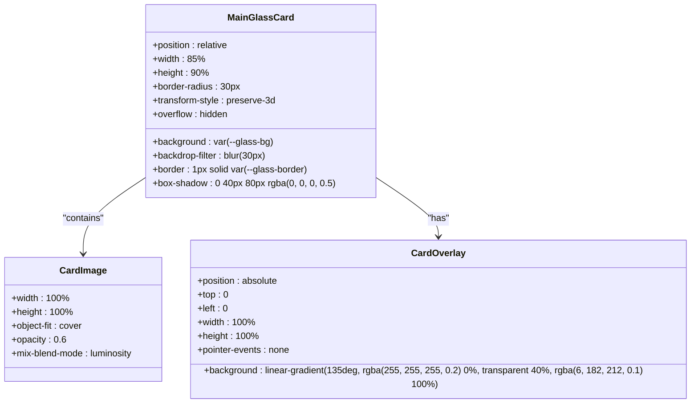
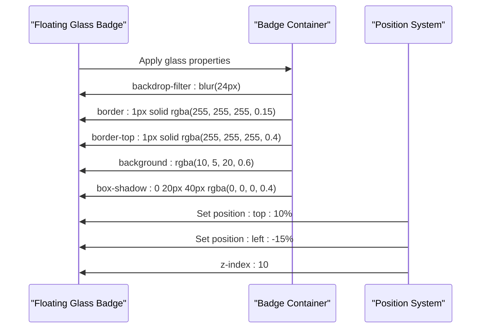
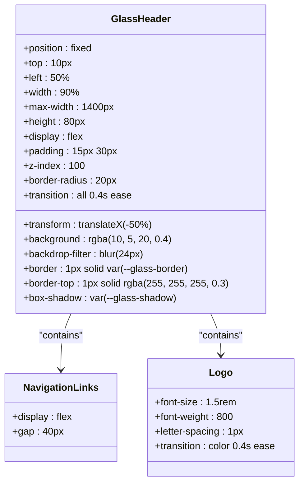
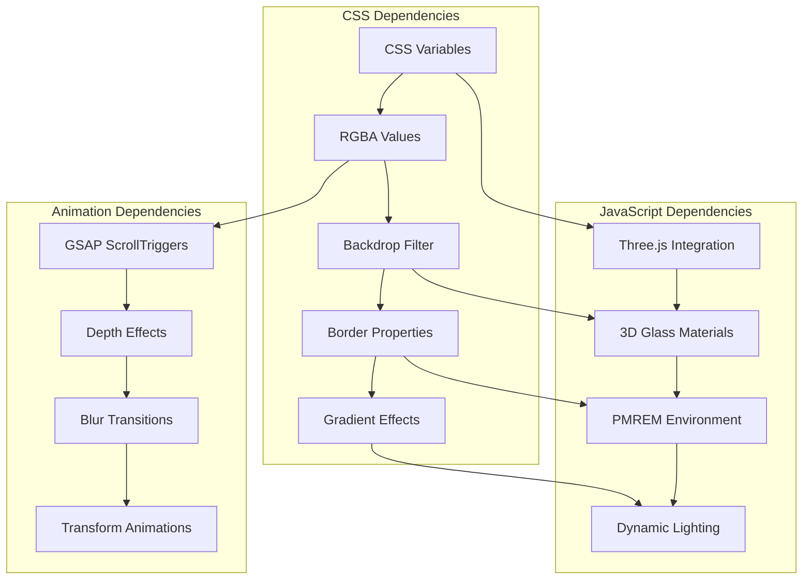
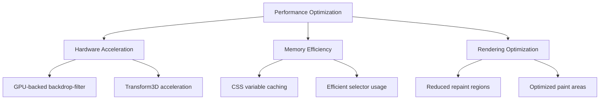

# Glass Morphism Design Implementation

<cite>
**Referenced Files in This Document**
- [index.css](file://assets/css/index.css)
- [header-footer.css](file://assets/css/header-footer.css)
- [about.css](file://assets/css/about.css)
- [contact.css](file://assets/css/contact.css)
- [blogs.css](file://assets/css/blogs.css)
- [index.js](file://assets/js/index.js)
</cite>

## Table of Contents
1. [Introduction](#introduction)
2. [Project Structure](#project-structure)
3. [Core Components](#core-components)
4. [Architecture Overview](#architecture-overview)
5. [Detailed Component Analysis](#detailed-component-analysis)
6. [Dependency Analysis](#dependency-analysis)
7. [Performance Considerations](#performance-considerations)
8. [Browser Compatibility Matrix](#browser-compatibility-matrix)
9. [Fallback Strategies](#fallback-strategies)
10. [Implementation Examples](#implementation-examples)
11. [Troubleshooting Guide](#troubleshooting-guide)
12. [Conclusion](#conclusion)

## Introduction

The Eduooz website implements a sophisticated glass morphism design system that creates ethereal, translucent UI elements with depth perception and modern visual appeal. This design approach combines backdrop-filter blur effects with rgba transparency values, sophisticated border styling, and gradient overlays to achieve a premium glass-like appearance.

The glass morphism system is built around carefully crafted CSS variables that define the fundamental glass properties, creating a consistent design language across all interactive elements including cards, panels, badges, and navigation components. The implementation leverages advanced CSS features while maintaining cross-browser compatibility and performance optimization.

## Project Structure

The glass morphism system is distributed across multiple CSS files, each serving specific sections of the website:



**Diagram sources**
- [index.css:17-24](file://assets/css/index.css#L17-L24)
- [header-footer.css:4-25](file://assets/css/header-footer.css#L4-L25)
- [index.js:1460-1659](file://assets/js/index.js#L1460-L1659)

**Section sources**
- [index.css:1-80](file://assets/css/index.css#L1-L80)
- [header-footer.css:1-80](file://assets/css/header-footer.css#L1-L80)

## Core Components

### Glass Property Variables

The foundation of the glass morphism system lies in the CSS custom properties that define the core glass characteristics:

| Variable | Value | Description |
|----------|-------|-------------|
| `--glass-bg` | `rgba(255, 255, 255, 0.03)` | Primary glass background with subtle translucency |
| `--glass-border` | `rgba(255, 255, 255, 0.15)` | Subtle border transparency for depth indication |
| `--glass-light-bg` | `rgba(255, 255, 255, 0.6)` | Lighter glass variant for contrasting elements |
| `--glass-light-border` | `rgba(255, 255, 255, 0.9)` | Enhanced border for light glass variants |
| `--glass-highlight` | `linear-gradient(135deg, rgba(255, 255, 255, 0.4) 0%, rgba(255, 255, 255, 0) 100%)` | Diagonal highlight gradient for surface definition |
| `--glass-shadow` | `0 30px 60px rgba(0, 0, 0, 0.4), inset 0 1px 0 rgba(255, 255, 255, 0.2)` | Combined shadow effects for depth perception |

### Backdrop-Filter Implementation

The system utilizes backdrop-filter CSS property with multiple blur values to create the glass effect:

```mermaid
flowchart TD
A[Element with Glass Effect] --> B[Apply backdrop-filter]
B --> C[Blur Values: 8px, 10px, 14px, 15px, 20px, 24px, 30px]
C --> D[rgba() Transparency Values]
D --> E[Visual Transparency]
E --> F[Depth Perception]
F --> G[Modern Glass Appearance]
```

**Diagram sources**
- [index.css:389-429](file://assets/css/index.css#L389-L429)
- [header-footer.css:17-23](file://assets/css/header-footer.css#L17-L23)

**Section sources**
- [index.css:17-24](file://assets/css/index.css#L17-L24)
- [header-footer.css:17-23](file://assets/css/header-footer.css#L17-L23)

## Architecture Overview

The glass morphism system follows a layered architecture that combines visual effects with interactive elements:



**Diagram sources**
- [index.css:383-439](file://assets/css/index.css#L383-L439)
- [about.css:406-434](file://assets/css/about.css#L406-L434)

## Detailed Component Analysis

### Main Glass Card Implementation

The primary glass card component demonstrates the complete glass morphism system:



**Diagram sources**
- [index.css:383-413](file://assets/css/index.css#L383-L413)

### Floating Glass Badge System

The floating badge implementation showcases the versatility of glass effects:



**Diagram sources**
- [index.css:416-429](file://assets/css/index.css#L416-L429)

### Trust Panel Implementation

The trust panel demonstrates advanced glass composition with multiple layers:

```mermaid
flowchart LR
A[Trust Panel Container] --> B[Glass Background Layer]
B --> C[Backdrop Filter Layer]
C --> D[Border Layer]
D --> E[Gradient Overlay Layer]
E --> F[Content Layer]
B -.-> G[rgba(15, 10, 25, 24%)]
C -.-> H[blur(24px)]
D -.-> I[1px solid rgba(255, 255, 255, 0.12)]
D -.-> J[border-top: 1px solid rgba(255, 255, 255, 0.25)]
E -.-> K[Linear Gradient Overlay]
F -.-> L[Stat Blocks]
```

**Diagram sources**
- [index.css:509-527](file://assets/css/index.css#L509-L527)

**Section sources**
- [index.css:383-527](file://assets/css/index.css#L383-L527)

### Header Glass Navigation

The header glass navigation exemplifies responsive glass design:



**Diagram sources**
- [header-footer.css:4-25](file://assets/css/header-footer.css#L4-L25)

**Section sources**
- [header-footer.css:4-25](file://assets/css/header-footer.css#L4-L25)

## Dependency Analysis

The glass morphism system exhibits several key dependencies and relationships:



**Diagram sources**
- [index.js:1460-1659](file://assets/js/index.js#L1460-L1659)
- [index.css:17-24](file://assets/css/index.css#L17-L24)

**Section sources**
- [index.js:1460-1659](file://assets/js/index.js#L1460-L1659)
- [index.css:17-24](file://assets/css/index.css#L17-L24)

## Performance Considerations

### Hardware Acceleration Benefits

The glass morphism system leverages hardware acceleration through strategic CSS property usage:

- **Backdrop-filter**: Utilizes GPU acceleration for blur effects
- **Transform properties**: Benefit from hardware acceleration
- **Opacity transitions**: Optimized for smooth animations
- **Box-shadow**: Hardware-accelerated rendering

### Memory Management

The system implements efficient memory management strategies:

- **Variable reuse**: Centralized CSS variables reduce memory footprint
- **Selective application**: Glass effects applied only where needed
- **Responsive optimization**: Reduced blur intensity on mobile devices
- **Clean-up procedures**: Proper disposal of Three.js resources

### Performance Optimization Techniques



**Section sources**
- [index.js:1460-1659](file://assets/js/index.js#L1460-L1659)

## Browser Compatibility Matrix

### Supported Browsers

| Feature | Chrome | Firefox | Safari | Edge | Internet Explorer |
|---------|--------|---------|--------|------|-------------------|
| backdrop-filter | ✅ | ❌ | ❌ | ✅ | ❌ |
| rgba() transparency | ✅ | ✅ | ✅ | ✅ | ✅ |
| CSS custom properties | ✅ | ✅ | ✅ | ✅ | ❌ |
| linear-gradient | ✅ | ✅ | ✅ | ✅ | ✅ |
| transform3d | ✅ | ✅ | ✅ | ✅ | ❌ |

### Vendor Prefix Requirements

The system requires vendor prefixes for optimal compatibility:

- `-webkit-backdrop-filter: blur(30px)`
- `-webkit-border-radius: 30px`
- `-webkit-box-shadow: 0 40px 80px rgba(0, 0, 0, 0.5)`

**Section sources**
- [index.css:390-395](file://assets/css/index.css#L390-L395)
- [header-footer.css:18-23](file://assets/css/header-footer.css#L18-L23)

## Fallback Strategies

### Progressive Enhancement Approach

The glass morphism system implements a comprehensive fallback strategy:

```mermaid
flowchart TD
A[Modern Browser] --> B[Full Glass Effect]
C[Legacy Browser] --> D[Fallback Style]
B --> E[backdrop-filter: blur(30px)]
B --> F[rgba() transparency]
B --> G[Advanced gradients]
D --> H[Simple background]
D --> I[Solid borders]
D --> J[Basic shadows]
E -.-> K[No blur fallback]
F -.-> L[Opaque fallback]
G -.-> M[Simple gradients]
```

### Legacy Browser Support

For browsers without backdrop-filter support:

- **Background fallback**: Solid rgba backgrounds with reduced opacity
- **Border fallback**: Simplified solid borders
- **Shadow fallback**: Basic box-shadow without inset effects
- **Performance fallback**: Reduced blur intensity or disabled blur

**Section sources**
- [index.css:389-395](file://assets/css/index.css#L389-L395)
- [header-footer.css:17-23](file://assets/css/header-footer.css#L17-L23)

## Implementation Examples

### Complete Glass Card Example

Here's a comprehensive example of a glass card implementation:

```css
.main-glass-card {
    position: relative;
    width: 85%;
    height: 90%;
    border-radius: 30px;
    overflow: hidden;
    background: var(--glass-bg);
    backdrop-filter: blur(30px);
    -webkit-backdrop-filter: blur(30px);
    border: 1px solid var(--glass-border);
    box-shadow: 0 40px 80px rgba(0, 0, 0, 0.5), 
               inset 0 2px 20px rgba(255, 255, 255, 0.15);
    transform-style: preserve-3d;
}

.card-img {
    width: 100%;
    height: 100%;
    object-fit: cover;
    opacity: 0.6;
    mix-blend-mode: luminosity;
}

.card-glass-overlay {
    position: absolute;
    top: 0;
    left: 0;
    width: 100%;
    height: 100%;
    background: linear-gradient(135deg, 
                              rgba(255, 255, 255, 0.2) 0%, 
                              transparent 40%, 
                              rgba(6, 182, 212, 0.1) 100%);
    pointer-events: none;
}
```

### Trust Panel Implementation

```css
.trust-glass-panel {
    pointer-events: auto;
    position: relative;
    max-width: 1250px;
    margin: -70px auto 0;
    display: flex;
    justify-content: space-between;
    align-items: center;
    background: rgba(15, 10, 25, 24%);
    backdrop-filter: blur(24px);
    -webkit-backdrop-filter: blur(24px);
    border: 1px solid rgba(255, 255, 255, 0.12);
    border-top: 1px solid rgba(255, 255, 255, 0.25);
    border-radius: 30px;
    padding: 45px 50px;
    box-shadow: 0 40px 80px rgba(0, 0, 0, 0.4), 
               inset 0 2px 20px rgba(255, 255, 255, 0.05);
    overflow: hidden;
}
```

### Floating Badge Implementation

```css
.floating-glass-badge {
    position: absolute;
    z-index: 10;
    background: rgba(10, 5, 20, 0.6);
    backdrop-filter: blur(24px);
    border: 1px solid rgba(255, 255, 255, 0.15);
    border-top: 1px solid rgba(255, 255, 255, 0.4);
    padding: 15px 25px;
    border-radius: 20px;
    display: flex;
    align-items: center;
    gap: 15px;
    box-shadow: 0 20px 40px rgba(0, 0, 0, 0.4), 
               inset 0 2px 10px rgba(255, 255, 255, 0.05);
}
```

**Section sources**
- [index.css:383-439](file://assets/css/index.css#L383-L439)

## Troubleshooting Guide

### Common Issues and Solutions

| Issue | Symptoms | Solution |
|-------|----------|----------|
| Glass effect not visible | Elements appear solid | Check backdrop-filter support and vendor prefixes |
| Performance degradation | Slow animations on mobile | Reduce blur intensity or disable on mobile |
| Border artifacts | Visible border edges | Ensure proper rgba() transparency values |
| Gradient overlay problems | Incorrect overlay positioning | Verify z-index stacking context |

### Debugging Techniques

1. **Inspect element properties**: Use browser developer tools to examine glass properties
2. **Test browser compatibility**: Verify backdrop-filter support in target browsers
3. **Performance profiling**: Monitor GPU usage and frame rates
4. **Responsive testing**: Validate glass effects across different screen sizes

### Optimization Tips

- **Limit blur intensity**: Use lower blur values on mobile devices
- **Reduce glass usage**: Apply glass effects selectively to important elements
- **Optimize gradients**: Use efficient gradient syntax and minimal stops
- **Monitor performance**: Regularly profile glass-heavy pages

**Section sources**
- [index.css:389-429](file://assets/css/index.css#L389-L429)
- [header-footer.css:17-23](file://assets/css/header-footer.css#L17-L23)

## Conclusion

The Eduooz glass morphism design system represents a sophisticated implementation of modern web design principles. Through careful combination of backdrop-filter effects, rgba transparency values, and gradient overlays, the system achieves a premium glass-like appearance that enhances user experience while maintaining performance and accessibility.

The modular architecture ensures consistency across all components, while the fallback strategies guarantee compatibility across different browser environments. The integration with Three.js and GSAP animations demonstrates the system's capability to handle complex interactive scenarios without compromising performance.

Key strengths of the implementation include:

- **Consistent design language** through centralized CSS variables
- **Performance optimization** via hardware acceleration and selective application
- **Cross-browser compatibility** with comprehensive fallback strategies
- **Scalable architecture** supporting future enhancements and modifications

The glass morphism system serves as a comprehensive example of modern web design, balancing aesthetic appeal with technical excellence and user experience considerations.