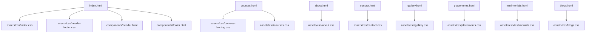
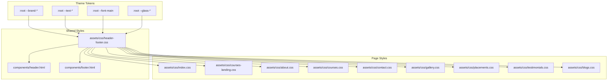
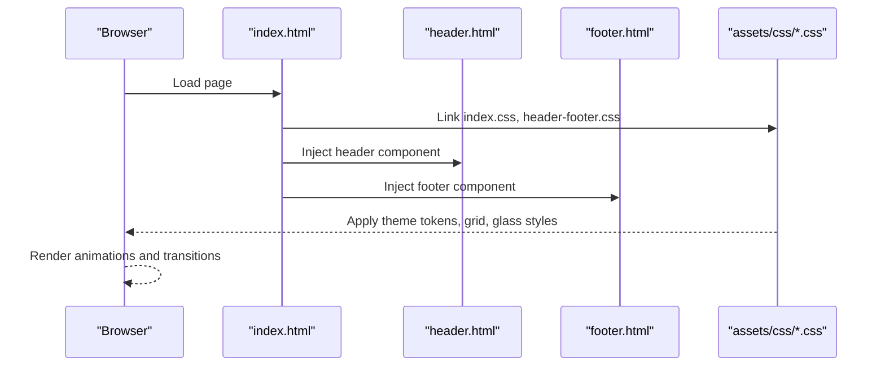
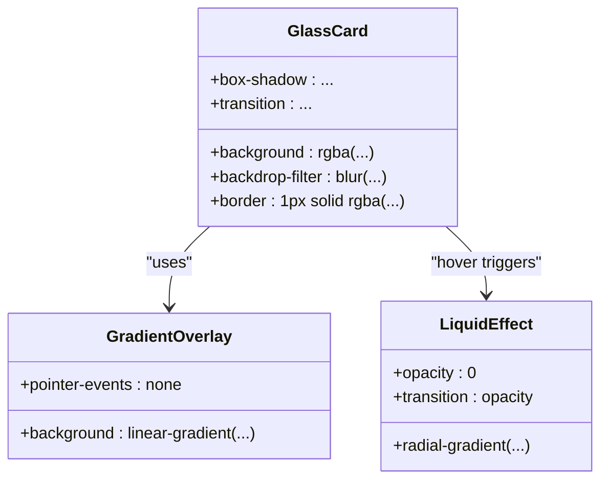
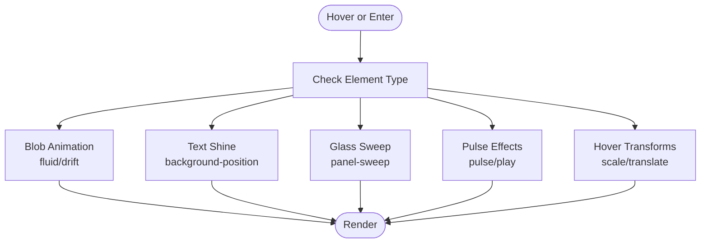
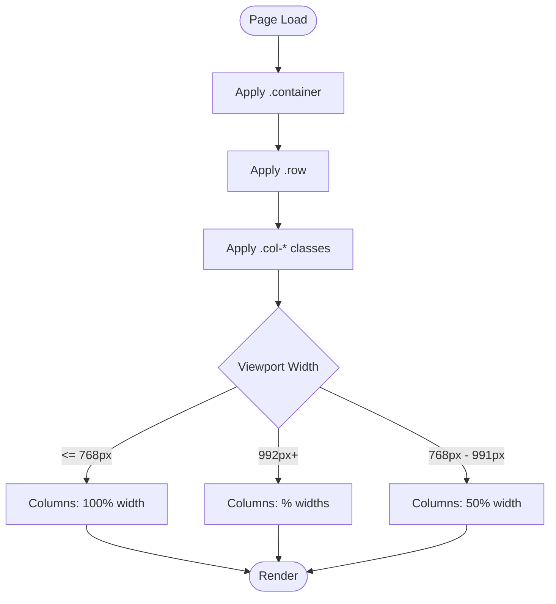
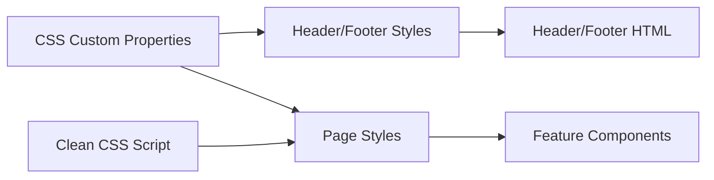

# Styling Architecture

<cite>
**Referenced Files in This Document**
- [index.html](file://index.html)
- [index.css](file://assets/css/index.css)
- [header-footer.css](file://assets/css/header-footer.css)
- [courses-landing.css](file://assets/css/courses-landing.css)
- [about.css](file://assets/css/about.css)
- [courses.css](file://assets/css/courses.css)
- [contact.css](file://assets/css/contact.css)
- [gallery.css](file://assets/css/gallery.css)
- [placements.css](file://assets/css/placements.css)
- [testimonials.css](file://assets/css/testimonials.css)
- [blogs.css](file://assets/css/blogs.css)
- [header.html](file://components/header.html)
- [footer.html](file://components/footer.html)
- [clean_css.js](file://clean_css.js)
</cite>

## Table of Contents
1. [Introduction](#introduction)
2. [Project Structure](#project-structure)
3. [Core Components](#core-components)
4. [Architecture Overview](#architecture-overview)
5. [Detailed Component Analysis](#detailed-component-analysis)
6. [Dependency Analysis](#dependency-analysis)
7. [Performance Considerations](#performance-considerations)
8. [Troubleshooting Guide](#troubleshooting-guide)
9. [Conclusion](#conclusion)

## Introduction
This document describes the Eduooz styling architecture and design system. It explains the CSS custom properties system for theme management, the glass morphism design implementation, a responsive grid system without external frameworks, animation and transition patterns, typography and iconography, and performance and compatibility considerations. The goal is to provide a comprehensive yet accessible guide for maintaining and extending the visual system.

## Project Structure
The styling system is organized around a shared design language with:
- A global design token system using CSS custom properties (:root)
- A vanilla CSS grid system for layouts
- Glass morphism styles for UI surfaces
- Page-specific CSS files for feature areas
- Shared header and footer components with consistent glass styling

**Diagram sources**
- [index.html:1-25](file://index.html#L1-L25)
- [header.html:1-22](file://components/header.html#L1-L22)
- [footer.html:1-75](file://components/footer.html#L1-L75)

**Section sources**
- [index.html:1-25](file://index.html#L1-L25)
- [header.html:1-22](file://components/header.html#L1-L22)
- [footer.html:1-75](file://components/footer.html#L1-L75)

## Core Components
- CSS custom properties (:root): Centralized theme tokens for colors, typography, and glass variables
- Vanilla grid system: Flexbox-based grid with responsive breakpoints
- Glass morphism: Backdrop blur, borders, and layered gradients for translucent UI
- Animations and transitions: Keyframes for motion, transitions for interactive states
- Typography: Plus Jakarta Sans for UI and optional Cormorant Garamond for headings
- Icons: Font Awesome integration for interactive and decorative icons
- Performance utilities: Clean CSS script to remove unused sections

**Section sources**
- [index.css:1-25](file://assets/css/index.css#L1-L25)
- [courses-landing.css:1-14](file://assets/css/courses-landing.css#L1-L14)
- [about.css:4-17](file://assets/css/about.css#L4-L17)
- [courses.css:1-10](file://assets/css/courses.css#L1-L10)
- [contact.css:1-25](file://assets/css/contact.css#L1-L25)
- [gallery.css:1-14](file://assets/css/gallery.css#L1-L14)
- [placements.css:1-14](file://assets/css/placements.css#L1-L14)
- [testimonials.css:1-14](file://assets/css/testimonials.css#L1-L14)
- [blogs.css:1-14](file://assets/css/blogs.css#L1-L14)
- [clean_css.js:1-40](file://clean_css.js#L1-L40)

## Architecture Overview
The styling architecture centers on a single design language:
- Theme tokens in :root define brand colors, text colors, and glass variables
- Shared header and footer use glass styles consistently across pages
- Page-specific CSS extends the base with feature-specific animations and layouts
- A vanilla grid system ensures consistent spacing and responsiveness

**Diagram sources**
- [index.css:1-25](file://assets/css/index.css#L1-L25)
- [header-footer.css:1-25](file://assets/css/header-footer.css#L1-L25)
- [header.html:1-22](file://components/header.html#L1-L22)
- [footer.html:1-75](file://components/footer.html#L1-L75)

## Detailed Component Analysis

### CSS Custom Properties System
- Theme tokens: Brand colors, text colors, and typography families are defined in :root
- Glass variables: Predefined rgba values and gradients for consistent glass panels
- Usage: Variables are referenced across components to maintain design consistency

Implementation highlights:
- Color scheme tokens for dark/light themes
- Typography tokens for primary font family
- Glass tokens for background, border, highlight, and shadow

**Section sources**
- [index.css:1-25](file://assets/css/index.css#L1-L25)
- [courses-landing.css:1-14](file://assets/css/courses-landing.css#L1-L14)
- [about.css:4-17](file://assets/css/about.css#L4-L17)
- [courses.css:1-10](file://assets/css/courses.css#L1-L10)
- [contact.css:1-25](file://assets/css/contact.css#L1-L25)
- [gallery.css:1-14](file://assets/css/gallery.css#L1-L14)
- [placements.css:1-14](file://assets/css/placements.css#L1-L14)
- [testimonials.css:1-14](file://assets/css/testimonials.css#L1-L14)
- [blogs.css:1-14](file://assets/css/blogs.css#L1-L14)

### Glass Morphism Implementation
Glass morphism is implemented consistently across components:
- Backdrop filters for blur effects
- Semi-transparent backgrounds and borders
- Gradient overlays for depth and highlight
- Box shadows for dimensionality

Key patterns:
- Glass cards with blur and borders
- Gradient overlays for lighting effects
- Layered borders and highlights for depth

**Section sources**
- [index.css:383-414](file://assets/css/index.css#L383-L414)
- [header-footer.css:4-25](file://assets/css/header-footer.css#L4-L25)
- [courses-landing.css:168-177](file://assets/css/courses-landing.css#L168-L177)
- [about.css:406-431](file://assets/css/about.css#L406-L431)
- [courses.css:175-217](file://assets/css/courses.css#L175-L217)
- [contact.css:232-239](file://assets/css/contact.css#L232-L239)
- [gallery.css:156-179](file://assets/css/gallery.css#L156-L179)
- [placements.css:131-136](file://assets/css/placements.css#L131-L136)
- [testimonials.css:132-154](file://assets/css/testimonials.css#L132-L154)
- [blogs.css:358-372](file://assets/css/blogs.css#L358-L372)

### Responsive Grid System
The grid system is built with flexbox and media queries:
- Base container and row classes
- Column classes with percentage widths
- Breakpoints at 768px and 992px for medium and large screens
- Mobile-first approach with stacked columns by default

Patterns:
- Flexbox wrapping for rows
- Percentage-based widths for columns
- Media queries to adjust widths and stacking

**Section sources**
- [index.css:191-229](file://assets/css/index.css#L191-L229)
- [courses-landing.css:31-42](file://assets/css/courses-landing.css#L31-L42)
- [about.css:34-46](file://assets/css/about.css#L34-L46)
- [courses.css:169-173](file://assets/css/courses.css#L169-L173)
- [contact.css:75-107](file://assets/css/contact.css#L75-L107)
- [gallery.css:140-154](file://assets/css/gallery.css#L140-L154)
- [placements.css:158-168](file://assets/css/placements.css#L158-L168)
- [testimonials.css:110-124](file://assets/css/testimonials.css#L110-L124)
- [blogs.css:316-323](file://assets/css/blogs.css#L316-L323)

### Animations and Transitions
Animations and transitions are used extensively:
- Keyframes for background blobs and cinematic effects
- Transitions for hover states and interactive elements
- Scroll-triggered reveals and parallax effects

Examples:
- Fluid and drift keyframes for animated blobs
- Gradient shine effects for text
- Pulse and sweep animations for glass panels
- Hover transforms and glows for cards and buttons

**Section sources**
- [index.css:121-129](file://assets/css/index.css#L121-L129)
- [index.css:701-709](file://assets/css/index.css#L701-L709)
- [index.css:276-280](file://assets/css/index.css#L276-L280)
- [index.css:597-609](file://assets/css/index.css#L597-L609)
- [header-footer.css:152-155](file://assets/css/header-footer.css#L152-L155)
- [courses-landing.css:190-191](file://assets/css/courses-landing.css#L190-L191)
- [courses.css:375-385](file://assets/css/courses.css#L375-L385)
- [testimonials.css:274-284](file://assets/css/testimonials.css#L274-L284)

### Typography and Icons
Typography:
- Plus Jakarta Sans is the primary font family
- Optional Cormorant Garamond for headings and serif accents
- Responsive font sizing using clamp and viewport units

Icons:
- Font Awesome is included globally
- Icons are used for navigation, badges, and interactive elements

**Section sources**
- [index.css:15](file://assets/css/index.css#L15)
- [courses-landing.css:12-13](file://assets/css/courses-landing.css#L12-L13)
- [about.css:244-246](file://assets/css/about.css#L244-L246)
- [index.html:9-16](file://index.html#L9-L16)

### Page-Specific Patterns
- Index page: Hero with animated background, glass stat bar, and course cards
- Courses landing: Hero with dynamic background, vitals dashboard, and video showcase
- About: Horizon scroll, bento boxes, and spatial pillars
- Courses: Liquid expansion grid and featured courses
- Contact: Form card with glass styling and map overlay
- Gallery: Parallax wall with custom glass cursor and lightbox
- Placements: Command center dashboard and alumni cascade
- Testimonials: Infinite marquee and swipeable theater
- Blogs: 3D magazine effect and cinematic story stacks

**Section sources**
- [index.css:68-132](file://assets/css/index.css#L68-L132)
- [courses-landing.css:87-220](file://assets/css/courses-landing.css#L87-L220)
- [about.css:300-794](file://assets/css/about.css#L300-L794)
- [courses.css:11-262](file://assets/css/courses.css#L11-L262)
- [contact.css:115-522](file://assets/css/contact.css#L115-L522)
- [gallery.css:109-223](file://assets/css/gallery.css#L109-L223)
- [placements.css:107-262](file://assets/css/placements.css#L107-L262)
- [testimonials.css:107-345](file://assets/css/testimonials.css#L107-L345)
- [blogs.css:104-530](file://assets/css/blogs.css#L104-L530)

### Performance and Organization
- Clean CSS script removes unused sections from index.css and contact.css to reduce bundle size
- Backdrop filters and blur effects are applied selectively to avoid unnecessary GPU load
- Media queries optimize rendering for different screen sizes
- CSS custom properties enable efficient theme switching and reduce duplication

**Section sources**
- [clean_css.js:1-40](file://clean_css.js#L1-L40)

## Architecture Overview

**Diagram sources**
- [index.html:22-24](file://index.html#L22-L24)
- [header.html:1-22](file://components/header.html#L1-L22)
- [footer.html:1-75](file://components/footer.html#L1-L75)

## Detailed Component Analysis

### Theme Token System
The theme token system defines:
- Brand palette: Dark background, purple, magenta, cyan accents
- Text palette: Light and dark text variants
- Typography: Primary font family and optional serif
- Glass palette: Background, border, highlight, and shadow variables

These tokens are consumed by all components to ensure visual consistency.

**Section sources**
- [index.css:1-25](file://assets/css/index.css#L1-L25)
- [courses-landing.css:1-14](file://assets/css/courses-landing.css#L1-L14)
- [about.css:4-17](file://assets/css/about.css#L4-L17)
- [courses.css:1-10](file://assets/css/courses.css#L1-L10)
- [contact.css:1-25](file://assets/css/contact.css#L1-L25)
- [gallery.css:1-14](file://assets/css/gallery.css#L1-L14)
- [placements.css:1-14](file://assets/css/placements.css#L1-L14)
- [testimonials.css:1-14](file://assets/css/testimonials.css#L1-L14)
- [blogs.css:1-14](file://assets/css/blogs.css#L1-L14)

### Glass Morphism Class Model

**Diagram sources**
- [index.css:383-414](file://assets/css/index.css#L383-L414)
- [courses-landing.css:168-177](file://assets/css/courses-landing.css#L168-L177)
- [about.css:406-431](file://assets/css/about.css#L406-L431)
- [courses.css:175-217](file://assets/css/courses.css#L175-L217)
- [testimonials.css:132-154](file://assets/css/testimonials.css#L132-L154)

### Animation Flowchart

**Diagram sources**
- [index.css:121-129](file://assets/css/index.css#L121-L129)
- [index.css:701-709](file://assets/css/index.css#L701-L709)
- [index.css:276-280](file://assets/css/index.css#L276-L280)
- [index.css:597-609](file://assets/css/index.css#L597-L609)
- [courses-landing.css:190-191](file://assets/css/courses-landing.css#L190-L191)
- [testimonials.css:274-284](file://assets/css/testimonials.css#L274-L284)

### Grid System Flowchart

**Diagram sources**
- [index.css:191-229](file://assets/css/index.css#L191-L229)
- [courses-landing.css:31-42](file://assets/css/courses-landing.css#L31-L42)
- [about.css:34-46](file://assets/css/about.css#L34-L46)
- [courses.css:169-173](file://assets/css/courses.css#L169-L173)
- [contact.css:75-107](file://assets/css/contact.css#L75-L107)
- [gallery.css:140-154](file://assets/css/gallery.css#L140-L154)
- [placements.css:158-168](file://assets/css/placements.css#L158-L168)
- [testimonials.css:110-124](file://assets/css/testimonials.css#L110-L124)
- [blogs.css:316-323](file://assets/css/blogs.css#L316-L323)

## Dependency Analysis
The styling system exhibits low coupling and high cohesion:
- Shared tokens in :root drive all components
- Header and footer share common glass styles
- Page-specific styles extend base without overriding tokens
- Utilities like clean_css.js reduce maintenance overhead

**Diagram sources**
- [index.css:1-25](file://assets/css/index.css#L1-L25)
- [header-footer.css:1-25](file://assets/css/header-footer.css#L1-L25)
- [header.html:1-22](file://components/header.html#L1-L22)
- [footer.html:1-75](file://components/footer.html#L1-L75)
- [clean_css.js:1-40](file://clean_css.js#L1-L40)

**Section sources**
- [index.css:1-25](file://assets/css/index.css#L1-L25)
- [header-footer.css:1-25](file://assets/css/header-footer.css#L1-L25)
- [clean_css.js:1-40](file://clean_css.js#L1-L40)

## Performance Considerations
- Prefer CSS custom properties for theme updates to avoid repaints
- Use transform and opacity for animations to leverage compositor threads
- Limit backdrop-filter usage to critical components to reduce GPU load
- Minimize media query complexity and consolidate breakpoints
- Remove unused CSS via clean_css.js to reduce payload

[No sources needed since this section provides general guidance]

## Troubleshooting Guide
Common issues and resolutions:
- Glass effects not visible: Verify backdrop-filter support and ensure parent containers have sufficient contrast
- Grid misalignment: Confirm column classes match intended breakpoints and container margins are balanced
- Animation stutter: Reduce number of animated elements on scroll or switch to transform-based animations
- Font loading: Ensure Google Fonts links are present and fallback fonts are defined
- CSS bloat: Run clean_css.js to strip unused sections from index.css and contact.css

**Section sources**
- [clean_css.js:1-40](file://clean_css.js#L1-L40)
- [index.html:9-16](file://index.html#L9-L16)

## Conclusion
The Eduooz styling architecture leverages a centralized token system, consistent glass morphism, and a robust vanilla grid to create a cohesive, performant, and visually compelling design system. By adhering to the documented patterns and utilizing the provided utilities, teams can extend the system while maintaining design consistency and optimal performance.