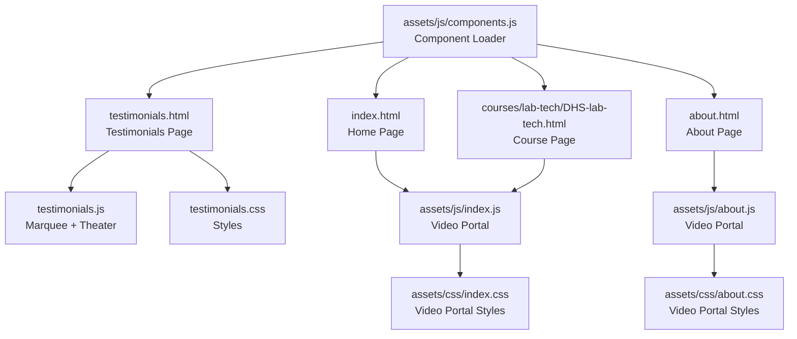
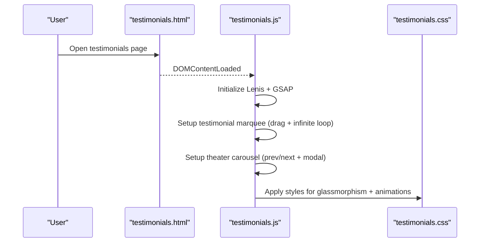
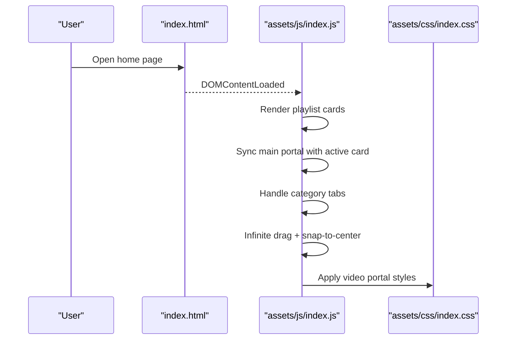
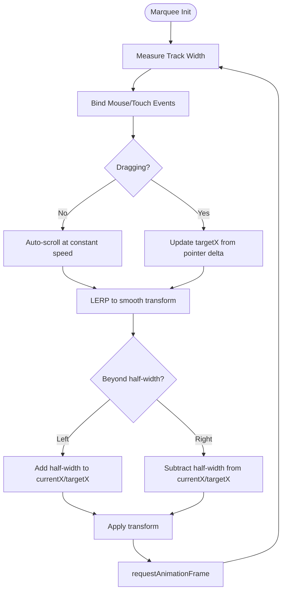
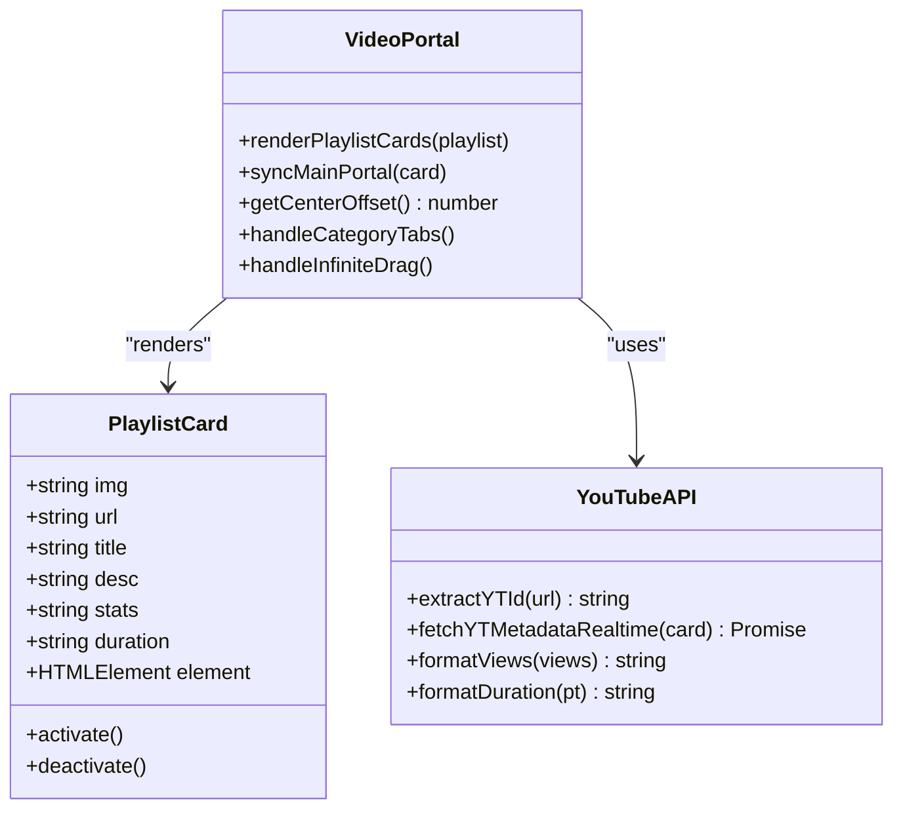
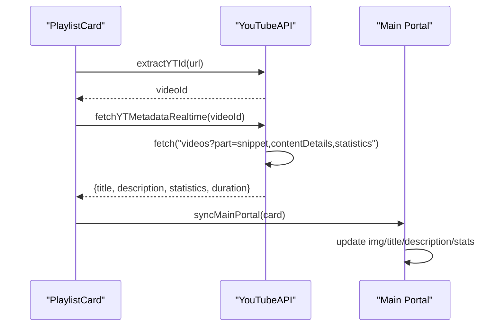
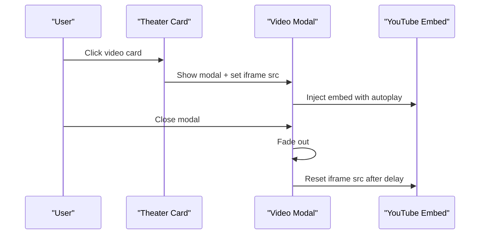
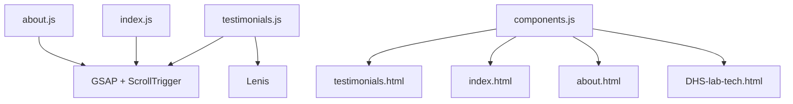

# Testimonial and Video System

<cite>
**Referenced Files in This Document**
- [testimonials.js](file://assets/js/testimonials.js)
- [testimonials.css](file://assets/css/testimonials.css)
- [testimonials.html](file://testimonials.html)
- [components.js](file://assets/js/components.js)
- [index.js](file://assets/js/index.js)
- [about.js](file://assets/js/about.js)
- [index.css](file://assets/css/index.css)
- [about.css](file://assets/css/about.css)
- [index.html](file://index.html)
- [about.html](file://about.html)
- [DHS-lab-tech.html](file://courses/lab-tech/DHS-lab-tech.html)
</cite>

## Table of Contents
1. [Introduction](#introduction)
2. [Project Structure](#project-structure)
3. [Core Components](#core-components)
4. [Architecture Overview](#architecture-overview)
5. [Detailed Component Analysis](#detailed-component-analysis)
6. [Dependency Analysis](#dependency-analysis)
7. [Performance Considerations](#performance-considerations)
8. [Accessibility Considerations](#accessibility-considerations)
9. [Troubleshooting Guide](#troubleshooting-guide)
10. [Conclusion](#conclusion)

## Introduction
This document describes the Eduooz testimonial and video carousel system, focusing on:
- YouTube video integration with playlist management, metadata extraction, and player customization
- Testimonial carousel functionality with infinite scrolling, responsive design, and touch interaction
- Video portal implementation featuring main video display, playlist navigation, and category filtering
- Technical details around YouTube API integration, video metadata extraction, and player state management
- Examples of testimonial data structures, carousel animation implementation, and responsive breakpoint handling
- Accessibility considerations, performance optimization for video loading, and cross-platform compatibility

## Project Structure
The system spans three primary areas:
- Testimonial marquee and theater carousel on the testimonials page
- Video portal ecosystem present across multiple pages (home, about, course-specific pages)
- Shared component loader for dynamic content injection

**Diagram sources**
- [testimonials.html:1-447](file://testimonials.html#L1-L447)
- [testimonials.js:1-267](file://assets/js/testimonials.js#L1-L267)
- [testimonials.css:1-345](file://assets/css/testimonials.css#L1-L345)
- [index.html:532-558](file://index.html#L532-L558)
- [index.js:1200-1399](file://assets/js/index.js#L1200-L1399)
- [about.html:496-527](file://about.html#L496-L527)
- [about.js:1140-1339](file://assets/js/about.js#L1140-L1339)
- [index.css:1708-1899](file://assets/css/index.css#L1708-L1899)
- [about.css:1253-1449](file://assets/css/about.css#L1253-L1449)
- [components.js:1-347](file://assets/js/components.js#L1-L347)

**Section sources**
- [testimonials.html:1-447](file://testimonials.html#L1-L447)
- [index.html:532-558](file://index.html#L532-L558)
- [about.html:496-527](file://about.html#L496-L527)
- [DHS-lab-tech.html:730-762](file://courses/lab-tech/DHS-lab-tech.html#L730-L762)
- [components.js:1-347](file://assets/js/components.js#L1-L347)

## Core Components
- Testimonial Marquee: Infinite horizontal scrolling testimonials with dual-direction rows and drag support
- Theater Carousel: Swipable video cards with modal playback and GSAP-driven animations
- Video Portal: Main video display with animated metadata overlay, playlist track with category tabs, and magnetic cursor effects
- YouTube Metadata Integration: Runtime fetching via YouTube Data API v3 with graceful fallbacks
- Component Loader: Dynamic injection of header, footer, and chat components

**Section sources**
- [testimonials.js:135-211](file://assets/js/testimonials.js#L135-L211)
- [testimonials.js:220-265](file://assets/js/testimonials.js#L220-L265)
- [index.js:1140-1339](file://assets/js/index.js#L1140-L1339)
- [about.js:1140-1339](file://assets/js/about.js#L1140-L1339)
- [index.css:1708-1899](file://assets/css/index.css#L1708-L1899)
- [about.css:1253-1449](file://assets/css/about.css#L1253-L1449)

## Architecture Overview
The system integrates client-side JavaScript with CSS animations and HTML templates to deliver a cohesive multimedia experience. The testimonial carousel operates independently on the testimonials page, while the video portal is shared across multiple pages and dynamically renders playlist cards and metadata.

**Diagram sources**
- [testimonials.html:1-447](file://testimonials.html#L1-L447)
- [testimonials.js:1-267](file://assets/js/testimonials.js#L1-L267)
- [testimonials.css:1-345](file://assets/css/testimonials.css#L1-L345)

**Diagram sources**
- [index.html:532-558](file://index.html#L532-L558)
- [index.js:1140-1339](file://assets/js/index.js#L1140-L1339)
- [index.css:1708-1899](file://assets/css/index.css#L1708-L1899)

## Detailed Component Analysis

### Testimonial Marquee and Theater Carousel
- Infinite horizontal scrolling testimonials with two synchronized rows, one moving left, the other right
- Drag support with mouse and touch events, LERP-based smoothing, and seamless loop wrapping
- Theater carousel with swipable cards, desktop navigation arrows, and modal playback
- GSAP-powered reveal animations and magnetic button interactions

**Diagram sources**
- [testimonials.js:150-211](file://assets/js/testimonials.js#L150-L211)

**Section sources**
- [testimonials.js:135-211](file://assets/js/testimonials.js#L135-L211)
- [testimonials.js:220-265](file://assets/js/testimonials.js#L220-L265)
- [testimonials.css:108-345](file://assets/css/testimonials.css#L108-L345)
- [testimonials.html:46-420](file://testimonials.html#L46-L420)

### Video Portal Implementation
- Main video portal with animated background image, glass overlay, and floating metadata
- Curved playlist track with magnetic play cursor and category tabs
- Dynamic card renderer with YouTube metadata fetching and runtime updates
- Infinite drag-and-snap behavior with GSAP animations and center alignment

**Diagram sources**
- [index.js:1140-1339](file://assets/js/index.js#L1140-L1339)
- [about.js:1140-1339](file://assets/js/about.js#L1140-L1339)
- [index.js:907-941](file://assets/js/index.js#L907-L941)
- [about.js:916-941](file://assets/js/about.js#L916-L941)

**Section sources**
- [index.js:1140-1339](file://assets/js/index.js#L1140-L1339)
- [about.js:1140-1339](file://assets/js/about.js#L1140-L1339)
- [index.css:1708-1899](file://assets/css/index.css#L1708-L1899)
- [about.css:1253-1449](file://assets/css/about.css#L1253-L1449)

### YouTube API Integration and Metadata Extraction
- Runtime metadata fetching using YouTube Data API v3 with graceful fallbacks when API key is absent
- Utility functions to extract video IDs from URLs, format view counts, and convert ISO 8601 durations to readable strings
- Per-card metadata population and live updates to the main portal’s active video content

**Diagram sources**
- [index.js:907-941](file://assets/js/index.js#L907-L941)
- [index.js:932-978](file://assets/js/index.js#L932-L978)
- [index.js:1021-1043](file://assets/js/index.js#L1021-L1043)

**Section sources**
- [index.js:907-941](file://assets/js/index.js#L907-L941)
- [index.js:932-978](file://assets/js/index.js#L932-L978)
- [index.js:1021-1043](file://assets/js/index.js#L1021-L1043)

### Player State Management and Modal Playback
- Theater modal opens on card click, injecting a YouTube embed with autoplay and modest branding
- Modal closes cleanly by resetting the iframe source after exit animation completes
- Video portal supports inline iframe injection on click, with cleanup to prevent audio continuation

**Diagram sources**
- [testimonials.js:238-265](file://assets/js/testimonials.js#L238-L265)
- [testimonials.html:429-435](file://testimonials.html#L429-L435)

**Section sources**
- [testimonials.js:238-265](file://assets/js/testimonials.js#L238-L265)
- [testimonials.html:429-435](file://testimonials.html#L429-L435)

### Responsive Design and Cross-Platform Compatibility
- Breakpoints and media queries adjust card sizes, spacing, and navigation controls for tablets and phones
- Mobile-first carousel logic detects screen center to activate cards on small screens
- Touch and mouse events are handled separately with passive listeners for performance

**Section sources**
- [testimonials.css:211-325](file://assets/css/testimonials.css#L211-L325)
- [index.css:1708-1899](file://assets/css/index.css#L1708-L1899)
- [about.css:1253-1449](file://assets/css/about.css#L1253-L1449)
- [testimonials.js:1827-1865](file://assets/js/testimonials.js#L1827-L1865)
- [index.js:1779-1885](file://assets/js/index.js#L1779-L1885)

## Dependency Analysis
The system relies on external libraries and modular scripts:
- GSAP and ScrollTrigger for animations and scroll-based triggers
- Lenis for smooth scrolling integration
- Component loader for dynamic HTML injection across pages

**Diagram sources**
- [testimonials.js:1-38](file://assets/js/testimonials.js#L1-L38)
- [index.js:1140-1339](file://assets/js/index.js#L1140-L1339)
- [about.js:1140-1339](file://assets/js/about.js#L1140-L1339)
- [components.js:1-347](file://assets/js/components.js#L1-L347)

**Section sources**
- [testimonials.js:1-38](file://assets/js/testimonials.js#L1-L38)
- [components.js:1-347](file://assets/js/components.js#L1-L347)

## Performance Considerations
- Efficient measurement caching and minimal DOM reads in hot loops
- Passive event listeners for touch interactions to avoid layout thrashing
- LERP-based transforms for smooth animations with reduced jank
- Lazy iframe creation and removal to prevent background audio and memory leaks
- Graceful fallbacks when YouTube API keys are unavailable

[No sources needed since this section provides general guidance]

## Accessibility Considerations
- Keyboard navigable category tabs and playlist cards
- Focus management during modal transitions
- Sufficient color contrast for glassmorphism overlays
- Alt text for video thumbnails and author avatars
- Reduced motion options via prefers-reduced-motion media queries

[No sources needed since this section provides general guidance]

## Troubleshooting Guide
Common issues and resolutions:
- YouTube API quota exceeded or missing key: system falls back to static HTML attributes
- Modal does not close audio: ensure iframe source reset occurs after exit animation
- Carousel feels sluggish: verify passive touch listeners and LERP damping values
- Playlist misalignment: confirm center offset calculations and card width/gap measurements

**Section sources**
- [index.js:932-978](file://assets/js/index.js#L932-L978)
- [testimonials.js:254-265](file://assets/js/testimonials.js#L254-L265)
- [index.js:1779-1885](file://assets/js/index.js#L1779-L1885)

## Conclusion
The Eduooz testimonial and video system combines a polished testimonial marquee, a performant theater carousel, and a sophisticated video portal to deliver an immersive educational experience. Through careful use of modern web APIs, GSAP animations, and responsive design, the system balances visual appeal with performance and accessibility across platforms.