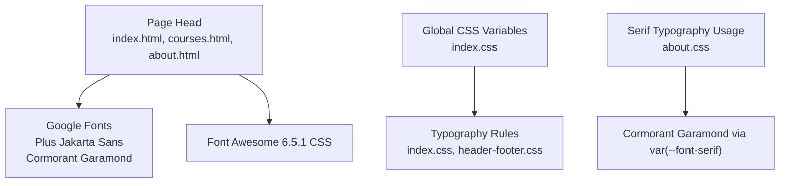
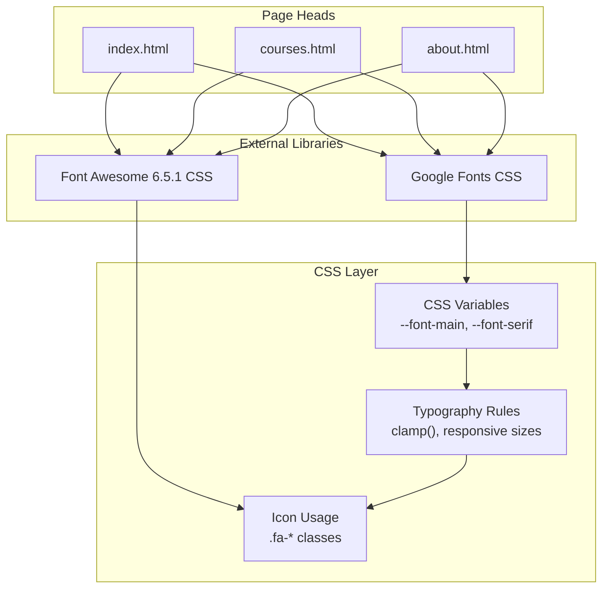
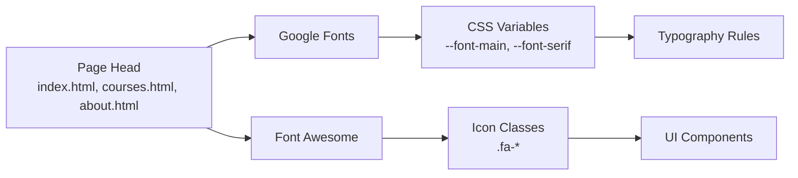
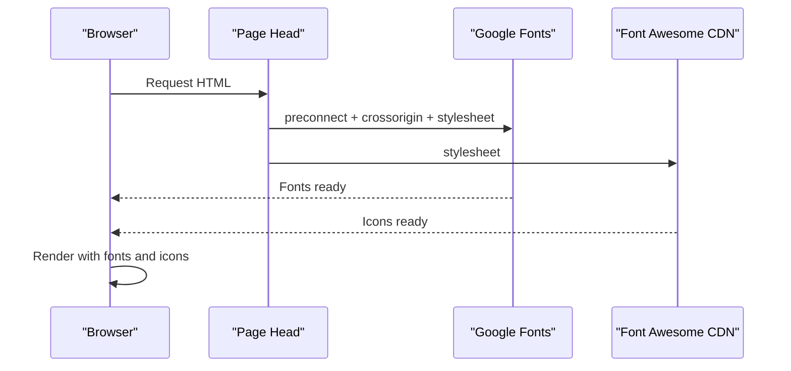

# Font and Icon Libraries

<cite>
**Referenced Files in This Document**
- [index.html](file://index.html)
- [courses.html](file://courses.html)
- [about.html](file://about.html)
- [index.css](file://assets/css/index.css)
- [header-footer.css](file://assets/css/header-footer.css)
- [placements.css](file://assets/css/placements.css)
- [testimonials.css](file://assets/css/testimonials.css)
- [courses-landing.css](file://assets/css/courses-landing.css)
- [about.css](file://assets/css/about.css)
- [components.js](file://assets/js/components.js)
</cite>

## Table of Contents
1. [Introduction](#introduction)
2. [Project Structure](#project-structure)
3. [Core Components](#core-components)
4. [Architecture Overview](#architecture-overview)
5. [Detailed Component Analysis](#detailed-component-analysis)
6. [Dependency Analysis](#dependency-analysis)
7. [Performance Considerations](#performance-considerations)
8. [Troubleshooting Guide](#troubleshooting-guide)
9. [Conclusion](#conclusion)
10. [Appendices](#appendices)

## Introduction
This document explains the font and icon libraries used across the Eduooz website. It covers:
- Google Fonts integration for Plus Jakarta Sans and Cormorant Garamond
- Typography hierarchy and responsive scaling
- Font loading performance strategies and fallbacks
- Font Awesome 6.5.1 usage patterns, SVG optimization, and custom styling
- Licensing and CDN best practices
- Extending the icon library and maintaining design system consistency

## Project Structure
The website loads fonts and icons in the document head and applies them via CSS custom properties and component-specific stylesheets. Key locations:
- Font and icon links in page heads
- Global CSS variables for font families
- Component-specific CSS applying typography and icon usage

**Diagram sources**
- [index.html:4-24](file://index.html#L4-L24)
- [courses.html:4-33](file://courses.html#L4-L33)
- [about.html:3-21](file://about.html#L3-L21)
- [index.css:15](file://assets/css/index.css#L15)
- [header-footer.css:170](file://assets/css/header-footer.css#L170)
- [about.css:1628](file://assets/css/about.css#L1628)

**Section sources**
- [index.html:4-24](file://index.html#L4-L24)
- [courses.html:4-33](file://courses.html#L4-L33)
- [about.html:3-21](file://about.html#L3-L21)
- [index.css:15](file://assets/css/index.css#L15)
- [header-footer.css:170](file://assets/css/header-footer.css#L170)
- [about.css:1628](file://assets/css/about.css#L1628)

## Core Components
- Google Fonts
  - Plus Jakarta Sans: primary sans-serif for body and UI text
  - Cormorant Garamond: serif accent for quotes, role labels, and special typography
- Font Awesome 6.5.1
  - Loaded via CDN for scalable vector icons
  - Used extensively in navigation, buttons, cards, and decorative elements

Key implementation references:
- Font links and FA stylesheet in page heads
- CSS variables for font families
- Serif usage in about page
- Icon usage across components

**Section sources**
- [index.html:11-16](file://index.html#L11-L16)
- [courses.html:13-18](file://courses.html#L13-L18)
- [about.html:10-12](file://about.html#L10-L12)
- [index.css:15](file://assets/css/index.css#L15)
- [placements.css:12-13](file://assets/css/placements.css#L12-L13)
- [testimonials.css:12-13](file://assets/css/testimonials.css#L12-L13)
- [courses-landing.css:641-643](file://assets/css/courses-landing.css#L641-L643)
- [about.css:1628](file://assets/css/about.css#L1628)

## Architecture Overview
The typography and icon systems are centralized in the page head and CSS variables, enabling consistent application across components.

**Diagram sources**
- [index.html:11-16](file://index.html#L11-L16)
- [courses.html:13-18](file://courses.html#L13-L18)
- [about.html:10-12](file://about.html#L10-L12)
- [index.css:15](file://assets/css/index.css#L15)
- [placements.css:12-13](file://assets/css/placements.css#L12-L13)
- [testimonials.css:12-13](file://assets/css/testimonials.css#L12-L13)
- [courses-landing.css:641-643](file://assets/css/courses-landing.css#L641-L643)
- [about.css:1628](file://assets/css/about.css#L1628)

## Detailed Component Analysis

### Google Fonts Integration
- Plus Jakarta Sans
  - Loaded with multiple weights for UI and headings
  - Applied via CSS variable for body and component typography
- Cormorant Garamond
  - Imported with specific weight and italic variant
  - Used for serif typography accents (quotes, roles, decorative text)

Implementation highlights:
- Preconnect and cross-origin hints for improved font loading
- CSS variables define font families for reuse
- Serif family is explicitly declared in multiple component CSS files

**Section sources**
- [index.html:11-16](file://index.html#L11-L16)
- [courses.html:13-18](file://courses.html#L13-L18)
- [about.html:10-12](file://about.html#L10-L12)
- [index.css:15](file://assets/css/index.css#L15)
- [placements.css:12-13](file://assets/css/placements.css#L12-L13)
- [testimonials.css:12-13](file://assets/css/testimonials.css#L12-L13)
- [courses-landing.css:641-643](file://assets/css/courses-landing.css#L641-L643)
- [about.css:1628](file://assets/css/about.css#L1628)

### Typography Hierarchy and Responsive Scaling
- Body and UI text
  - Primary font applied via CSS variable
  - Responsive sizing using clamp() for headings and section titles
- Serif accents
  - Specific selectors apply serif family for quotes and role labels
- Component-specific scales
  - Buttons, stats, and cards define font sizes and weights for consistent rhythm

Examples of responsive typography:
- Hero titles and section headers use clamp() for fluid scaling
- Stat numbers and labels adjust across breakpoints
- Footer and navigation typography remains consistent via CSS variables

**Section sources**
- [index.css:255-289](file://assets/css/index.css#L255-L289)
- [index.css:728-742](file://assets/css/index.css#L728-L742)
- [header-footer.css:165-168](file://assets/css/header-footer.css#L165-L168)
- [placements.css:126-127](file://assets/css/placements.css#L126-L127)
- [testimonials.css:126-127](file://assets/css/testimonials.css#L126-L127)
- [courses-landing.css:650-651](file://assets/css/courses-landing.css#L650-L651)

### Font Awesome 6.5.1 Integration
- CDN-hosted CSS ensures fast delivery and caching
- Scalable vector icons integrate seamlessly with text and layout
- Custom icon styling applied via component CSS (sizes, colors, spacing)

Usage patterns observed:
- Navigation and header CTA buttons
- Feature lists and course cards
- Social links and decorative accents
- Role badges and quote styling

**Section sources**
- [index.html:16](file://index.html#L16)
- [courses.html:18](file://courses.html#L18)
- [about.html:12](file://about.html#L12)
- [header-footer.css:196-205](file://assets/css/header-footer.css#L196-L205)
- [courses-landing.css:641-643](file://assets/css/courses-landing.css#L641-L643)
- [about.css:1628](file://assets/css/about.css#L1628)

### SVG Optimization and Custom Styling
- Inline SVG used for decorative elements (e.g., rotating badges)
- CSS transforms and animations applied for motion effects
- Color and stroke customization via CSS variables

Example references:
- Rotating badge with animated text along a circular path
- Social media icons styled with glass and hover effects

**Section sources**
- [index.html:357-367](file://index.html#L357-L367)
- [header-footer.css:196-205](file://assets/css/header-footer.css#L196-L205)

### Component-Level Typography and Icon Application
- Header and footer
  - Navigation items and buttons use consistent font sizes and weights
  - Icons accompany text in menus and social links
- About page
  - Serif typography for role labels and quotes
  - Decorative watermarks and gradients complement iconography
- Courses landing
  - Icon-based badges and stats for course features
  - Consistent color and sizing via CSS utilities

**Section sources**
- [header-footer.css:71-94](file://assets/css/header-footer.css#L71-L94)
- [header-footer.css:196-205](file://assets/css/header-footer.css#L196-L205)
- [about.css:1628](file://assets/css/about.css#L1628)
- [courses-landing.css:641-643](file://assets/css/courses-landing.css#L641-L643)

## Dependency Analysis
The typography and icon systems depend on:
- Page head imports for external libraries
- CSS variables for centralized font family definitions
- Component CSS for targeted overrides and icon usage

**Diagram sources**
- [index.html:11-16](file://index.html#L11-L16)
- [courses.html:13-18](file://courses.html#L13-L18)
- [about.html:10-12](file://about.html#L10-L12)
- [index.css:15](file://assets/css/index.css#L15)
- [header-footer.css:170](file://assets/css/header-footer.css#L170)

**Section sources**
- [index.html:11-16](file://index.html#L11-L16)
- [courses.html:13-18](file://courses.html#L13-L18)
- [about.html:10-12](file://about.html#L10-L12)
- [index.css:15](file://assets/css/index.css#L15)
- [header-footer.css:170](file://assets/css/header-footer.css#L170)

## Performance Considerations
- Preload strategy
  - preconnect and cross-origin hints reduce DNS and handshake latency for font domains
- Font-display behavior
  - Font loading uses default display behavior; consider adding font-display: swap for improved perceived performance
- Weight and subset selection
  - Current imports include multiple weights; consider narrowing to essential weights per page to reduce payload
- Icon delivery
  - Single CSS file loaded once; keep CDN for global caching benefits
- Local hosting alternatives
  - Self-hosting fonts requires proper CORS and cache headers; ensure WOFF2 availability and consider service worker caching
- Fallback fonts
  - Sans-serif fallback is implicit; ensure readable fallbacks for serif usage where applicable

[No sources needed since this section provides general guidance]

## Troubleshooting Guide
- Fonts not rendering
  - Verify preconnect and crossorigin attributes in page head
  - Confirm CSS variables are defined and applied consistently
- Serif text not appearing
  - Ensure the serif font variable is present in component CSS
  - Check for conflicting font-family declarations
- Icons missing or misaligned
  - Confirm Font Awesome CSS is loaded
  - Inspect icon classes and ensure they match FA 6.5.1 naming
- Layout shifts
  - Use clamp() and viewport-relative units for stable scaling
  - Avoid changing font metrics mid-load; preload critical fonts

**Section sources**
- [index.html:11-16](file://index.html#L11-L16)
- [courses.html:13-18](file://courses.html#L13-L18)
- [about.html:10-12](file://about.html#L10-L12)
- [index.css:15](file://assets/css/index.css#L15)
- [placements.css:12-13](file://assets/css/placements.css#L12-L13)
- [testimonials.css:12-13](file://assets/css/testimonials.css#L12-L13)
- [courses-landing.css:641-643](file://assets/css/courses-landing.css#L641-L643)
- [about.css:1628](file://assets/css/about.css#L1628)

## Conclusion
The Eduooz website employs a clean, maintainable typography and icon system:
- Plus Jakarta Sans provides a modern, versatile foundation
- Cormorant Garamond adds elegant serif accents where needed
- Font Awesome 6.5.1 delivers scalable, accessible icons
- CSS variables and component-specific styles ensure consistency and flexibility
Adhering to the recommended performance and maintenance practices will keep the system fast, reliable, and easy to evolve.

[No sources needed since this section summarizes without analyzing specific files]

## Appendices

### Font Loading Sequence (Conceptual)

[No sources needed since this diagram shows conceptual workflow, not actual code structure]

### Extending the Icon Library
- Add new FA icons by including the appropriate class names in HTML
- Style icons consistently using existing button and utility classes
- Maintain color and sizing via CSS variables and component styles
- For custom icons, prefer inline SVG or FA brands where available

**Section sources**
- [index.html:16](file://index.html#L16)
- [courses.html:18](file://courses.html#L18)
- [about.html:12](file://about.html#L12)
- [header-footer.css:196-205](file://assets/css/header-footer.css#L196-L205)

### Maintaining Design System Consistency
- Define typography scales and icon usage in shared CSS variables
- Apply clamp() for responsive scaling across breakpoints
- Use component-specific CSS to override defaults while preserving global styles
- Keep icon and font choices aligned with brand guidelines

**Section sources**
- [index.css:15](file://assets/css/index.css#L15)
- [header-footer.css:170](file://assets/css/header-footer.css#L170)
- [about.css:1628](file://assets/css/about.css#L1628)
- [courses-landing.css:641-643](file://assets/css/courses-landing.css#L641-L643)