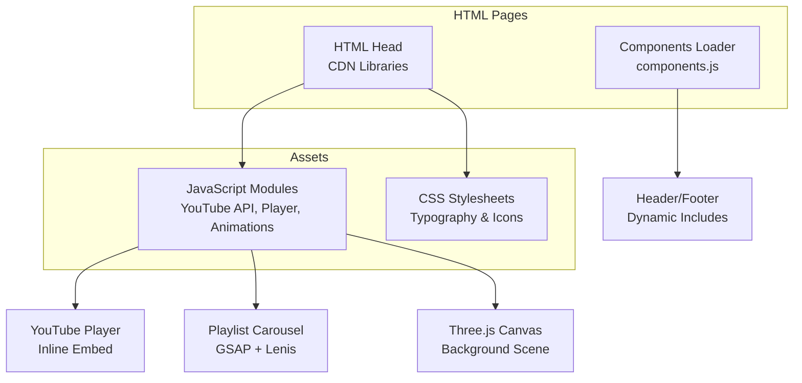
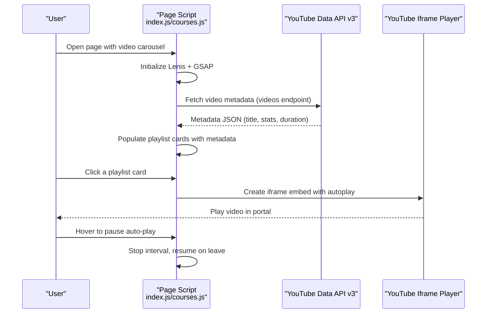
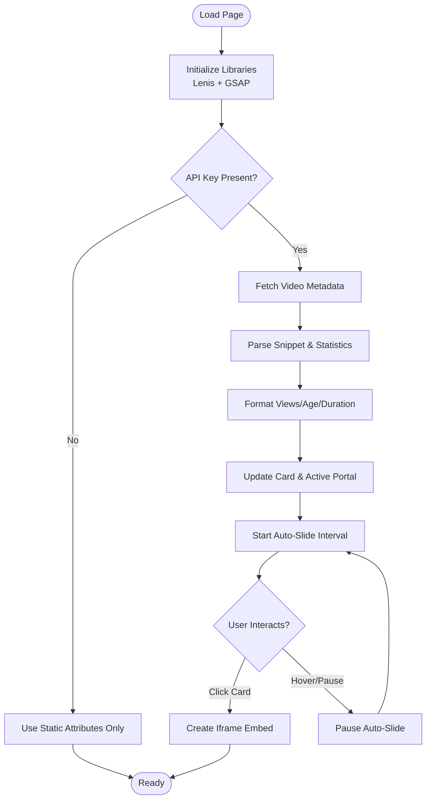
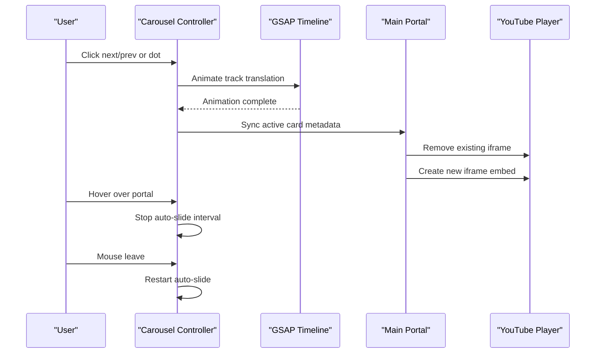
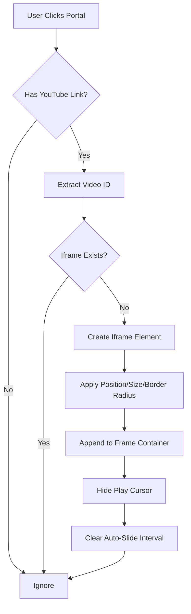
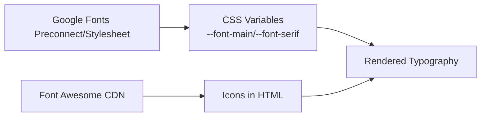
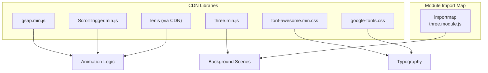
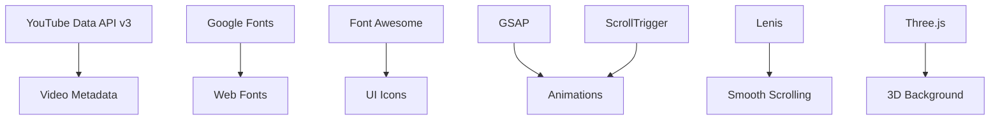

# Third-party Integrations

<cite>
**Referenced Files in This Document**
- [index.html](file://index.html)
- [about.html](file://about.html)
- [courses.html](file://courses.html)
- [assets/js/index.js](file://assets/js/index.js)
- [assets/js/courses.js](file://assets/js/courses.js)
- [assets/js/about.js](file://assets/js/about.js)
- [assets/js/components.js](file://assets/js/components.js)
- [assets/css/header-footer.css](file://assets/css/header-footer.css)
- [assets/css/about.css](file://assets/css/about.css)
</cite>

## Table of Contents
1. [Introduction](#introduction)
2. [Project Structure](#project-structure)
3. [Core Components](#core-components)
4. [Architecture Overview](#architecture-overview)
5. [Detailed Component Analysis](#detailed-component-analysis)
6. [Dependency Analysis](#dependency-analysis)
7. [Performance Considerations](#performance-considerations)
8. [Security Considerations](#security-considerations)
9. [Troubleshooting Guide](#troubleshooting-guide)
10. [Conclusion](#conclusion)

## Introduction
This document explains how Eduooz integrates third-party services and external libraries to deliver interactive experiences. It covers:
- YouTube API integration for dynamic video metadata, category-based playlists, and inline player embedding
- Typography services via Google Fonts and Font Awesome iconography
- External library management for Three.js, GSAP, and Lenis
- API integration patterns, configuration, error handling, and fallback strategies
- Version compatibility, update procedures, and operational best practices

## Project Structure
Third-party integrations are primarily declared in HTML head sections and consumed by JavaScript modules:
- CDN-hosted libraries are included in the HTML head for global availability
- JavaScript modules implement YouTube API fetching, playlist rendering, and media player controls
- CSS leverages Google Fonts and Font Awesome for typography and icons
- Components are loaded dynamically via a component loader

**Diagram sources**
- [index.html:1-25](file://index.html#L1-L25)
- [about.html:1-20](file://about.html#L1-L20)
- [courses.html:1-33](file://courses.html#L1-L33)
- [assets/js/index.js:905-1080](file://assets/js/index.js#L905-L1080)
- [assets/js/about.js:1-120](file://assets/js/about.js#L1-L120)
- [assets/js/components.js:1-76](file://assets/js/components.js#L1-L76)

**Section sources**
- [index.html:1-25](file://index.html#L1-L25)
- [about.html:1-20](file://about.html#L1-L20)
- [courses.html:1-33](file://courses.html#L1-L33)
- [assets/js/components.js:1-76](file://assets/js/components.js#L1-L76)

## Core Components
- YouTube Data API v3 integration for dynamic metadata retrieval and category-based playlists
- Inline YouTube player embedding with autoplay and responsive iframe controls
- GSAP-powered animations and Lenis smooth scrolling orchestration
- Three.js canvas for immersive background scenes
- Google Fonts and Font Awesome for typography and icons

Key integration points:
- YouTube API key placeholder and runtime fetching logic
- Category-specific playlist arrays and interleaving strategy
- Player portal click handler and iframe lifecycle management
- Lenis initialization and GSAP ticker synchronization
- Three.js scene setup guarded by feature detection

**Section sources**
- [assets/js/index.js:905-1080](file://assets/js/index.js#L905-L1080)
- [assets/js/courses.js:500-700](file://assets/js/courses.js#L500-L700)
- [assets/js/about.js:1-120](file://assets/js/about.js#L1-L120)

## Architecture Overview
The integration architecture combines declarative CDN inclusion with imperative JavaScript orchestration. The flow below maps actual code locations to illustrate how external services are wired.

**Diagram sources**
- [assets/js/index.js:905-1080](file://assets/js/index.js#L905-L1080)
- [assets/js/courses.js:500-700](file://assets/js/courses.js#L500-L700)

## Detailed Component Analysis

### YouTube API Integration
The YouTube integration consists of:
- API key placeholder and runtime guard
- URL parsing and metadata extraction
- Formatting helpers for views, age, and durations
- Dynamic playlist rendering and carousel synchronization
- Inline player creation and lifecycle management

**Diagram sources**
- [assets/js/index.js:905-1080](file://assets/js/index.js#L905-L1080)
- [assets/js/courses.js:500-700](file://assets/js/courses.js#L500-L700)

Implementation highlights:
- API endpoint construction and error handling with graceful fallback
- Duration parsing and human-readable stats composition
- Active card synchronization and portal updates with GSAP transitions
- Auto-play interval management and hover pause behavior
- Inline iframe creation with autoplay and responsive sizing

**Section sources**
- [assets/js/index.js:905-1080](file://assets/js/index.js#L905-L1080)
- [assets/js/courses.js:500-700](file://assets/js/courses.js#L500-L700)

### Playlist Management and Carousel Controls
Carousel behavior includes:
- Centering logic for the active card
- Responsive slides visibility and pagination dots
- Click handlers for switching videos and pausing auto-play
- Hover pause/resume integration with Lenis and GSAP

**Diagram sources**
- [assets/js/index.js:980-1080](file://assets/js/index.js#L980-L1080)
- [assets/js/courses.js:530-640](file://assets/js/courses.js#L530-L640)

**Section sources**
- [assets/js/index.js:980-1080](file://assets/js/index.js#L980-L1080)
- [assets/js/courses.js:530-640](file://assets/js/courses.js#L530-L640)

### Inline YouTube Player Customization
The inline player:
- Creates an iframe on demand within the main portal
- Applies responsive styles and z-index stacking
- Removes iframe on metadata sync to prevent audio bleed
- Pauses auto-slide during playback

**Diagram sources**
- [assets/js/index.js:1047-1080](file://assets/js/index.js#L1047-L1080)
- [assets/js/courses.js:598-630](file://assets/js/courses.js#L598-L630)

**Section sources**
- [assets/js/index.js:1047-1080](file://assets/js/index.js#L1047-L1080)
- [assets/js/courses.js:598-630](file://assets/js/courses.js#L598-L630)

### Typography Services Integration
Typography relies on:
- Google Fonts preconnect and stylesheet declarations
- CSS variables for font families and weights
- Font Awesome CDN for icons across pages

**Diagram sources**
- [index.html:9-16](file://index.html#L9-L16)
- [about.html:8-12](file://about.html#L8-L12)
- [courses.html:11-18](file://courses.html#L11-L18)
- [assets/css/header-footer.css:1-200](file://assets/css/header-footer.css#L1-L200)
- [assets/css/about.css:214-1639](file://assets/css/about.css#L214-L1639)

**Section sources**
- [index.html:9-16](file://index.html#L9-L16)
- [about.html:8-12](file://about.html#L8-L12)
- [courses.html:11-18](file://courses.html#L11-L18)
- [assets/css/header-footer.css:1-200](file://assets/css/header-footer.css#L1-L200)
- [assets/css/about.css:214-1639](file://assets/css/about.css#L214-L1639)

### External Library Management
Libraries and their usage:
- GSAP and ScrollTrigger for animations and scroll-driven effects
- Lenis for smooth scrolling with GSAP ticker synchronization
- Three.js for immersive background scenes (CDN and module import map)
- Font Awesome and Google Fonts for icons and typography

**Diagram sources**
- [index.html:18-22](file://index.html#L18-L22)
- [about.html:14-16](file://about.html#L14-L16)
- [courses.html:20-28](file://courses.html#L20-L28)
- [assets/js/index.js:1-74](file://assets/js/index.js#L1-L74)
- [assets/js/about.js:1-35](file://assets/js/about.js#L1-L35)
- [assets/js/components.js:1-76](file://assets/js/components.js#L1-L76)

**Section sources**
- [index.html:18-22](file://index.html#L18-L22)
- [about.html:14-16](file://about.html#L14-L16)
- [courses.html:20-28](file://courses.html#L20-L28)
- [assets/js/index.js:1-74](file://assets/js/index.js#L1-L74)
- [assets/js/about.js:1-35](file://assets/js/about.js#L1-L35)
- [assets/js/components.js:1-76](file://assets/js/components.js#L1-L76)

## Dependency Analysis
External dependencies and their roles:
- YouTube Data API v3: metadata retrieval for thumbnails, titles, descriptions, and statistics
- Google Fonts: web font delivery with preconnect for performance
- Font Awesome: icon library for UI elements
- GSAP + ScrollTrigger: animation orchestration and scroll-linked motion
- Lenis: smooth scrolling with GSAP ticker synchronization
- Three.js: WebGL-based 3D scenes for background visuals

**Diagram sources**
- [assets/js/index.js:905-1080](file://assets/js/index.js#L905-L1080)
- [index.html:9-16](file://index.html#L9-L16)
- [assets/js/index.js:1-74](file://assets/js/index.js#L1-L74)
- [assets/js/about.js:1-35](file://assets/js/about.js#L1-L35)

**Section sources**
- [assets/js/index.js:905-1080](file://assets/js/index.js#L905-L1080)
- [index.html:9-16](file://index.html#L9-L16)
- [assets/js/index.js:1-74](file://assets/js/index.js#L1-L74)
- [assets/js/about.js:1-35](file://assets/js/about.js#L1-L35)

## Performance Considerations
- Lazy loading and conditional initialization: Three.js and Lenis checks prevent unnecessary work when libraries are unavailable
- Efficient DOM updates: GSAP timelines batch DOM changes to reduce reflows
- CDN caching: Google Fonts and Font Awesome leverage browser caches
- Auto-play intervals: Paused on hover and when iframe exists to avoid redundant operations
- Import maps: Module import avoids dual Three.js bundles

Recommendations:
- Monitor YouTube API quotas and cache metadata where feasible
- Use preconnect and preload hints for critical fonts and icons
- Keep animation timelines minimal and kill overlapping ones to prevent jank
- Consider lazy-loading Three.js scenes only when visible

[No sources needed since this section provides general guidance]

## Security Considerations
- Content Security Policy: Restrict script-src and frame-ancestors as appropriate for embedded players
- API keys: Store keys server-side or use backend proxy to avoid exposing client keys
- Iframe sandboxing: Consider adding sandbox attributes for untrusted content
- Cross-origin resources: Ensure CORS policies permit loading of thumbnails and fonts
- Input sanitization: Sanitize user-provided YouTube links before embedding

[No sources needed since this section provides general guidance]

## Troubleshooting Guide
Common issues and resolutions:
- YouTube API failures: Graceful fallback to static attributes; check API key validity and quotas
- Player conflicts: Removing existing iframe before creating a new one prevents audio overlap
- Lenis not initializing: Guard against missing Lenis object; initialize fallback RAF loop
- Three.js scene errors: Feature detection prevents initialization when Three.js is absent
- Component loading: Base path resolution ensures correct asset paths across deployments

**Section sources**
- [assets/js/index.js:975-978](file://assets/js/index.js#L975-L978)
- [assets/js/index.js:1025-1028](file://assets/js/index.js#L1025-L1028)
- [assets/js/index.js:22-26](file://assets/js/index.js#L22-L26)
- [assets/js/about.js:74-80](file://assets/js/about.js#L74-L80)
- [assets/js/components.js:9-24](file://assets/js/components.js#L9-L24)

## Conclusion
Eduooz integrates third-party services thoughtfully:
- YouTube API enriches video carousels with dynamic metadata while gracefully degrading without a key
- GSAP and Lenis deliver polished, scroll-linked animations with smooth scrolling
- Three.js enhances visual appeal with optional background scenes
- Google Fonts and Font Awesome provide consistent typography and icons
- Robust error handling, feature detection, and fallbacks ensure reliability across environments

[No sources needed since this section summarizes without analyzing specific files]