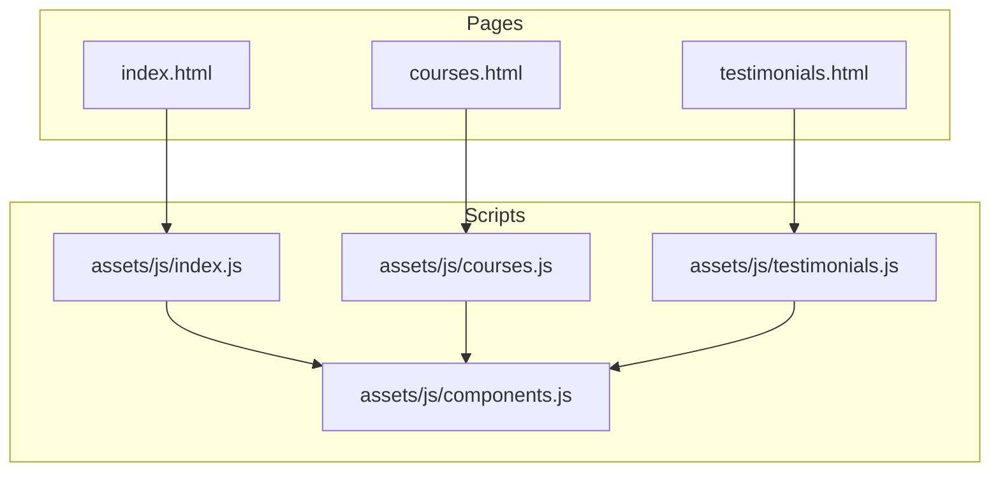
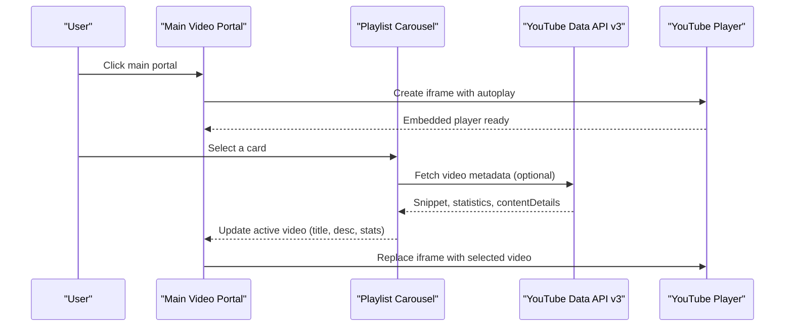
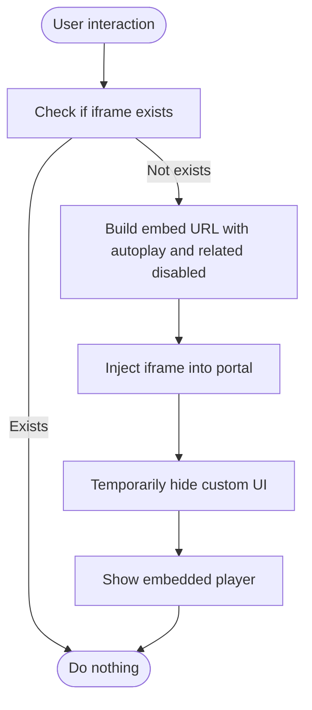
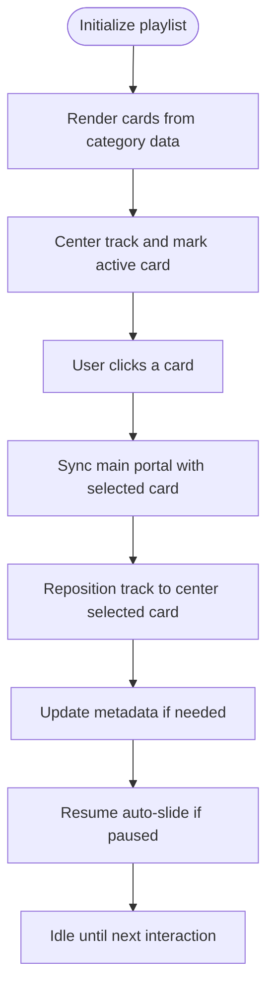
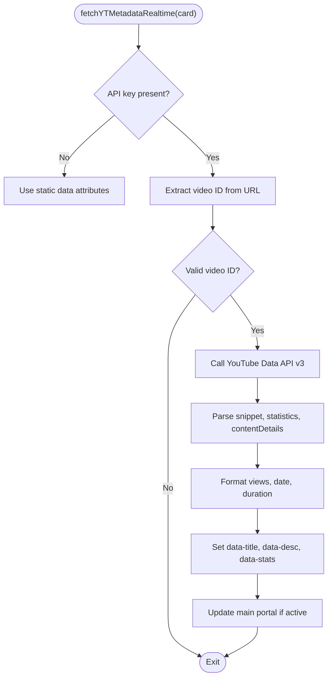
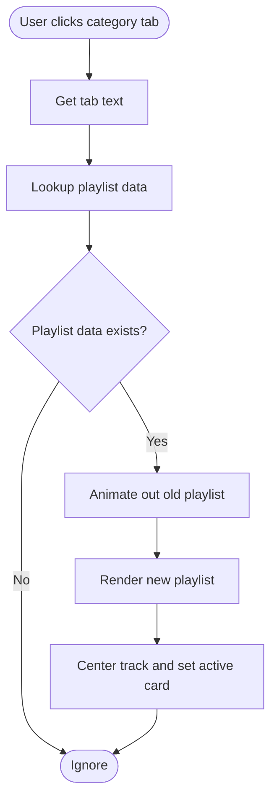
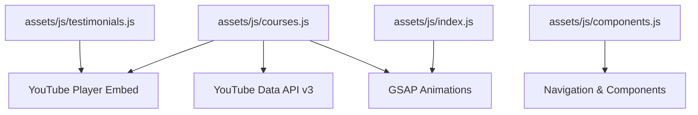

# YouTube API Integration

<cite>
**Referenced Files in This Document**
- [index.html](file://index.html)
- [courses.html](file://courses.html)
- [assets/js/index.js](file://assets/js/index.js)
- [assets/js/courses.js](file://assets/js/courses.js)
- [assets/js/testimonials.js](file://assets/js/testimonials.js)
- [assets/js/components.js](file://assets/js/components.js)
</cite>

## Table of Contents
1. [Introduction](#introduction)
2. [Project Structure](#project-structure)
3. [Core Components](#core-components)
4. [Architecture Overview](#architecture-overview)
5. [Detailed Component Analysis](#detailed-component-analysis)
6. [Dependency Analysis](#dependency-analysis)
7. [Performance Considerations](#performance-considerations)
8. [Troubleshooting Guide](#troubleshooting-guide)
9. [Conclusion](#conclusion)

## Introduction
This document explains the YouTube API integration used in the Eduooz video carousel system. It covers the YouTube Player API for embedding videos, playlist management, and thumbnail handling. It documents the JavaScript integration pattern including API initialization, video selection logic, and playlist navigation. It also details the video metadata extraction process, category filtering system, and responsive video player configuration. Concrete examples of API endpoint usage, error handling strategies for network failures, and fallback mechanisms are included, along with guidance for troubleshooting common integration issues such as CORS restrictions, API quota limits, and video availability problems.

## Project Structure
The YouTube integration spans multiple pages and scripts:
- The main landing page defines the primary video showcase area with category tabs and a responsive playlist carousel.
- The courses page implements a similar YouTube carousel with category filtering and metadata fetching.
- The testimonials page includes a video theater with modal playback.
- Shared components handle navigation and lazy-loading of page sections.

**Diagram sources**
- [index.html](file://index.html)
- [courses.html](file://courses.html)
- [assets/js/index.js](file://assets/js/index.js)
- [assets/js/courses.js](file://assets/js/courses.js)
- [assets/js/testimonials.js](file://assets/js/testimonials.js)
- [assets/js/components.js](file://assets/js/components.js)

**Section sources**
- [index.html](file://index.html)
- [courses.html](file://courses.html)
- [assets/js/index.js](file://assets/js/index.js)
- [assets/js/courses.js](file://assets/js/courses.js)
- [assets/js/testimonials.js](file://assets/js/testimonials.js)
- [assets/js/components.js](file://assets/js/components.js)

## Core Components
- YouTube Player Embedding: Videos are embedded inline within a glass-frame container using the YouTube embed URL pattern. The player supports autoplay and related video suppression.
- Playlist Management: A horizontally scrollable playlist displays video thumbnails and metadata. Users can select videos to update the main portal.
- Metadata Extraction: The YouTube Data API v3 is queried to enrich playlist cards with titles, view counts, publication dates, and durations.
- Category Filtering: Category tabs filter the playlist to show Nursing, Pharmacist, Lab Technician, German Language, or a mixed "All" collection.
- Responsive Player: The player adapts to viewport size and device orientation, with mobile-specific adjustments.

**Section sources**
- [index.html](file://index.html)
- [courses.html](file://courses.html)
- [assets/js/courses.js](file://assets/js/courses.js)

## Architecture Overview
The system integrates YouTube embeds with dynamic metadata retrieval and interactive playlist navigation. The main portal updates the active video while the playlist carousel handles selection and auto-advance.

**Diagram sources**
- [assets/js/courses.js](file://assets/js/courses.js)

**Section sources**
- [assets/js/courses.js](file://assets/js/courses.js)

## Detailed Component Analysis

### YouTube Player Embedding
- Embed Pattern: The player uses the YouTube embed URL with autoplay enabled and related videos disabled. The iframe is injected into the main portal container upon user interaction.
- Inline Player: The player fills the video glass frame container and is brought to the front with appropriate z-index and border-radius styling.
- Autoplay Behavior: The player starts automatically when the user clicks the portal or selects a playlist item.

**Diagram sources**
- [assets/js/courses.js](file://assets/js/courses.js)

**Section sources**
- [assets/js/courses.js](file://assets/js/courses.js)

### Playlist Management and Navigation
- Card Rendering: Playlist items are rendered from category-specific arrays. Each card stores data attributes for image, URL, title, description, and stats.
- Active State: The third card in the viewport is marked active. Clicking a card updates the main portal and repositions the track.
- Auto-Slide: The carousel advances every few seconds when idle, with manual selection pausing the auto-slide.
- Responsive Positioning: The track is centered based on viewport width and card dimensions, with gap handling.

**Diagram sources**
- [assets/js/courses.js](file://assets/js/courses.js)

**Section sources**
- [assets/js/courses.js](file://assets/js/courses.js)

### Video Metadata Extraction
- API Endpoint: The system queries the YouTube Data API v3 using the videos endpoint with snippet, contentDetails, and statistics parts.
- Data Parsing: Title, view count, published date, and duration are extracted and formatted. Duration is parsed from ISO 8601 format.
- Fallback Handling: If the API key is missing, metadata remains static from data attributes. On errors, the system logs a warning and continues.

**Diagram sources**
- [assets/js/courses.js](file://assets/js/courses.js)

**Section sources**
- [assets/js/courses.js](file://assets/js/courses.js)

### Category Filtering System
- Category Data: Separate arrays define playlists for Nursing, Pharmacist, Lab Technician, German Language, and a mixed "All" collection.
- Tab Switching: Clicking a category tab rebuilds the playlist with the selected dataset, animating transitions and re-centering the active card.
- Mixed Collection: The "All" tab interleaves videos from all categories to create a diverse feed.

**Diagram sources**
- [assets/js/courses.js](file://assets/js/courses.js)

**Section sources**
- [assets/js/courses.js](file://assets/js/courses.js)

### Responsive Video Player Configuration
- Viewport Awareness: The player adjusts to different screen sizes. On smaller devices, camera positioning and field-of-view are tuned for optimal viewing.
- Container Sizing: The iframe is sized to fill the video glass frame container, maintaining aspect ratio and applying rounded corners.
- Interaction Feedback: The magnetic play cursor responds to mouse movement within the portal, enhancing engagement.

**Section sources**
- [assets/js/index.js](file://assets/js/index.js)
- [assets/js/courses.js](file://assets/js/courses.js)

### Additional Integration Patterns
- Lazy Loading: The player is created on first interaction to avoid preloading unnecessary resources.
- Modal Theater: The testimonials page uses a modal to host the YouTube player, with controls to close and stop audio.
- Component Loading: Shared components manage navigation and page sections, ensuring consistent behavior across pages.

**Section sources**
- [assets/js/testimonials.js](file://assets/js/testimonials.js)
- [assets/js/components.js](file://assets/js/components.js)

## Dependency Analysis
The integration relies on external libraries and APIs:
- YouTube Player API: Used for embedding videos via iframe.
- YouTube Data API v3: Provides metadata enrichment for playlist cards.
- GSAP: Handles animations for transitions and UI feedback.
- Lenis: Provides smooth scrolling integration.

**Diagram sources**
- [assets/js/courses.js](file://assets/js/courses.js)
- [assets/js/index.js](file://assets/js/index.js)
- [assets/js/testimonials.js](file://assets/js/testimonials.js)
- [assets/js/components.js](file://assets/js/components.js)

**Section sources**
- [assets/js/courses.js](file://assets/js/courses.js)
- [assets/js/index.js](file://assets/js/index.js)
- [assets/js/testimonials.js](file://assets/js/testimonials.js)
- [assets/js/components.js](file://assets/js/components.js)

## Performance Considerations
- Lazy Initialization: The player is created on first click to reduce initial load time.
- Conditional API Calls: Metadata fetching is skipped when the API key is absent, preventing unnecessary network requests.
- Animation Optimization: GSAP timelines are used to coordinate transitions, minimizing layout thrashing.
- Responsive Adjustments: Camera and FOV adjustments improve rendering performance on mobile devices.

## Troubleshooting Guide
Common issues and resolutions:
- CORS Restrictions: The YouTube embed uses a standard iframe approach, avoiding CORS concerns. Ensure the embed URL is constructed correctly.
- API Quota Limits: The metadata fetch uses the YouTube Data API v3. If quotas are exceeded, the system falls back to static data attributes.
- Video Availability: If a video is private or unavailable, the embed may fail. Implement error handling to display a fallback message or skip the card.
- Autoplay Policies: Some browsers restrict autoplay with sound. The embed URL includes autoplay flags; consider adding muted autoplay for broader compatibility.
- Mobile Responsiveness: Verify container sizing and z-index settings to ensure the player overlays correctly on small screens.

**Section sources**
- [assets/js/courses.js](file://assets/js/courses.js)

## Conclusion
The Eduooz YouTube integration combines responsive embeds, dynamic metadata enrichment, and intuitive playlist navigation. By leveraging the YouTube Player API and Data API v3, the system delivers a seamless, engaging video experience across devices. Proper error handling and fallbacks ensure reliability under varying network conditions and browser policies.